# Architecture Overview

<cite>
**Referenced Files in This Document**
- [README.md](file://README.md)
- [package.json](file://package.json)
- [vite.config.js](file://vite.config.js)
- [server.js](file://server.js)
- [src/main.js](file://src/main.js)
- [src/store.js](file://src/store.js)
- [src/cart.js](file://src/cart.js)
- [src/layout.js](file://src/layout.js)
- [src/utils/logger.js](file://src/utils/logger.js)
- [src/routes/auth.js](file://src/routes/auth.js)
- [src/routes/member.js](file://src/routes/member.js)
- [src/routes/products.js](file://src/routes/products.js)
- [src/routes/payment.js](file://src/routes/payment.js)
- [src/routes/orders.js](file://src/routes/orders.js)
- [src/routes/contact.js](file://src/routes/contact.js)
- [src/routes/admin.js](file://src/routes/admin.js)
- [database/db.js](file://database/db.js)
- [index.html](file://index.html)
</cite>

## Update Summary
**Changes Made**
- Updated modular routing system documentation to reflect the new dedicated route handlers
- Added comprehensive coverage of the new route-based architecture with separate modules
- Enhanced security documentation with detailed TOTP authentication implementation
- Updated database abstraction section to cover both MySQL and PostgreSQL implementations
- Revised component interaction diagrams to show the new modular architecture
- Added detailed coverage of the Vite build system and development workflow

## Table of Contents
1. [Introduction](#introduction)
2. [Project Structure](#project-structure)
3. [Core Components](#core-components)
4. [Architecture Overview](#architecture-overview)
5. [Detailed Component Analysis](#detailed-component-analysis)
6. [Dependency Analysis](#dependency-analysis)
7. [Performance Considerations](#performance-considerations)
8. [Security and Middleware](#security-and-middleware)
9. [External Service Integrations](#external-service-integrations)
10. [Build and Development Workflow](#build-and-development-workflow)
11. [Troubleshooting Guide](#troubleshooting-guide)
12. [Conclusion](#conclusion)

## Introduction
This document describes the full-stack architecture of Active Zone Hub, focusing on the separation between frontend HTML/CSS/JavaScript and the backend Node.js/Express server. The system has undergone a major architectural transformation from a monolithic server.js to a modular Express application with dedicated route handlers. It explains how the system implements an MVC-like pattern, the modular routing design, database abstraction and connection management, and the integration with external services such as Gym Master API, Paystack, and Brevo. It also covers the build process using Vite, development server configuration, security considerations, and component interaction flows.

## Project Structure
The project follows a hybrid static site plus backend API approach with a completely modular architecture:
- Static frontend assets and pages (HTML, CSS, JS) under the repository root and in the src directory.
- Backend server implemented in Express.js with modular route handlers organized by functional area in the src/routes directory.
- Database abstraction supporting both file-based persistence and MySQL/PostgreSQL with separate modules for each database type.
- Build tooling powered by Vite for development and production builds with multi-entry point configuration.

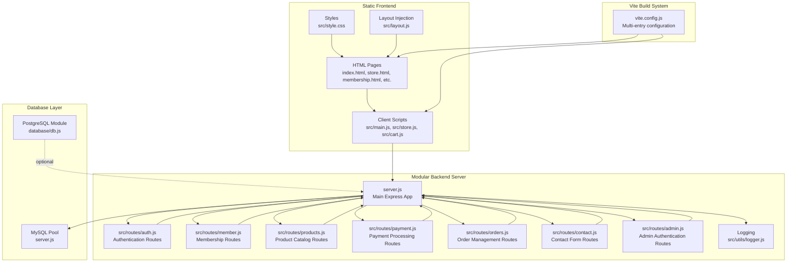

**Diagram sources**
- [index.html](file://index.html#L1-L200)
- [src/main.js](file://src/main.js#L1-L405)
- [src/store.js](file://src/store.js#L1-L316)
- [src/cart.js](file://src/cart.js#L1-L156)
- [src/layout.js](file://src/layout.js#L1-L93)
- [vite.config.js](file://vite.config.js#L1-L25)
- [server.js](file://server.js#L1-L2343)
- [src/routes/auth.js](file://src/routes/auth.js#L1-L54)
- [src/routes/member.js](file://src/routes/member.js#L1-L142)
- [src/routes/products.js](file://src/routes/products.js#L1-L121)
- [src/routes/payment.js](file://src/routes/payment.js#L1-L154)
- [src/routes/orders.js](file://src/routes/orders.js#L1-L371)
- [src/routes/contact.js](file://src/routes/contact.js#L1-L71)
- [src/routes/admin.js](file://src/routes/admin.js#L1-L128)
- [src/utils/logger.js](file://src/utils/logger.js#L1-L51)
- [database/db.js](file://database/db.js#L1-L267)

**Section sources**
- [README.md](file://README.md#L1-L3)
- [package.json](file://package.json#L1-L32)
- [vite.config.js](file://vite.config.js#L1-L25)
- [server.js](file://server.js#L1-L2343)
- [src/main.js](file://src/main.js#L1-L405)
- [src/store.js](file://src/store.js#L1-L316)
- [src/cart.js](file://src/cart.js#L1-L156)
- [src/layout.js](file://src/layout.js#L1-L93)
- [src/utils/logger.js](file://src/utils/logger.js#L1-L51)
- [src/routes/auth.js](file://src/routes/auth.js#L1-L54)
- [src/routes/member.js](file://src/routes/member.js#L1-L142)
- [src/routes/products.js](file://src/routes/products.js#L1-L121)
- [src/routes/payment.js](file://src/routes/payment.js#L1-L154)
- [src/routes/orders.js](file://src/routes/orders.js#L1-L371)
- [src/routes/contact.js](file://src/routes/contact.js#L1-L71)
- [src/routes/admin.js](file://src/routes/admin.js#L1-L128)
- [database/db.js](file://database/db.js#L1-L267)
- [index.html](file://index.html#L1-L200)

## Core Components
- **Frontend client-side scripts** handle UI interactions, cart management, product browsing, and form submissions with modular JavaScript architecture.
- **Modular backend routes** encapsulate business logic for authentication, membership, products, payments, orders, contact, and admin functions with dedicated route handlers.
- **Dual database abstraction** supports both file-based storage and MySQL/PostgreSQL pools with separate modules for each database type.
- **Centralized logging and monitoring** via Winston with configurable transports and log levels.

**Section sources**
- [src/main.js](file://src/main.js#L1-L405)
- [src/store.js](file://src/store.js#L1-L316)
- [src/cart.js](file://src/cart.js#L1-L156)
- [server.js](file://server.js#L1-L2343)
- [src/routes/auth.js](file://src/routes/auth.js#L1-L54)
- [src/routes/member.js](file://src/routes/member.js#L1-L142)
- [src/routes/products.js](file://src/routes/products.js#L1-L121)
- [src/routes/payment.js](file://src/routes/payment.js#L1-L154)
- [src/routes/orders.js](file://src/routes/orders.js#L1-L371)
- [src/routes/contact.js](file://src/routes/contact.js#L1-L71)
- [src/routes/admin.js](file://src/routes/admin.js#L1-L128)
- [database/db.js](file://database/db.js#L1-L267)
- [src/utils/logger.js](file://src/utils/logger.js#L1-L51)

## Architecture Overview
The system employs a completely modular Express server with route-based separation of concerns. The frontend communicates with the backend via RESTful endpoints mounted under /api with distinct prefixes for each functional area. The server manages database connections, rate limiting, CORS, and integrates with external APIs for membership, payments, and email notifications. The architecture now features dedicated route modules for enhanced maintainability and scalability.

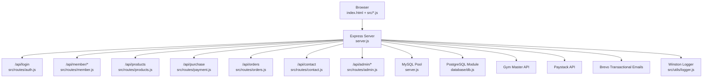

**Diagram sources**
- [server.js](file://server.js#L469-L476)
- [src/routes/auth.js](file://src/routes/auth.js#L1-L54)
- [src/routes/member.js](file://src/routes/member.js#L1-L142)
- [src/routes/products.js](file://src/routes/products.js#L1-L121)
- [src/routes/payment.js](file://src/routes/payment.js#L1-L154)
- [src/routes/orders.js](file://src/routes/orders.js#L1-L371)
- [src/routes/contact.js](file://src/routes/contact.js#L1-L71)
- [src/routes/admin.js](file://src/routes/admin.js#L1-L128)
- [database/db.js](file://database/db.js#L1-L267)
- [src/utils/logger.js](file://src/utils/logger.js#L1-L51)

## Detailed Component Analysis

### Frontend MVC Pattern (Views, Controllers, Models)
- **Views**: HTML pages and templates (e.g., index.html, store.html) serve as presentation surfaces with dynamic content injection.
- **Controllers**: Client-side JavaScript modules orchestrate user interactions and API calls with modular architecture for each page.
- **Models**: Data structures and state management (e.g., shopping cart) are handled in scripts like store.js and cart.js with localStorage persistence.

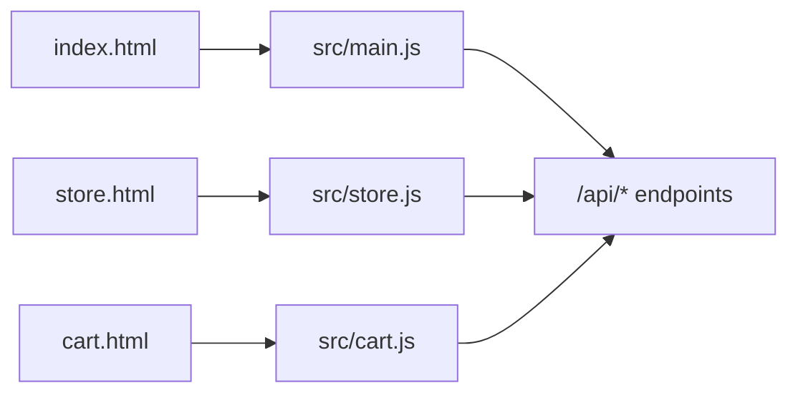

**Diagram sources**
- [index.html](file://index.html#L1-L200)
- [src/main.js](file://src/main.js#L1-L405)
- [src/store.js](file://src/store.js#L1-L316)
- [src/cart.js](file://src/cart.js#L1-L156)
- [server.js](file://server.js#L1-L2343)

**Section sources**
- [index.html](file://index.html#L1-L200)
- [src/main.js](file://src/main.js#L1-L405)
- [src/store.js](file://src/store.js#L1-L316)
- [src/cart.js](file://src/cart.js#L1-L156)

### Modular Routing System
The server now uses a completely modular architecture with dedicated route handlers mounted under distinct prefixes:
- **Authentication**: /api/login → src/routes/auth.js
- **Member operations**: /api/member/* → src/routes/member.js
- **Products catalog**: /api/products → src/routes/products.js
- **Payments**: /api/purchase → src/routes/payment.js
- **Orders**: /api/orders → src/routes/orders.js
- **Contact forms**: /api/contact → src/routes/contact.js
- **Admin**: /api/admin/* → src/routes/admin.js

Each route module enforces validation using express-validator at the route level for request sanitization and error handling. The modular approach improves maintainability, testability, and allows for independent development of each functional area.

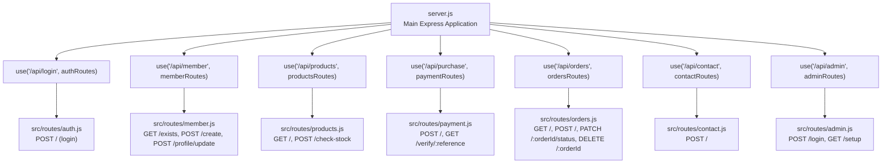

**Diagram sources**
- [server.js](file://server.js#L469-L476)
- [src/routes/auth.js](file://src/routes/auth.js#L1-L54)
- [src/routes/member.js](file://src/routes/member.js#L1-L142)
- [src/routes/products.js](file://src/routes/products.js#L1-L121)
- [src/routes/payment.js](file://src/routes/payment.js#L1-L154)
- [src/routes/orders.js](file://src/routes/orders.js#L1-L371)
- [src/routes/contact.js](file://src/routes/contact.js#L1-L71)
- [src/routes/admin.js](file://src/routes/admin.js#L1-L128)

**Section sources**
- [server.js](file://server.js#L469-L476)
- [src/routes/auth.js](file://src/routes/auth.js#L1-L54)
- [src/routes/member.js](file://src/routes/member.js#L1-L142)
- [src/routes/products.js](file://src/routes/products.js#L1-L121)
- [src/routes/payment.js](file://src/routes/payment.js#L1-L154)
- [src/routes/orders.js](file://src/routes/orders.js#L1-L371)
- [src/routes/contact.js](file://src/routes/contact.js#L1-L71)
- [src/routes/admin.js](file://src/routes/admin.js#L1-L128)

### Database Abstraction and Connection Management
The system now provides dual database support with separate modules for different database types:

**MySQL Implementation** (server.js):
- Conditional pool creation based on environment flags; fallback to file-based storage when disabled
- Provides helpers for CRUD operations on orders with Gym Master integration
- Supports SSL configuration for cloud database providers

**PostgreSQL Implementation** (database/db.js):
- Complete PostgreSQL module with connection pooling, migrations, and ORM-style operations
- Includes OrderDB and EmailLogDB operations with proper JSON field handling
- Supports environment-specific SSL configuration for production deployments

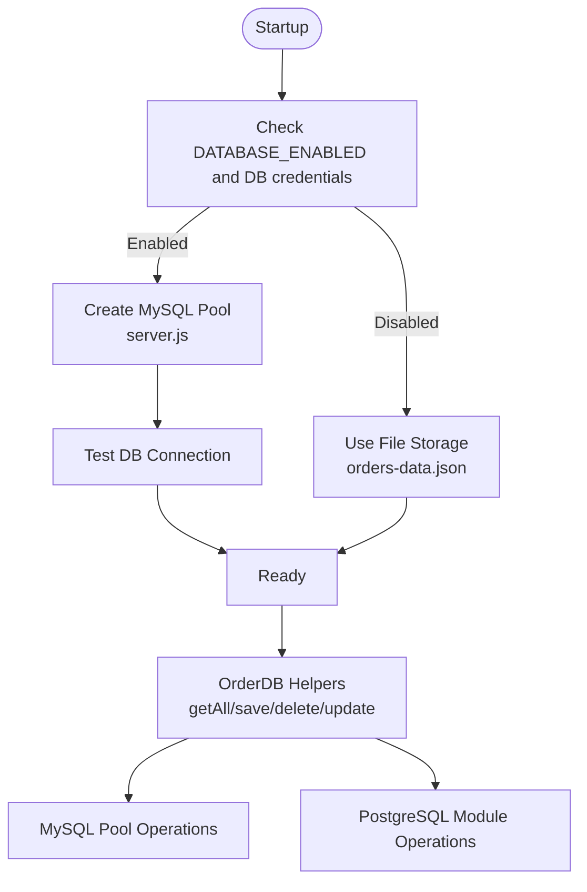

**Diagram sources**
- [server.js](file://server.js#L105-L155)
- [server.js](file://server.js#L157-L342)
- [database/db.js](file://database/db.js#L1-L267)

**Section sources**
- [server.js](file://server.js#L105-L155)
- [server.js](file://server.js#L157-L342)
- [database/db.js](file://database/db.js#L1-L267)

### Component Interaction: Payment Flow
This sequence illustrates the end-to-end payment flow from the store page to Paystack and order persistence with the new modular architecture.

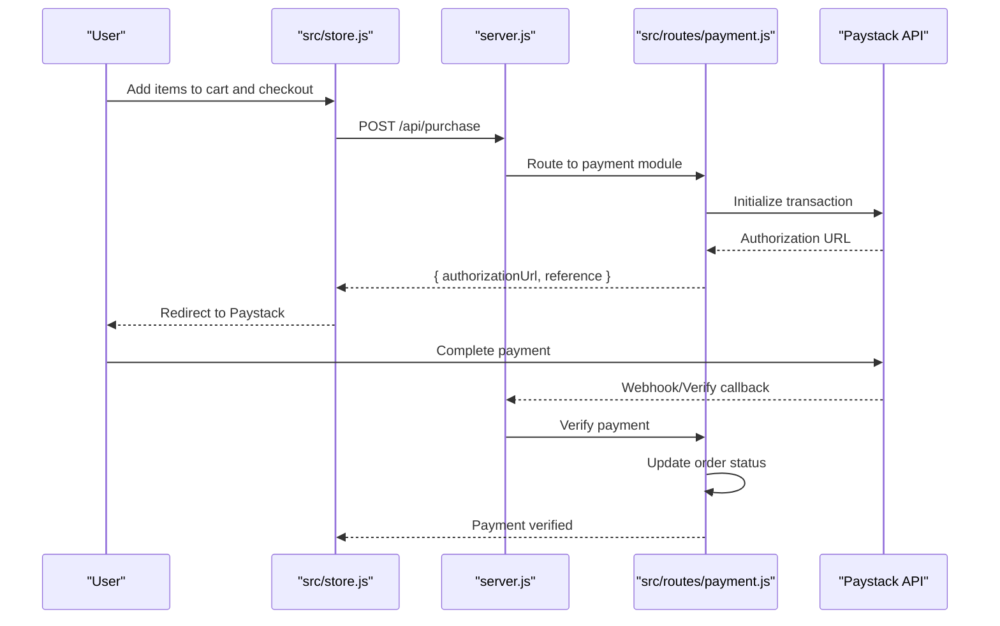

**Diagram sources**
- [src/store.js](file://src/store.js#L1-L316)
- [src/routes/payment.js](file://src/routes/payment.js#L1-L154)
- [server.js](file://server.js#L788-L800)

**Section sources**
- [src/store.js](file://src/store.js#L1-L316)
- [src/routes/payment.js](file://src/routes/payment.js#L1-L154)
- [server.js](file://server.js#L788-L800)

### Component Interaction: Membership and Gym Master Integration
The membership flow integrates with Gym Master for existence checks, prospect creation, and profile updates through the modular route system.

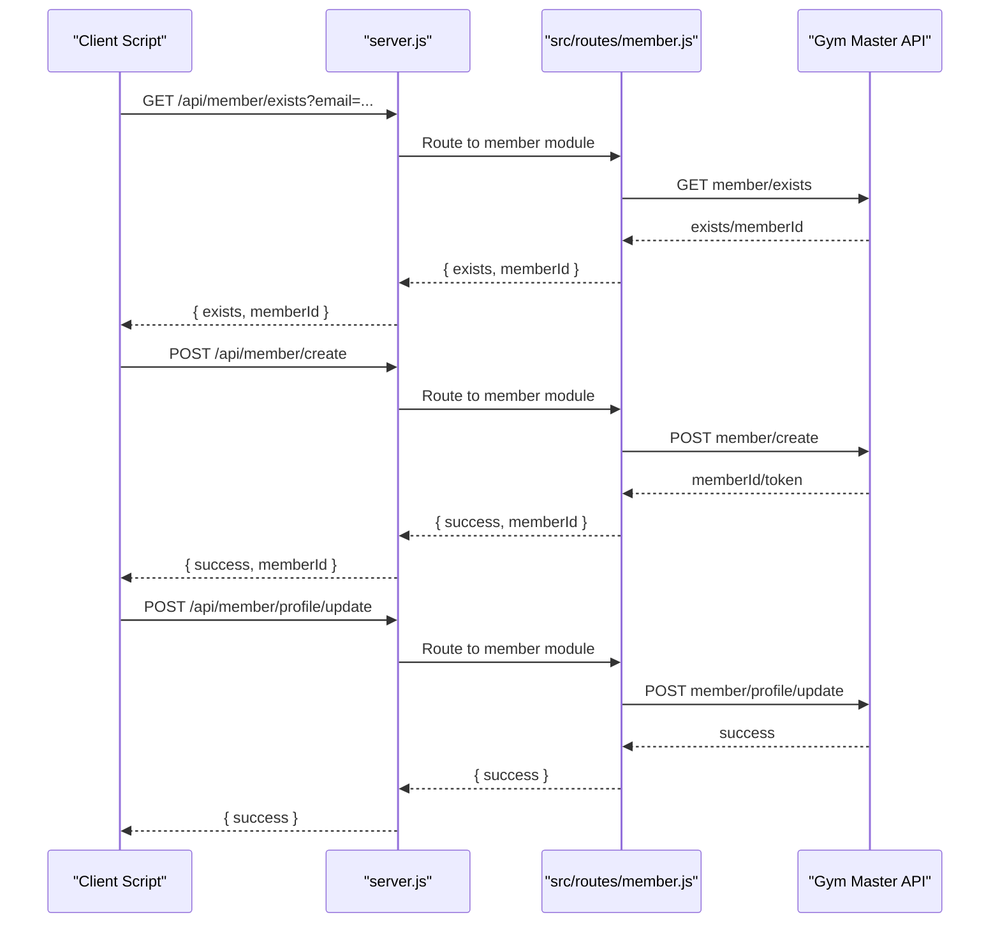

**Diagram sources**
- [src/routes/member.js](file://src/routes/member.js#L1-L142)
- [server.js](file://server.js#L479-L506)

**Section sources**
- [src/routes/member.js](file://src/routes/member.js#L1-L142)
- [server.js](file://server.js#L479-L506)

## Dependency Analysis
The backend depends on several libraries for HTTP, validation, rate limiting, logging, and external integrations. The frontend relies on Vite for bundling and runtime scripts for interactivity. The modular architecture reduces coupling between components and improves testability.

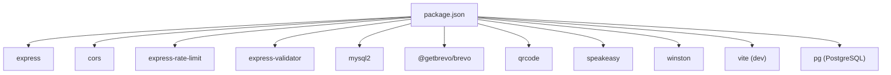

**Diagram sources**
- [package.json](file://package.json#L1-L32)

**Section sources**
- [package.json](file://package.json#L1-L32)

## Performance Considerations
- **Static asset serving**: Express serves static files from the project root, minimizing server overhead for frontend resources.
- **Vite build**: Produces optimized bundles for production with multi-entry point configuration, enabling fast page loads and reduced bundle sizes.
- **Database pooling**: MySQL pool limits concurrent connections and keeps connections alive to reduce overhead.
- **Request logging and rate limiting**: Reduce server load and protect against abuse with three-tier rate limiting strategy.
- **Client-side caching**: The products route caches data locally to minimize repeated API calls.
- **Modular architecture**: Reduces memory footprint by loading only required route handlers.

## Security and Middleware
The system implements comprehensive security measures with multiple layers of protection:

**CORS**: Enabled globally to allow cross-origin requests from trusted clients.

**JSON parsing**: Custom verifier ensures malformed JSON is rejected early.

**Rate limiting**: Three-tier strategy for different endpoints:
- Admin login: 5 attempts per 15 minutes (strictest)
- Order deletion: 3 attempts per 15 minutes (strict)
- General API: 100 requests per minute (moderate)

**Input validation**: express-validator validates and sanitizes inputs at the route level for all endpoints.

**TOTP Authentication**: Two-factor authentication via speakeasy for:
- Admin login (separate secret from order deletion)
- Order deletion operations
- QR code generation for setup

**Logging**: Winston centralizes logs with file and console transports, including request tracing and error tracking.

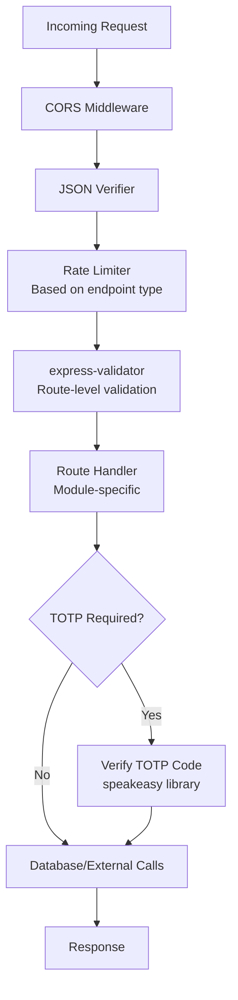

**Diagram sources**
- [server.js](file://server.js#L387-L462)
- [src/routes/admin.js](file://src/routes/admin.js#L1-L128)
- [src/routes/orders.js](file://src/routes/orders.js#L192-L232)
- [src/utils/logger.js](file://src/utils/logger.js#L1-L51)

**Section sources**
- [server.js](file://server.js#L387-L462)
- [src/routes/admin.js](file://src/routes/admin.js#L1-L128)
- [src/routes/orders.js](file://src/routes/orders.js#L192-L232)
- [src/utils/logger.js](file://src/utils/logger.js#L1-L51)

## External Service Integrations
The system integrates with multiple external services through dedicated API endpoints:

**Gym Master API**: Used for membership existence checks, prospect creation, and profile updates. The server proxies requests and parses responses with comprehensive error handling.

**Paystack**: Integrated for payment initialization and verification. The system constructs transactions with proper metadata and updates order statuses upon verification.

**Brevo**: Used for sending transactional emails on contact form submissions with fallback mechanisms for development environments.

**Google Authenticator**: Implemented for two-factor authentication setup with QR code generation for both admin login and order deletion functions.

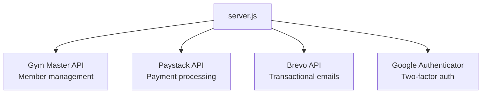

**Diagram sources**
- [server.js](file://server.js#L344-L367)
- [server.js](file://server.js#L479-L506)
- [src/routes/payment.js](file://src/routes/payment.js#L1-L154)
- [src/routes/contact.js](file://src/routes/contact.js#L1-L71)
- [src/routes/admin.js](file://src/routes/admin.js#L28-L125)

**Section sources**
- [server.js](file://server.js#L344-L367)
- [server.js](file://server.js#L479-L506)
- [src/routes/payment.js](file://src/routes/payment.js#L1-L154)
- [src/routes/contact.js](file://src/routes/contact.js#L1-L71)
- [src/routes/admin.js](file://src/routes/admin.js#L28-L125)

## Build and Development Workflow
The Vite-based build system provides a modern development experience with comprehensive multi-entry point configuration:

**Development server**: Vite dev server runs the frontend and proxies API requests to the backend during development with hot module replacement.

**Production build**: Vite bundles multiple entry points including index, about, services, store, membership, gallery, contact, cart, checkout, orders, track-order, and payment-success pages.

**Static hosting**: The backend serves static files directly, enabling deployment to platforms that host static assets and Node.js servers separately.

**Environment configuration**: Multi-environment support with separate configurations for development, staging, and production.

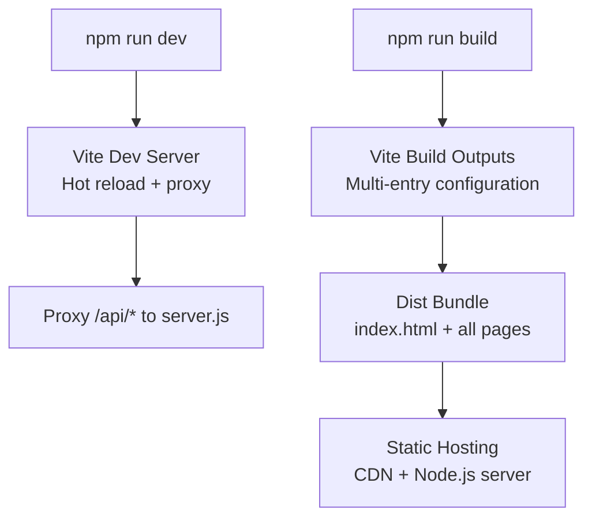

**Diagram sources**
- [package.json](file://package.json#L5-L12)
- [vite.config.js](file://vite.config.js#L1-L25)

**Section sources**
- [package.json](file://package.json#L5-L12)
- [vite.config.js](file://vite.config.js#L1-L25)

## Troubleshooting Guide
**Database connectivity**: Check environment flags and credentials; the server logs connection attempts and table verification. For PostgreSQL, ensure DATABASE_URL is properly configured.

**File-based vs database mode**: If DATABASE_ENABLED is false or missing, the system falls back to file storage for orders using orders-data.json.

**CORS issues**: Confirm CORS middleware is active and origins match expectations. Check browser developer tools for CORS error details.

**Rate limiting**: If requests are throttled, review rate limiter configurations and IP addresses. Check the specific rate limit tier for the endpoint being accessed.

**TOTP authentication**: Verify Google Authenticator setup by accessing /api/admin/setup endpoint. Ensure both admin login and order deletion secrets are properly configured.

**Logging**: Review Winston logs for detailed request traces and error stacks. Check logs directory for error.log and combined.log files.

**Section sources**
- [server.js](file://server.js#L105-L155)
- [server.js](file://server.js#L469-L476)
- [src/utils/logger.js](file://src/utils/logger.js#L1-L51)
- [src/routes/admin.js](file://src/routes/admin.js#L28-L125)

## Conclusion
Active Zone Hub's architecture has evolved into a highly modular, secure, and scalable system that cleanly separates frontend and backend responsibilities. The transition from monolithic server.js to dedicated route handlers significantly improves maintainability, testability, and development velocity. The dual database support (MySQL and PostgreSQL) and external integrations (Gym Master, Paystack, Brevo) provide flexibility for diverse deployment scenarios. The Vite-based build pipeline streamlines development and production delivery, while comprehensive logging, rate limiting, and TOTP authentication improve operational reliability and security. The modular routing system with separate authentication, membership, products, payments, orders, contact, and admin modules creates a clean separation of concerns that facilitates future enhancements and team collaboration.