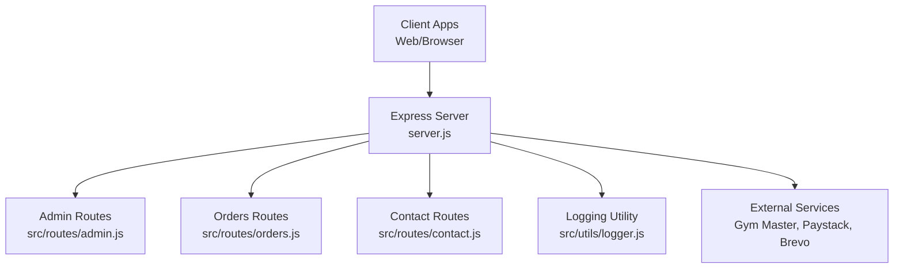
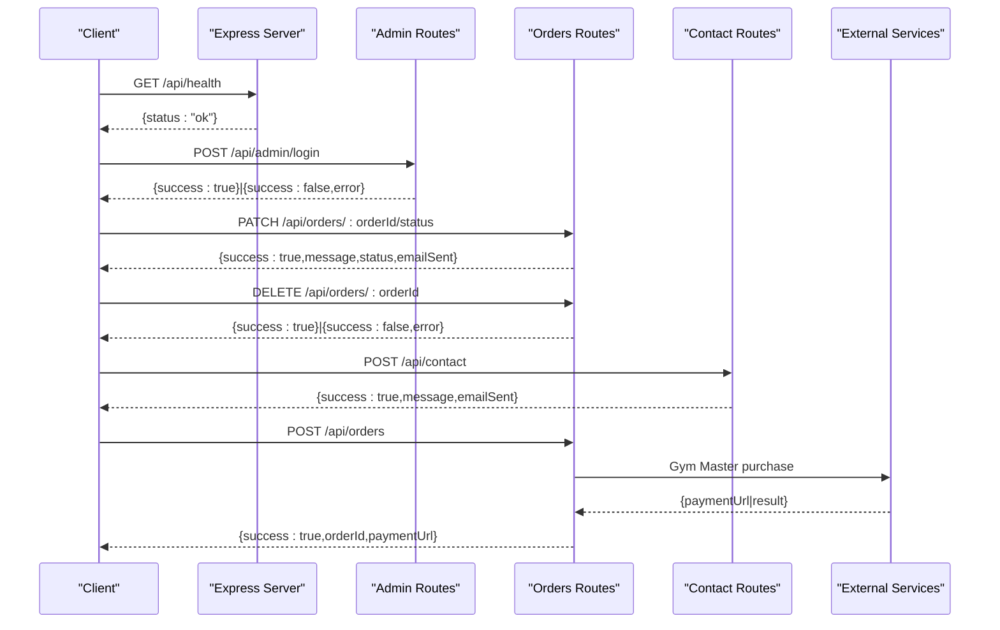
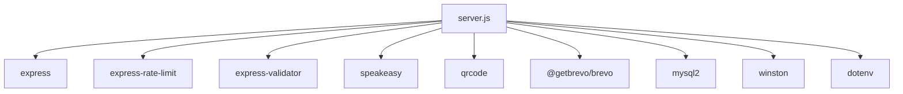

# Administrative & Contact API

<cite>
**Referenced Files in This Document**
- [server.js](file://server.js)
- [src/routes/admin.js](file://src/routes/admin.js)
- [src/routes/auth.js](file://src/routes/auth.js)
- [src/routes/contact.js](file://src/routes/contact.js)
- [src/routes/orders.js](file://src/routes/orders.js)
- [src/utils/logger.js](file://src/utils/logger.js)
- [package.json](file://package.json)
- [orders-data.json](file://orders-data.json)
</cite>

## Table of Contents
1. [Introduction](#introduction)
2. [Project Structure](#project-structure)
3. [Core Components](#core-components)
4. [Architecture Overview](#architecture-overview)
5. [Detailed Component Analysis](#detailed-component-analysis)
6. [Dependency Analysis](#dependency-analysis)
7. [Performance Considerations](#performance-considerations)
8. [Troubleshooting Guide](#troubleshooting-guide)
9. [Conclusion](#conclusion)
10. [Appendices](#appendices)

## Introduction
This document provides comprehensive API documentation for administrative and contact management endpoints. It covers:
- Administrative functions: order management, user administration, system monitoring, and two-factor authentication for admin access
- Contact form processing and customer communication
- Support ticket-like workflows via contact submissions
- Authentication and authorization requirements
- Security measures, access controls, and audit logging
- Practical examples of order management workflows, contact form processing, and administrative reporting
- Rate limiting, input validation, and security considerations specific to administrative access

## Project Structure
The backend is an Express.js server with modular route handlers and a logging utility. Administrative endpoints are exposed under `/api/admin`, while order and contact endpoints are under `/api/orders` and `/api/contact`. The server integrates with external services for authentication, payment, and email.

**Diagram sources**
- [server.js](file://server.js#L462-L469)
- [src/routes/admin.js](file://src/routes/admin.js#L1-L81)
- [src/routes/orders.js](file://src/routes/orders.js#L1-L350)
- [src/routes/contact.js](file://src/routes/contact.js#L1-L71)
- [src/utils/logger.js](file://src/utils/logger.js#L1-L51)

**Section sources**
- [server.js](file://server.js#L462-L469)
- [package.json](file://package.json#L15-L26)

## Core Components
- Express server with CORS, rate limiting, request logging, and health checks
- Modular route handlers for admin, orders, contact, and authentication
- Winston-based structured logging with file transport
- TOTP-based two-factor authentication for admin login and order deletion
- Validation middleware for request sanitization and error handling

**Section sources**
- [server.js](file://server.js#L380-L452)
- [src/utils/logger.js](file://src/utils/logger.js#L10-L39)
- [src/routes/admin.js](file://src/routes/admin.js#L7-L8)
- [src/routes/orders.js](file://src/routes/orders.js#L5-L6)

## Architecture Overview
The server exposes REST endpoints grouped by functional areas:
- Admin: login, TOTP setup page
- Orders: list, track, update status, delete (with TOTP), create, verify payment
- Contact: submit contact form
- Member/Auth: Gym Master login and member operations
- Utilities: health check, email test, prospect/member creation/update

**Diagram sources**
- [server.js](file://server.js#L457-L460)
- [src/routes/admin.js](file://src/routes/admin.js#L10-L24)
- [src/routes/orders.js](file://src/routes/orders.js#L137-L169)
- [src/routes/orders.js](file://src/routes/orders.js#L171-L211)
- [src/routes/contact.js](file://src/routes/contact.js#L5-L68)
- [server.js](file://server.js#L1767-L2014)

## Detailed Component Analysis

### Administrative Endpoints
- Purpose: Admin login and TOTP setup for secure access to administrative functions.

Endpoints
- POST /api/admin/login
  - Description: Authenticate admin with password.
  - Authentication: None (use with caution; rate-limited).
  - Request body:
    - password: string (required)
  - Responses:
    - 200 OK: { success: true, message: "Login successful" }
    - 400 Bad Request: { success: false, error: "<validation error>" }
    - 401 Unauthorized: { success: false, error: "Invalid password" }
  - Notes: Rate-limited to prevent brute-force attempts.

- GET /api/totp/setup
  - Description: Display QR codes and secrets for configuring Google Authenticator for admin login and order deletion.
  - Authentication: None.
  - Responses:
    - 200 OK: HTML page with QR codes and secrets.
    - 500 Internal Server Error: { success: false, error: "Failed to generate QR code" }

Security and Access Controls
- Admin login is protected by strict rate limiting.
- TOTP is used for order deletion and admin login setup.
- Secrets are generated at runtime if not configured in environment variables.

Practical Example
- Admin setup workflow:
  1. Visit /api/totp/setup to obtain QR codes/secrets.
  2. Configure Google Authenticator with both accounts.
  3. Use admin login endpoint to authenticate.
  4. Use TOTP when performing sensitive actions like order deletion.

**Section sources**
- [src/routes/admin.js](file://src/routes/admin.js#L10-L24)
- [src/routes/admin.js](file://src/routes/admin.js#L26-L78)
- [server.js](file://server.js#L1118-L1136)
- [server.js](file://server.js#L1138-L1216)

### Order Management Endpoints
- Purpose: Manage orders, track status, update delivery status, delete orders (with TOTP), create orders via Gym Master, and verify payments.

Endpoints
- GET /api/orders
  - Description: List orders with filtering, sorting, and pagination.
  - Authentication: None.
  - Query parameters:
    - page: integer (default 1)
    - limit: integer (default 20)
    - status: string (filter by deliveryStatus)
    - search: string (search by orderId, customer name/email/phone)
  - Responses:
    - 200 OK: { success: true, orders, pagination }
    - 500 Internal Server Error: { success: false, error: "Failed to fetch orders" }

- GET /api/orders/track/:reference
  - Description: Retrieve order details by reference.
  - Authentication: None.
  - Path parameters:
    - reference: string (required)
  - Responses:
    - 200 OK: { success: true, order }
    - 404 Not Found: { success: false, error: "Order not found" }

- PATCH /api/orders/:orderId/status
  - Description: Update order delivery status.
  - Authentication: None.
  - Path parameters:
    - orderId: string (required)
  - Request body:
    - deliveryStatus: enum ["pending","paid","processing","shipped","delivered"] (required)
  - Responses:
    - 200 OK: { success: true, message: "Order status updated", emailSent: boolean }
    - 400 Bad Request: { success: false, error: "<validation error>" }
    - 404 Not Found: { success: false, error: "Order not found" }

- DELETE /api/orders/:orderId
  - Description: Delete an order (requires TOTP).
  - Authentication: Requires TOTP header.
  - Path parameters:
    - orderId: string (required)
  - Headers:
    - x-totp-code: string (6 digits, required)
  - Responses:
    - 200 OK: { success: true, message: "Order deleted successfully", orderId }
    - 400 Bad Request: { success: false, error: "Invalid code format" }
    - 401 Unauthorized: { success: false, error: "TOTP code required" }
    - 403 Forbidden: { success: false, error: "Invalid authentication code" }
    - 404 Not Found: { success: false, error: "Order not found" }
  - Notes: Rate-limited to prevent abuse.

- POST /api/orders
  - Description: Create an order via Gym Master purchase and initialize payment.
  - Authentication: None.
  - Request body:
    - token: string (required, Gym Master member token)
    - customer: object (required)
      - name: string (required)
      - email: string (required)
      - phone: string (optional)
    - items: array (required, min 1)
      - productId: number (required)
      - quantity: number (required)
    - deliveryMethod: enum ["delivery","pickup"] (optional)
    - deliveryAddress: object (optional)
      - street: string
      - city: string
      - state: string
      - postalCode: string
    - subtotal: number (optional)
    - deliveryFee: number (optional)
    - total: number (min 0, required)
    - notes: string (optional)
  - Responses:
    - 200 OK: { success: true, orderId, paymentUrl, message, order, gymMasterResponse }
    - 400 Bad Request: { success: false, error: "<validation error>" }
    - 500 Internal Server Error: { success: false, error: "<server error>" }

- GET /api/orders/verify/:reference
  - Description: Verify Paystack payment for a given reference.
  - Authentication: None.
  - Path parameters:
    - reference: string (required)
  - Responses:
    - 200 OK: { success: true, verified: boolean } or { success: false, verified: false }
    - 500 Internal Server Error: { success: false, error: "Payment verification not configured" }

Security and Access Controls
- Order deletion requires TOTP verification via header.
- Status updates are open but can trigger automated emails.
- Payment verification requires Paystack secret key.

Practical Example: Order Management Workflow
- Create order:
  1. Client posts to /api/orders with customer, items, and token.
  2. Server calls Gym Master purchase API and receives payment URL.
  3. Server saves order and returns orderId and paymentUrl.
- Update status:
  1. Admin calls PATCH /api/orders/:orderId/status with deliveryStatus.
  2. Server updates status and sends status update email if applicable.
- Delete order:
  1. Admin calls DELETE /api/orders/:orderId with x-totp-code header.
  2. Server validates TOTP and deletes order if eligible.

**Section sources**
- [src/routes/orders.js](file://src/routes/orders.js#L38-L90)
- [src/routes/orders.js](file://src/routes/orders.js#L92-L135)
- [src/routes/orders.js](file://src/routes/orders.js#L137-L169)
- [src/routes/orders.js](file://src/routes/orders.js#L171-L211)
- [src/routes/orders.js](file://src/routes/orders.js#L213-L304)
- [src/routes/orders.js](file://src/routes/orders.js#L306-L347)
- [server.js](file://server.js#L1218-L1285)
- [server.js](file://server.js#L1767-L2014)
- [server.js](file://server.js#L878-L980)

### Contact Form Processing Endpoints
- Purpose: Receive contact form submissions and notify support via email or file fallback.

Endpoints
- POST /api/contact
  - Description: Submit a contact form message.
  - Authentication: None.
  - Request body:
    - name: string (required)
    - email: string (required)
    - phone: string (optional)
    - message: string (required)
  - Responses:
    - 200 OK: { success: true, message: "Message sent successfully", emailSent: boolean }
    - 400 Bad Request: { success: false, error: "<validation error>" }
    - 500 Internal Server Error: { success: false, error: "Failed to send message" }
  - Notes: Uses Brevo email service if configured; otherwise falls back to saving to file.

Security and Access Controls
- No authentication required.
- Input is sanitized and validated.

Practical Example: Contact Form Processing
- Client submits contact form.
- Server validates input and sends email via Brevo.
- If email service is unavailable, message is saved to contact-messages.json.

**Section sources**
- [src/routes/contact.js](file://src/routes/contact.js#L5-L68)
- [server.js](file://server.js#L2052-L2264)

### Authentication and User Administration
- Gym Master Login Endpoint
  - POST /api/login
    - Description: Authenticate a member with Gym Master.
    - Authentication: None.
    - Request body:
      - email: string (required)
      - password: string (required)
    - Responses:
      - 200 OK: { success: true, token, sessionId, memberId, member }
      - 400 Bad Request: { success: false, error: "<validation error>" }
      - 401 Unauthorized: { success: false, error: "<login error>" }
      - 500 Internal Server Error: { success: false, error: "<server error>" }

- Member Operations
  - POST /api/prospect/create: Create a prospect in Gym Master.
  - POST /api/member/profile/update: Update member profile/address.
  - GET /api/test-email: Test Brevo email configuration.

Notes
- Gym Master integration is configurable via environment variables.
- Token handling and JWT decoding are supported.

**Section sources**
- [server.js](file://server.js#L682-L779)
- [server.js](file://server.js#L501-L600)
- [server.js](file://server.js#L602-L680)
- [server.js](file://server.js#L1061-L1116)

### System Monitoring and Logging
- Health Check
  - GET /api/health: Lightweight endpoint to verify server availability.
- Request Logging
  - All requests are logged with method, path, status, duration, and IP.
- Winston Logging
  - Structured logs with file transport and console transport in development.

**Section sources**
- [server.js](file://server.js#L457-L460)
- [server.js](file://server.js#L430-L452)
- [src/utils/logger.js](file://src/utils/logger.js#L10-L39)

## Dependency Analysis
External libraries and integrations:
- express-rate-limit: Enforces rate limits for admin login and order deletion.
- express-validator: Validates and sanitizes request bodies and parameters.
- speakeasy: Generates TOTP secrets and verifies codes.
- qrcode: Renders QR codes for TOTP setup.
- @getbrevo/brevo: Sends transactional emails.
- mysql2: Optional MySQL database integration for orders.
- dotenv: Loads environment variables.

**Diagram sources**
- [package.json](file://package.json#L15-L26)
- [server.js](file://server.js#L1-L15)

**Section sources**
- [package.json](file://package.json#L15-L26)
- [server.js](file://server.js#L1-L15)

## Performance Considerations
- Rate Limiting:
  - Admin login: 5 attempts per 15 minutes
  - Order deletion: 3 attempts per 15 minutes
  - General API: 100 requests per minute
- Pagination:
  - Orders endpoint supports pagination and filtering to reduce payload sizes.
- Asynchronous Operations:
  - External service calls (Gym Master, Paystack, Brevo) are awaited; consider timeouts and retries for resilience.
- File vs Database:
  - Orders can be stored in-memory or persisted to file; database mode is preferred for production.

[No sources needed since this section provides general guidance]

## Troubleshooting Guide
Common Issues and Resolutions
- Invalid JSON Body
  - Symptom: 400 error with "Invalid JSON".
  - Cause: Malformed JSON in request body.
  - Resolution: Validate JSON structure and content.
- Validation Errors
  - Symptom: 400 error with validation message.
  - Causes: Missing or invalid fields (e.g., email format, required fields).
  - Resolution: Ensure all required fields are present and correctly formatted.
- TOTP Authentication Failures
  - Symptom: 401/403 errors on order deletion.
  - Causes: Missing or invalid x-totp-code header; incorrect TOTP code.
  - Resolution: Verify Google Authenticator setup and code freshness.
- Email Service Not Configured
  - Symptom: Contact form saved to file instead of emailed.
  - Cause: BREVO_API_KEY missing.
  - Resolution: Set BREVO_API_KEY and SMTP_FROM_* variables; test with /api/test-email.
- Payment Verification Not Configured
  - Symptom: 500 error indicating payment verification not configured.
  - Cause: PAYSTACK_SECRET_KEY missing.
  - Resolution: Set PAYSTACK_SECRET_KEY to enable Paystack verification.

Audit Logging
- All requests are logged with method, path, status, duration, and IP.
- Errors are logged with stack traces for debugging.

**Section sources**
- [server.js](file://server.js#L383-L393)
- [server.js](file://server.js#L430-L452)
- [src/utils/logger.js](file://src/utils/logger.js#L10-L39)

## Conclusion
This API provides a robust foundation for administrative order management, secure two-factor authentication, and customer communication via contact forms. By leveraging rate limiting, input validation, and structured logging, the system maintains reliability and security. Integrations with Gym Master, Paystack, and Brevo enable end-to-end commerce workflows with email notifications and payment verification.

[No sources needed since this section summarizes without analyzing specific files]

## Appendices

### Endpoint Reference Summary
- Admin
  - POST /api/admin/login
  - GET /api/totp/setup
- Orders
  - GET /api/orders
  - GET /api/orders/track/:reference
  - PATCH /api/orders/:orderId/status
  - DELETE /api/orders/:orderId
  - POST /api/orders
  - GET /api/orders/verify/:reference
- Contact
  - POST /api/contact
- Member/Auth
  - POST /api/login
  - POST /api/prospect/create
  - POST /api/member/profile/update
  - GET /api/test-email

**Section sources**
- [src/routes/admin.js](file://src/routes/admin.js#L10-L78)
- [src/routes/orders.js](file://src/routes/orders.js#L38-L347)
- [src/routes/contact.js](file://src/routes/contact.js#L5-L68)
- [server.js](file://server.js#L682-L779)
- [server.js](file://server.js#L501-L600)
- [server.js](file://server.js#L602-L680)
- [server.js](file://server.js#L1061-L1116)

### Data Models
Representative order model used across endpoints:
- id: string
- orderId: string
- customer: object
  - name: string
  - email: string
  - phone: string
- items: array
  - productId: number
  - name: string
  - price: number
  - quantity: number
- deliveryMethod: enum ["delivery","pickup"]
- deliveryAddress: object (optional)
  - street: string
  - city: string
  - state: string
  - postalCode: string
- subtotal: number
- deliveryFee: number
- total: number
- notes: string
- paymentStatus: enum ["pending","paid"]
- deliveryStatus: enum ["pending","paid","processing","shipped","delivered"]
- timestamp: datetime
- statusUpdatedAt: datetime (optional)

**Section sources**
- [orders-data.json](file://orders-data.json#L1-L66)
- [src/routes/orders.js](file://src/routes/orders.js#L235-L252)