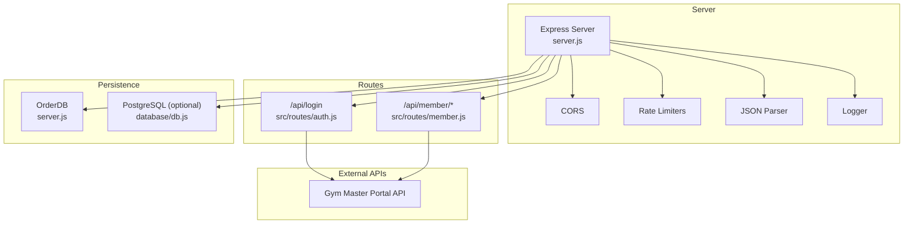
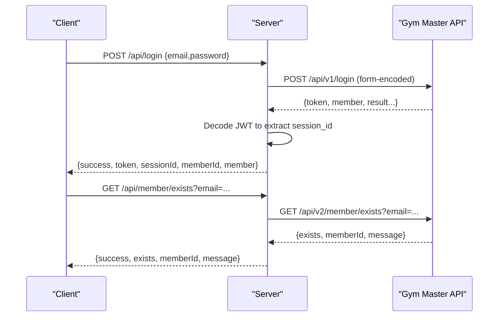
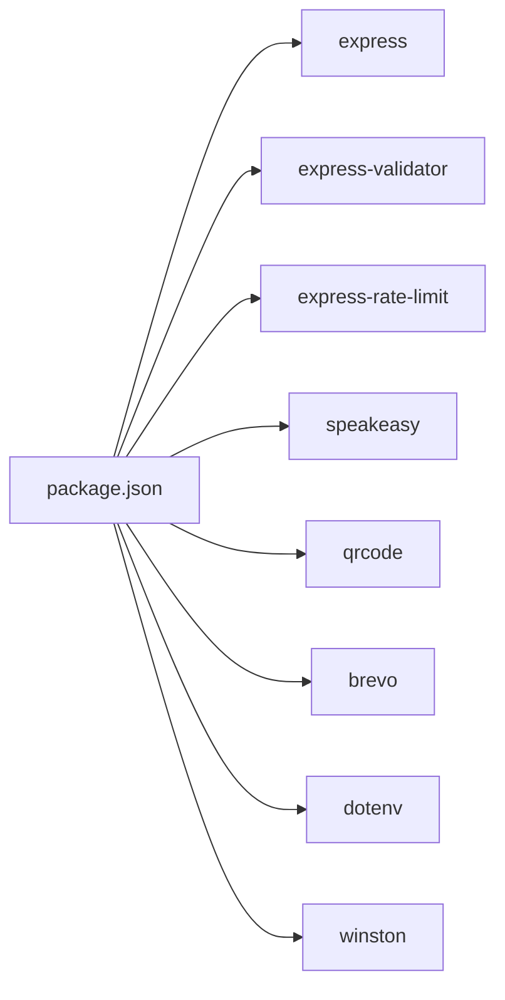
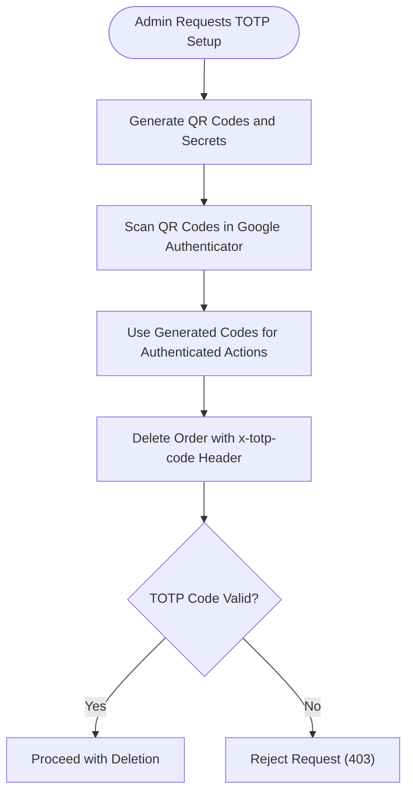

# Authentication & Membership API

<cite>
**Referenced Files in This Document**
- [server.js](file://server.js)
- [src/routes/auth.js](file://src/routes/auth.js)
- [src/routes/member.js](file://src/routes/member.js)
- [database/db.js](file://database/db.js)
- [package.json](file://package.json)
- [CPANEL_DEPLOYMENT_GUIDE.txt](file://CPANEL_DEPLOYMENT_GUIDE.txt)
</cite>

## Table of Contents
1. [Introduction](#introduction)
2. [Project Structure](#project-structure)
3. [Core Components](#core-components)
4. [Architecture Overview](#architecture-overview)
5. [Detailed Component Analysis](#detailed-component-analysis)
6. [Dependency Analysis](#dependency-analysis)
7. [Performance Considerations](#performance-considerations)
8. [Troubleshooting Guide](#troubleshooting-guide)
9. [Conclusion](#conclusion)
10. [Appendices](#appendices)

## Introduction
This document provides comprehensive API documentation for authentication and membership management endpoints. It covers:
- Member authentication flow (login verification, token generation)
- Gym Master API integration for membership operations
- Membership verification endpoints
- Profile management endpoints
- Two-factor authentication (TOTP) setup and enforcement
- Rate limiting, input validation, and security measures
- Practical examples of authentication flows, verification processes, and profile updates

## Project Structure
The backend is implemented as a Node.js Express server with modular route handlers and database utilities. Key areas:
- Routes for authentication and membership
- Server middleware for rate limiting, CORS, JSON parsing, and logging
- Gym Master API integrations for login, membership existence checks, prospect creation, and profile updates
- Database abstraction for order persistence
- Deployment and environment configuration guidance

**Diagram sources**
- [server.js](file://server.js#L380-L470)
- [src/routes/auth.js](file://src/routes/auth.js#L1-L54)
- [src/routes/member.js](file://src/routes/member.js#L1-L142)
- [database/db.js](file://database/db.js#L1-L267)

**Section sources**
- [server.js](file://server.js#L1-L2312)
- [src/routes/auth.js](file://src/routes/auth.js#L1-L54)
- [src/routes/member.js](file://src/routes/member.js#L1-L142)
- [database/db.js](file://database/db.js#L1-L267)

## Core Components
- Authentication route: Validates credentials, forwards to Gym Master v1 login, decodes JWT to extract session identifiers, and returns token and member metadata.
- Membership route: Provides existence checks, prospect creation, and profile updates via Gym Master v2 and v1 endpoints.
- Rate limiting: General API protection, strict limits for admin login and order deletion with TOTP.
- Validation: Express validator for request sanitization and validation.
- Logging: Structured logging for requests and errors.
- Database: Order persistence abstraction with MySQL/PG support.

**Section sources**
- [server.js](file://server.js#L400-L456)
- [src/routes/auth.js](file://src/routes/auth.js#L1-L54)
- [src/routes/member.js](file://src/routes/member.js#L1-L142)

## Architecture Overview
The authentication and membership flow integrates with Gym Master’s portal API. The server acts as a proxy, validating inputs, forwarding requests to Gym Master, and returning normalized responses. Token decoding extracts session identifiers for session management insights.

**Diagram sources**
- [server.js](file://server.js#L682-L779)
- [src/routes/auth.js](file://src/routes/auth.js#L11-L51)
- [src/routes/member.js](file://src/routes/member.js#L11-L41)

## Detailed Component Analysis

### Authentication Endpoints

#### POST /api/login
- Purpose: Authenticate members via Gym Master v1 login.
- Validation:
  - email: required, validated as email and normalized
  - password: required
- Request body:
  - email: string
  - password: string
- Response:
  - success: boolean
  - token: string (JWT)
  - sessionId: string (extracted from JWT payload)
  - memberId: string
  - member: object (id/name)
- Errors:
  - 400: Missing or invalid fields
  - 401: Invalid credentials
  - 500: Server or Gym Master error
- Security:
  - Rate-limited for admin login elsewhere; general rate limiting applies to all API routes.
  - JWT decoded to extract session identifier for session management insights.

Example request:
- POST /api/login
- Body: { "email": "...", "password": "..." }

Example response:
- 200 OK: { "success": true, "token": "...", "sessionId": "...", "memberId": "...", "member": { "id": "...", "name": "..." } }

**Section sources**
- [server.js](file://server.js#L682-L779)
- [src/routes/auth.js](file://src/routes/auth.js#L11-L18)

### Membership Verification Endpoints

#### GET /api/member/exists
- Purpose: Check if a member exists in Gym Master by email.
- Validation:
  - email: query parameter, required, validated as email and normalized
- Query parameters:
  - email: string
- Response:
  - success: boolean
  - exists: boolean
  - memberId: string|null
  - message: string
- Errors:
  - 400: Invalid email
  - 500: Server or Gym Master error

Example request:
- GET /api/member/exists?email=john.doe@example.com

Example response:
- 200 OK: { "success": true, "exists": true, "memberId": "12345", "message": "Check complete" }

**Section sources**
- [src/routes/member.js](file://src/routes/member.js#L11-L41)

### Membership Creation Endpoints

#### POST /api/prospect/create
- Purpose: Create a prospect (new customer) in Gym Master v1.
- Validation:
  - firstName: required, trimmed and escaped
  - lastName: required, trimmed and escaped
  - email: required, validated as email and normalized
  - phone: optional, trimmed
  - address: optional, trimmed
- Request body:
  - firstName: string
  - lastName: string
  - email: string
  - phone: string (optional)
  - address: object (optional)
- Response:
  - success: boolean
  - prospectId: string|null
  - token: string|null
  - message: string
  - localOnly: boolean (fallback if Gym Master returns non-JSON)
  - needsProfileUpdate: boolean (if address provided)
- Errors:
  - 400: Missing required fields
  - 500: Server error or Gym Master error

Example request:
- POST /api/prospect/create
- Body: { "firstName": "...", "lastName": "...", "email": "...", "phone": "...", "address": { "street": "...", "city": "...", "state": "...", "postalCode": "..." } }

Example response:
- 200 OK: { "success": true, "prospectId": "123", "token": null, "message": "Prospect created successfully in Gym Master", "needsProfileUpdate": true }

**Section sources**
- [server.js](file://server.js#L501-L600)

### Membership Profile Management Endpoints

#### POST /api/member/profile/update
- Purpose: Update member profile (phone/address) via Gym Master v2.
- Validation:
  - token: required, trimmed
  - phone: optional, trimmed
  - address: optional, trimmed
- Request body:
  - token: string
  - phone: string (optional)
  - address: object (optional)
- Response:
  - success: boolean
  - message: string
- Errors:
  - 400: Missing token
  - 500: Server or Gym Master error

Example request:
- POST /api/member/profile/update
- Body: { "token": "...", "phone": "+234...", "address": { "street": "...", "city": "...", "state": "...", "postalCode": "..." } }

Example response:
- 200 OK: { "success": true, "message": "Profile updated" }

**Section sources**
- [src/routes/member.js](file://src/routes/member.js#L99-L139)

#### POST /api/member/profile/update (Legacy v1)
- Purpose: Update member profile (phone/address) via Gym Master v1.
- Validation:
  - token: required
- Request body:
  - token: string
  - phone: string (optional)
  - address: object (optional)
- Response:
  - success: boolean
  - message: string
  - localOnly: boolean (fallback if Gym Master returns non-JSON)
- Errors:
  - 400: Missing token
  - 500: Server or Gym Master error

Example request:
- POST /api/member/profile/update
- Body: { "token": "...", "phone": "+234...", "address": { "street": "...", "city": "...", "state": "...", "postalCode": "..." } }

Example response:
- 200 OK: { "success": true, "message": "Profile updated successfully" }

**Section sources**
- [server.js](file://server.js#L602-L680)

### Legacy Authentication Endpoint (Direct Gym Master v1)
- POST /api/login (legacy)
- Purpose: Authenticate via Gym Master v1 login with form-encoded body.
- Validation:
  - email: required
  - password: required
- Response:
  - success: boolean
  - token: string
  - sessionId: string (decoded from JWT)
  - memberId: string
  - member: object
- Errors:
  - 400: Missing fields
  - 401: Invalid credentials
  - 500: Server or Gym Master error

**Section sources**
- [server.js](file://server.js#L682-L779)

### Route Modules

#### src/routes/auth.js
- Exposes POST /api/login with validation and Gym Master v2 login integration.
- Returns token, memberId, and member metadata.

**Section sources**
- [src/routes/auth.js](file://src/routes/auth.js#L1-L54)

#### src/routes/member.js
- Exposes:
  - GET /api/member/exists
  - POST /api/prospect/create
  - POST /api/member/profile/update

**Section sources**
- [src/routes/member.js](file://src/routes/member.js#L1-L142)

## Dependency Analysis
- Express: Web framework and middleware
- express-validator: Input validation and sanitization
- express-rate-limit: Rate limiting
- speakeasy: TOTP generation and verification
- qrcode: QR code generation for TOTP setup
- @getbrevo/brevo: Email service integration
- dotenv: Environment configuration
- winston: Logging

**Diagram sources**
- [package.json](file://package.json#L15-L26)

**Section sources**
- [package.json](file://package.json#L1-L28)

## Performance Considerations
- Rate limiting:
  - General API: 100 requests per minute
  - Admin login: 5 attempts per 15 minutes
  - Order deletion: 3 attempts per 15 minutes
- Request logging: Tracks method, path, status, duration, and IP for observability.
- JWT decoding: Extracts session identifiers for session management insights.
- Database abstraction: Supports MySQL and PostgreSQL with connection pooling and graceful fallbacks.

[No sources needed since this section provides general guidance]

## Troubleshooting Guide
Common issues and resolutions:
- Invalid JSON body:
  - The server validates JSON and returns 400 with a structured error.
- Gym Master API failures:
  - Responses are parsed and forwarded; non-JSON responses are handled gracefully with local-only fallbacks.
- Missing environment variables:
  - Critical keys include Gym Master API credentials, Paystack keys, and TOTP secrets. Ensure they are set in .env.
- Rate limit exceeded:
  - Reduce request frequency or wait for the window to reset.
- TOTP verification failures:
  - Ensure the correct code is provided via the x-totp-code header for order deletion.

**Section sources**
- [server.js](file://server.js#L384-L393)
- [server.js](file://server.js#L403-L428)
- [server.js](file://server.js#L1219-L1285)
- [CPANEL_DEPLOYMENT_GUIDE.txt](file://CPANEL_DEPLOYMENT_GUIDE.txt#L32-L50)

## Conclusion
The authentication and membership API integrates seamlessly with Gym Master, providing robust validation, rate limiting, and security measures. The endpoints support member login, verification, prospect creation, and profile updates, with clear error handling and fallback mechanisms for resilience.

[No sources needed since this section summarizes without analyzing specific files]

## Appendices

### JWT Token Structure and Session Management
- The server decodes the JWT token to extract session identifiers for session management insights.
- Typical JWT payload fields observed include sessionid/session_id.

**Section sources**
- [server.js](file://server.js#L742-L756)

### Two-Factor Authentication (TOTP) Setup and Enforcement
- TOTP setup page generates QR codes for Google Authenticator for admin login and order deletion.
- Order deletion requires x-totp-code header; verification uses speakeasy with a configurable secret.

**Diagram sources**
- [server.js](file://server.js#L1138-L1216)
- [server.js](file://server.js#L1219-L1285)

**Section sources**
- [server.js](file://server.js#L1138-L1216)
- [server.js](file://server.js#L1219-L1285)

### Practical Examples

#### Authentication Flow
- Client sends POST /api/login with email and password.
- Server forwards to Gym Master v1 login.
- On success, server decodes JWT to extract session identifier and returns token, memberId, and member metadata.

**Section sources**
- [server.js](file://server.js#L682-L779)

#### Membership Verification Process
- Client sends GET /api/member/exists with email query parameter.
- Server calls Gym Master v2 member existence endpoint and returns existence status and memberId.

**Section sources**
- [src/routes/member.js](file://src/routes/member.js#L11-L41)

#### Profile Update Operation
- Client sends POST /api/member/profile/update with token and optional phone/address.
- Server calls Gym Master v2 profile update endpoint and returns success status.

**Section sources**
- [src/routes/member.js](file://src/routes/member.js#L99-L139)