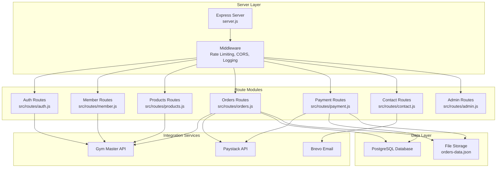
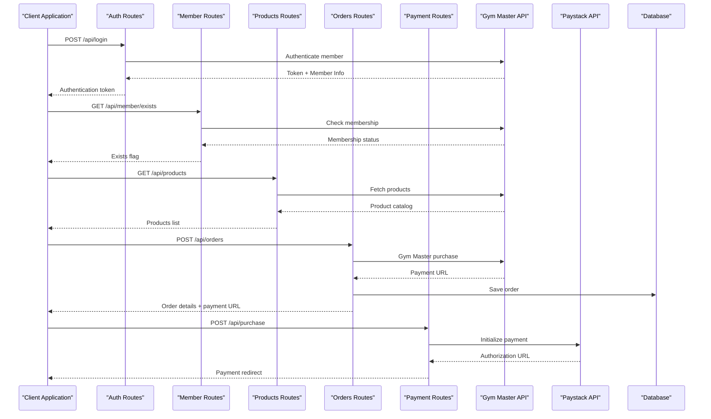
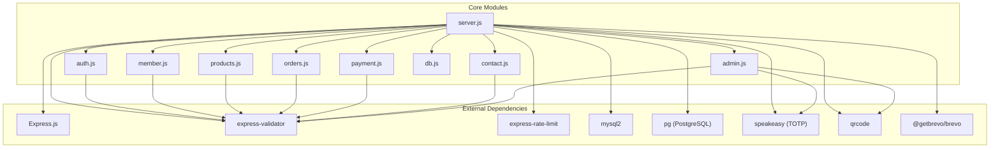

# Backend API Reference

<cite>
**Referenced Files in This Document**
- [server.js](file://server.js)
- [auth.js](file://src/routes/auth.js)
- [admin.js](file://src/routes/admin.js)
- [member.js](file://src/routes/member.js)
- [products.js](file://src/routes/products.js)
- [orders.js](file://src/routes/orders.js)
- [payment.js](file://src/routes/payment.js)
- [contact.js](file://src/routes/contact.js)
- [db.js](file://database/db.js)
- [init.sql](file://database/init.sql)
- [package.json](file://package.json)
</cite>

## Update Summary
**Changes Made**
- Enhanced order deletion endpoint documentation with improved TOTP verification process
- Added comprehensive debug endpoint information for order management
- Updated security considerations for TOTP authentication with dual-secret support
- Improved error response formats and validation rules
- Added rate limiting details for order deletion operations

## Table of Contents
1. [Introduction](#introduction)
2. [Project Structure](#project-structure)
3. [Core Components](#core-components)
4. [Architecture Overview](#architecture-overview)
5. [Detailed Component Analysis](#detailed-component-analysis)
6. [Dependency Analysis](#dependency-analysis)
7. [Performance Considerations](#performance-considerations)
8. [Troubleshooting Guide](#troubleshooting-guide)
9. [Conclusion](#conclusion)

## Introduction
This document provides comprehensive API documentation for Active Zone Hub's backend. It covers all RESTful endpoints including health checks, authentication, membership management, product catalog, order processing, payment handling, and administrative functions. Special attention is given to Gym Master API integration for member verification and authentication, Paystack payment processing, rate limiting, input validation, and security controls.

## Project Structure
The backend is built with Express.js and organized into modular route handlers. Key components include:
- Central server configuration with middleware and rate limiting
- Route modules for authentication, membership, products, orders, payments, and contacts
- Database abstraction for PostgreSQL with fallback to file-based storage
- Gym Master API integration for membership and purchases
- Paystack integration for payment processing
- Email service integration via Brevo



**Diagram sources**
- [server.js:17-25](file://server.js#L17-L25)
- [auth.js:1-54](file://src/routes/auth.js#L1-L54)
- [member.js:1-142](file://src/routes/member.js#L1-L142)
- [products.js:1-121](file://src/routes/products.js#L1-L121)
- [orders.js:1-371](file://src/routes/orders.js#L1-L371)
- [payment.js:1-154](file://src/routes/payment.js#L1-L154)
- [contact.js:1-71](file://src/routes/contact.js#L1-L71)

**Section sources**
- [server.js:17-25](file://server.js#L17-L25)
- [package.json:1-32](file://package.json#L1-L32)

## Core Components

### Rate Limiting and Security
The server implements three tiers of rate limiting:
- General API rate limiting: 100 requests per minute
- Admin login rate limiting: 5 attempts per 15 minutes
- Order deletion rate limiting: 3 attempts per 15 minutes

Security measures include:
- Input validation using express-validator
- JSON parsing verification
- CORS configuration
- HTTPS enforcement in production
- TOTP-based authentication for admin operations with dual-secret support

### Database Abstraction
The system supports dual storage modes:
- PostgreSQL database with automatic migrations
- File-based fallback using JSON files
- Hybrid approach with MySQL helpers for order management

**Section sources**
- [server.js:407-436](file://server.js#L407-L436)
- [db.js:1-267](file://database/db.js#L1-L267)
- [init.sql:1-80](file://database/init.sql#L1-L80)

## Architecture Overview



**Diagram sources**
- [server.js:1793-2040](file://server.js#L1793-L2040)
- [auth.js:11-51](file://src/routes/auth.js#L11-L51)
- [member.js:11-41](file://src/routes/member.js#L11-L41)
- [products.js:37-69](file://src/routes/products.js#L37-L69)
- [orders.js:234-325](file://src/routes/orders.js#L234-L325)
- [payment.js:31-110](file://src/routes/payment.js#L31-L110)

## Detailed Component Analysis

### Health Check Endpoint
**Endpoint:** `GET /api/health`
**Purpose:** Server health monitoring
**Response:** `{ status: 'ok', message: 'Server is running' }`

**Section sources**
- [server.js:464-467](file://server.js#L464-L467)

### Authentication Endpoints

#### Member Authentication
**Endpoint:** `POST /api/login`
**Purpose:** Authenticate members via Gym Master API
**Authentication:** None required
**Request Body:**
```javascript
{
  email: string,      // Required - Valid email
  password: string    // Required - Password
}
```

**Response:**
```javascript
{
  success: boolean,
  token: string,      // Gym Master authentication token
  sessionId: string,  // JWT session identifier
  memberId: string,   // Member identifier
  member: object      // Member details
}
```

**Validation Rules:**
- Email: Valid email format
- Password: Non-empty string

**Section sources**
- [server.js:689-786](file://server.js#L689-L786)
- [auth.js:11-51](file://src/routes/auth.js#L11-L51)

### Gym Master Integration Endpoints

#### Member Verification
**Endpoint:** `GET /api/member/exists`
**Purpose:** Check if member exists in Gym Master system
**Authentication:** None required
**Query Parameters:**
- `email`: Required - Valid email address

**Response:**
```javascript
{
  success: boolean,
  exists: boolean,     // Member existence flag
  memberId: string,    // Gym Master member ID
  message: string     // Operation status
}
```

**Section sources**
- [server.js:478-506](file://server.js#L478-L506)
- [member.js:11-41](file://src/routes/member.js#L11-L41)

#### Member Registration
**Endpoint:** `POST /api/member/create`
**Purpose:** Create new member in Gym Master system
**Authentication:** None required
**Request Body:**
```javascript
{
  firstName: string,   // Required
  lastName: string,    // Required
  email: string,       // Required - Valid email
  phone?: string,      // Optional
  address?: object     // Optional - { street, city, state, postalCode }
}
```

**Response:**
```javascript
{
  success: boolean,
  memberId: string,    // Gym Master member ID
  message: string     // Operation status
}
```

**Section sources**
- [server.js:508-607](file://server.js#L508-L607)
- [member.js:43-97](file://src/routes/member.js#L43-L97)

#### Profile Updates
**Endpoint:** `POST /api/member/profile/update`
**Purpose:** Update member profile information
**Authentication:** Requires Gym Master token
**Request Body:**
```javascript
{
  token: string,       // Required - Gym Master authentication token
  phone?: string,      // Optional
  address?: object     // Optional - { street, city, state, postalCode }
}
```

**Response:**
```javascript
{
  success: boolean,
  message: string     // Operation status
}
```

**Section sources**
- [server.js:609-687](file://server.js#L609-L687)
- [member.js:99-139](file://src/routes/member.js#L99-L139)

### Product Catalog Endpoints

#### Product Listing
**Endpoint:** `GET /api/products`
**Purpose:** Retrieve product catalog
**Authentication:** None required
**Response:**
```javascript
{
  success: boolean,
  products: array    // Product catalog with filtering applied
}
```

**Filtering Logic:**
- Excludes delivery/pickup products (IDs: 730312, 730313)
- Falls back to Gym Master API if local cache empty

**Section sources**
- [server.js:37-69](file://server.js#L37-L69)
- [products.js:37-69](file://src/routes/products.js#L37-L69)

#### Stock Validation
**Endpoint:** `POST /api/products/check-stock`
**Purpose:** Validate product availability
**Authentication:** None required
**Request Body:**
```javascript
{
  items: array    // Array of { id, quantity }
}
```

**Response:**
```javascript
{
  success: boolean,
  allAvailable: boolean,    // True if all items available
  results: array           // Individual item validation results
}
```

**Section sources**
- [server.js:71-118](file://server.js#L71-L118)
- [products.js:71-118](file://src/routes/products.js#L71-L118)

### Order Processing Endpoints

#### Order Creation
**Endpoint:** `POST /api/orders`
**Purpose:** Create new order with Gym Master integration
**Authentication:** Gym Master token required
**Request Body:**
```javascript
{
  token: string,              // Required - Gym Master authentication
  customer: object,           // Required - { name, email, phone }
  items: array,               // Required - Order items
  deliveryMethod?: string,    // Optional - 'delivery' or 'pickup'
  deliveryAddress?: object,   // Optional - Delivery location
  subtotal?: number,          // Optional - Subtotal amount
  deliveryFee?: number,       // Optional - Delivery fee
  total: number,              // Required - Total amount
  notes?: string             // Optional - Order notes
}
```

**Response:**
```javascript
{
  success: boolean,
  orderId: string,           // Generated order identifier
  paymentUrl: string,        // Payment authorization URL
  message: string,           // Operation status
  order: object,             // Created order details
  gymMasterResponse: object  // Gym Master API response
}
```

**Processing Logic:**
1. Validates Gym Master token
2. Calls Gym Master purchase API
3. Attempts Paystack fallback if Gym Master fails
4. Saves order to database
5. Returns payment URL

**Section sources**
- [server.js:1793-2040](file://server.js#L1793-L2040)
- [orders.js:234-325](file://src/routes/orders.js#L234-L325)

#### Order Tracking
**Endpoint:** `GET /api/orders/track/:reference`
**Purpose:** Track order status by reference
**Authentication:** None required
**Path Parameters:**
- `reference`: Required - Order identifier

**Response:**
```javascript
{
  success: boolean,
  order: object    // Order details with status
}
```

**Section sources**
- [orders.js:102-145](file://src/routes/orders.js#L102-L145)

#### Order Status Management
**Endpoint:** `PATCH /api/orders/:orderId/status`
**Purpose:** Update order delivery status (Admin only)
**Authentication:** Admin credentials required
**Path Parameters:**
- `orderId`: Required - Order identifier

**Request Body:**
```javascript
{
  deliveryStatus: string    // One of: 'pending', 'paid', 'processing', 'shipped', 'delivered'
}
```

**Response:**
```javascript
{
  success: boolean,
  message: string,
  order: object,
  emailSent: boolean
}
```

**Section sources**
- [server.js:992-1066](file://server.js#L992-L1066)
- [orders.js:147-190](file://src/routes/orders.js#L147-L190)

#### Order Deletion
**Endpoint:** `DELETE /api/orders/:orderId`
**Purpose:** Delete orders (Admin only) with enhanced TOTP verification
**Authentication:** Admin credentials + TOTP required
**Path Parameters:**
- `orderId`: Required - Order identifier
**Headers:**
- `x-totp-code`: Required - 6-digit Google Authenticator code

**Enhanced Security Features:**
- Dual-secret TOTP verification with fallback support
- Rate limiting (3 attempts per 15 minutes)
- Restricts deletion of paid orders that are being processed
- Enhanced error responses with specific failure reasons

**Response:**
```javascript
{
  success: boolean,
  message: string,
  orderId: string
}
```

**Security Controls:**
- TOTP verification with base32 secret
- Rate limiting configuration: 3 attempts per 15 minutes
- Restricts deletion of paid orders that are being processed
- Enhanced logging for security events

**Debug Information:**
- Accessible via `/api/orders/debug` endpoint
- Provides database connection status
- Shows TOTP secret configuration status
- Displays timestamp for debugging purposes

**Section sources**
- [server.js:1307-1374](file://server.js#L1307-L1374)
- [orders.js:24-35](file://src/routes/orders.js#L24-L35)
- [admin.js:10-26](file://src/routes/admin.js#L10-L26)

### Payment Processing Endpoints

#### Payment Initialization
**Endpoint:** `POST /api/purchase`
**Purpose:** Initialize payment via Paystack
**Authentication:** None required
**Request Body:**
```javascript
{
  token: string,              // Required - Gym Master authentication
  items: array,               // Required - Order items
  customer: object,           // Required - { name, email, phone }
  deliveryMethod?: string,    // Optional
  deliveryAddress?: object,   // Optional
  subtotal?: number,          // Optional
  deliveryFee?: number,       // Optional
  total: number,              // Required - Amount in NGN
  notes?: string             // Optional
}
```

**Response:**
```javascript
{
  success: boolean,
  orderId: string,           // Generated order identifier
  authorizationUrl: string,  // Paystack authorization URL
  reference: string         // Payment reference
}
```

**Section sources**
- [payment.js:31-110](file://src/routes/payment.js#L31-L110)

#### Payment Verification
**Endpoint:** `GET /api/verify-payment/:reference`
**Purpose:** Verify Paystack payment completion
**Authentication:** None required
**Path Parameters:**
- `reference`: Required - Payment reference

**Response:**
```javascript
{
  success: boolean,
  message: string,
  data?: object    // Payment details if successful
}
```

**Section sources**
- [server.js:885-987](file://server.js#L885-L987)
- [payment.js:112-151](file://src/routes/payment.js#L112-L151)

### Administrative Endpoints

#### Admin Login
**Endpoint:** `POST /api/admin/login`
**Purpose:** Admin authentication
**Authentication:** None required
**Request Body:**
```javascript
{
  password: string    // Required - Admin password
}
```

**Response:**
```javascript
{
  success: boolean,
  message: string
}
```

**Security Controls:**
- Rate limited (5 attempts per 15 minutes)
- Configurable via environment variable

**Section sources**
- [server.js:1125-1142](file://server.js#L1125-L1142)
- [admin.js:10-26](file://src/routes/admin.js#L10-L26)

#### TOTP Setup
**Endpoint:** `GET /api/totp/setup`
**Purpose:** Display Google Authenticator setup
**Authentication:** None required
**Response:** HTML page with QR codes and secrets

**Enhanced Features:**
- Separate TOTP codes for admin login and order deletion
- Manual secret entry option
- Instructions for Google Authenticator setup
- Dual-secret support with fallback mechanisms

**Security Considerations:**
- Two-factor authentication for critical operations
- Separate secrets for different admin functions
- Time-based verification with window tolerance
- Enhanced logging for security events

**Section sources**
- [server.js:1144-1242](file://server.js#L1144-L1242)
- [admin.js:28-125](file://src/routes/admin.js#L28-L125)

### Debug Endpoints

#### Order Management Debug
**Endpoint:** `GET /api/orders/debug`
**Purpose:** Debug order management system status
**Authentication:** None required
**Response:**
```javascript
{
  USE_DB: boolean,
  DATABASE_ENABLED: string,
  MONGODB_URI: string,
  dbConnected: boolean,
  TOTP_SECRET_ADMIN_set: boolean,
  TOTP_SECRET_set: boolean,
  timestamp: string
}
```

**Debug Information:**
- Database connection status
- Environment variable configuration
- TOTP secret availability
- System timestamp for debugging

**Section sources**
- [orders.js:24-35](file://src/routes/orders.js#L24-L35)

### Contact Form Endpoint

#### Contact Submission
**Endpoint:** `POST /api/contact`
**Purpose:** Submit contact form messages
**Authentication:** None required
**Request Body:**
```javascript
{
  name: string,     // Required
  email: string,    // Required - Valid email
  message: string,  // Required
  phone?: string    // Optional
}
```

**Response:**
```javascript
{
  success: boolean,
  message: string,
  emailSent?: boolean
}
```

**Features:**
- Email notification via Brevo
- Fallback to file storage if email service unavailable
- Comprehensive logging

**Section sources**
- [server.js:2078-2290](file://server.js#L2078-L2290)
- [contact.js:1-71](file://src/routes/contact.js#L1-L71)

## Dependency Analysis



**Diagram sources**
- [package.json:19-30](file://package.json#L19-L30)
- [server.js:1-16](file://server.js#L1-L16)

**Section sources**
- [package.json:19-30](file://package.json#L19-L30)

## Performance Considerations

### Rate Limiting Configuration
- General API: 100 requests per minute
- Admin login: 5 attempts per 15 minutes
- Order deletion: 3 attempts per 15 minutes

### Database Optimization
- PostgreSQL indexes on frequently queried columns
- JSONB fields for flexible data storage
- Automatic timestamp updates via triggers
- Connection pooling for efficient resource usage

### Caching Strategy
- Local product cache with Gym Master fallback
- File-based storage as primary fallback
- Memory caching for active sessions

## Troubleshooting Guide

### Common Issues and Solutions

#### Authentication Failures
**Problem:** Gym Master authentication errors
**Solution:** Verify API credentials and network connectivity
**Debug Steps:**
1. Check Gym Master API key and company ID
2. Verify network access to Gym Master endpoints
3. Review authentication logs

#### Payment Processing Issues
**Problem:** Paystack payment initialization failures
**Solution:** Validate Paystack secret key and amount formatting
**Debug Steps:**
1. Confirm PAYSTACK_SECRET_KEY environment variable
2. Ensure amount is in kobo (multiply NGN by 100)
3. Check callback URL configuration

#### Database Connection Problems
**Problem:** PostgreSQL connection failures
**Solution:** Verify connection string and SSL configuration
**Debug Steps:**
1. Check DATABASE_URL environment variable
2. Validate SSL certificate configuration
3. Test connection with psql client

#### Email Service Configuration
**Problem:** Email delivery failures
**Solution:** Configure Brevo API credentials properly
**Debug Steps:**
1. Set BREVO_API_KEY environment variable
2. Verify sender email configuration
3. Check email template formatting

#### TOTP Authentication Issues
**Problem:** Order deletion TOTP verification failures
**Solution:** Verify Google Authenticator setup and secret configuration
**Debug Steps:**
1. Check TOTP_SECRET_ADMIN and TOTP_SECRET environment variables
2. Verify Google Authenticator app synchronization
3. Confirm rate limiting hasn't been triggered
4. Use `/api/orders/debug` endpoint for status information

**Section sources**
- [server.js:2050-2071](file://server.js#L2050-L2071)
- [db.js:1-50](file://database/db.js#L1-L50)

## Conclusion
Active Zone Hub's backend provides a comprehensive API solution with robust integrations to Gym Master and Paystack, along with strong security measures including rate limiting, input validation, and TOTP-based authentication. The modular architecture supports both database-driven and file-based storage, ensuring flexibility across deployment environments. The enhanced order deletion endpoint with improved TOTP verification process provides better security and debugging capabilities. The extensive error handling and logging capabilities facilitate reliable operation and easy troubleshooting.