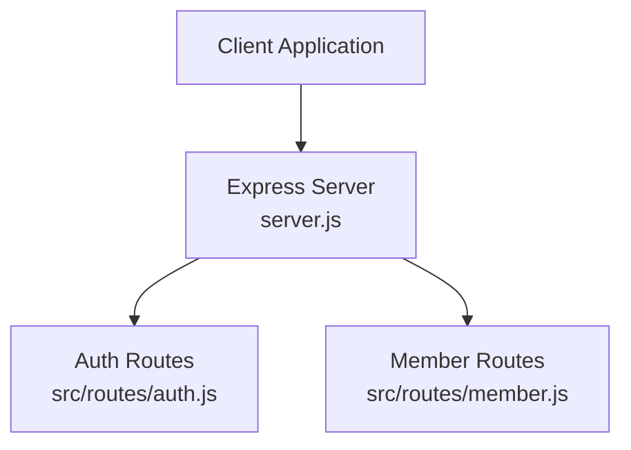
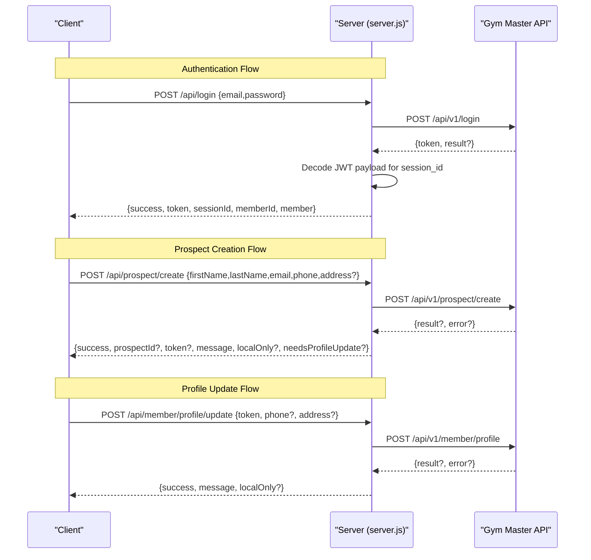
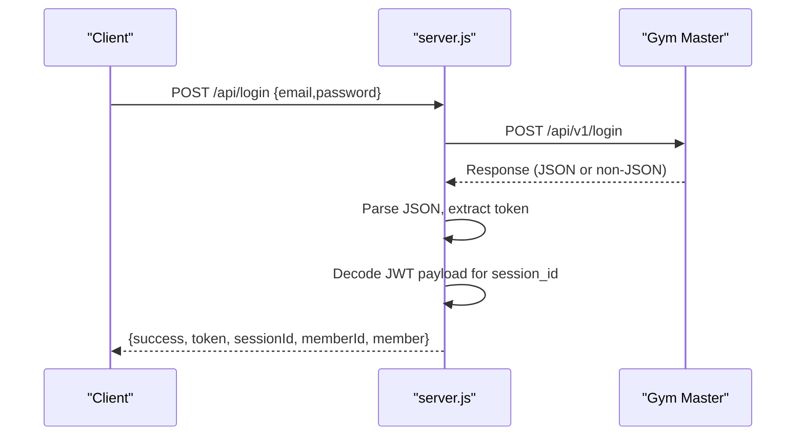
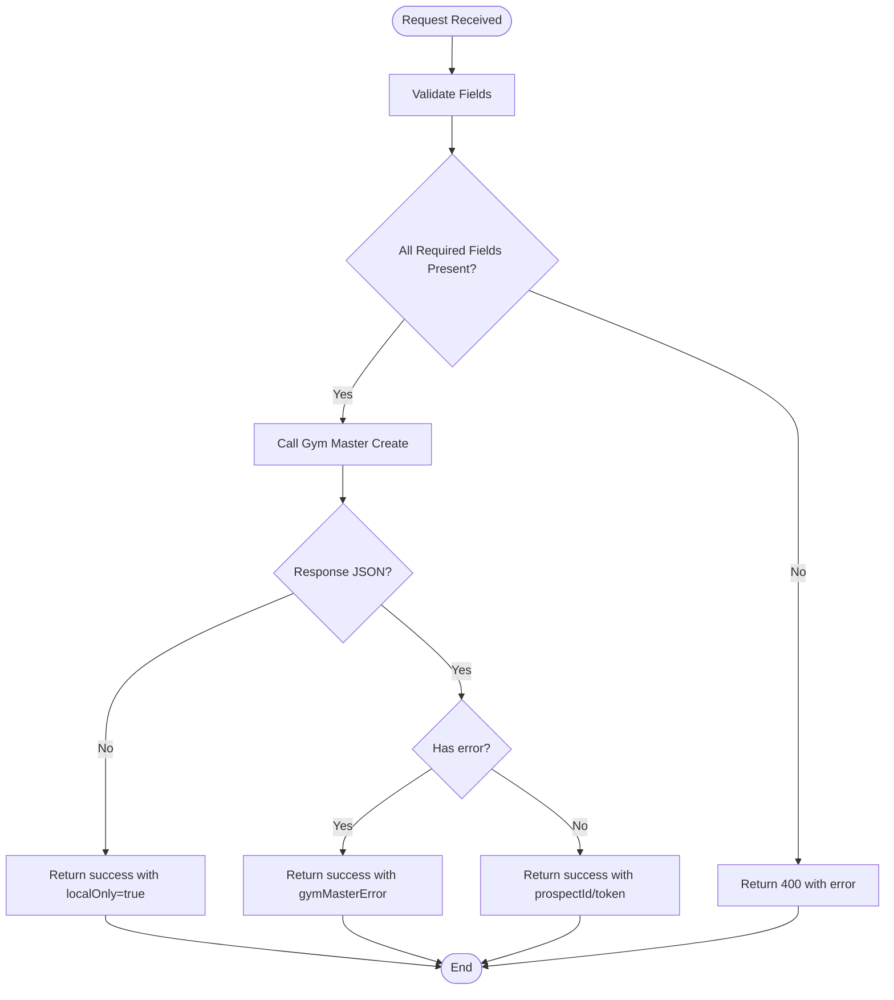
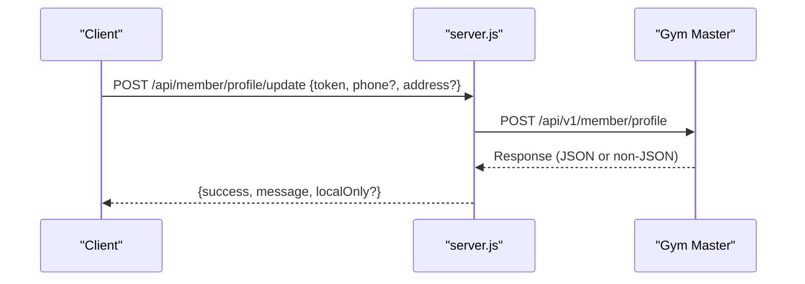
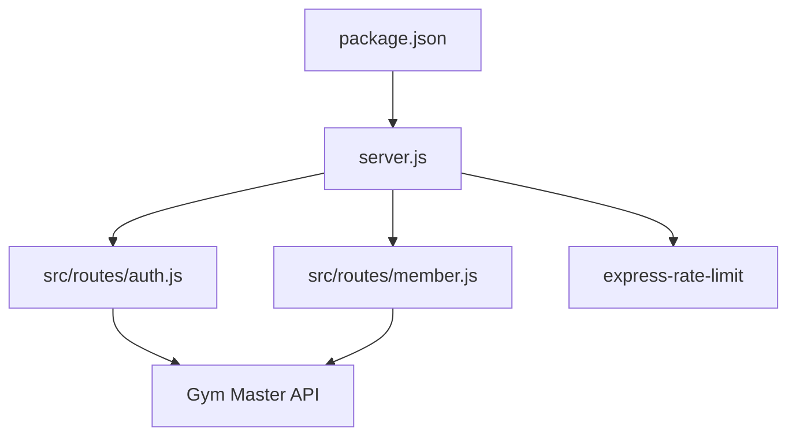

# Core Endpoints

<cite>
**Referenced Files in This Document**
- [server.js](file://server.js)
- [auth.js](file://src/routes/auth.js)
- [member.js](file://src/routes/member.js)
- [package.json](file://package.json)
- [schema.sql](file://database/schema.sql)
- [init.sql](file://database/init.sql)
</cite>

## Table of Contents
1. [Introduction](#introduction)
2. [Project Structure](#project-structure)
3. [Core Components](#core-components)
4. [Architecture Overview](#architecture-overview)
5. [Detailed Component Analysis](#detailed-component-analysis)
6. [Dependency Analysis](#dependency-analysis)
7. [Performance Considerations](#performance-considerations)
8. [Troubleshooting Guide](#troubleshooting-guide)
9. [Conclusion](#conclusion)

## Introduction
This document provides comprehensive API documentation for Active Zone Hub’s core endpoints focused on system health, member authentication, customer prospect creation, and member profile updates. It covers HTTP methods, URL patterns, request/response schemas, authentication requirements, validation rules, error handling, Gym Master integration flow, JWT token handling, session management, rate limiting policies, and security measures.

## Project Structure
The backend server is implemented in a single Node.js application with modular route handlers. The core endpoints are exposed under the /api namespace, with dedicated route modules for authentication and member management.

**Diagram sources**
- [server.js](file://server.js#L462-L469)
- [auth.js](file://src/routes/auth.js#L1-L54)
- [member.js](file://src/routes/member.js#L1-L142)

**Section sources**
- [server.js](file://server.js#L462-L469)
- [auth.js](file://src/routes/auth.js#L1-L54)
- [member.js](file://src/routes/member.js#L1-L142)

## Core Components
This section documents the four primary endpoints requested:

- GET /api/health
- POST /api/login
- POST /api/prospect/create
- POST /api/member/profile/update

Each endpoint includes HTTP method, URL pattern, request/response schemas, authentication requirements, validation rules, error handling, and practical examples.

### GET /api/health
- Purpose: System health check for monitoring and readiness probes.
- Method: GET
- URL: /api/health
- Authentication: Not required
- Rate Limiting: None (exposed outside general rate limiter)
- Response:
  - Success: { status: "ok", message: "Server is running" }
- Error Handling:
  - Returns 500 on unexpected internal failures (handled globally)
- Practical Examples:
  - curl: curl -i https://yourdomain.com/api/health
  - JavaScript fetch: fetch("https://yourdomain.com/api/health").then(r => r.json()).then(console.log)

**Section sources**
- [server.js](file://server.js#L457-L460)

### POST /api/login
- Purpose: Authenticate members via Gym Master integration and return session identifiers.
- Method: POST
- URL: /api/login
- Authentication: Not required
- Request Body:
  - email: string, required
  - password: string, required
- Validation:
  - email: must be a valid email format
  - password: must not be empty
- Gym Master Integration:
  - Calls Gym Master v1 login endpoint with api_key, companyId, email, password
  - Parses JWT-like token and extracts session_id/sessionid from payload
- Response:
  - On success: { success: true, token: string, sessionId: string|null, memberId: string, member: object }
  - On failure: { success: false, error: string }
- Error Handling:
  - Invalid JSON response from Gym Master returns 500 with error message
  - Non-OK HTTP status mapped to response status and error message
  - General server errors return 500
- Security Measures:
  - Uses HTTPS in production environments
  - JWT decoding performed safely with base64 parsing and JSON parsing
- Practical Examples:
  - curl: curl -X POST https://yourdomain.com/api/login -H "Content-Type: application/json" -d '{"email":"member@example.com","password":"secure"}'
  - JavaScript fetch: fetch("https://yourdomain.com/api/login", { method: "POST", headers: {"Content-Type":"application/json"}, body: JSON.stringify({email:"...",password:"..."}) }).then(r => r.json()).then(console.log)

**Section sources**
- [server.js](file://server.js#L682-L779)

### POST /api/prospect/create
- Purpose: Register a new customer prospect with Gym Master and optionally capture address details.
- Method: POST
- URL: /api/prospect/create
- Authentication: Not required
- Request Body:
  - firstName: string, required
  - lastName: string, required
  - email: string, required
  - phone: string, required
  - address: object, optional
    - street: string
    - city: string
    - state: string
    - postalCode: string
- Validation:
  - firstName, lastName, email, phone are required
- Gym Master Integration:
  - Calls Gym Master v1 prospect create endpoint with api_key, companyId, and normalized fields
  - Accepts non-JSON responses gracefully and still returns success for local order processing
- Response:
  - On success: { success: true, prospectId: string|null, token: string|null, message: string, localOnly?: boolean, needsProfileUpdate?: boolean }
  - On Gym Master error: { success: true, prospectId: null, token: null, message: string, gymMasterError?: string, localOnly: true }
  - On connection failure: { success: true, prospectId: null, token: null, message: string, localOnly: true }
- Error Handling:
  - Graceful handling of Gym Master non-JSON responses
  - Local-only fallback ensures order processing continues
- Practical Examples:
  - curl: curl -X POST https://yourdomain.com/api/prospect/create -H "Content-Type: application/json" -d '{"firstName":"John","lastName":"Doe","email":"john@example.com","phone":"+234...","address":{"street":"123 Main St","city":"City","state":"State","postalCode":"ZIP"}}'
  - JavaScript fetch: fetch("https://yourdomain.com/api/prospect/create", { method: "POST", headers: {"Content-Type":"application/json"}, body: JSON.stringify({...}) }).then(r => r.json()).then(console.log)

**Section sources**
- [server.js](file://server.js#L501-L600)

### POST /api/member/profile/update
- Purpose: Update a member’s profile (e.g., add phone/address) after prospect creation.
- Method: POST
- URL: /api/member/profile/update
- Authentication: Not required
- Request Body:
  - token: string, required
  - phone: string, optional
  - address: object, optional
    - street: string
    - city: string
    - state: string
    - postalCode: string
- Validation:
  - token is required
- Gym Master Integration:
  - Calls Gym Master v1 member profile endpoint with api_key, token, and optional fields
  - Handles non-JSON responses gracefully
- Response:
  - On success: { success: true, message: string, localOnly?: boolean }
  - On error: { success: true, message: string, error?: string }
- Error Handling:
  - Attempts update even if Gym Master returns non-JSON or error response
- Practical Examples:
  - curl: curl -X POST https://yourdomain.com/api/member/profile/update -H "Content-Type: application/json" -d '{"token":"PROSPECT_TOKEN","phone":"+234...","address":{"city":"City","state":"State"}}'
  - JavaScript fetch: fetch("https://yourdomain.com/api/member/profile/update", { method: "POST", headers: {"Content-Type":"application/json"}, body: JSON.stringify({...}) }).then(r => r.json()).then(console.log)

**Section sources**
- [server.js](file://server.js#L602-L680)

## Architecture Overview
The backend integrates with Gym Master for authentication, prospect creation, and member profile updates. Requests are validated, rate-limited, and forwarded to Gym Master APIs. Responses are normalized and returned to clients.

**Diagram sources**
- [server.js](file://server.js#L682-L779)
- [server.js](file://server.js#L501-L600)
- [server.js](file://server.js#L602-L680)

## Detailed Component Analysis

### Endpoint: GET /api/health
- Behavior: Returns a simple health status payload.
- Observability: Logged via request logging middleware.
- Monitoring: Suitable for Kubernetes readiness/liveness probes.

**Section sources**
- [server.js](file://server.js#L457-L460)

### Endpoint: POST /api/login
- Validation: Express validator checks email format and non-empty password.
- Gym Master Integration: Sends credentials to Gym Master login endpoint and parses token.
- JWT Handling: Decodes token to extract session identifier from payload.
- Session Management: Exposes session_id/sessionid for downstream client usage.
- Error Handling: Maps Gym Master errors and invalid responses to structured JSON.

**Diagram sources**
- [server.js](file://server.js#L682-L779)

**Section sources**
- [server.js](file://server.js#L682-L779)

### Endpoint: POST /api/prospect/create
- Validation: Requires firstName, lastName, email, phone.
- Gym Master Integration: Submits prospect data to Gym Master create endpoint.
- Fallback Behavior: If Gym Master returns non-JSON or error, still returns success with localOnly flag to continue order processing.
- Address Handling: If address is provided, marks needsProfileUpdate to indicate follow-up profile update.

**Diagram sources**
- [server.js](file://server.js#L501-L600)

**Section sources**
- [server.js](file://server.js#L501-L600)

### Endpoint: POST /api/member/profile/update
- Validation: Requires token; phone/address are optional.
- Gym Master Integration: Updates member profile with provided fields.
- Fallback Behavior: Attempts update even if Gym Master returns non-JSON or error.

**Diagram sources**
- [server.js](file://server.js#L602-L680)

**Section sources**
- [server.js](file://server.js#L602-L680)

## Dependency Analysis
The server applies rate limiting and integrates with Gym Master and external services. Route modules encapsulate validation and Gym Master calls.

**Diagram sources**
- [package.json](file://package.json#L15-L26)
- [server.js](file://server.js#L11-L14)
- [auth.js](file://src/routes/auth.js#L1-L54)
- [member.js](file://src/routes/member.js#L1-L142)

**Section sources**
- [package.json](file://package.json#L15-L26)
- [server.js](file://server.js#L11-L14)
- [auth.js](file://src/routes/auth.js#L1-L54)
- [member.js](file://src/routes/member.js#L1-L142)

## Performance Considerations
- General Rate Limiting: Applied to all /api routes with moderate limits to prevent abuse.
- Endpoint-Specific Rate Limiting:
  - Admin login: strict limit to mitigate brute-force attempts.
  - Order deletion: strict limit requiring TOTP verification.
- Request Logging: Middleware logs method, path, status, and duration for observability.
- Database Mode: Falls back to file-based storage when MySQL is disabled, impacting performance and reliability.

[No sources needed since this section provides general guidance]

## Troubleshooting Guide
Common issues and resolutions:

- Invalid JSON in requests:
  - The server validates JSON and returns 400 with a structured error message when malformed JSON is detected.
- Gym Master API failures:
  - Prospective creation and profile update handle non-JSON and error responses gracefully, returning success with localOnly flags to continue processing.
- Login failures:
  - Returns 400/401 with Gym Master-provided error messages; invalid responses are treated as server errors.
- Rate limiting:
  - Excessive requests receive 429 responses; reduce request frequency or adjust limits.
- HTTPS enforcement:
  - Production enforces HTTPS redirection; ensure proper SSL configuration to avoid mixed-content issues.

**Section sources**
- [server.js](file://server.js#L384-L393)
- [server.js](file://server.js#L501-L600)
- [server.js](file://server.js#L602-L680)
- [server.js](file://server.js#L682-L779)
- [server.js](file://server.js#L403-L428)
- [server.js](file://server.js#L2270-L2278)

## Conclusion
Active Zone Hub’s core endpoints provide robust integration with Gym Master for authentication, prospect creation, and member profile updates, while maintaining clear validation, error handling, and rate limiting. The documented schemas and flows enable reliable client integrations and smooth operational workflows.