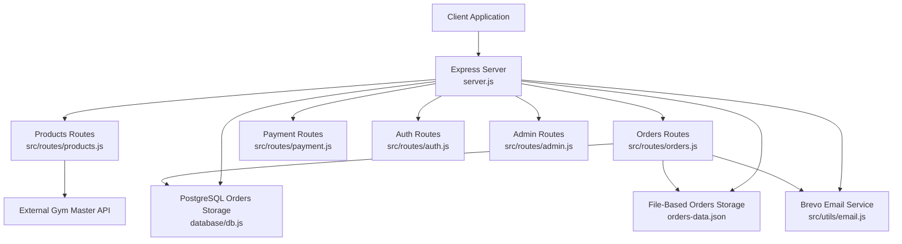
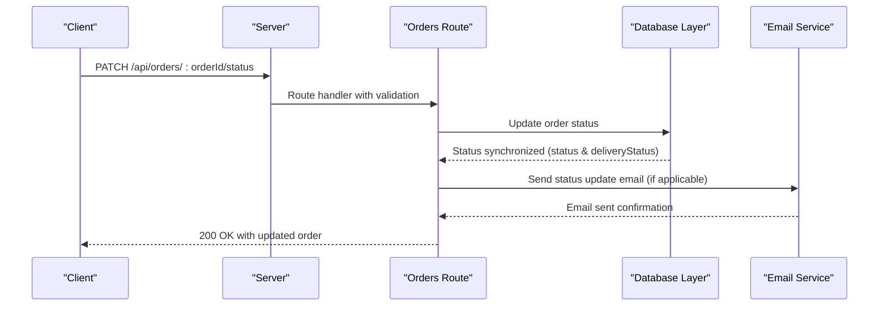

# E-commerce & Products API

<cite>
**Referenced Files in This Document**
- [server.js](file://server.js)
- [products.js](file://src/routes/products.js)
- [orders.js](file://src/routes/orders.js)
- [payment.js](file://src/routes/payment.js)
- [auth.js](file://src/routes/auth.js)
- [admin.js](file://src/routes/admin.js)
- [db.js](file://database/db.js)
- [package.json](file://package.json)
- [orders-data.json](file://orders-data.json)
- [email.js](file://src/utils/email.js)
- [schema.sql](file://database/schema.sql)
</cite>

## Update Summary
**Changes Made**
- Enhanced order status update mechanism with automatic status and deliveryStatus synchronization
- Added comprehensive logging system for order operations with detailed status change tracking
- Implemented timestamp fields (statusUpdatedAt, updatedAt) for audit trail
- Improved error handling and validation in order tracking interface using express-validator
- Integrated Brevo email service for automated order status notifications
- Added automatic email notifications for processing, shipped, and delivered status updates

## Table of Contents
1. [Introduction](#introduction)
2. [Project Structure](#project-structure)
3. [Core Components](#core-components)
4. [Architecture Overview](#architecture-overview)
5. [Detailed Component Analysis](#detailed-component-analysis)
6. [Dependency Analysis](#dependency-analysis)
7. [Performance Considerations](#performance-considerations)
8. [Troubleshooting Guide](#troubleshooting-guide)
9. [Conclusion](#conclusion)

## Introduction
This document provides comprehensive API documentation for e-commerce and product management endpoints. The system has undergone a complete migration from local file-based product management to Gym Master API integration with intelligent caching. It covers product catalog retrieval, product filtering, inventory management, and product-related operations. For each endpoint, you will find HTTP methods, URL patterns, request/response schemas, and authentication requirements. The guide also details parameter descriptions for product queries, filtering options, pagination, product data structures, pricing calculations, availability checks, practical examples, caching strategies, performance optimization, and error handling.

## Project Structure
The backend is implemented as an Express.js server with modular route handlers. Product-related endpoints are primarily exposed under `/api/products`, while purchase and order management are under `/api/orders`. Authentication integrates with an external Gym Master API, and order persistence now supports both file-based and PostgreSQL-backed storage with automatic fallback.

**Diagram sources**
- [server.js](file://server.js#L462-L469)
- [products.js](file://src/routes/products.js#L1-L108)
- [orders.js](file://src/routes/orders.js#L1-L377)
- [payment.js](file://src/routes/payment.js#L1-L154)
- [auth.js](file://src/routes/auth.js#L1-L54)
- [admin.js](file://src/routes/admin.js#L1-L81)
- [db.js](file://database/db.js#L66-L240)
- [email.js](file://src/utils/email.js#L1-L412)

**Section sources**
- [server.js](file://server.js#L462-L469)
- [package.json](file://package.json#L1-L28)

## Core Components
- **Product Catalog Retrieval**: Fetches products from Gym Master API with intelligent caching system that stores data in memory with 5-minute TTL expiration.
- **Inventory Availability Check**: Validates requested quantities against Gym Master product inventory using cached data for optimal performance.
- **Purchase Flow**: Integrates with Gym Master for product purchases and stock deduction, with automatic fallback to Paystack for payment initialization.
- **Order Management**: Creates orders, verifies payments, updates statuses, and tracks orders by reference with dual storage backend (PostgreSQL and file-based).
- **Enhanced Order Status Management**: Automatic synchronization of status and deliveryStatus fields with comprehensive logging and timestamp tracking.
- **Email Notifications**: Automated Brevo email integration for order confirmation and status update notifications.
- **Authentication**: Authenticates users via Gym Master and exposes admin endpoints with TOTP-based protection.
- **Intelligent Caching**: Implements TTL-based caching for product data to minimize external API calls and improve response times.

**Section sources**
- [products.js](file://src/routes/products.js#L15-L108)
- [server.js](file://server.js#L781-L876)
- [server.js](file://server.js#L1767-L2014)
- [orders.js](file://src/routes/orders.js#L48-L377)
- [payment.js](file://src/routes/payment.js#L31-L151)
- [auth.js](file://src/routes/auth.js#L11-L51)
- [admin.js](file://src/routes/admin.js#L10-L24)
- [email.js](file://src/utils/email.js#L210-L405)

## Architecture Overview
The system integrates with an external Gym Master API for product data and purchase processing. A sophisticated caching mechanism stores product data in memory with 5-minute TTL expiration to reduce external API calls. Orders are persisted to PostgreSQL database when configured, with automatic fallback to file-based storage for development environments. Payment verification leverages Paystack, and email notifications are supported via Brevo with comprehensive status update automation.

**Diagram sources**
- [server.js](file://server.js#L978-L1054)
- [email.js](file://src/utils/email.js#L210-L405)

## Detailed Component Analysis

### Product Catalog Retrieval
- **Endpoint**: GET /api/products
- **Authentication**: Not required
- **Description**: Returns the current product catalog with intelligent caching. If the in-memory cache is expired or empty, fetches from Gym Master API, filters out delivery/pickup items, and updates the cache.
- **Caching Strategy**: In-memory cache with 5-minute TTL (300,000ms) that persists across requests in serverless environments.
- **Response Schema**:
  - success: boolean
  - products: array of product objects
  - cached: boolean (indicates if data came from cache)
- **Product Fields**:
  - productid: integer
  - name: string
  - maxquantity: integer
  - price: number
  - category: string
  - description: string
  - image: string
- **Notes**:
  - Delivery/pickup items are excluded from the returned list.
  - Cache includes timestamp for TTL validation.
  - Automatic fallback to Gym Master API when cache expires.

**Section sources**
- [products.js](file://src/routes/products.js#L45-L66)

### Product Availability Check
- **Endpoint**: POST /api/products/check-stock
- **Authentication**: Not required
- **Request Body**:
  - items: array of objects
    - id: integer (product identifier)
    - quantity: integer (requested quantity)
- **Response Schema**:
  - success: boolean
  - allAvailable: boolean
  - results: array of objects
    - id: integer
    - name: string
    - available: boolean
    - quantity: integer (available stock)
    - requested: integer
- **Behavior**:
  - Uses cached product data if available, otherwise fetches from Gym Master API.
  - Validates each item's availability against maxquantity.
  - Returns aggregated availability status for all items.

**Section sources**
- [products.js](file://src/routes/products.js#L68-L105)

### Purchase Flow (Create Order)
- **Endpoint**: POST /api/purchase
- **Authentication**: Requires Gym Master token in request body
- **Request Body**:
  - token: string (Gym Master session token)
  - items: array of objects
    - productId: integer
    - quantity: integer
  - customer: object
    - name: string
    - email: string
    - phone: string (optional)
  - deliveryMethod: string (delivery or pickup)
  - deliveryAddress: object (optional)
  - notes: string (optional)
- **Response Schema**:
  - success: boolean
  - orderId: string
  - paymentUrl: string|null
  - message: string
  - data: object (raw Gym Master response)
- **Behavior**:
  - Calls Gym Master purchase API with products array.
  - Deducts stock on Gym Master side.
  - Returns payment URL from Gym Master or falls back to Paystack initialization if not available.
  - Saves order to PostgreSQL database (if configured) or file storage.

**Section sources**
- [server.js](file://server.js#L781-L876)
- [server.js](file://server.js#L878-L980)

### Order Creation via Gym Master Integration
- **Endpoint**: POST /api/orders
- **Authentication**: Requires Gym Master token in request body
- **Request Body**:
  - token: string (Gym Master session token)
  - items: array of objects
    - productId: integer
    - quantity: integer
  - customer: object
  - deliveryMethod: string (delivery or pickup)
  - deliveryAddress: object (optional)
  - subtotal: number
  - deliveryFee: number
  - total: number
  - notes: string (optional)
- **Response Schema**:
  - success: boolean
  - orderId: string
  - paymentUrl: string|null
  - message: string
  - order: object (created order details)
  - gymMasterResponse: object (raw Gym Master response)
- **Behavior**:
  - Prepares products array with delivery/pickup product inclusion.
  - Calls Gym Master purchase API.
  - If Gym Master does not provide a payment URL, initializes Paystack payment.
  - Persists order to PostgreSQL database (if available) and returns appropriate response.

**Section sources**
- [server.js](file://server.js#L1767-L2014)

### Enhanced Order Tracking and Status Management
- **Track Order by Reference**
  - **Endpoint**: GET /api/orders/track/:reference
  - **Authentication**: Not required
  - **Path Parameter**:
    - reference: string (order identifier)
  - **Validation**: Uses express-validator middleware for input sanitization and validation
  - **Response Schema**:
    - success: boolean
    - order: object
      - orderId: string
      - status: string (automatically synchronized with deliveryStatus)
      - deliveryStatus: string (automatically synchronized with status)
      - paymentStatus: string
      - items: array
      - total: number
      - subtotal: number
      - deliveryFee: number
      - deliveryMethod: string
      - deliveryAddress: object|null
      - customer: object
      - timestamp: string (createdAt or timestamp)
  - **Enhanced Features**:
    - Comprehensive input validation with express-validator
    - Automatic status/deliveryStatus synchronization
    - Detailed error handling and logging

- **Update Order Status (Admin)**
  - **Endpoint**: PATCH /api/orders/:orderId/status
  - **Authentication**: Admin login required (password-based)
  - **Path Parameter**:
    - orderId: string
  - **Request Body**:
    - deliveryStatus: string (pending, paid, processing, shipped, delivered)
  - **Response Schema**:
    - success: boolean
    - message: string
    - order: object (updated order with synchronized status fields)
    - emailSent: boolean (indicates if email notification was sent)
  - **Enhanced Features**:
    - Automatic synchronization of both status and deliveryStatus fields
    - Comprehensive logging with old vs new status comparison
    - Timestamp management with statusUpdatedAt and updatedAt fields
    - Automated email notifications for processing, shipped, and delivered states
    - Enhanced error handling and validation

- **Delete Order (Admin with TOTP)**
  - **Endpoint**: DELETE /api/orders/:orderId
  - **Authentication**: Requires header X-TOTP-CODE
  - **Path Parameter**:
    - orderId: string
  - **Response Schema**:
    - success: boolean
    - message: string

**Section sources**
- [orders.js](file://src/routes/orders.js#L242-L284)
- [orders.js](file://src/routes/orders.js#L289-L327)
- [server.js](file://server.js#L978-L1054)

### Payment Verification
- **Verify Paystack Payment**
  - **Endpoint**: GET /api/verify-payment/:reference
  - **Authentication**: Not required
  - **Path Parameter**:
    - reference: string
  - **Response Schema**:
    - success: boolean
    - message: string
    - data: object|null
      - reference: string
      - amount: number
      - paidAt: string
      - channel: string
      - customer: object

- **Payment Verification (Payment Route)**
  - **Endpoint**: GET /api/purchase/verify/:reference
  - **Authentication**: Not required
  - **Path Parameter**:
    - reference: string
  - **Response Schema**:
    - success: boolean
    - verified: boolean
    - message: string (optional)

**Section sources**
- [server.js](file://server.js#L878-L980)
- [payment.js](file://src/routes/payment.js#L112-L151)

### Authentication and Admin
- **Member Login (via Gym Master)**
  - **Endpoint**: POST /api/login
  - **Authentication**: Not required
  - **Request Body**:
    - email: string
    - password: string
  - **Response Schema**:
    - success: boolean
    - token: string
    - sessionId: string
    - memberId: string
    - member: object

- **Admin Login**
  - **Endpoint**: POST /api/admin/login
  - **Authentication**: Not required
  - **Request Body**:
    - password: string
  - **Response Schema**:
    - success: boolean
    - message: string

- **TOTP Setup (Admin)**
  - **Endpoint**: GET /api/totp/setup
  - **Authentication**: Not required
  - **Response**: HTML page with QR codes and secrets for Google Authenticator

**Section sources**
- [auth.js](file://src/routes/auth.js#L11-L51)
- [admin.js](file://src/routes/admin.js#L10-L24)
- [server.js](file://server.js#L1138-L1216)

## Dependency Analysis
The server composes modular route handlers and integrates with external services and databases. Key dependencies include Express, rate limiting, Gym Master API, Paystack, PostgreSQL database, and optional email services.

```mermaid
graph TB
Express["Express"]
RateLimit["express-rate-limit"]
Validator["express-validator"]
PostgreSQL["pg (PostgreSQL)"]
Brevo["@getbrevo/brevo"]
QR["qrcode"]
Speakeasy["speakeasy"]
Logger["Custom Logger"]
Server["server.js"]
Products["src/routes/products.js"]
Orders["src/routes/orders.js"]
Payment["src/routes/payment.js"]
Auth["src/routes/auth.js"]
Admin["src/routes/admin.js"]
DB["database/db.js"]
Email["src/utils/email.js"]
Server --> Express
Server --> RateLimit
Server --> Validator
Server --> PostgreSQL
Server --> Brevo
Server --> QR
Server --> Speakeasy
Server --> Logger
Server --> Products
Server --> Orders
Server --> Payment
Server --> Auth
Server --> Admin
Server --> DB
Server --> Email
```

**Diagram sources**
- [package.json](file://package.json#L15-L26)
- [server.js](file://server.js#L3-L15)
- [db.js](file://database/db.js#L1-L50)
- [email.js](file://src/utils/email.js#L1-L17)

**Section sources**
- [package.json](file://package.json#L15-L26)
- [server.js](file://server.js#L3-L15)

## Performance Considerations
- **Intelligent Caching Strategy**:
  - Product catalog is cached in memory with 5-minute TTL (300,000ms) to minimize external API calls.
  - Cache includes timestamp validation to ensure data freshness.
  - Automatic fallback to Gym Master API when cache expires.
- **Database Persistence**:
  - PostgreSQL database is used for order persistence when configured via DATABASE_URL environment variable.
  - Automatic fallback to file-based storage (orders-data.json) for development and testing.
  - Connection pooling with configurable pool size and timeouts.
  - Enhanced indexing for order status, payment reference, and timestamps.
- **Rate Limiting**:
  - General API rate limiting is applied to protect against abuse.
  - Admin login and order deletion endpoints have stricter limits.
- **Asynchronous Processing**:
  - Payment verification and email sending are asynchronous to avoid blocking request handling.
  - Email notifications are sent asynchronously via Brevo API.
- **Memory Management**:
  - In-memory cache is cleared on each request in serverless environments to prevent memory leaks.
  - Cache TTL prevents indefinite memory growth.
- **Enhanced Order Operations**:
  - Automatic status synchronization reduces data inconsistency.
  - Timestamp fields enable efficient querying and auditing.
  - Comprehensive logging helps with performance monitoring and debugging.

## Troubleshooting Guide
- **Product Catalog Empty**:
  - **Cause**: Gym Master API credentials not configured or Gym Master API unreachable.
  - **Action**: Ensure GYM_MASTER_API_KEY, GYM_MASTER_BASE_URL, and GYM_MASTER_COMPANY_ID are configured in environment variables. Verify Gym Master API connectivity and retry the request.

- **Stock Check Failures**:
  - **Cause**: Missing product identifiers or invalid cache state.
  - **Action**: Verify product IDs and ensure the cache is populated. Check Gym Master API response format and re-fetch products if necessary.

- **Purchase Failures**:
  - **Cause**: Gym Master API errors, invalid token, or insufficient stock.
  - **Action**: Confirm Gym Master token validity and API key configuration. Check Gym Master response for error details and verify product availability.

- **Payment Verification Issues**:
  - **Cause**: Missing Paystack secret or invalid reference.
  - **Action**: Configure PAYSTACK_SECRET_KEY in environment variables and ensure the reference matches the order.

- **Order Deletion Blocked**:
  - **Cause**: Missing or invalid TOTP code.
  - **Action**: Provide a valid 6-digit code generated by Google Authenticator for the delete account.

- **Database Connection Issues**:
  - **Cause**: DATABASE_URL not configured or PostgreSQL server unreachable.
  - **Action**: Configure DATABASE_URL environment variable with proper PostgreSQL connection string. Verify database credentials and network connectivity.

- **Order Status Update Failures**:
  - **Cause**: Invalid order ID, unauthorized access, or database connectivity issues.
  - **Action**: Verify order ID format, ensure proper authentication, and check database connectivity. Review server logs for detailed error messages.

- **Email Notification Issues**:
  - **Cause**: Missing BREVO_API_KEY or invalid email configuration.
  - **Action**: Configure BREVO_API_KEY in environment variables and verify email service settings. Check email service logs for delivery failures.

- **Order Tracking Validation Errors**:
  - **Cause**: Invalid reference format or missing validation middleware.
  - **Action**: Ensure reference parameter is properly formatted and validate input using express-validator. Check server logs for validation error details.

**Section sources**
- [products.js](file://src/routes/products.js#L15-L43)
- [server.js](file://server.js#L781-L876)
- [server.js](file://server.js#L878-L980)
- [orders.js](file://src/routes/orders.js#L171-L211)
- [server.js](file://server.js#L978-L1054)

## Conclusion
The e-commerce and product management API provides robust endpoints for retrieving product catalogs, validating inventory, processing purchases via Gym Master, managing orders, and handling payments. The system incorporates intelligent caching with 5-minute TTL, rate limiting, and dual storage backend (PostgreSQL and file-based) to balance performance and reliability. The enhanced order status management system provides automatic synchronization of status fields, comprehensive logging, timestamp tracking, and automated email notifications. The migration to Gym Master API integration ensures real-time product data synchronization and accurate inventory management. Proper configuration of external APIs, database connections, and environment variables is essential for full functionality. The addition of Brevo email integration and enhanced validation provides a complete solution for modern e-commerce operations.