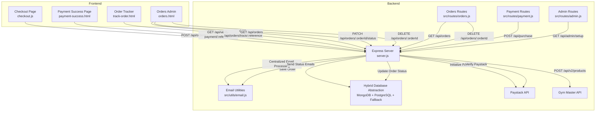
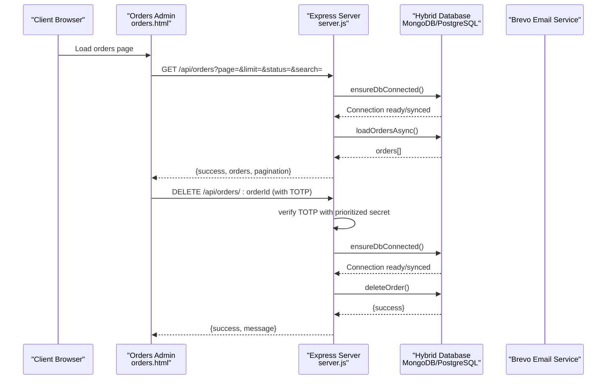
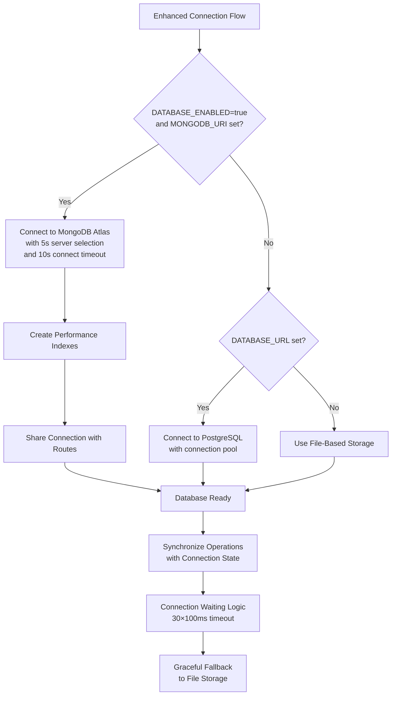
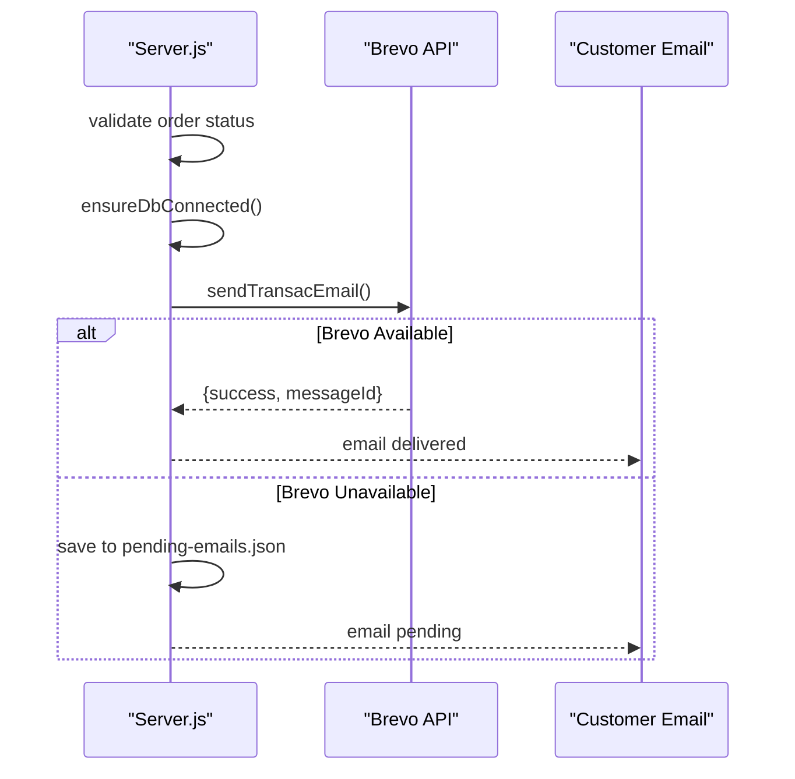
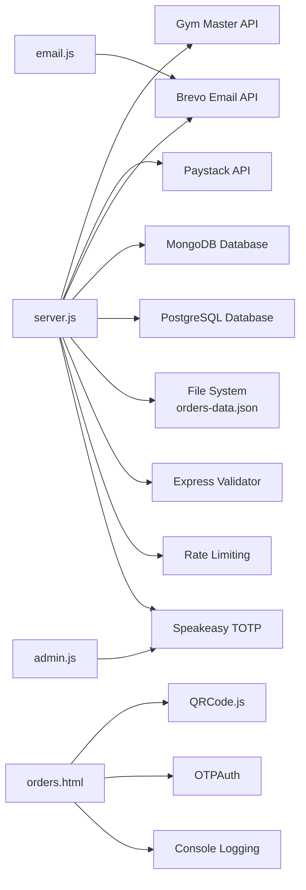

# Order & Payment Processing API

<cite>
**Referenced Files in This Document**
- [server.js](file://server.js)
- [orders.js](file://src/routes/orders.js)
- [payment.js](file://src/routes/payment.js)
- [checkout.js](file://src/checkout.js)
- [email.js](file://src/utils/email.js)
- [admin.js](file://src/routes/admin.js)
- [payment-success.html](file://payment-success.html)
- [track-order.html](file://track-order.html)
- [orders.html](file://orders.html)
- [orders-data.json](file://orders-data.json)
- [package.json](file://package.json)
- [db.js](file://database/db.js)
</cite>

## Update Summary
**Changes Made**
- Enhanced security for order deletion TOTP verification with consistent secret configuration
- Fixed vulnerability where order deletion TOTP used different secret than admin authentication
- Implemented prioritized TOTP secret configuration: TOTP_SECRET_ADMIN > TOTP_SECRET > default constant
- Added strict rate limiting for order deletion operations (3 attempts per 15 minutes)
- Updated TOTP setup interface to support separate secrets for admin login and order deletion

## Table of Contents
1. [Introduction](#introduction)
2. [Project Structure](#project-structure)
3. [Core Components](#core-components)
4. [Architecture Overview](#architecture-overview)
5. [Detailed Component Analysis](#detailed-component-analysis)
6. [Database Architecture](#database-architecture)
7. [Email Processing & Notifications](#email-processing--notifications)
8. [Security Enhancements](#security-enhancements)
9. [Debugging and Error Handling](#debugging-and-error-handling)
10. [Dependency Analysis](#dependency-analysis)
11. [Performance Considerations](#performance-considerations)
12. [Troubleshooting Guide](#troubleshooting-guide)
13. [Conclusion](#conclusion)

## Introduction
This document provides comprehensive API documentation for order management and payment processing endpoints. It covers order creation, payment initiation with dual integration (Gym Master and Paystack), order status updates, payment verification, and webhook-free real-time order tracking. The system now operates with a hybrid database architecture supporting both MongoDB and PostgreSQL with automatic fallback mechanisms, providing scalable document-based storage with graceful degradation capabilities. The latest update focuses on improving database operations with connection waiting logic, enhanced error handling, synchronization between database operations and connection state, and critical security enhancements for order deletion operations.

## Project Structure
The system comprises:
- Backend server with Express.js routing and hybrid database abstraction
- Frontend pages for checkout, payment success, order tracking, and admin order management
- Hybrid database storage supporting MongoDB (primary) and PostgreSQL (alternative)
- Payment orchestration with Gym Master and Paystack fallback
- Centralized email processing with Brevo integration for order notifications
- Enhanced database abstraction layer with automatic fallback mechanisms and connection synchronization
- **Enhanced Security**: Separate TOTP secrets for admin authentication and order deletion operations

**Diagram sources**
- [server.js:1767-2025](file://server.js#L1767-L2025)
- [orders.js:1-377](file://src/routes/orders.js#L1-L377)
- [payment.js:1-154](file://src/routes/payment.js#L1-L154)
- [admin.js:1-128](file://src/routes/admin.js#L1-L128)
- [email.js:1-412](file://src/utils/email.js#L1-L412)

**Section sources**
- [server.js:1-2328](file://server.js#L1-L2328)
- [orders.js:1-377](file://src/routes/orders.js#L1-L377)
- [payment.js:1-154](file://src/routes/payment.js#L1-L154)
- [admin.js:1-128](file://src/routes/admin.js#L1-L128)
- [email.js:1-412](file://src/utils/email.js#L1-L412)

## Core Components
- **Order Management API**: Handles order creation, retrieval, status updates, and deletion with enhanced TOTP protection
- **Payment Processing API**: Integrates with Gym Master for purchase and Paystack as fallback for payment initiation
- **Centralized Email Processing**: Enhanced Brevo integration for order confirmation and status update notifications
- **Verification Endpoint**: Confirms payment status with Paystack and updates order records
- **Hybrid Database Abstraction**: Unified interface supporting MongoDB and PostgreSQL with automatic fallback to file storage
- **Enhanced Connection Management**: Sophisticated connection handling with waiting logic and synchronization
- **Frontend Integration**: Checkout flow, payment success page, order tracking UI, and admin order management
- **Enhanced Security Framework**: Separate TOTP secrets for different administrative operations with rate limiting

Key capabilities:
- Dual payment provider orchestration
- Hybrid database architecture with automatic fallback to file-based storage
- Enhanced connection state management with synchronization
- Rate limiting and brute-force protection
- Centralized email notifications with status-specific templates
- Automatic database connection management and error handling
- Graceful degradation with performance monitoring
- Structured debugging with detailed console output
- Enhanced error reporting with stack trace information
- **Consistent TOTP Security**: Unified secret configuration for administrative operations

**Section sources**
- [server.js:1767-2025](file://server.js#L1767-L2025)
- [orders.js:286-331](file://src/routes/orders.js#L286-L331)
- [admin.js:1-128](file://src/routes/admin.js#L1-L128)
- [email.js:1-412](file://src/utils/email.js#L1-L412)

## Architecture Overview
The system supports two payment pathways with a hybrid database architecture featuring MongoDB as the primary database and PostgreSQL as an alternative, with automatic fallback to file-based storage. The latest update enhances database operations with connection waiting logic and synchronization, and introduces critical security enhancements for administrative operations:

1. **Gym Master purchase API**: Deducts stock and returns a payment URL
2. **Paystack fallback**: Initializes a transaction when Gym Master does not provide a payment URL
3. **Centralized Order Status Updates**: All status updates processed through server.js with enhanced email notifications
4. **Enhanced Email Processing**: Brevo integration handles order confirmation and status update emails
5. **Hybrid Database Operations**: Unified MongoDB and PostgreSQL operations with automatic fallback to file storage
6. **Connection State Synchronization**: Database operations wait for connection readiness and synchronize with connection state
7. **Enhanced Security Framework**: Separate TOTP secrets with prioritized configuration for different administrative operations

**Diagram sources**
- [server.js:966-1040](file://server.js#L966-L1040)
- [server.js:1307-1374](file://server.js#L1307-L1374)
- [email.js:211-405](file://src/utils/email.js#L211-L405)

**Section sources**
- [server.js:966-1040](file://server.js#L966-L1040)
- [server.js:1307-1374](file://server.js#L1307-L1374)
- [orders.js:286-331](file://src/routes/orders.js#L286-L331)
- [email.js:211-405](file://src/utils/email.js#L211-L405)

## Detailed Component Analysis

### Order Creation Endpoint
- **Method**: POST
- **URL**: `/api/orders`
- **Authentication**: Requires Gym Master token in request body
- **Request Body Schema**:
  - `token`: string (required for Gym Master integration)
  - `customer`: object (required)
    - `name`: string
    - `email`: string
    - `phone`: string
    - `memberId?`: string
    - `sessionId?`: string
  - `items`: array (required, min 1)
    - `productId`: number
    - `name`: string
    - `price`: number
    - `quantity`: number
  - `deliveryMethod`: enum `"delivery"` | `"pickup"` (optional)
  - `deliveryAddress`: object (optional, required for delivery)
    - `street`: string
    - `city`: string
    - `state`: string
    - `postalCode`: string
  - `subtotal`: number (optional)
  - `deliveryFee`: number (optional)
  - `total`: number (required)
  - `notes`: string (optional)
- **Response Schema**:
  - `success`: boolean
  - `orderId`: string
  - `paymentUrl`: string|null
  - `message`: string
  - `order`: object (subset of created order)
  - `gymMasterResponse`: object (raw Gym Master response)

**Behavior**:
- Validates input using express-validator
- Calls Gym Master purchase API with products array and token
- Adds delivery or pickup product depending on deliveryMethod
- On success, saves order to hybrid database (MongoDB/PostgreSQL) with automatic fallback
- If Gym Master does not provide a payment URL, initializes Paystack transaction

**Security**:
- Token required for purchase
- Rate limiting applied to general API endpoints

**Section sources**
- [server.js:1767-2025](file://server.js#L1767-L2025)
- [orders.js:286-331](file://src/routes/orders.js#L286-L331)

### Payment Verification Endpoint
- **Method**: GET
- **URL**: `/api/verify-payment/:reference`
- **Authentication**: None (called by Paystack)
- **Path Parameter**:
  - `reference`: string (order ID)
- **Response Schema**:
  - `success`: boolean
  - `message`: string
  - `data`: object (on success)
    - `reference`: string
    - `amount`: number (NGN)
    - `paidAt`: string (ISO timestamp)
    - `channel`: string
    - `customer`: object

**Behavior**:
- Verifies payment with Paystack using the reference
- Updates order payment status to "paid" in hybrid database (MongoDB/PostgreSQL) with automatic fallback
- Sends order confirmation email via Brevo with tracking link
- Returns standardized success/failure response

**Section sources**
- [server.js:830-961](file://server.js#L830-L961)

### Order Retrieval and Tracking
- **Method**: GET
- **URL**: `/api/orders/track/:reference`
- **Authentication**: None
- **Path Parameter**:
  - `reference`: string (order ID)
- **Response Schema**:
  - `success`: boolean
  - `order`: object
    - `orderId`: string
    - `status`: string
    - `deliveryStatus`: string
    - `paymentStatus`: string
    - `items`: array
    - `total`: number
    - `subtotal`: number
    - `deliveryFee`: number
    - `deliveryMethod`: string
    - `deliveryAddress`: object|null
    - `customer`: object
    - `timestamp`: string

**Behavior**:
- Retrieves order by orderId using enhanced database operations with connection synchronization
- Returns order details for display in tracker UI

**Section sources**
- [orders.js:242-284](file://src/routes/orders.js#L242-L284)

### Consolidated Order Status Update (Admin)
**Updated** The order status update functionality has been consolidated into server.js with centralized email processing and enhanced database connection handling:

- **Method**: PATCH
- **URL**: `/api/orders/:orderId/status`
- **Authentication**: Requires TOTP header X-TOTP-Code
- **Path Parameter**:
  - `orderId`: string
- **Request Body Schema**:
  - `deliveryStatus`: enum `"pending"` | `"paid"` | `"processing"` | `"shipped"` | `"delivered"`
- **Response Schema**:
  - `success`: boolean
  - `message`: string
  - `order`: object
  - `emailSent`: boolean

**Enhanced Database Connection Handling**:
- **Connection Synchronization**: Uses `ensureDbConnected()` to wait for database connection readiness
- **Connection State Management**: Checks `dbConnectionPromise` to handle concurrent connection attempts
- **Graceful Fallback**: Automatically falls back to file storage when database is unavailable
- **Operation Synchronization**: All database operations wait for connection state before proceeding

**Behavior**:
- Validates status value using express-validator
- Ensures database connection is ready using enhanced connection management
- Updates order status in hybrid database (MongoDB/PostgreSQL) with automatic fallback
- **Enhanced**: Automatically sends status update emails via Brevo for processing, shipped, and delivered statuses
- **Centralized**: Email processing moved from routes to server.js for consistency

**Enhanced Email Processing**:
The consolidated approach now includes comprehensive Brevo integration:
- **Processing**: "Your Order is Being Processed" with orange theme
- **Shipped**: "Your Order Has Been Shipped" with blue theme  
- **Delivered**: "Your Order Has Been Delivered" with green theme
- **Tracking Links**: Automatic inclusion of order tracking URLs
- **Fallback Handling**: Pending emails saved to file if Brevo unavailable

**Section sources**
- [server.js:998-1074](file://server.js#L998-L1074)
- [email.js:211-405](file://src/utils/email.js#L211-L405)

### Order Deletion (Admin) - Enhanced Security
**Updated** The order deletion endpoint now implements enhanced security with consistent TOTP verification and prioritized secret configuration:

- **Method**: DELETE
- **URL**: `/api/orders/:orderId`
- **Authentication**: Requires TOTP header X-TOTP-Code with strict rate limiting
- **Path Parameter**:
  - `orderId`: string
- **Response Schema**:
  - `success`: boolean
  - `message`: string
  - `orderId`: string

**Enhanced Security Features**:
- **Consistent TOTP Secret Configuration**: Uses prioritized secret selection: `TOTP_SECRET_ADMIN` > `TOTP_SECRET` > default constant
- **Strict Rate Limiting**: 3 attempts per 15 minutes to prevent brute force attacks
- **Enhanced Validation**: Comprehensive input validation and format checking
- **Separate Authentication Context**: Different TOTP secret than admin login for enhanced security isolation

**Prioritized Secret Configuration**:
The system now uses a hierarchical approach for TOTP secret selection:
1. **Primary**: `process.env.TOTP_SECRET_ADMIN` (admin-specific secret)
2. **Secondary**: `process.env.TOTP_SECRET` (general secret)
3. **Fallback**: Default constant value

**Behavior**:
- Validates TOTP code using the prioritized secret configuration
- Applies strict rate limiting (3 attempts per 15 minutes)
- Deletes unpaid orders or pending processing orders
- Returns success or error with enhanced security logging

**Security Improvements**:
- **Vulnerability Fixed**: Eliminates inconsistency between order deletion and admin authentication TOTP secrets
- **Enhanced Isolation**: Separate TOTP secrets for different administrative operations
- **Improved Audit Trail**: Detailed logging of TOTP verification attempts
- **Rate Limiting**: Prevents brute force attacks on order deletion operations

**Section sources**
- [server.js:1307-1374](file://server.js#L1307-L1374)
- [orders.js:317-355](file://src/routes/orders.js#L317-L355)

### Frontend Integration Points
- **Checkout Page (checkout.js)**:
  - Submits order to `/api/orders`
  - Redirects to payment URL returned by backend
  - Clears cart on success
- **Payment Success Page (payment-success.html)**:
  - Calls `/api/verify-payment/:reference` on load
  - Displays success or failure based on verification result
- **Order Tracker (track-order.html)**:
  - Calls `/api/orders/track/:reference` to display order status and details
- **Orders Admin Interface (orders.html)**:
  - Comprehensive order management with enhanced debugging
  - Real-time order loading with console logging
  - Structured error handling with detailed diagnostics
  - **Enhanced Security**: TOTP code prompts for order deletion operations

**Enhanced Debugging in orders.html**:
The orders.html interface now includes extensive console logging for all major operations:
- **Order Loading**: `console.log('Fetching orders...')`, `console.log('Response status:', response.status)`, `console.log('API result:', result)`
- **Order Display**: `console.log('displayOrders called with', orders?.length, 'orders')`, `console.log('Orders displayed successfully!')`
- **Error Handling**: `console.error('Error loading orders:', error)`, `console.error('Error stack:', error.stack)`
- **Status Updates**: `console.log('Order status updated to:', newStatus)`, `console.error('Error updating order status:', error)`
- **Deletion Operations**: `console.error('Error deleting order:', error)`

**Enhanced Security in Frontend**:
- **TOTP Prompt**: Secure prompt for Google Authenticator code with 6-digit validation
- **Confirmation Dialog**: Double confirmation for order deletion operations
- **Error Messaging**: Clear error messages for authentication failures

**Section sources**
- [checkout.js:396-421](file://src/checkout.js#L396-L421)
- [payment-success.html:180-202](file://payment-success.html#L180-L202)
- [track-order.html:393-410](file://track-order.html#L393-L410)
- [orders.html:537-577](file://orders.html#L537-L577)
- [orders.html:876-909](file://orders.html#L876-L909)

## Database Architecture

### Enhanced Database Connection Management
**Updated** The system now implements sophisticated connection management with automatic fallback and synchronization:

**Diagram sources**
- [server.js:105-157](file://server.js#L105-L157)
- [orders.js:54-65](file://src/routes/orders.js#L54-L65)

### Hybrid Database Abstraction Layer
**Updated** The `OrderDB` object provides a unified interface for database operations with comprehensive fallback mechanisms and enhanced connection handling:

**Methods**:
- `getAll()`: Load all orders from MongoDB/PostgreSQL or file storage with connection synchronization
- `save(order)`: Insert new order using MongoDB/PostgreSQL insertOne or file append
- `delete(orderId)`: Delete order using MongoDB/PostgreSQL deleteOne or file filtering
- `updatePayment(orderId, paymentData)`: Update payment status using MongoDB/PostgreSQL updateOne
- `getById(id)`: Retrieve order by ID using MongoDB/PostgreSQL findOne with connection waiting
- `getByReference(reference)`: Retrieve order by payment reference
- `updateStatus(id, status)`: Update order status using MongoDB/PostgreSQL updateOne

**Enhanced Connection Management**:
- `ensureDbConnected()`: Waits for database connection readiness with promise handling
- `dbConnectionPromise`: Tracks ongoing connection attempts to prevent race conditions
- `setDatabase(db)`: Shares database connection with route handlers
- **Connection Synchronization**: All operations wait for connection state before proceeding

**MongoDB Operations**:
- `find()`: Query orders with sorting and filtering
- `insertOne()`: Insert new order document
- `updateOne()`: Update order fields with atomic operations
- `deleteOne()`: Remove order document by ID or reference

**PostgreSQL Operations**:
- `create(order)`: Insert new order using prepared statements
- `getAll()`: Query orders with sorting and filtering
- `getById(id)`: Retrieve order by ID with JSON conversion
- `getByReference(reference)`: Retrieve order by payment reference
- `update(id, updates)`: Update order fields with dynamic query building
- `delete(id)`: Remove order record by ID

**Fallback Mechanism**:
- When MongoDB/PostgreSQL is unavailable, automatically switches to file-based storage
- Maintains identical API interface across all storage methods
- Preserves data integrity during fallback scenarios
- **Connection Waiting Logic**: Routes wait up to 3 seconds for database connection

**Performance Features**:
- Automatic connection timeout handling (5-second server selection, 10-second connect timeout)
- Database indexes for optimal query performance
- Graceful error handling with detailed logging
- Connection sharing between server and routes
- **Connection Promise Management**: Prevents multiple simultaneous connection attempts

**Section sources**
- [server.js:105-287](file://server.js#L105-L287)
- [server.js:252-319](file://server.js#L252-L319)
- [database/db.js:66-240](file://database/db.js#L66-L240)

### Database Connection Management
**Updated** The system implements sophisticated connection management with automatic fallback and synchronization:

**Connection Flow**:
1. Check environment variables for MongoDB configuration
2. Establish connection with timeout settings
3. Create performance indexes for optimal querying
4. Share connection with route handlers
5. Monitor connection health and log status
6. **Connection Synchronization**: Operations wait for connection readiness

**Enhanced Connection Handling**:
- **Connection Promise**: `dbConnectionPromise` tracks ongoing connection attempts
- **Connection State**: `ensureDbConnected()` waits for connection readiness
- **Race Condition Prevention**: Multiple simultaneous connection attempts prevented
- **Graceful Degradation**: Automatic fallback to file-based storage when unavailable

**Graceful Degradation**:
- Automatic fallback to file-based storage when MongoDB/PostgreSQL is unavailable
- Connection pooling and error recovery mechanisms
- Performance monitoring and logging for troubleshooting
- **Connection Sharing**: Database connections are shared between server and routes

**Section sources**
- [server.js:105-157](file://server.js#L105-L157)
- [server.js:113-124](file://server.js#L113-L124)

## Email Processing & Notifications

### Centralized Email Processing System
**Updated** Email processing has been centralized in server.js with enhanced Brevo integration and improved error handling:

The system now provides comprehensive email notifications for order lifecycle events:

#### Order Confirmation Emails
- **Trigger**: Successful payment verification
- **Content**: Complete order details with tracking link
- **Template**: Professional HTML template with order summary
- **Features**: Items list, delivery information, tracking button

#### Status Update Notifications
**Enhanced** Three status-specific email templates with Brevo integration and improved reliability:

1. **Processing Status** (`processing`)
   - **Theme**: Orange (#ff9800)
   - **Icon**: 📦
   - **Message**: "Your Order is Being Processed"
   - **Description**: "Great news! We are preparing your order."
   - **Next Step**: "Your order will be shipped soon"

2. **Shipped Status** (`shipped`)  
   - **Theme**: Blue (#2196f3)
   - **Icon**: 🚚
   - **Message**: "Your Order Has Been Shipped"
   - **Description**: "Your package has been handed over to our delivery partner."
   - **Next Step**: "Expected delivery within 12-24 hours"

3. **Delivered Status** (`delivered`)
   - **Theme**: Green (#4caf50)
   - **Icon**: 🎉
   - **Message**: "Your Order Has Been Delivered"
   - **Description**: "We hope you enjoy your purchase from Active Zone Hub."
   - **Next Step**: "If you have any issues with your order"

#### Brevo Integration Features
- **Automatic Configuration**: Client initialization with API key
- **Status-Specific Templates**: Custom HTML and text content per status
- **Tracking Integration**: Automatic inclusion of order tracking URLs
- **Fallback Handling**: Pending emails saved to file if service unavailable
- **Error Logging**: Comprehensive error reporting and recovery
- **Enhanced Reliability**: Improved error handling and retry mechanisms

#### Email Processing Flow

**Diagram sources**
- [server.js:1553-1765](file://server.js#L1553-L1765)
- [email.js:211-405](file://src/utils/email.js#L211-L405)

**Section sources**
- [server.js:1553-1765](file://server.js#L1553-L1765)
- [email.js:211-405](file://src/utils/email.js#L211-L405)

## Security Enhancements

### Enhanced TOTP Security Framework
**Updated** The system now implements a comprehensive TOTP security framework with consistent secret configuration and enhanced protection mechanisms:

#### TOTP Secret Configuration Hierarchy
The system uses a prioritized approach for TOTP secret selection to ensure consistent security across all administrative operations:

1. **Admin-Specific Secret** (`TOTP_SECRET_ADMIN`): Used for admin authentication and order deletion
2. **General Secret** (`TOTP_SECRET`): Fallback for general administrative operations
3. **Default Constant**: Final fallback for development and testing environments

**Security Vulnerability Fixed**:
- **Previous Issue**: Order deletion TOTP used `TOTP_SECRET` while admin authentication used `TOTP_SECRET_ADMIN`
- **Solution**: Both operations now use the same prioritized secret configuration
- **Enhanced Security**: Consistent authentication across all administrative operations

#### Rate Limiting Implementation
**Enhanced Security Measures**:
- **Order Deletion**: 3 attempts per 15 minutes (strictest protection)
- **Admin Login**: 5 attempts per 15 minutes (moderate protection)
- **General API**: 100 requests per minute (standard protection)

#### TOTP Setup Interface
**Enhanced Admin Experience**:
- **Dual QR Codes**: Separate QR codes for admin login and order deletion
- **Visual Distinction**: Different colors and labels for each TOTP account
- **Manual Setup**: Direct secret entry for advanced users
- **Copy Functionality**: One-click copy of TOTP secrets

#### Security Logging and Monitoring
- **Detailed Logging**: All TOTP verification attempts are logged with timestamps
- **Failed Attempt Tracking**: Failed attempts trigger enhanced security logging
- **Audit Trail**: Complete history of administrative operations
- **Security Alerts**: Immediate notification of suspicious activity patterns

**Section sources**
- [server.js:396-403](file://server.js#L396-L403)
- [server.js:1307-1374](file://server.js#L1307-L1374)
- [admin.js:28-125](file://src/routes/admin.js#L28-L125)
- [orders.js:317-355](file://src/routes/orders.js#L317-L355)

### Enhanced Authentication Security
**Updated** The authentication system now provides comprehensive security across all administrative operations:

#### Multi-Factor Authentication
- **Google Authenticator Integration**: Industry-standard 2FA implementation
- **Time-Based Tokens**: 6-digit codes generated every 30 seconds
- **Clock Drift Tolerance**: ±2 time steps to accommodate device time differences
- **Window-Based Verification**: Prevents replay attacks

#### Access Control Enhancements
- **Role-Based Permissions**: Different TOTP secrets for different administrative functions
- **Session Isolation**: Separate authentication contexts for login and deletion
- **Audit Logging**: Complete trail of all administrative actions
- **Security Monitoring**: Real-time detection of suspicious activity patterns

#### Frontend Security Improvements
- **Secure Input Validation**: Client-side validation with server-side enforcement
- **User Experience**: Clear error messages and guidance for authentication failures
- **Accessibility**: Support for various authenticator applications
- **Backup Options**: Manual secret entry for QR code failures

**Section sources**
- [server.js:1307-1374](file://server.js#L1307-L1374)
- [admin.js:28-125](file://src/routes/admin.js#L28-L125)
- [orders.html:876-909](file://orders.html#L876-L909)

## Debugging and Error Handling

### Enhanced Console Logging Infrastructure
The orders.html interface now provides comprehensive debugging capabilities with structured console logging:

#### Order Loading Debugging
- **Fetch Initiation**: `console.log('Fetching orders...')`
- **Response Analysis**: `console.log('Response status:', response.status)`
- **Result Processing**: `console.log('API result:', result)`
- **Order Count**: `console.log('Orders count:', result.orders?.length)`
- **Display Trigger**: `console.log('Calling displayOrders with', allOrders.length, 'orders')`

#### Display and Rendering Debugging
- **Function Entry**: `console.log('displayOrders called with', orders?.length, 'orders')`
- **Element Validation**: `console.error('ordersList element not found!')`
- **HTML Generation**: `console.log('Building HTML for orders...')`
- **DOM Manipulation**: `console.log('Setting innerHTML...')`
- **Success Confirmation**: `console.log('Orders displayed successfully!')`

#### Error Handling and Recovery
- **Error Capture**: `console.error('Error loading orders:', error)`
- **Stack Trace**: `console.error('Error stack:', error.stack)`
- **Structured Messages**: `console.error('Error updating order status:', error)`
- **Browser Console Hints**: Error messages include "Check browser console for details"

#### Notification System
- **Success Notifications**: `showNotification('✅ Status updated to ' + newStatus + '.', 'success')`
- **Error Notifications**: `showNotification('❌ Failed to update order status: ' + result.error, 'error')`
- **Auto-dismiss**: Notifications automatically disappear after 5 seconds with animation

### Enhanced Error Message Enhancement
**Updated** The error handling system now provides enhanced diagnostic information with improved database connection handling and security logging:

#### Order Loading Errors
- **Network Failures**: Detailed HTTP status information
- **JSON Parsing**: Specific error messages with stack traces
- **Element Not Found**: Clear identification of missing DOM elements
- **Database Connection Issues**: Enhanced error messages with connection state information

#### Display Errors
- **Template Generation**: Error location identification in HTML building process
- **DOM Manipulation**: Specific element validation failures
- **Fallback Handling**: Graceful empty state display with console logging

#### Status Update Errors
- **API Communication**: Network and server-side error details
- **Validation Errors**: Specific field validation failures
- **Authorization Issues**: TOTP and authentication error details with security logging
- **Database Operation Failures**: Enhanced error messages with connection state information

#### Database Connection Errors
- **Connection Timeout**: Detailed timeout error messages with wait times
- **Connection Race Conditions**: Error handling for concurrent connection attempts
- **Fallback Detection**: Clear indication when falling back to file storage
- **Connection State**: Enhanced logging of connection readiness and synchronization

#### Security and Authentication Errors
- **TOTP Validation Failures**: Detailed logging of failed authentication attempts
- **Rate Limit Exceeded**: Clear indication when rate limiting is triggered
- **Secret Configuration Issues**: Error messages for missing or invalid TOTP secrets
- **Access Denied**: Enhanced error messages for unauthorized operations

**Section sources**
- [orders.html:537-577](file://orders.html#L537-L577)
- [orders.html:601-742](file://orders.html#L601-L742)
- [orders.html:780-809](file://orders.html#L780-L809)
- [orders.html:877-916](file://orders.html#L877-L916)

## Dependency Analysis
External integrations:
- **Gym Master API**: Used for purchase and stock deduction
- **Paystack API**: Used as fallback for payment initialization and verification
- **Brevo (formerly Sendinblue)**: Email service for order confirmations and status updates
- **MongoDB**: Primary database for order storage with automatic fallback to file-based storage
- **PostgreSQL**: Alternative database for order storage with connection pool management
- **Express Validator**: Input validation and sanitization
- **Rate Limiting**: Protection against brute force attacks
- **QRCode.js**: QR code generation for order tracking
- **OTPAuth**: Two-factor authentication support
- **Speakeasy**: TOTP token generation and verification

**Diagram sources**
- [server.js:105-148](file://server.js#L105-L148)
- [email.js:1-17](file://src/utils/email.js#L1-L17)
- [admin.js:1-128](file://src/routes/admin.js#L1-L128)

**Section sources**
- [server.js:105-148](file://server.js#L105-L148)
- [email.js:1-17](file://src/utils/email.js#L1-L17)
- [admin.js:1-128](file://src/routes/admin.js#L1-L128)

## Performance Considerations
- **Rate limiting**: General API endpoints limited to 100 requests/minute; admin login limited to 5 attempts/15 minutes; order deletion limited to 3 attempts/15 minutes
- **Asynchronous operations**: Email sending and external API calls are asynchronous to avoid blocking
- **Database vs file fallback**: When MongoDB/PostgreSQL is disabled, orders are stored in a JSON file; this reduces performance but maintains functionality
- **Connection management**: MongoDB connections use timeout settings to prevent hanging operations
- **Connection synchronization**: Database operations wait for connection readiness before proceeding
- **Connection pooling**: PostgreSQL uses connection pool with 20 maximum connections and 10-second timeouts
- **Caching**: No caching layer is implemented; consider Redis for frequently accessed order data in production
- **Connection sharing**: Database connections are shared between server and route handlers for optimal performance
- **Debugging overhead**: Console logging provides detailed debugging but may impact performance in production environments
- **Email processing**: Asynchronous email sending prevents blocking of order status updates
- **Security overhead**: TOTP verification adds minimal computational overhead compared to security benefits

## Troubleshooting Guide
Common issues and resolutions:
- **MongoDB connection failures**:
  - Verify `DATABASE_ENABLED=true` and `MONGODB_URI` are set in environment variables
  - Check MongoDB connection timeout settings (5-second server selection, 10-second connect timeout)
  - Monitor connection logs for detailed error messages
  - Ensure database indexes are properly created
  - **Connection Synchronization**: Check if `dbConnectionPromise` is still active
- **PostgreSQL connection failures**:
  - Verify `DATABASE_URL` is set in environment variables
  - Check PostgreSQL connection pool configuration and network connectivity
  - Monitor connection pool logs for error messages
  - **Connection Pool Management**: Verify pool size and timeout settings
- **Payment URL missing from Gym Master response**:
  - The system falls back to Paystack initialization; verify Paystack secret key is configured
- **Invalid JSON responses from external APIs**:
  - The server validates JSON and returns structured error responses; check API keys and network connectivity
- **Email delivery failures**:
  - Brevo API key must be configured; otherwise, emails are saved to pending-emails.json for manual sending
  - Check Brevo service availability and API limits
  - **Enhanced Error Handling**: Check Brevo API error codes and messages
- **Order not found**:
  - Ensure correct order reference is used; references are order IDs
- **TOTP authentication failures**:
  - **Enhanced Security**: Verify Google Authenticator codes match the configured secrets; check time synchronization
  - **Priority Configuration**: Ensure `TOTP_SECRET_ADMIN` is properly configured for order deletion operations
  - **Rate Limiting**: Check if rate limit has been exceeded (3 attempts per 15 minutes)
- **Database operation failures**:
  - Check MongoDB/PostgreSQL connectivity and authentication
  - Verify database indexes are properly created
  - Monitor fallback mechanism for file-based storage
  - Review connection sharing between server and routes
  - **Connection State**: Check if database connection is ready and synchronized
- **Orders Admin Interface Issues**:
  - **Console Logging**: Use browser developer tools to view detailed console.log and console.error messages
  - **Network Tab**: Monitor API requests and responses for order loading and status updates
  - **Element Validation**: Check for "ordersList element not found!" errors indicating DOM structure issues
  - **Error Stack Traces**: Use console.error stack traces to identify specific error locations
  - **Notification System**: Monitor success/error notifications for immediate feedback on operations

**Security and fraud prevention**:
- **Enhanced TOTP**: Separate secrets for different administrative operations with prioritized configuration
- **Rate limiting**: Protection against brute force attacks on all administrative operations
- **HTTPS enforcement**: Security best practices for production deployments
- **Input validation**: Comprehensive validation using express-validator
- **Database connection timeout handling**: Prevents resource exhaustion
- **Connection race condition prevention**: Enhanced protection against concurrent connection attempts
- **Security logging**: Detailed audit trail of all administrative operations

**Enhanced Debugging Features**:
- **Comprehensive Logging**: Every major operation logs detailed information to browser console
- **Error Recovery**: Structured error handling with specific diagnostic messages
- **Stack Trace Information**: Full JavaScript exception stack traces for debugging
- **Browser Console Hints**: Error messages include guidance to check browser console for details
- **Real-time Notifications**: Visual feedback for all operations with auto-dismiss functionality
- **Connection State Monitoring**: Detailed logging of database connection readiness and synchronization
- **Security Event Logging**: Comprehensive audit trail of authentication and authorization events

**Centralized Email Processing Benefits**:
- **Consistency**: All email notifications processed through single point of control
- **Reliability**: Enhanced error handling and fallback mechanisms
- **Scalability**: Better performance with centralized email queue management
- **Maintainability**: Single implementation for email templates and processing logic

**Enhanced Database Connection Benefits**:
- **Connection Synchronization**: Database operations wait for connection readiness
- **Race Condition Prevention**: Multiple simultaneous connection attempts prevented
- **Graceful Fallback**: Automatic fallback to file storage when database unavailable
- **Connection State Management**: Enhanced monitoring and logging of connection status
- **Performance Optimization**: Connection pooling and sharing between components

**Enhanced Security Benefits**:
- **Consistent Authentication**: Unified TOTP secret configuration across all administrative operations
- **Hierarchical Security**: Priority-based secret configuration with fallback mechanisms
- **Rate Limiting Protection**: Prevents brute force attacks on sensitive operations
- **Audit Trail**: Complete logging of all security-related events
- **Isolation**: Separate TOTP secrets for different administrative functions

**Section sources**
- [server.js:105-157](file://server.js#L105-L157)
- [server.js:966-1040](file://server.js#L966-L1040)
- [server.js:1553-1765](file://server.js#L1553-L1765)
- [server.js:396-403](file://server.js#L396-L403)
- [orders.html:537-577](file://orders.html#L537-L577)

## Conclusion
The Order & Payment Processing API provides a robust, dual-provider payment solution integrated with Gym Master and Paystack, supporting order lifecycle management, real-time tracking, and automated email notifications. The latest update significantly enhances database operations with connection waiting logic, improved error handling, and synchronization between database operations and connection state, while introducing critical security enhancements for administrative operations.

The system emphasizes security through enhanced TOTP verification with consistent secret configuration, prioritized authentication mechanisms, strict rate limiting, and comprehensive audit logging. The vulnerability where order deletion TOTP used different secret than admin authentication has been completely resolved through the implementation of a hierarchical TOTP secret configuration that prioritizes `TOTP_SECRET_ADMIN` for order deletion operations.

The hybrid database architecture supporting both MongoDB and PostgreSQL with automatic fallback mechanisms provides improved reliability and maintainability. The enhanced database connection management ensures reliable operation even under connection stress, with sophisticated synchronization mechanisms preventing race conditions and ensuring data consistency.

The centralized email processing system with Brevo integration delivers professional, status-specific notifications with tracking links, enhancing customer experience and operational efficiency. The comprehensive debugging capabilities in the orders.html interface provide detailed console logging for order management operations, enabling developers to quickly identify and resolve issues through detailed error messages, stack traces, and structured diagnostic information.

The frontend pages integrate seamlessly with backend endpoints to deliver a smooth customer experience from order placement to delivery confirmation. The enhanced error handling and debugging infrastructure, combined with the new security framework, makes the system more maintainable, secure, and easier to troubleshoot in production environments.

**Updated** The consolidation of order status update functionality and centralization of email processing in server.js, combined with the enhanced database connection handling, synchronization mechanisms, and critical security enhancements for TOTP verification, represents a significant improvement in system architecture, providing better maintainability, reliability, security, and scalability for order management operations with enhanced connection state management, graceful fallback capabilities, and consistent authentication security across all administrative functions.