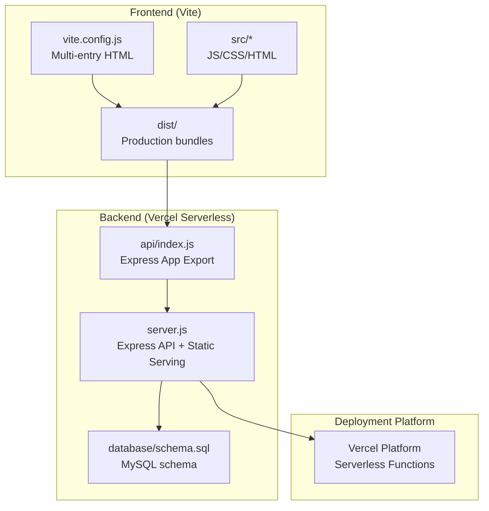
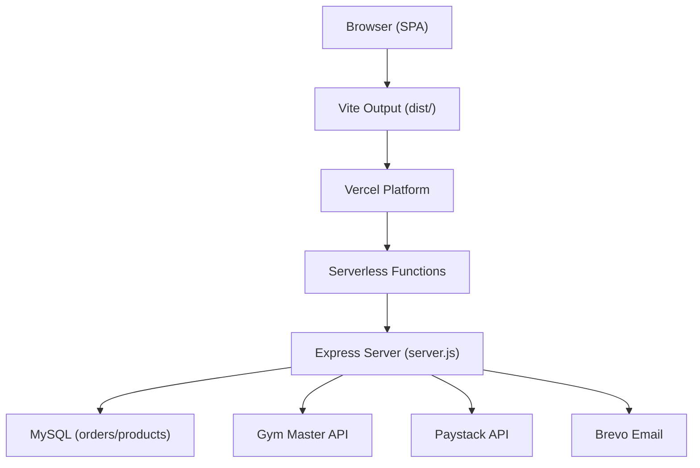
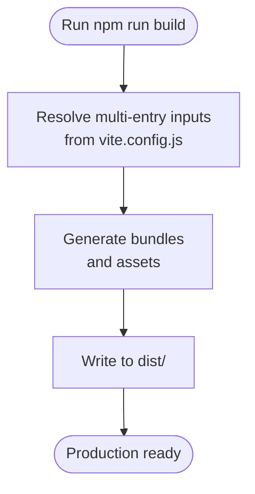
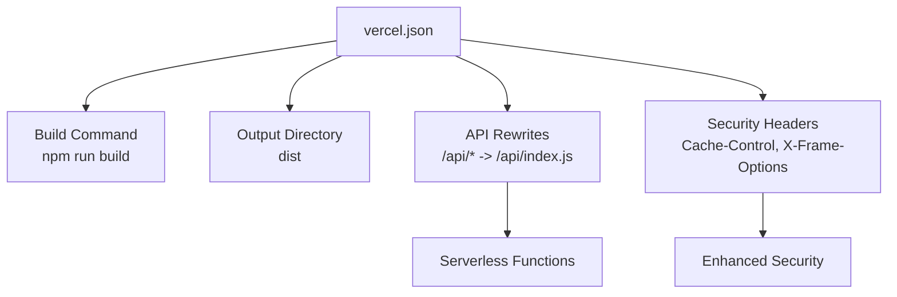
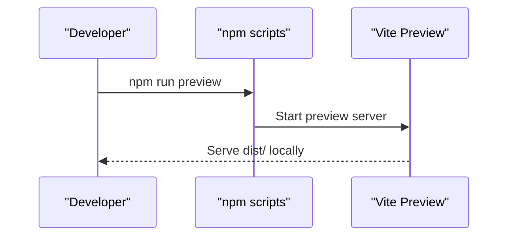
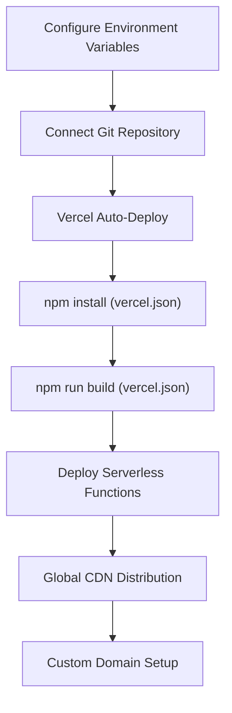
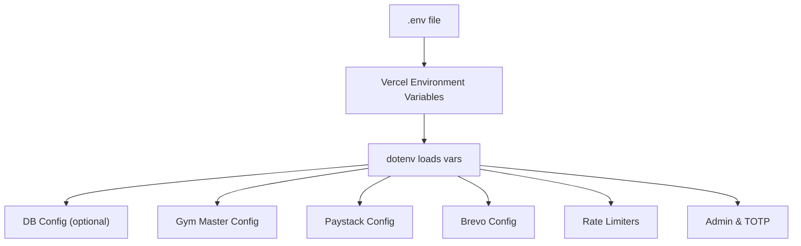
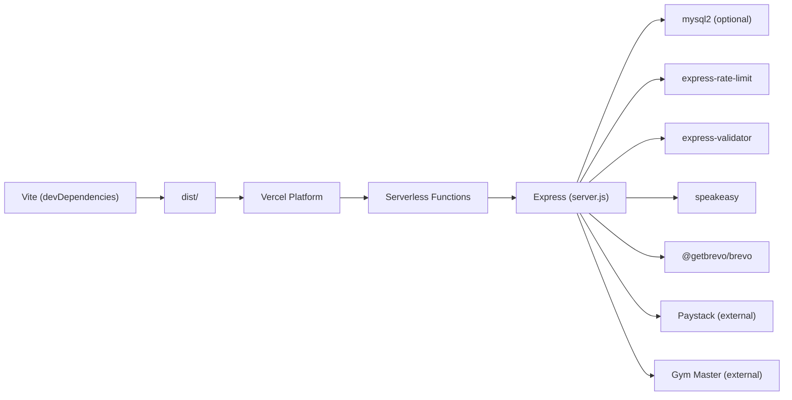

# Build & Deployment

<cite>
**Referenced Files in This Document**
- [package.json](file://package.json)
- [vite.config.js](file://vite.config.js)
- [vercel.json](file://vercel.json)
- [api/index.js](file://api/index.js)
- [server.js](file://server.js)
- [database/schema.sql](file://database/schema.sql)
</cite>

## Update Summary
**Changes Made**
- Updated deployment architecture to reflect migration from cPanel/shared hosting to Vercel serverless deployment
- Removed all cPanel-related deployment procedures and documentation
- Added comprehensive Vercel serverless deployment guide with configuration details
- Updated architecture diagrams to show new serverless API routing
- Revised environment variable management for Vercel platform
- Removed deprecated deployment scripts and checklists

## Table of Contents
1. [Introduction](#introduction)
2. [Project Structure](#project-structure)
3. [Core Components](#core-components)
4. [Architecture Overview](#architecture-overview)
5. [Detailed Component Analysis](#detailed-component-analysis)
6. [Dependency Analysis](#dependency-analysis)
7. [Performance Considerations](#performance-considerations)
8. [Troubleshooting Guide](#troubleshooting-guide)
9. [Conclusion](#conclusion)
10. [Appendices](#appendices)

## Introduction
This document provides comprehensive build and deployment guidance for Active Zone Hub. It covers:
- Production build using Vite, including asset optimization, bundle generation, and static file compilation
- Step-by-step Vercel serverless deployment for cloud hosting environments
- Environment variable management across development, staging, and production
- Preview server setup for pre-production testing
- Deployment checklists, rollback strategies, and post-deployment verification
- Performance optimization, CDN integration, and monitoring recommendations
- Troubleshooting and maintenance procedures

**Updated** The project has migrated from traditional cPanel/shared hosting to Vercel serverless deployment, providing improved scalability and reduced infrastructure management overhead.

## Project Structure
Active Zone Hub is a hybrid static SPA served by a Node.js backend configured for Vercel serverless deployment. The frontend is built with Vite and targets multiple HTML entry points. The backend exposes REST APIs as serverless functions and serves static assets.

**Diagram sources**
- [vite.config.js](file://vite.config.js#L1-L25)
- [api/index.js](file://api/index.js#L1-L5)
- [server.js](file://server.js#L1-L200)
- [database/schema.sql](file://database/schema.sql#L1-L46)

**Section sources**
- [vite.config.js](file://vite.config.js#L1-L25)
- [package.json](file://package.json#L1-L32)
- [api/index.js](file://api/index.js#L1-L5)
- [server.js](file://server.js#L1-L200)

## Core Components
- Build toolchain: Vite with multi-page application configuration targeting index.html and several SPA pages
- Backend serverless: Express-based API configured as Vercel serverless functions with rate limiting, CORS, static file serving, and modular routes
- Database: MySQL schema for order and product metadata; runtime switching between file-based and database-backed persistence
- Environment management: dotenv-based configuration for API keys, database credentials, and third-party integrations
- Vercel deployment: Serverless configuration with custom rewrites, headers, and build optimization

Key build and deployment artifacts:
- Production build script and preview server launcher
- Multi-entry HTML configuration for Vite
- Vercel serverless configuration with API routing
- Database schema for MySQL
- Serverless API handler for Vercel deployment

**Section sources**
- [package.json](file://package.json#L1-L32)
- [vite.config.js](file://vite.config.js#L1-L25)
- [vercel.json](file://vercel.json#L1-L28)
- [api/index.js](file://api/index.js#L1-L5)
- [database/schema.sql](file://database/schema.sql#L1-L46)

## Architecture Overview
The system comprises a frontend built with Vite and a Node.js backend configured for Vercel serverless deployment. The backend serves static assets and exposes REST endpoints for product catalog, orders, payments, and administrative functions as serverless functions. It supports optional MySQL persistence and graceful degradation to file-based storage.

**Diagram sources**
- [vercel.json](file://vercel.json#L7-L10)
- [server.js](file://server.js#L1-L200)
- [database/schema.sql](file://database/schema.sql#L1-L46)

## Detailed Component Analysis

### Vite Build Configuration and Production Build
- Multi-entry configuration defines HTML entry points for index, about, services, store, membership, gallery, contact, cart, checkout, orders, track-order, and payment-success pages
- Base path is set to relative ("./") to support subdirectory or domain root deployments
- Rollup inputs map each HTML to a dedicated entry
- Build output produces optimized static assets under dist/

**Diagram sources**
- [vite.config.js](file://vite.config.js#L8-L22)
- [package.json](file://package.json#L9-L11)

**Section sources**
- [vite.config.js](file://vite.config.js#L1-L25)
- [package.json](file://package.json#L1-L32)

### Vercel Serverless Configuration
- Serverless deployment configuration with custom build command and output directory
- API rewrites mapping /api/* routes to serverless functions
- Security headers for API endpoints and static assets
- Install command for dependency management during deployment

**Diagram sources**
- [vercel.json](file://vercel.json#L3-L26)

**Section sources**
- [vercel.json](file://vercel.json#L1-L28)

### Serverless API Handler
- Exports the Express app as a Vercel serverless function
- Enables seamless deployment of the existing backend as serverless functions
- Maintains all existing API functionality with Vercel's serverless infrastructure

**Section sources**
- [api/index.js](file://api/index.js#L1-L5)

### Preview Server Workflow
- The preview server runs the Vite preview server for local testing of production bundles
- Ensures developers can validate production-like behavior before deployment

**Diagram sources**
- [package.json](file://package.json#L10)

**Section sources**
- [package.json](file://package.json#L1-L32)

### Vercel Deployment Procedure
- Prerequisites: Vercel account with Node.js project, environment variables configured, and Git repository connected
- Configure environment variables in Vercel dashboard for database credentials, API keys, and application settings
- Push code to connected Git repository or deploy manually through Vercel CLI
- Vercel automatically runs npm install and build commands based on vercel.json configuration
- Serverless functions are deployed with automatic scaling and global CDN distribution
- Custom domain configuration and SSL certificate management handled by Vercel

**Diagram sources**
- [vercel.json](file://vercel.json#L3-L6)
- [api/index.js](file://api/index.js#L1-L5)

**Section sources**
- [vercel.json](file://vercel.json#L1-L28)
- [api/index.js](file://api/index.js#L1-L5)

### Environment Variable Management
- The backend reads configuration from environment variables for:
  - Database: host, port, user, password, name, and toggles
  - Gym Master: API key, base URL, company ID
  - Paystack: secret key
  - Brevo: email client initialization
  - Rate limiting, admin password, and TOTP secrets
- Vercel environment variables are managed through the Vercel dashboard or CLI
- Production values are configured securely without exposing sensitive data in code

**Diagram sources**
- [server.js](file://server.js#L105-L378)

**Section sources**
- [server.js](file://server.js#L105-L378)

### Preview Server Setup
- Use the npm script to preview the production bundle locally
- Ideal for smoke testing before pushing to staging or production

**Section sources**
- [package.json](file://package.json#L10)

### Deployment Checklists and Verification
- Pre-deployment checklist includes verifying relative API paths, security hardening, production build, schema readiness, and environment template
- Files to upload include backend files, frontend HTML, src/, images/, and schema.sql
- Post-deployment verification includes testing frontend pages, API endpoints, checkout flow, and admin access

**Section sources**
- [database/schema.sql](file://database/schema.sql#L1-L46)

### Rollback Strategies
- Maintain previous deployment artifacts and .env files
- For Vercel: use Vercel's version control integration to roll back to previous deployments
- Keep prior versions and switch .env variables as needed
- Use version control to tag releases and quickly roll back to known good commits

### Post-Deployment Verification Steps
- Validate health endpoint, product catalog, cart, checkout, payment verification, order confirmation emails, and admin order management
- Confirm static assets are served correctly and API responses are consistent
- Monitor Vercel logs and performance metrics for any deployment issues

**Section sources**
- [server.js](file://server.js#L464-L467)

## Dependency Analysis
- Frontend build depends on Vite and generates static assets consumed by the backend
- Backend depends on Express, MySQL2 (optional), rate limiting, validation, QR code generation, and email service
- Third-party integrations include Gym Master API, Paystack, and Brevo
- Vercel serverless deployment adds minimal runtime dependencies for function execution

**Diagram sources**
- [package.json](file://package.json#L16-L30)
- [server.js](file://server.js#L1-L200)

**Section sources**
- [package.json](file://package.json#L1-L32)
- [server.js](file://server.js#L1-L200)

## Performance Considerations
- Optimize frontend assets with Vite's built-in minification and chunk splitting
- Serve static assets from the Node.js server to reduce cross-origin complexity
- Use Vercel's global CDN for improved delivery latency and caching
- Enable compression and caching headers at the Vercel edge layer
- Monitor API response times and apply rate limiting to protect resources
- Consider enabling HTTP/2 or HTTP/3 at the Vercel edge for optimal performance

**Updated** Vercel's global CDN and serverless architecture provide superior performance compared to traditional hosting, with automatic scaling and edge computing capabilities.

## Troubleshooting Guide
Common issues and resolutions:
- Application fails to start: check Vercel logs, verify environment variables, confirm dependencies installed, ensure server.js permissions
- Cannot connect to database: verify DB existence, credentials, privileges, and schema import
- 502/503 errors: check Vercel function logs, verify environment variables, contact Vercel support if persistent
- API endpoints return 404: confirm serverless functions are deployed, verify routes, check Vercel rewrites
- Paystack payment failures: confirm live keys, account activation, and dashboard logs
- Email notifications not sending: verify BREVO_API_KEY, SMTP_FROM_EMAIL verification, and application logs
- Products not loading: verify Gym Master API credentials, test API connectivity, inspect browser console
- Vercel deployment issues: check build logs, verify vercel.json configuration, ensure correct output directory

**Updated** Vercel-specific troubleshooting focuses on serverless function deployment, environment variable configuration, and CDN caching issues.

**Section sources**
- [vercel.json](file://vercel.json#L7-L26)
- [server.js](file://server.js#L352-L355)

## Conclusion
Active Zone Hub's deployment pipeline has evolved to leverage Vercel's serverless architecture, combining a modern Vite-built frontend with a scalable Node.js backend deployed as serverless functions. The streamlined deployment process reduces infrastructure management overhead while providing improved scalability, global CDN distribution, and automatic scaling capabilities. Environment management and verification procedures help maintain reliability across environments with Vercel's enhanced monitoring and logging capabilities.

**Updated** The migration to Vercel provides significant operational benefits including reduced maintenance, improved scalability, and enhanced global performance through serverless architecture and edge computing.

## Appendices

### Environment Variables Reference
- Database: DB_HOST, DB_PORT, DB_USER, DB_PASSWORD, DB_NAME, DATABASE_ENABLED
- Gym Master: GYM_MASTER_API_KEY, GYM_MASTER_BASE_URL, GYM_MASTER_COMPANY_ID
- Paystack: PAYSTACK_SECRET_KEY
- Brevo: BREVO_API_KEY, SMTP_FROM_EMAIL, SMTP_FROM_NAME
- Security: ADMIN_PASSWORD, TOTP_SECRET, TOTP_SECRET_ADMIN
- Application: APP_URL, PORT

**Section sources**
- [server.js](file://server.js#L105-L378)

### Frontend API Base Path Behavior
- Frontend code switches between localhost backend and relative origin for production compatibility
- Store and checkout modules use a dynamic API base derived from the current origin

**Section sources**
- [server.js](file://server.js#L464-L467)

### Vercel Configuration Reference
- Build command: npm run build
- Output directory: dist
- Install command: npm install
- Framework: null (custom serverless)
- API rewrites: /api/* -> /api/index.js
- Security headers: Cache-Control, X-Frame-Options, X-XSS-Protection

**Section sources**
- [vercel.json](file://vercel.json#L1-L28)