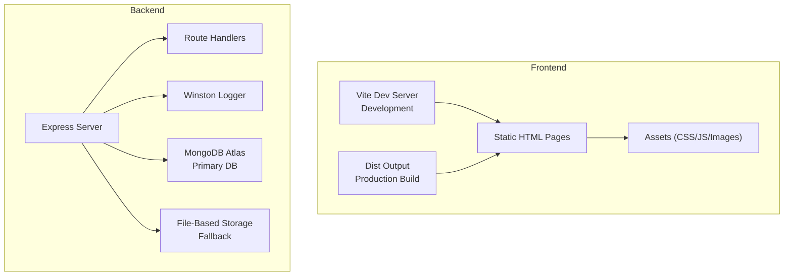
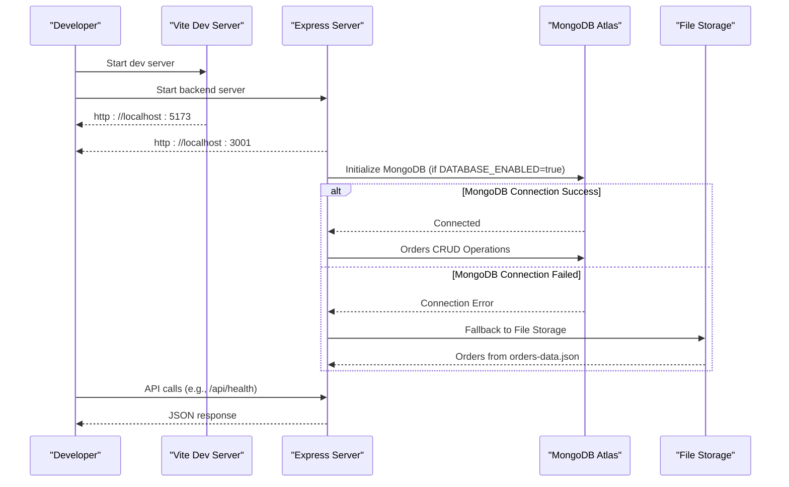
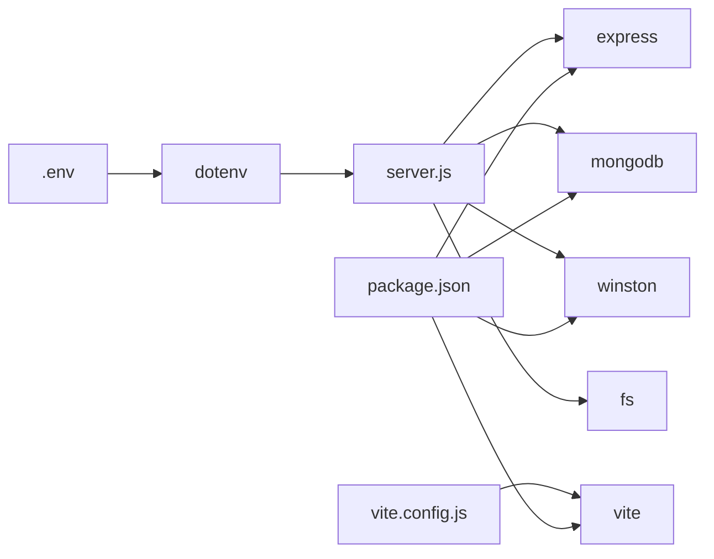

# Configuration Management

<cite>
**Referenced Files in This Document**
- [package.json](file://package.json)
- [vite.config.js](file://vite.config.js)
- [server.js](file://server.js)
- [database/db.js](file://database/db.js)
- [.gitignore](file://.gitignore)
- [orders-data.json](file://orders-data.json)
- [database/schema.sql](file://database/schema.sql)
</cite>

## Update Summary
**Changes Made**
- Updated MongoDB Atlas configuration with new environment variables (MONGODB_URI, MONGODB_DB_NAME)
- Added DATABASE_ENABLED environment variable for database enablement control
- Documented MongoDB fallback behavior and file-based storage mechanism
- Updated database configuration architecture to reflect MongoDB-first approach
- Revised environment variable reference to include MongoDB-specific settings

## Table of Contents
1. [Introduction](#introduction)
2. [Project Structure](#project-structure)
3. [Core Components](#core-components)
4. [Architecture Overview](#architecture-overview)
5. [Detailed Component Analysis](#detailed-component-analysis)
6. [Dependency Analysis](#dependency-analysis)
7. [Performance Considerations](#performance-considerations)
8. [Troubleshooting Guide](#troubleshooting-guide)
9. [Conclusion](#conclusion)
10. [Appendices](#appendices)

## Introduction
This document provides comprehensive configuration management guidance for Active Zone Hub. It covers environment variables for MongoDB Atlas, external services, and application settings; configuration hierarchy across development and production; Vite build and development server options; static asset and public resource organization; .gitignore patterns; validation and testing strategies; and security practices for secret management and compliance.

## Project Structure
Active Zone Hub is a full-stack application with:
- A Node.js/Express backend that serves APIs and static resources
- A Vite-powered frontend development and build pipeline
- MongoDB Atlas as the primary database backend with fallback to file-based storage
- Static HTML pages and client-side assets under the project root
- Orders data stored in MongoDB collections with automatic indexing

**Diagram sources**
- [vite.config.js](file://vite.config.js#L1-L25)
- [server.js](file://server.js#L105-L134)
- [orders-data.json](file://orders-data.json#L1-L66)

**Section sources**
- [package.json](file://package.json#L1-L33)
- [vite.config.js](file://vite.config.js#L1-L25)
- [server.js](file://server.js#L105-L134)
- [orders-data.json](file://orders-data.json#L1-L66)

## Core Components
- Environment variables are loaded via dotenv and consumed by the backend and Vite.
- MongoDB Atlas is the primary database with optional fallback to file-based storage.
- External service integrations include Gym Master API, Paystack, and Brevo email service.
- Logging is configurable via LOG_LEVEL and writes to files and console depending on environment.
- Static assets are served from the project root and built into a dist folder for production.

**Section sources**
- [server.js](file://server.js#L15-L15)
- [server.js](file://server.js#L105-L134)
- [server.js](file://server.js#L286-L291)
- [src/utils/logger.js](file://src/utils/logger.js#L1-L51)

## Architecture Overview
The configuration architecture centers on MongoDB Atlas as the primary database with fallback capabilities:
- Development: Vite dev server runs on port 5173; backend runs on port 3001; MongoDB connection enabled via environment variables.
- Production: Built assets served statically; backend reads production .env; MongoDB Atlas connection with automatic fallback to file storage.
- Database Enablement: DATABASE_ENABLED controls whether MongoDB is used or file storage is activated.

**Diagram sources**
- [server.js](file://server.js#L105-L134)
- [server.js](file://server.js#L136-L151)
- [orders-data.json](file://orders-data.json#L1-L66)

## Detailed Component Analysis

### Environment Variables and Secrets
Active Zone Hub uses environment variables for MongoDB Atlas configuration and application settings. The backend loads dotenv and reads variables to configure:
- MongoDB Atlas connectivity (MONGODB_URI, MONGODB_DB_NAME)
- Database enablement control (DATABASE_ENABLED)
- External service credentials (Gym Master, Paystack, Brevo)
- Application behavior (logging level, app URL, rate limits)
- Security (TOTP secrets)

Key categories and examples:
- **MongoDB Configuration**: MONGODB_URI, MONGODB_DB_NAME, DATABASE_ENABLED
- **Application Settings**: NODE_ENV, PORT, APP_URL, LOG_LEVEL
- **External Services**: GYM_MASTER_API_KEY, GYM_MASTER_BASE_URL, GYM_MASTER_COMPANY_ID, PAYSTACK_SECRET_KEY, PAYSTACK_PUBLIC_KEY, BREVO_API_KEY, SMTP_FROM_EMAIL, SMTP_FROM_NAME
- **Security**: TOTP_SECRET, TOTP_SECRET_ADMIN

Best practices:
- Keep .env private and excluded from version control via .gitignore.
- Use separate test and live keys for Paystack.
- Generate and rotate TOTP secrets periodically.
- Validate presence of required variables at startup.

**Section sources**
- [server.js](file://server.js#L105-L134)
- [server.js](file://server.js#L286-L291)
- [server.js](file://server.js#L294-L297)
- [.gitignore](file://.gitignore#L19-L20)

### Configuration Hierarchy: Development to Production
- **Development**:
  - Ports: Vite dev server on 5173; backend on 3001.
  - MongoDB: Configure MONGODB_URI and MONGODB_DB_NAME; set DATABASE_ENABLED=true for MongoDB usage.
  - Fallback: If MongoDB connection fails, system automatically falls back to file-based storage using orders-data.json.
  - Logging: Console and file transport with configurable level.
  - Secrets: Local TOTP secrets auto-generated on first run.
- **Production**:
  - MongoDB: DATABASE_ENABLED=true with MONGODB_URI pointing to MongoDB Atlas cluster.
  - Database: Orders collection with automatic indexes (id, paymentReference, createdAt).
  - Secrets: Use production Paystack keys; set TOTP secrets in .env.
  - Static assets: Serve built dist folder or source HTML/JS via backend.

Validation and overrides:
- Use .env.example as a template; copy to .env and fill values.
- Override defaults via environment variables; backend validates critical variables.
- DATABASE_ENABLED controls database functionality; MongoDB connection timeout is 5 seconds.

**Section sources**
- [server.js](file://server.js#L105-L134)
- [server.js](file://server.js#L136-L151)
- [orders-data.json](file://orders-data.json#L1-L66)

### Vite Configuration Options
Vite is configured for a multi-page application with explicit HTML entry points and relative base path for portability.

Highlights:
- base: "./" ensures assets resolve correctly when hosted under subpaths.
- build.rollupOptions.input: Explicitly lists HTML entry points for index, about, services, store, membership, gallery, contact, cart, checkout, orders, track-order, and payment-success.
- Scripts: npm run dev, build, preview are defined in package.json.

Optimization and development:
- Use npm run build for production bundle.
- Use npm run preview to test production build locally.
- Hot reload is available via Vite dev server.

**Section sources**
- [vite.config.js](file://vite.config.js#L1-L25)
- [package.json](file://package.json#L5-L11)

### Static Asset Organization and Public Resources
- Static HTML pages and client-side assets are served from the project root by the Express server.
- During development, Vite serves the frontend; in production, built assets are served from dist.
- Images are organized under the images/ directory; ensure they are included in production deployments.

Recommendations:
- Place public assets under the project root or images/ for easy access.
- For production, build assets into dist and serve via backend or CDN.

**Section sources**
- [server.js](file://server.js#L345-L346)
- [vite.config.js](file://vite.config.js#L8-L21)

### MongoDB Configuration and Fallback Behavior
MongoDB Atlas is configured as the primary database with comprehensive fallback mechanisms:

**MongoDB Configuration**:
- **Connection**: MONGODB_URI provides MongoDB Atlas connection string
- **Database Name**: MONGODB_DB_NAME (defaults to 'activezone' if not specified)
- **Enablement**: DATABASE_ENABLED='true' activates MongoDB usage
- **Connection Timeout**: 5-second server selection timeout, 10-second connection timeout
- **Indexes**: Automatic creation of indexes for id, paymentReference, and createdAt fields

**Fallback Behavior**:
- If DATABASE_ENABLED is not 'true' or MONGODB_URI is not provided, system uses file-based storage
- File-based storage uses orders-data.json for all order operations
- Automatic fallback preserves all API functionality without database connectivity

**Database Operations**:
- Orders collection with full CRUD operations
- Payment status updates and order tracking
- Status updates with timestamps
- Automatic fallback to file operations when MongoDB is unavailable

**Section sources**
- [server.js](file://server.js#L105-L134)
- [server.js](file://server.js#L136-L284)
- [orders-data.json](file://orders-data.json#L1-L66)

### External Service Integrations
- **Gym Master API**: Configured via GYM_MASTER_API_KEY, GYM_MASTER_BASE_URL, GYM_MASTER_COMPANY_ID.
- **Paystack**: Requires PAYSTACK_SECRET_KEY and PAYSTACK_PUBLIC_KEY; backend warns if missing.
- **Brevo Email**: Requires BREVO_API_KEY and SMTP_FROM settings; used for transactional emails.

Security:
- Use live keys in production; test keys in development.
- Store API keys in .env and restrict file permissions.

**Section sources**
- [server.js](file://server.js#L286-L291)
- [server.js](file://server.js#L294-L297)

### Logging and Observability
- Winston is configured with file transports for error and combined logs.
- Console transport is enabled outside production.
- LOG_LEVEL controls verbosity.
- MongoDB connection status logged with database name information.

**Section sources**
- [src/utils/logger.js](file://src/utils/logger.js#L1-L51)
- [server.js](file://server.js#L122-L131)

### Rate Limiting and Security Controls
- Express-rate-limit protects admin login and order deletion endpoints.
- JSON body parsing includes verification to reject malformed requests.
- CORS is enabled globally.

**Section sources**
- [server.js](file://server.js#L352-L377)
- [server.js](file://server.js#L333-L342)

### Configuration Validation Procedures
- **MongoDB Connectivity**: Backend attempts connection with timeout validation.
- **Database Enablement**: DATABASE_ENABLED controls MongoDB usage vs file fallback.
- **API Key Presence**: Backend warns if Paystack secret key is missing.
- **TOTP Secrets**: On first run, backend logs setup instructions if secrets are missing.

Testing strategies:
- Health check endpoint: GET /api/health
- Product retrieval: GET /api/products
- Order management: GET /api/orders and related endpoints
- Admin access: Use TOTP code from /api/totp/setup
- Database status: Check MongoDB connection logs in console

**Section sources**
- [server.js](file://server.js#L105-L134)
- [server.js](file://server.js#L407-L409)
- [server.js](file://server.js#L312-L327)

### Environment-Specific Overrides and Testing
- **Development**: Configure MONGODB_URI for local MongoDB or leave unset for file storage; run npm run server and npm run dev.
- **Production**: Set DATABASE_ENABLED=true with MongoDB Atlas URI; build with npm run build; preview with npm run preview.
- **Testing**: Use orders-data.json for development without MongoDB connectivity.

**Section sources**
- [server.js](file://server.js#L105-L134)
- [orders-data.json](file://orders-data.json#L1-L66)

### Security Considerations and Compliance
- **Secret Management**:
  - Keep .env private; restrict permissions to 600.
  - Never commit .env to version control.
  - Use separate test and live keys; rotate TOTP secrets periodically.
- **MongoDB Security**:
  - Use MongoDB Atlas with network access controls.
  - Implement proper authentication and encryption.
  - Monitor connection logs and database performance.
- **Data Protection**:
  - Orders data stored in MongoDB collections with automatic indexing.
  - Fallback to file-based storage maintains data integrity.
  - Validate and sanitize external API responses.
- **Compliance**:
  - Follow hosting provider guidelines for log retention and access.
  - Maintain audit trails via Winston logs.
  - Ensure GDPR compliance for customer data handling.

**Section sources**
- [.gitignore](file://.gitignore#L19-L20)
- [server.js](file://server.js#L115-L131)

## Dependency Analysis
The backend depends on dotenv for environment loading, Express for routing, MongoDB driver for database operations, and Winston for logging. Vite is a dev dependency used for building and serving the frontend.

**Diagram sources**
- [package.json](file://package.json#L19-L31)
- [vite.config.js](file://vite.config.js#L1-L25)
- [server.js](file://server.js#L1-L15)

**Section sources**
- [package.json](file://package.json#L1-L33)
- [server.js](file://server.js#L1-L15)

## Performance Considerations
- **MongoDB Optimization**: Automatic indexes on id, paymentReference, and createdAt fields improve query performance.
- **Connection Management**: 5-second server selection timeout prevents hanging connections.
- **Fallback Performance**: File-based storage operations are optimized for local development scenarios.
- Use Vite's production build (npm run build) to optimize assets and reduce payload sizes.
- Serve static assets efficiently; avoid unnecessary re-renders by leveraging hot reload during development.
- Tune rate limiter thresholds according to traffic patterns.
- Monitor MongoDB connection pool sizes and connection timeouts for optimal throughput.

## Troubleshooting Guide
Common issues and resolutions:
- **MongoDB Connection Failed**: Check MONGODB_URI format and network connectivity; verify DATABASE_ENABLED is set to 'true'.
- **Application failed to start**: Check cPanel logs; verify .env MongoDB credentials; ensure dependencies installed.
- **Orders not persisting**: Verify MongoDB connection; check orders collection creation; confirm DATABASE_ENABLED setting.
- **502/503 gateway errors**: Restart Node.js app; verify assigned port matches .env; check MongoDB connection logs.
- **API 404 errors**: Confirm server.js is running; APP_URL matches domain; verify route definitions.
- **Paystack payment failures**: Use live keys; confirm account activation; check Paystack dashboard.
- **Email notifications not sending**: Verify BREVO_API_KEY; ensure SMTP_FROM_EMAIL is verified; review backend logs.
- **Products not loading**: Verify Gym Master credentials; test API connectivity; check outbound access.
- **File-based storage issues**: Check orders-data.json permissions; verify file encoding; ensure Node.js can read the file.

**Section sources**
- [server.js](file://server.js#L129-L131)
- [server.js](file://server.js#L136-L151)
- [orders-data.json](file://orders-data.json#L1-L66)

## Conclusion
Active Zone Hub's configuration model now centers on MongoDB Atlas as the primary database with robust fallback capabilities. The system uses environment-driven behavior across development and production, with DATABASE_ENABLED controlling database functionality. By following the documented environment variables, Vite configuration, MongoDB setup, and security practices, teams can reliably deploy, operate, and maintain the application across environments.

## Appendices

### Appendix A: Environment Variables Reference
- **MongoDB Atlas**: MONGODB_URI, MONGODB_DB_NAME, DATABASE_ENABLED
- **Application**: NODE_ENV, PORT, APP_URL, LOG_LEVEL
- **Gym Master**: GYM_MASTER_API_KEY, GYM_MASTER_BASE_URL, GYM_MASTER_COMPANY_ID
- **Paystack**: PAYSTACK_SECRET_KEY, PAYSTACK_PUBLIC_KEY
- **Brevo Email**: BREVO_API_KEY, SMTP_FROM_EMAIL, SMTP_FROM_NAME
- **Security**: TOTP_SECRET, TOTP_SECRET_ADMIN

**Section sources**
- [server.js](file://server.js#L105-L134)
- [server.js](file://server.js#L286-L291)
- [server.js](file://server.js#L294-L297)

### Appendix B: Vite Build and Dev Commands
- **Development**: npm run dev (Vite dev server)
- **Production build**: npm run build (outputs to dist)
- **Preview production**: npm run preview
- **Backend server**: npm run server

**Section sources**
- [package.json](file://package.json#L5-L11)
- [vite.config.js](file://vite.config.js#L1-L25)

### Appendix C: Database Migration and Fallback
- **MongoDB Setup**: Configure MONGODB_URI and MONGODB_DB_NAME; set DATABASE_ENABLED=true
- **File-based Fallback**: Orders stored in orders-data.json when MongoDB is unavailable
- **Migration Path**: DATABASE_ENABLED controls database usage; MongoDB connection timeout is 5 seconds
- **Development Mode**: Leave DATABASE_ENABLED unset or set to false for file-based storage

**Section sources**
- [server.js](file://server.js#L105-L134)
- [server.js](file://server.js#L136-L151)
- [orders-data.json](file://orders-data.json#L1-L66)