# Database Design

<cite>
**Referenced Files in This Document**
- [database/db.js](file://database/db.js)
- [database/init.sql](file://database/init.sql)
- [database/schema.sql](file://database/schema.sql)
- [server.js](file://server.js)
- [src/routes/orders.js](file://src/routes/orders.js)
- [src/routes/products.js](file://src/routes/products.js)
- [src/utils/email.js](file://src/utils/email.js)
- [src/utils/logger.js](file://src/utils/logger.js)
- [orders-data.json](file://orders-data.json)
- [package.json](file://package.json)
</cite>

## Table of Contents
1. [Introduction](#introduction)
2. [Project Structure](#project-structure)
3. [Core Components](#core-components)
4. [Architecture Overview](#architecture-overview)
5. [Detailed Component Analysis](#detailed-component-analysis)
6. [Dependency Analysis](#dependency-analysis)
7. [Performance Considerations](#performance-considerations)
8. [Troubleshooting Guide](#troubleshooting-guide)
9. [Conclusion](#conclusion)

## Introduction
This document provides a comprehensive analysis of the database design for the Active Zone Hub platform. The system supports both MongoDB and PostgreSQL storage backends with automatic fallback mechanisms, integrates with external APIs (Gym Master and Paystack), and maintains order lifecycle tracking with email notifications. The design emphasizes flexibility, scalability, and operational resilience through dual storage modes and robust error handling.

## Project Structure
The database design spans multiple technologies and storage modes:
- MongoDB Atlas for primary order management and caching
- PostgreSQL for optional structured order persistence
- File-based JSON storage as a fallback mechanism
- External API integrations for product catalog and payment verification

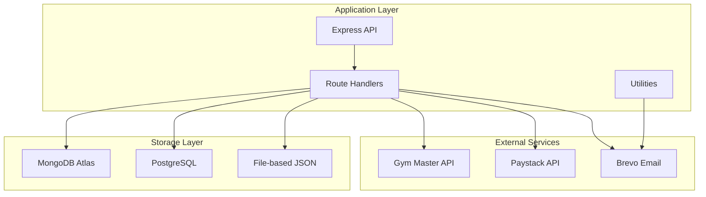

**Diagram sources**
- [server.js](file://server.js#L105-L137)
- [database/db.js](file://database/db.js#L1-L50)
- [src/routes/orders.js](file://src/routes/orders.js#L12-L23)

**Section sources**
- [server.js](file://server.js#L105-L137)
- [database/db.js](file://database/db.js#L1-L50)
- [src/routes/orders.js](file://src/routes/orders.js#L12-L23)

## Core Components

### Database Configuration and Connection Management
The system implements flexible database connectivity with automatic fallback:

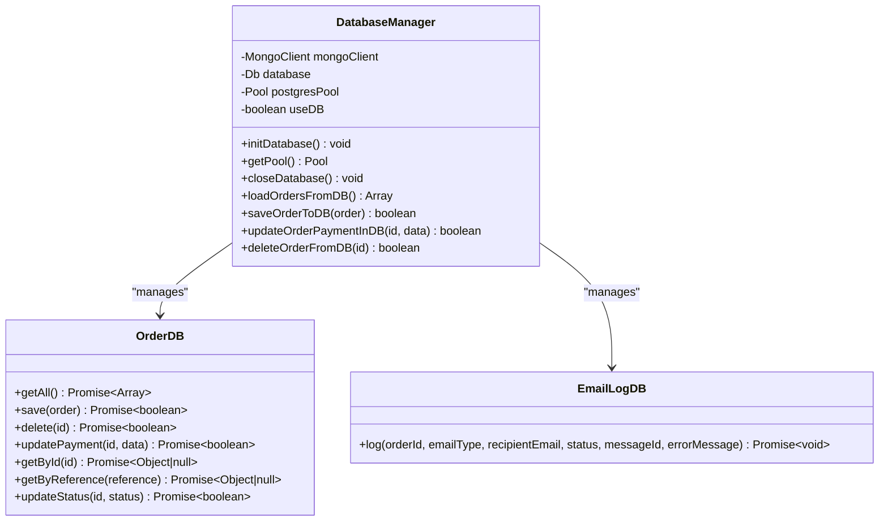

**Diagram sources**
- [server.js](file://server.js#L232-L287)
- [database/db.js](file://database/db.js#L66-L267)

### Storage Modes and Fallback Mechanisms
The system operates in three distinct modes:

| Mode | Technology | Use Case | Fallback Priority |
|------|------------|----------|-------------------|
| MongoDB | MongoDB Atlas | Primary order management | Highest |
| PostgreSQL | PostgreSQL | Structured order persistence | Medium |
| File-based | JSON Files | Local development/testing | Lowest |

**Section sources**
- [server.js](file://server.js#L105-L137)
- [database/db.js](file://database/db.js#L1-L50)
- [src/routes/orders.js](file://src/routes/orders.js#L36-L69)

## Architecture Overview

### Multi-Backend Storage Architecture
The system implements a hybrid storage architecture with automatic failover:

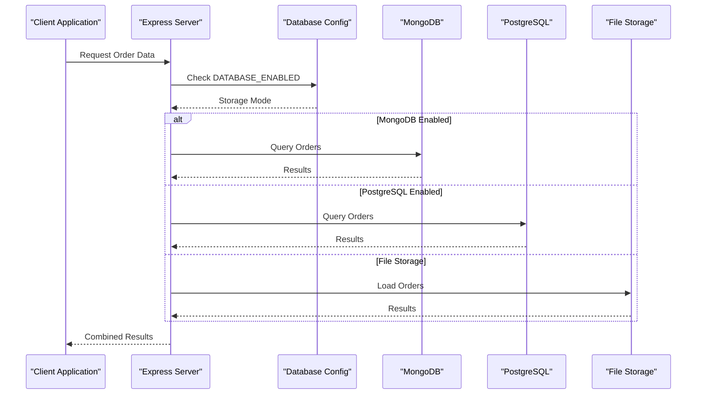

**Diagram sources**
- [server.js](file://server.js#L139-L154)
- [src/routes/orders.js](file://src/routes/orders.js#L52-L69)

### Order Lifecycle Management
The order management system tracks complete lifecycle from creation to delivery:

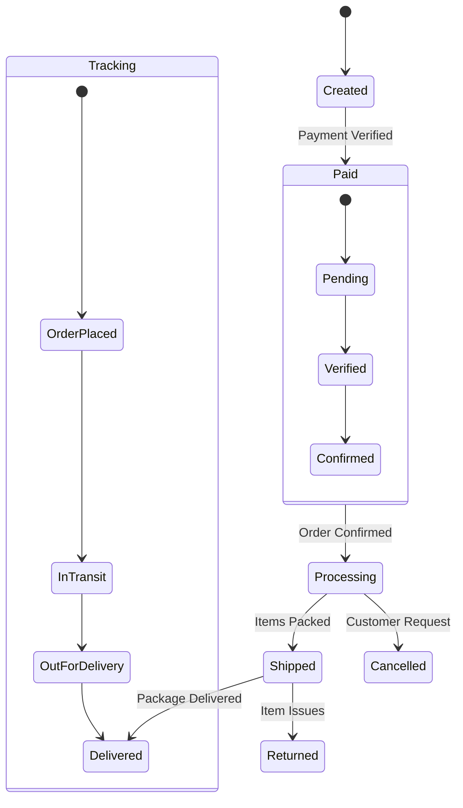

**Diagram sources**
- [server.js](file://server.js#L734-L820)
- [src/routes/orders.js](file://src/routes/orders.js#L300-L341)

## Detailed Component Analysis

### MongoDB Order Management
MongoDB serves as the primary storage backend with comprehensive indexing and validation:

#### Collection Schema
The orders collection implements flexible document structure with essential fields:

| Field | Type | Description | Index |
|-------|------|-------------|-------|
| id | String | Unique order identifier | Primary |
| orderId | String | Legacy order reference | Secondary |
| customer | JSON | Customer information | None |
| items | JSON | Ordered products | None |
| deliveryMethod | String | 'delivery' or 'pickup' | None |
| deliveryAddress | JSON | Shipping address | None |
| subtotal | Decimal | Subtotal amount | None |
| deliveryFee | Decimal | Shipping cost | None |
| total | Decimal | Total amount | None |
| notes | Text | Customer notes | None |
| paymentStatus | String | Payment state | Secondary |
| deliveryStatus | String | Order state | Secondary |
| paymentReference | String | Payment reference | Secondary |
| gymMasterToken | String | Member token | None |
| gymMasterMemberId | String | Member identifier | None |
| paidAt | String | Payment timestamp | None |
| statusUpdatedAt | String | Status change time | None |
| timestamp | String | Creation time | Secondary |

#### Index Strategy
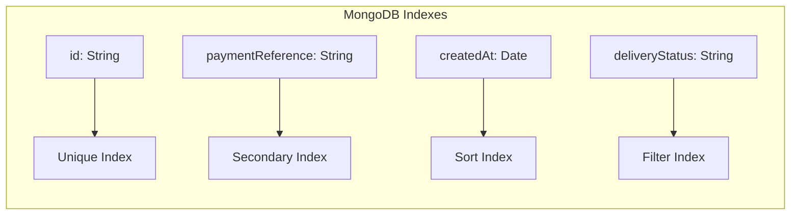

**Diagram sources**
- [database/init.sql](file://database/init.sql#L28-L33)
- [server.js](file://server.js#L127-L130)

**Section sources**
- [database/init.sql](file://database/init.sql#L4-L48)
- [server.js](file://server.js#L127-L130)
- [src/routes/orders.js](file://src/routes/orders.js#L52-L69)

### PostgreSQL Alternative Storage
PostgreSQL provides structured relational storage with JSONB support:

#### Table Structure
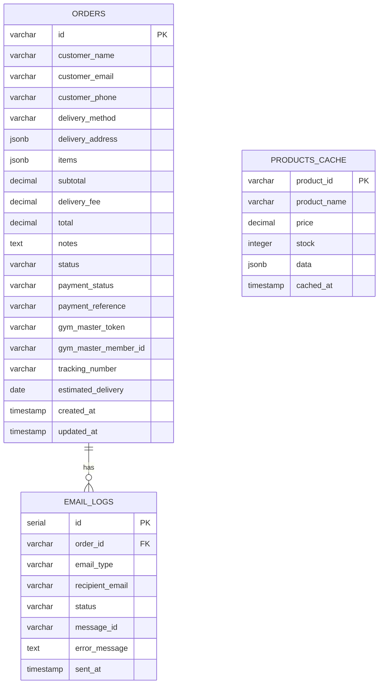

**Diagram sources**
- [database/init.sql](file://database/init.sql#L5-L79)

**Section sources**
- [database/init.sql](file://database/init.sql#L5-L79)
- [database/schema.sql](file://database/schema.sql#L4-L45)

### File-Based Fallback Storage
The system maintains a JSON file for local development and testing:

#### File Structure
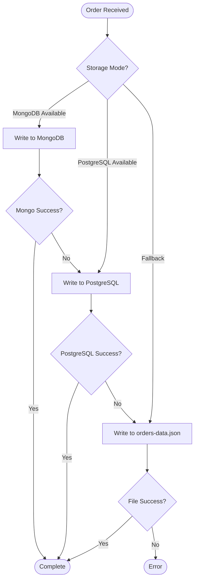

**Diagram sources**
- [server.js](file://server.js#L156-L173)
- [src/routes/orders.js](file://src/routes/orders.js#L82-L105)

**Section sources**
- [orders-data.json](file://orders-data.json#L1-L66)
- [server.js](file://server.js#L34-L103)

### Email Integration and Logging
The system implements comprehensive email tracking with Brevo integration:

#### Email Workflow
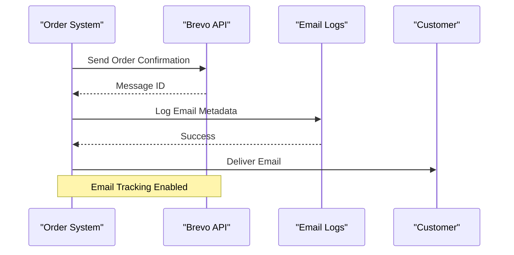

**Diagram sources**
- [src/utils/email.js](file://src/utils/email.js#L22-L206)
- [database/init.sql](file://database/init.sql#L62-L75)

**Section sources**
- [src/utils/email.js](file://src/utils/email.js#L22-L206)
- [database/init.sql](file://database/init.sql#L62-L75)

## Dependency Analysis

### Technology Dependencies
The system relies on multiple external services and libraries:

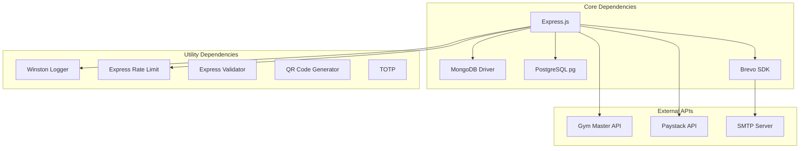

**Diagram sources**
- [package.json](file://package.json#L19-L31)

### Database Relationship Dependencies
The system maintains loose coupling between storage backends:

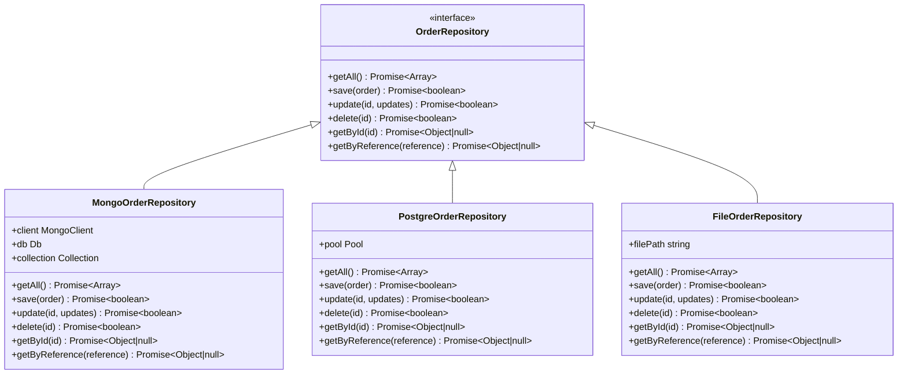

**Diagram sources**
- [server.js](file://server.js#L232-L287)
- [database/db.js](file://database/db.js#L66-L267)

**Section sources**
- [package.json](file://package.json#L19-L31)
- [server.js](file://server.js#L232-L287)
- [database/db.js](file://database/db.js#L66-L267)

## Performance Considerations

### Storage Performance Optimization
The system implements several performance optimization strategies:

#### Indexing Strategy
- **MongoDB**: Composite indexes on frequently queried fields (email, status, payment reference)
- **PostgreSQL**: Triggers for automatic timestamp updates and JSONB optimization
- **File Storage**: In-memory caching for frequently accessed orders

#### Connection Pooling
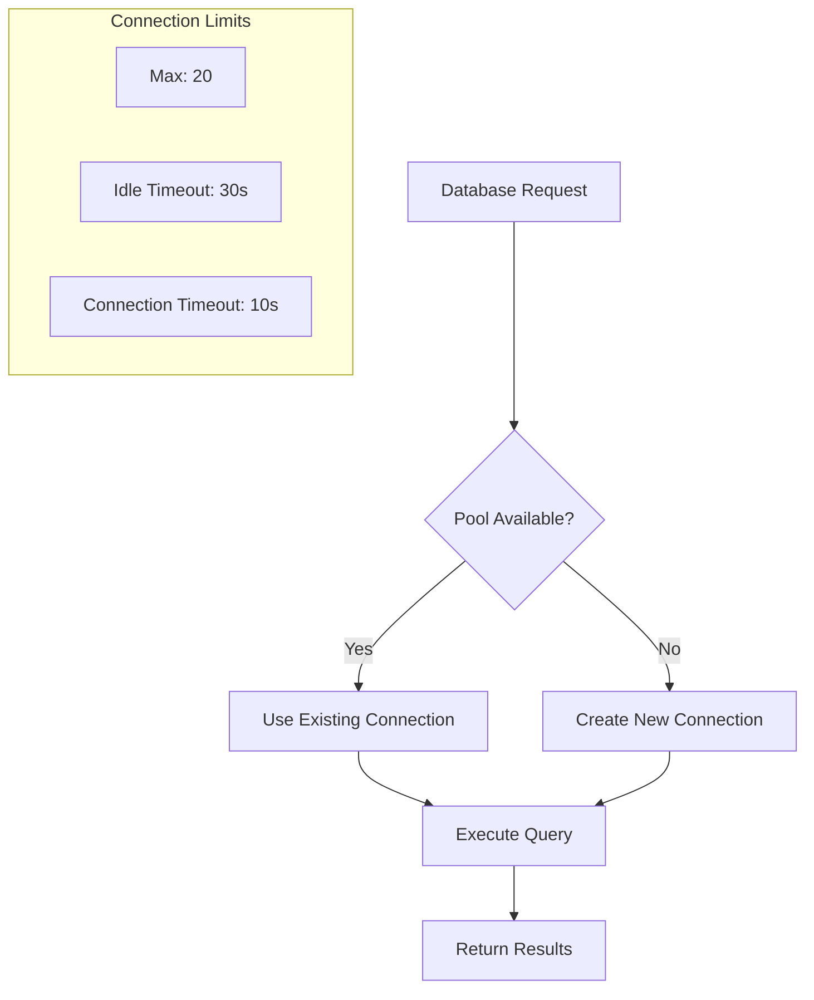

**Diagram sources**
- [database/db.js](file://database/db.js#L19-L27)

#### Caching Strategy
- **Product Catalog**: 5-minute cache TTL for Gym Master API responses
- **Order Data**: In-memory caching during request lifecycle
- **Email Templates**: Pre-rendered templates with dynamic content injection

**Section sources**
- [database/db.js](file://database/db.js#L19-L27)
- [src/routes/products.js](file://src/routes/products.js#L10-L13)

### Scalability Considerations
The hybrid storage approach provides natural scaling opportunities:
- **Horizontal Scaling**: Multiple MongoDB instances with replica sets
- **Read Replicas**: PostgreSQL read replicas for reporting queries
- **CDN Integration**: Static assets for improved delivery performance
- **Queue Processing**: Background jobs for email sending and report generation

## Troubleshooting Guide

### Common Database Issues

#### Connection Failures
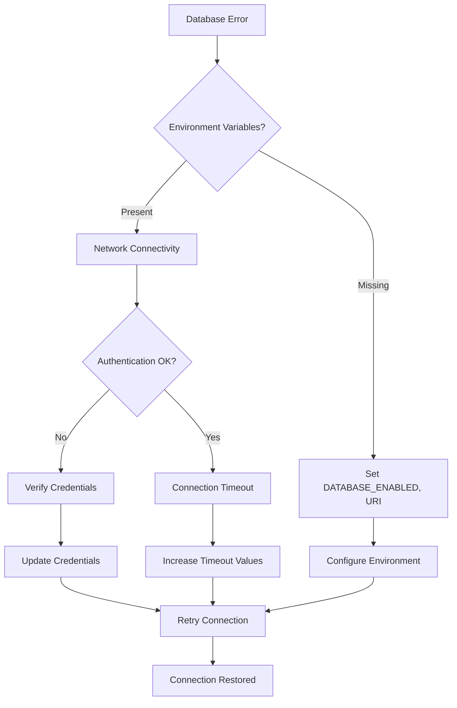

**Diagram sources**
- [server.js](file://server.js#L111-L137)
- [database/db.js](file://database/db.js#L17-L49)

#### Migration Between Storage Backends
When transitioning between storage modes:

1. **Export Current Data**: Backup current storage state
2. **Configure Target Backend**: Set appropriate environment variables
3. **Data Migration**: Transfer records with proper schema mapping
4. **Validation**: Verify data integrity and query functionality
5. **Cutover**: Switch production traffic to new backend

#### Monitoring and Logging
The system provides comprehensive logging capabilities:

| Log Level | Purpose | Output Destination |
|-----------|---------|-------------------|
| Error | Critical failures | File + Console |
| Warn | Non-critical issues | Console |
| Info | General operations | Console |
| Debug | Development troubleshooting | Console |

**Section sources**
- [src/utils/logger.js](file://src/utils/logger.js#L47-L64)
- [server.js](file://server.js#L382-L404)

### Performance Troubleshooting
Common performance issues and solutions:

#### Slow Query Performance
- **MongoDB**: Review query patterns and add missing indexes
- **PostgreSQL**: Analyze query plans and optimize expensive queries
- **File Storage**: Consider implementing pagination for large datasets

#### Memory Usage Issues
- **Caching**: Adjust cache TTL and size limits
- **Streaming**: Implement streaming for large data exports
- **Connection Limits**: Monitor and adjust pool sizes

## Conclusion
The Active Zone Hub database design demonstrates a sophisticated approach to multi-backend storage with automatic failover, comprehensive monitoring, and robust error handling. The hybrid architecture ensures high availability through MongoDB as the primary backend, PostgreSQL as an alternative, and file-based storage for development scenarios. The system's integration with external APIs and email services creates a complete order management ecosystem that scales effectively while maintaining operational resilience.

The design successfully balances flexibility, performance, and maintainability through careful index strategy, connection pooling, and comprehensive logging. Future enhancements could include implementing database sharding for horizontal scaling, adding data compression for large JSON fields, and integrating advanced monitoring dashboards for real-time performance insights.