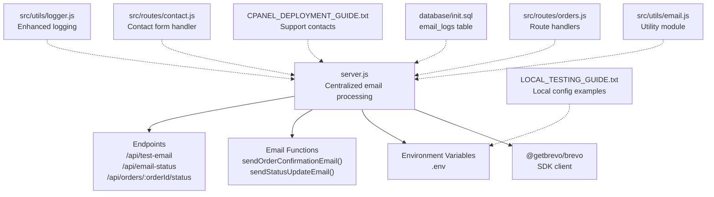
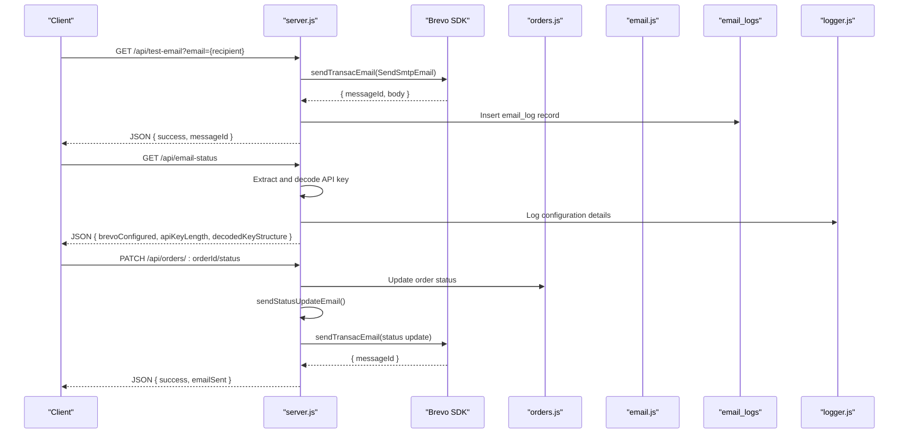
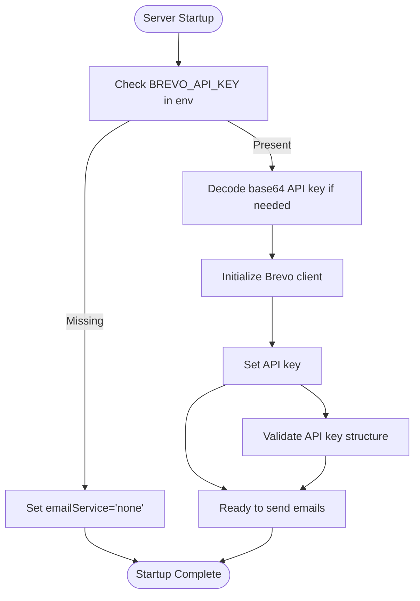
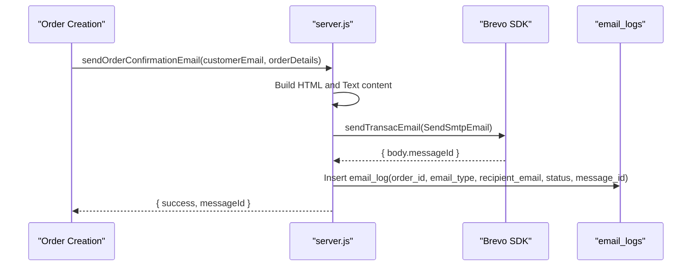
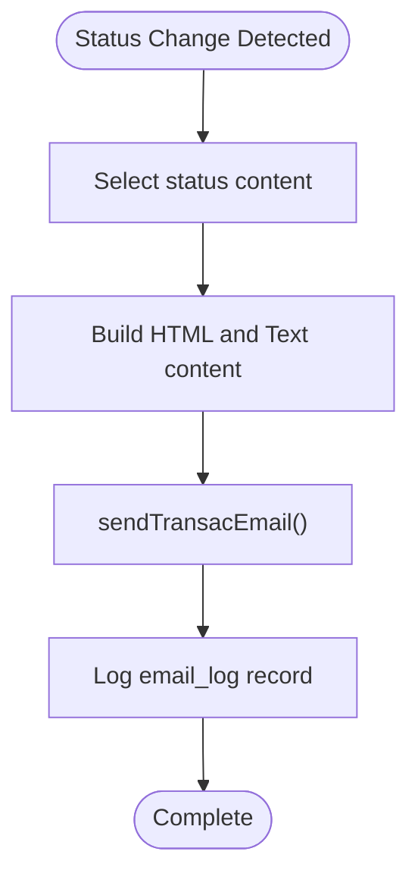
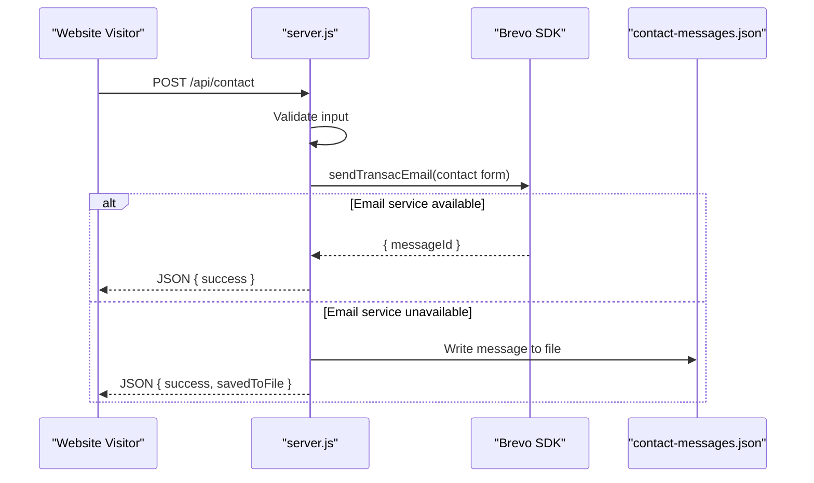
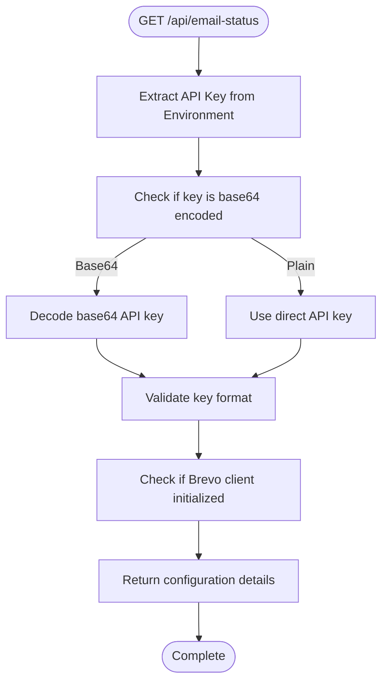
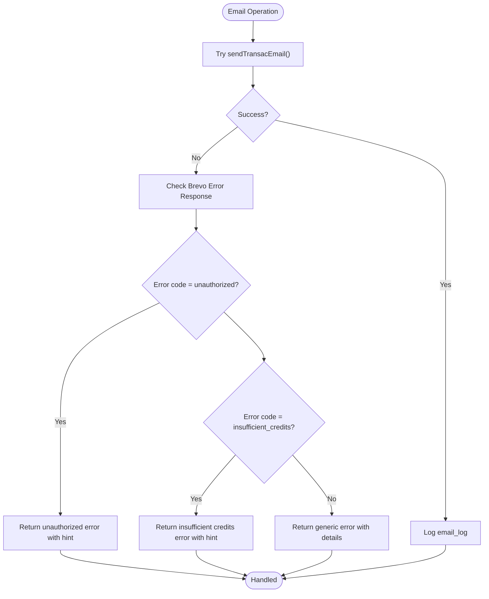
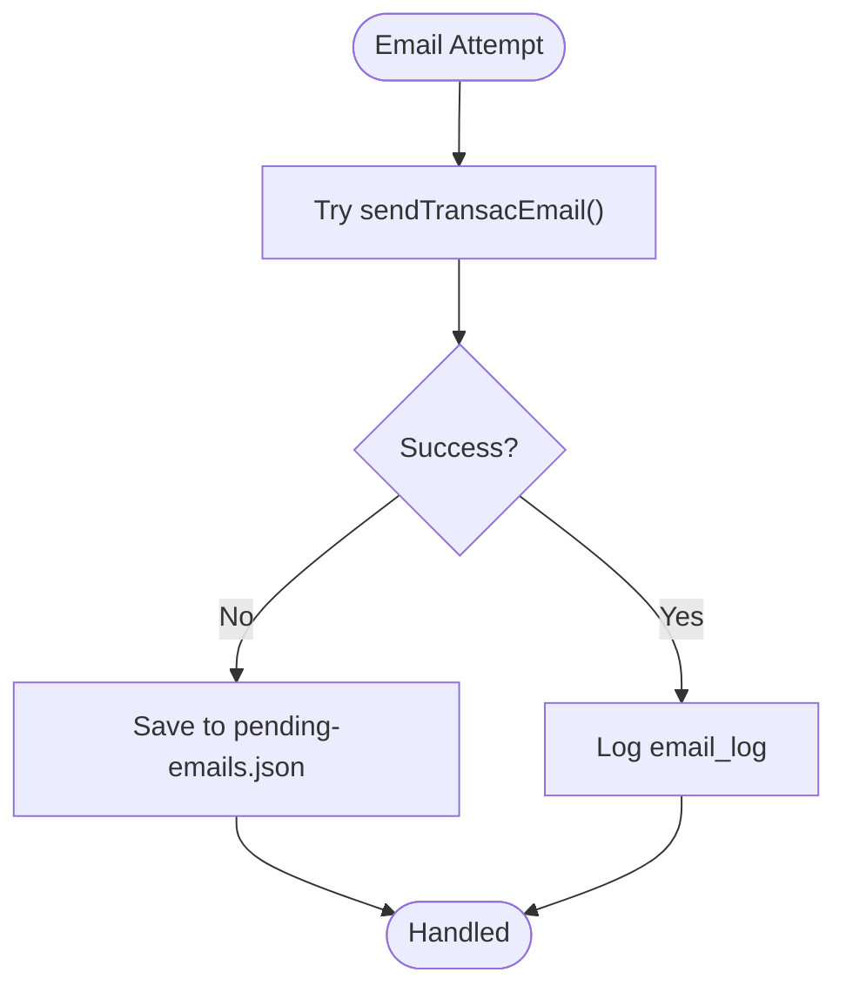
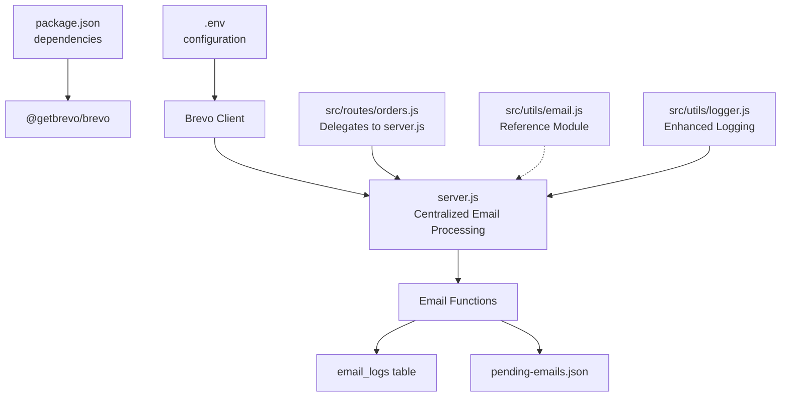

# Brevo Email Service Integration

<cite>
**Referenced Files in This Document**
- [server.js](file://server.js)
- [package.json](file://package.json)
- [src/utils/email.js](file://src/utils/email.js)
- [src/routes/orders.js](file://src/routes/orders.js)
- [database/init.sql](file://database/init.sql)
- [LOCAL_TESTING_GUIDE.txt](file://LOCAL_TESTING_GUIDE.txt)
- [CPANEL_DEPLOYMENT_GUIDE.txt](file://CPANEL_DEPLOYMENT_GUIDE.txt)
- [src/routes/contact.js](file://src/routes/contact.js)
- [src/utils/logger.js](file://src/utils/logger.js)
</cite>

## Update Summary
**Changes Made**
- Added new diagnostic endpoint `/api/email-status` for comprehensive email configuration debugging
- Enhanced error handling with specific error codes (`unauthorized`, `insufficient_credits`) for improved troubleshooting
- Implemented base64 decoding for API keys with JSON structure validation for debugging purposes
- Expanded comprehensive logging capabilities for debugging email configuration issues
- Updated error response format to include structured error codes and hints for better diagnostics

## Table of Contents
1. [Introduction](#introduction)
2. [Project Structure](#project-structure)
3. [Core Components](#core-components)
4. [Architecture Overview](#architecture-overview)
5. [Detailed Component Analysis](#detailed-component-analysis)
6. [Dependency Analysis](#dependency-analysis)
7. [Performance Considerations](#performance-considerations)
8. [Troubleshooting Guide](#troubleshooting-guide)
9. [Conclusion](#conclusion)

## Introduction
This document provides comprehensive documentation for the Brevo email service integration used by the Active Zone Hub application. The email system has been centralized in server.js, eliminating duplicate implementations across different modules. It covers configuration, email sending mechanisms for order confirmations, notifications, and administrative communications, the template system for dynamic content generation, error handling strategies, monitoring approaches, security considerations, and troubleshooting procedures.

**Updated** The integration now includes enhanced diagnostic capabilities with the `/api/email-status` endpoint, improved error handling with specific error codes, and comprehensive logging for debugging email configuration issues.

## Project Structure
The email integration is now centralized in the main server.js file, with supporting utilities and route handlers that delegate email operations to the central implementation. The orders module no longer contains duplicate email sending logic, ensuring a single source of truth for all email operations.

**Diagram sources**
- [server.js](file://server.js#L10-L15)
- [server.js](file://server.js#L1056-L1082)
- [server.js](file://server.js#L1320-L1551)
- [server.js](file://server.js#L1553-L1765)
- [src/utils/email.js](file://src/utils/email.js#L1-L412)
- [src/routes/orders.js](file://src/routes/orders.js#L286-L287)
- [src/utils/logger.js](file://src/utils/logger.js#L1-L66)

**Section sources**
- [server.js](file://server.js#L10-L15)
- [server.js](file://server.js#L1056-L1082)
- [server.js](file://server.js#L1320-L1551)
- [server.js](file://server.js#L1553-L1765)
- [src/utils/email.js](file://src/utils/email.js#L1-L412)
- [src/routes/orders.js](file://src/routes/orders.js#L286-L287)
- [src/utils/logger.js](file://src/utils/logger.js#L1-L66)

## Core Components
- **Centralized Brevo SDK client** initialization and configuration in server.js
- **Unified email sending functions** for order confirmations and status updates
- **Administrative contact form email delivery** through centralized handler
- **Email logging and fallback mechanisms** integrated throughout the system
- **Environment-based configuration** for sender identity and API key management
- **Diagnostic endpoint** `/api/email-status` for comprehensive email configuration debugging
- **Enhanced error handling** with specific error codes (`unauthorized`, `insufficient_credits`)
- **Base64 decoding** for API keys with JSON structure validation

**Updated** The email processing has been centralized in server.js, removing duplicate implementations from other modules and establishing a single source of truth for all email operations. New diagnostic capabilities provide comprehensive email configuration debugging.

Key implementation highlights:
- Centralized SDK client setup with API key and HTTPS transport
- HTML and plain text email content generation in server.js
- Message ID retrieval and logging through unified functions
- Fallback to file-based storage when email service is unavailable
- Rate limiting and request logging middleware integrated with email operations
- Diagnostic endpoint `/api/email-status` for email configuration validation
- Structured error handling with specific Brevo error codes
- Base64 decoding for API keys with JSON structure inspection

**Section sources**
- [server.js](file://server.js#L10-L15)
- [server.js](file://server.js#L1056-L1082)
- [server.js](file://server.js#L1300-L1316)
- [server.js](file://server.js#L1320-L1551)
- [server.js](file://server.js#L1553-L1765)
- [server.js](file://server.js#L2053-L2264)
- [src/utils/email.js](file://src/utils/email.js#L1-L412)
- [src/utils/logger.js](file://src/utils/logger.js#L1-L66)

## Architecture Overview
The email architecture now centers around server.js as the single point of contact for all email operations. The orders module delegates email functionality to server.js functions, while the utility module serves as a secondary reference for email operations. Administrative endpoints leverage the same centralized client for contact form notifications.

**Diagram sources**
- [server.js](file://server.js#L1056-L1082)
- [server.js](file://server.js#L1084-L1166)
- [server.js](file://server.js#L1320-L1551)
- [server.js](file://server.js#L1553-L1765)
- [src/routes/orders.js](file://src/routes/orders.js#L286-L287)
- [src/utils/logger.js](file://src/utils/logger.js#L1-L66)

## Detailed Component Analysis

### Centralized Brevo Client Initialization
The server initializes the Brevo client using the API key from environment variables in a centralized location. It sets the API key and logs configuration details. If the API key is missing, the service remains uninitialized but email operations can still be performed through the centralized functions.

**Updated** Enhanced with base64 decoding capability for API keys and comprehensive logging for debugging.

**Diagram sources**
- [server.js](file://server.js#L1300-L1316)
- [server.js](file://server.js#L1056-L1082)

**Section sources**
- [server.js](file://server.js#L1300-L1316)
- [server.js](file://server.js#L1056-L1082)

### Centralized Order Confirmation Email Function
This function generates an order confirmation email with a tracking link and sends it via Brevo. It constructs both HTML and plain text content, captures the message ID when available, and logs the attempt. The function is now centralized in server.js, replacing duplicate implementations.

**Updated** The order confirmation email function has been moved from the utility module to server.js, making it the single source of truth for order confirmation emails.

**Diagram sources**
- [server.js](file://server.js#L1320-L1551)
- [server.js](file://server.js#L1477-L1504)
- [init.sql](file://database/init.sql#L62-L79)

**Section sources**
- [server.js](file://server.js#L1320-L1551)
- [server.js](file://server.js#L1477-L1504)
- [init.sql](file://database/init.sql#L62-L79)

### Centralized Status Update Email Function
This function sends status-specific emails (processing, shipped, delivered) with themed content and tracking links. It selects content based on the new status and logs the delivery attempt. The function is now centralized in server.js, providing a unified approach to status notifications.

**Updated** The status update email function has been moved from the utility module to server.js, consolidating all email operations in a single location.

**Diagram sources**
- [server.js](file://server.js#L1553-L1765)
- [server.js](file://server.js#L1718-L1765)
- [init.sql](file://database/init.sql#L62-L79)

**Section sources**
- [server.js](file://server.js#L1553-L1765)
- [server.js](file://server.js#L1718-L1765)
- [init.sql](file://database/init.sql#L62-L79)

### Contact Form Email Handler
The contact form endpoint composes an HTML email with sender information and message content, then sends it via Brevo. If the email service is unavailable, it falls back to saving the message to a file. This handler is centralized in server.js, providing consistent contact form processing.

**Updated** The contact form email handler has been moved from the routes module to server.js, making it part of the centralized email processing system.

**Diagram sources**
- [server.js](file://server.js#L2053-L2264)

**Section sources**
- [server.js](file://server.js#L2053-L2264)

### Diagnostic Endpoint: `/api/email-status`
The new diagnostic endpoint provides comprehensive email configuration validation and debugging capabilities. It extracts and decodes the Brevo API key, validates its structure, and returns detailed configuration information for troubleshooting purposes.

**New Feature** Added comprehensive diagnostic endpoint for email configuration debugging.

**Diagram sources**
- [server.js](file://server.js#L1056-L1082)

**Section sources**
- [server.js](file://server.js#L1056-L1082)

### Enhanced Error Handling with Specific Error Codes
The system now implements enhanced error handling with specific Brevo error codes (`unauthorized`, `insufficient_credits`) for improved troubleshooting. The error handling logic checks for specific error codes and provides appropriate error messages and hints.

**Updated** Enhanced error handling with specific Brevo error codes for better diagnostics.

**Diagram sources**
- [server.js](file://server.js#L1141-L1165)

**Section sources**
- [server.js](file://server.js#L1141-L1165)

### Comprehensive Logging Capabilities
The system now includes comprehensive logging capabilities for debugging email configuration issues. The logger module provides structured logging with timestamps, levels, and detailed error information for troubleshooting purposes.

**Updated** Enhanced logging capabilities with structured logging for debugging email configuration issues.

**Section sources**
- [src/utils/logger.js](file://src/utils/logger.js#L1-L66)

### Template System and Dynamic Content
The email templates are constructed dynamically using JavaScript string interpolation in server.js. They include:
- Sender identity from environment variables
- Order-specific details and tracking URLs
- Status-specific styling and messaging
- Plain text alternatives for accessibility

**Updated** Template construction has been centralized in server.js, eliminating duplicate implementations and ensuring consistency across all email types.

Template construction occurs within the centralized email functions in server.js, providing a single source of truth for all email content generation.

**Section sources**
- [server.js](file://server.js#L1320-L1551)
- [server.js](file://server.js#L1553-L1765)
- [server.js](file://server.js#L2053-L2264)

### Multi-Language Support
The current implementation does not include explicit multi-language handling. All content is generated in the default locale. To add multi-language support, implement locale detection and template selection logic before constructing email content.

[No sources needed since this section provides general guidance]

### Error Handling Strategies
The system implements layered error handling through centralized functions:
- Initialization errors are caught and logged; the service remains disabled
- Runtime errors during email sending are captured and returned as structured responses
- Fallback mechanisms save pending emails to a JSON file for later retry
- Contact form errors fall back to file-based storage when the email service is unavailable
- **New** Specific error codes (`unauthorized`, `insufficient_credits`) provide targeted troubleshooting guidance

**Updated** Error handling has been centralized in server.js, providing consistent error management across all email operations with enhanced specificity.

**Diagram sources**
- [server.js](file://server.js#L1495-L1504)
- [server.js](file://server.js#L2213-L2253)
- [init.sql](file://database/init.sql#L62-L79)

**Section sources**
- [server.js](file://server.js#L1495-L1504)
- [server.js](file://server.js#L2213-L2253)
- [init.sql](file://database/init.sql#L62-L79)

### Monitoring Approaches
The database schema includes an email logging table to track delivery attempts. The server logs message IDs upon successful sends and records timestamps and statuses through centralized logging functions.

Recommended monitoring steps:
- Query the email_logs table for recent entries and statuses
- Monitor for recurring failures and investigate root causes
- Track bounce rates and engagement metrics via Brevo dashboards
- **New** Use `/api/email-status` endpoint for regular health checks of email configuration

**Section sources**
- [init.sql](file://database/init.sql#L62-L79)
- [server.js](file://server.js#L1495-L1504)
- [server.js](file://server.js#L1736-L1745)
- [server.js](file://server.js#L1056-L1082)

### Security Considerations
- API key protection: Store the BREVO_API_KEY in environment variables and avoid committing secrets to version control
- Email content validation: Input validation is applied to contact form submissions; consider sanitizing HTML content before rendering
- Compliance: Ensure adherence to anti-spam regulations and provide unsubscribe mechanisms where applicable
- **New** Base64 decoding validation: The system validates API key structure and provides JSON inspection for debugging

**Section sources**
- [LOCAL_TESTING_GUIDE.txt](file://LOCAL_TESTING_GUIDE.txt#L100-L116)
- [server.js](file://server.js#L2053-L2072)
- [server.js](file://server.js#L1072-L1080)

### Configuration Examples
Environment variables used by the integration:
- BREVO_API_KEY: Brevo API key for authentication (supports base64 encoding)
- SMTP_FROM_EMAIL: Sender email address
- SMTP_FROM_NAME: Sender display name
- APP_URL: Application base URL for tracking links

Example usage locations:
- Brevo client initialization
- Email sender configuration
- Tracking URL construction

**Section sources**
- [server.js](file://server.js#L1300-L1316)
- [server.js](file://server.js#L1323-L1323)
- [server.js](file://server.js#L1556-L1556)
- [LOCAL_TESTING_GUIDE.txt](file://LOCAL_TESTING_GUIDE.txt#L100-L116)

## Dependency Analysis
The email integration depends on the Brevo SDK and environment configuration. The server now serves as the central hub for all email operations, with the orders module delegating email functionality to server.js functions.

**Updated** Dependencies have been streamlined with server.js as the central dependency for all email operations, enhanced with diagnostic capabilities.

**Diagram sources**
- [package.json](file://package.json#L15-L26)
- [server.js](file://server.js#L10-L15)
- [server.js](file://server.js#L1300-L1316)
- [src/routes/orders.js](file://src/routes/orders.js#L286-L287)
- [src/utils/email.js](file://src/utils/email.js#L1-L412)
- [src/utils/logger.js](file://src/utils/logger.js#L1-L66)

**Section sources**
- [package.json](file://package.json#L15-L26)
- [server.js](file://server.js#L10-L15)
- [server.js](file://server.js#L1300-L1316)
- [src/routes/orders.js](file://src/routes/orders.js#L286-L287)
- [src/utils/email.js](file://src/utils/email.js#L1-L412)
- [src/utils/logger.js](file://src/utils/logger.js#L1-L66)

## Performance Considerations
- Asynchronous email sending prevents blocking request handling
- Message ID capture enables efficient delivery tracking
- Consider batching or queuing for high-volume scenarios
- Monitor API rate limits and adjust retry logic accordingly
- **New** Diagnostic endpoint provides real-time health monitoring without affecting email delivery performance

**Updated** Performance considerations now apply to the centralized email processing system, ensuring optimal performance across all email operations with enhanced monitoring capabilities.

[No sources needed since this section provides general guidance]

## Troubleshooting Guide
Common issues and resolutions:
- Missing BREVO_API_KEY: Ensure the environment variable is set and the server reboots to reinitialize the client
- Email service unavailable: The system falls back to saving messages to files; monitor pending-emails.json and contact-messages.json
- API errors: Inspect server logs for error messages and validate Brevo account status
- **New** Unauthorized API key: Use `/api/email-status` endpoint to validate API key format and structure
- **New** Insufficient credits: Check Brevo account balance and credit status through the diagnostic endpoint
- Deployment issues: Refer to deployment guide for support contacts and SSL configuration

**Updated** Troubleshooting procedures now focus on the centralized email processing system, providing unified guidance for all email-related issues with enhanced diagnostic capabilities.

**Section sources**
- [server.js](file://server.js#L1312-L1316)
- [server.js](file://server.js#L1495-L1504)
- [server.js](file://server.js#L2213-L2253)
- [server.js](file://server.js#L1056-L1082)
- [CPANEL_DEPLOYMENT_GUIDE.txt](file://CPANEL_DEPLOYMENT_GUIDE.txt#L394-L396)

## Conclusion
The centralized Brevo email integration provides robust order and administrative communication capabilities with built-in error handling and logging. By moving email processing to server.js and removing duplicate implementations from other modules, the system now offers improved maintainability, consistency, and reliability. The new diagnostic endpoint `/api/email-status` provides comprehensive email configuration validation, while enhanced error handling with specific error codes improves troubleshooting capabilities. Following the configuration guidelines, monitoring practices, and troubleshooting procedures outlined in this document, you can maintain reliable email delivery and improve operational visibility across all email operations.