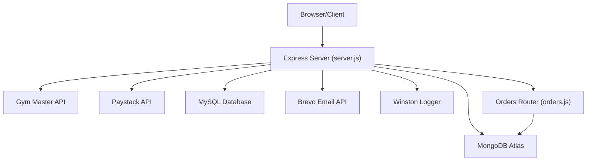
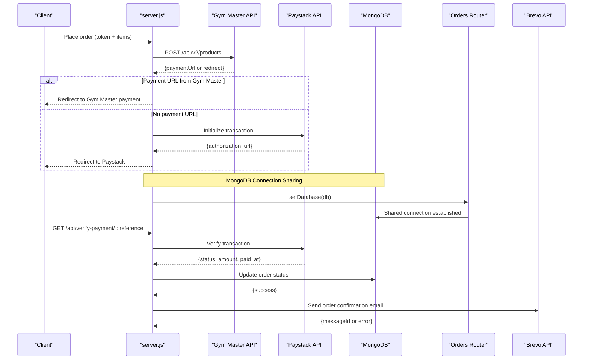
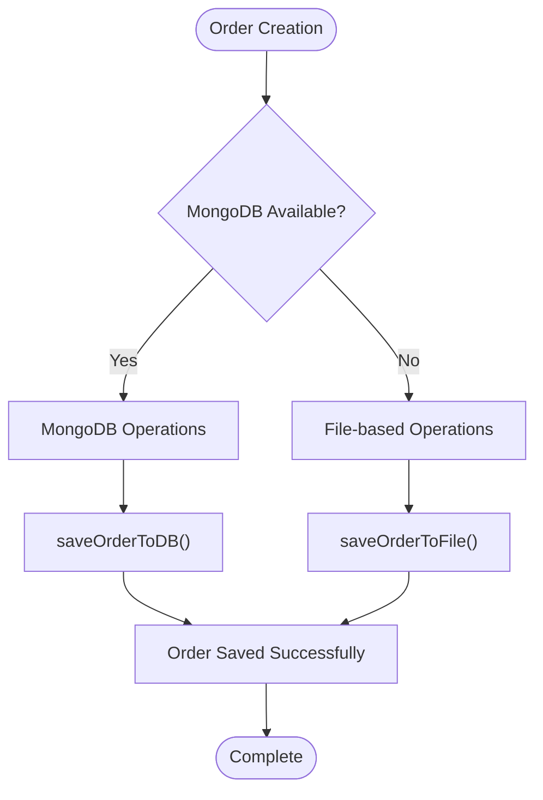
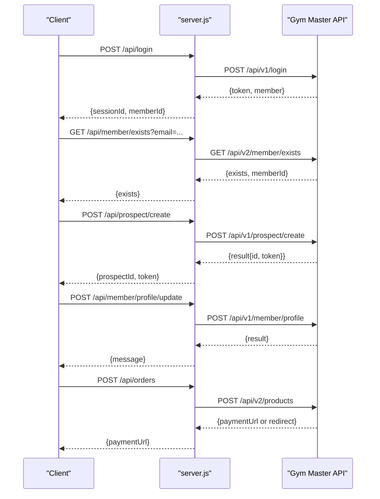
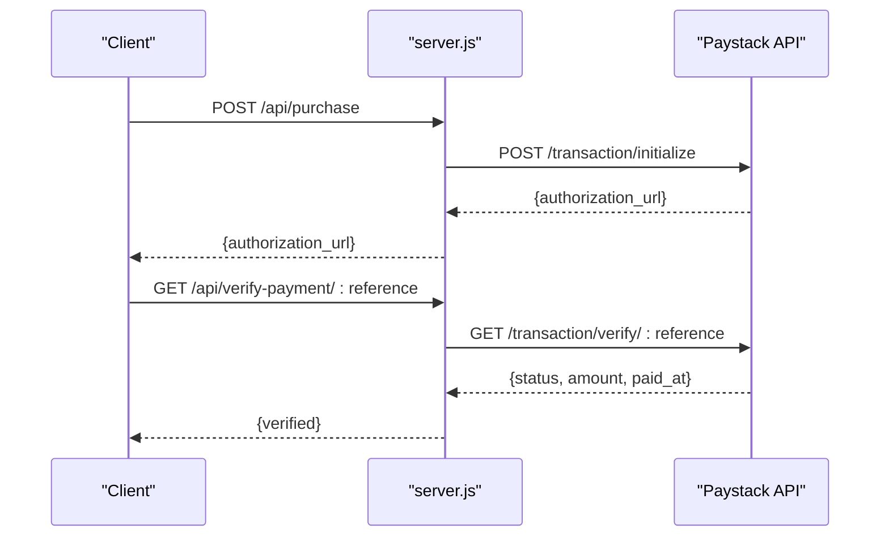
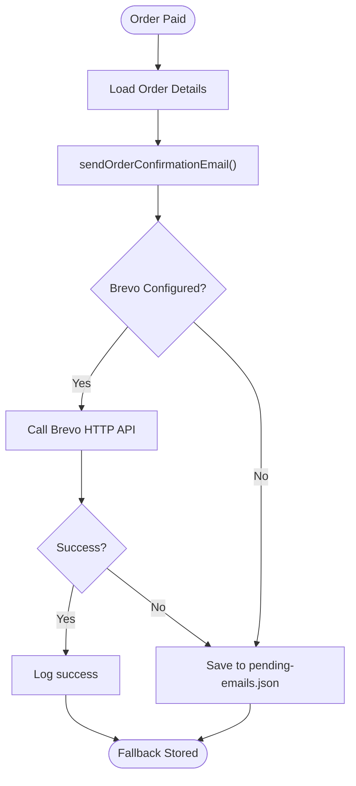
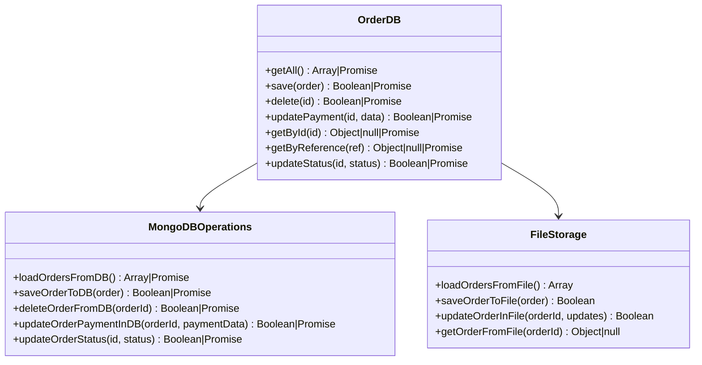
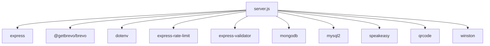

# External Integrations

<cite>
**Referenced Files in This Document**
- [server.js](file://server.js)
- [orders.js](file://src/routes/orders.js)
- [payment.js](file://src/routes/payment.js)
- [member.js](file://src/routes/member.js)
- [db.js](file://database/db.js)
- [logger.js](file://src/utils/logger.js)
- [package.json](file://package.json)
- [init.sql](file://database/init.sql)
- [orders-data.json](file://orders-data.json)
</cite>

## Update Summary
**Changes Made**
- Updated MongoDB connection sharing pattern between server and routes
- Enhanced hybrid storage model with MongoDB as primary and file-based fallback
- Improved error handling for database operations with graceful degradation
- Streamlined payment processing workflows with Gym Master and Paystack integration
- Added comprehensive database connection management and monitoring
- Updated order management system with unified database operations

## Table of Contents
1. [Introduction](#introduction)
2. [Project Structure](#project-structure)
3. [Core Components](#core-components)
4. [Architecture Overview](#architecture-overview)
5. [Detailed Component Analysis](#detailed-component-analysis)
6. [Dependency Analysis](#dependency-analysis)
7. [Performance Considerations](#performance-considerations)
8. [Troubleshooting Guide](#troubleshooting-guide)
9. [Conclusion](#conclusion)
10. [Appendices](#appendices)

## Introduction
This document explains Active Zone Hub's external service integrations and operational patterns with enhanced MongoDB connection sharing, improved error handling, and streamlined payment processing workflows. It covers:
- Gym Master API integration: authentication flow, member verification, profile synchronization, and error handling
- Paystack payment processing: transaction initiation, verification, and fallback behavior
- MongoDB database integration: connection sharing, hybrid storage model, and graceful degradation
- Brevo email service configuration for notifications, marketing, and customer support
- API key management, webhook considerations, and integration testing procedures
- Error handling patterns, retry strategies, and fallback mechanisms
- Security considerations and monitoring approaches for external service health

## Project Structure
The backend server orchestrates integrations and exposes API endpoints with enhanced MongoDB connection sharing. Routes encapsulate specific integrations (member, payment, orders), while shared utilities handle logging and environment configuration. The system now uses a hybrid storage model with MongoDB as primary and file-based fallback.

**Diagram sources**
- [server.js](file://server.js#L105-L137)
- [orders.js](file://src/routes/orders.js#L16-L23)
- [payment.js](file://src/routes/payment.js#L1-L154)
- [member.js](file://src/routes/member.js#L1-L142)
- [logger.js](file://src/utils/logger.js#L1-L51)

**Section sources**
- [server.js](file://server.js#L1-L120)
- [package.json](file://package.json#L1-L33)

## Core Components
- Gym Master API client: Authentication, member existence checks, prospect creation, profile updates, and product purchase flows
- Paystack payment client: Transaction initialization and verification with enhanced error handling
- MongoDB database integration: Connection sharing between server and routes with graceful fallback
- Hybrid storage model: MongoDB as primary storage with file-based fallback for orders-data.json
- Brevo email client: Order confirmation and status update emails with robust error handling
- Database abstraction: Unified OrderDB interface for both MongoDB and MySQL operations
- Logging and monitoring: Structured Winston logs with request auditing and database connection monitoring

**Section sources**
- [server.js](file://server.js#L105-L137)
- [server.js](file://server.js#L232-L287)
- [orders.js](file://src/routes/orders.js#L16-L23)
- [orders.js](file://src/routes/orders.js#L82-L105)
- [db.js](file://database/db.js#L66-L240)

## Architecture Overview
The system integrates three external services with enhanced database connectivity:
- Gym Master for membership and product purchase orchestration
- Paystack for payment processing with a fallback path when Gym Master does not provide a payment URL
- MongoDB for primary order storage with graceful file-based fallback
- Brevo for transactional email delivery with robust error handling

**Diagram sources**
- [server.js](file://server.js#L1827-L2025)
- [server.js](file://server.js#L115-L137)
- [orders.js](file://src/routes/orders.js#L16-L23)
- [server.js](file://server.js#L382-L404)

## Detailed Component Analysis

### MongoDB Connection Sharing and Hybrid Storage Model
**Updated** Enhanced with MongoDB connection sharing between server and routes for improved resource management and performance.

The system now implements a sophisticated hybrid storage model with MongoDB as the primary database and file-based fallback for orders-data.json:

**Diagram sources**
- [server.js](file://server.js#L157-L173)
- [server.js](file://server.js#L158-L161)
- [orders.js](file://src/routes/orders.js#L82-L105)

**Section sources**
- [server.js](file://server.js#L105-L137)
- [server.js](file://server.js#L157-L173)
- [orders.js](file://src/routes/orders.js#L16-L23)
- [orders.js](file://src/routes/orders.js#L82-L105)

### Gym Master API Integration
- Configuration: API key, base URL, and company ID are loaded from environment variables
- Authentication flow: Login endpoint posts credentials to Gym Master and decodes a JWT-like token to extract session identifiers
- Member verification: Endpoint checks if a member exists by email
- Profile synchronization: After prospect creation, address and phone can be added via profile update endpoint
- Product purchase: The server posts items and delivery option to Gym Master and extracts a payment URL; if absent, Paystack fallback is used

**Diagram sources**
- [server.js](file://server.js#L635-L731)
- [server.js](file://server.js#L424-L451)
- [server.js](file://server.js#L454-L552)
- [server.js](file://server.js#L555-L632)
- [server.js](file://server.js#L1831-L2025)

**Section sources**
- [server.js](file://server.js#L289-L294)
- [server.js](file://server.js#L635-L731)
- [server.js](file://server.js#L424-L451)
- [server.js](file://server.js#L454-L552)
- [server.js](file://server.js#L555-L632)
- [server.js](file://server.js#L1831-L2025)

### Paystack Payment Processing Integration
**Updated** Enhanced with improved error handling and streamlined payment processing workflows.

- Transaction initiation: The payment route initializes a Paystack transaction with metadata including order ID and customer details
- Verification: A dedicated endpoint verifies the transaction and updates order status accordingly
- Fallback behavior: If Gym Master does not return a payment URL, Paystack is used as a fallback during order creation
- Enhanced error handling: Comprehensive error handling for Paystack API failures and graceful degradation

**Diagram sources**
- [payment.js](file://src/routes/payment.js#L31-L110)
- [payment.js](file://src/routes/payment.js#L112-L151)
- [server.js](file://server.js#L1908-L1963)
- [server.js](file://server.js#L382-L404)

**Section sources**
- [payment.js](file://src/routes/payment.js#L31-L151)
- [server.js](file://server.js#L1908-L1963)
- [server.js](file://server.js#L382-L404)

### Brevo Email Service Configuration
- Initialization: The server initializes the Brevo HTTP API client using the API key from environment variables
- Order confirmation and status update emails: Sent via Brevo with rich HTML and plain-text content
- Fallback: If email service is unavailable, order confirmation emails are persisted to a file for later manual sending
- Contact form: Messages are emailed to support or saved to a file if email is not configured

**Diagram sources**
- [server.js](file://server.js#L2191-L2275)

**Section sources**
- [server.js](file://server.js#L2191-L2275)

### Database Abstraction and Hybrid Persistence
**Updated** Enhanced with MongoDB connection sharing and improved error handling patterns.

The system now implements a unified database abstraction with MongoDB as primary and MySQL as secondary:

**Diagram sources**
- [server.js](file://server.js#L232-L287)
- [orders.js](file://src/routes/orders.js#L52-L69)
- [orders.js](file://src/routes/orders.js#L82-L105)

**Section sources**
- [server.js](file://server.js#L232-L287)
- [orders.js](file://src/routes/orders.js#L52-L69)
- [orders.js](file://src/routes/orders.js#L82-L105)
- [orders.js](file://src/routes/orders.js#L108-L135)
- [orders.js](file://src/routes/orders.js#L138-L156)
- [orders.js](file://src/routes/orders.js#L159-L184)

## Dependency Analysis
External libraries and their roles:
- Express: Web framework and routing
- @getbrevo/brevo: HTTP API client for email delivery
- dotenv: Environment variable loading
- express-rate-limit: Rate limiting for sensitive endpoints
- express-validator: Input validation for routes
- mongodb: MongoDB driver for connection sharing
- mysql2: MySQL driver for PostgreSQL compatibility
- qrcode: QR code generation for TOTP setup
- speakeasy: Two-factor authentication implementation
- winston: Structured logging

**Diagram sources**
- [package.json](file://package.json#L19-L31)
- [server.js](file://server.js#L1-L15)

**Section sources**
- [package.json](file://package.json#L19-L31)

## Performance Considerations
- **MongoDB Connection Sharing**: Single connection instance shared between server and routes reduces connection overhead and improves performance
- **Database Pooling**: Connection limits and keep-alive reduce overhead and improve throughput for MySQL operations
- **Hybrid Storage Model**: MongoDB as primary storage with file-based fallback ensures continuity when database is unavailable
- **Request Logging**: Structured logs aid in diagnosing performance bottlenecks
- **Rate Limiting**: Protects endpoints from abuse and reduces external service load spikes
- **Connection Monitoring**: Real-time monitoring of database connections and fallback mechanisms

## Troubleshooting Guide
Common issues and resolutions:
- **MongoDB Connection Issues**: Verify MONGODB_URI format and connection timeout settings; check network connectivity and authentication
- **Database Connection Sharing**: Ensure orders router receives database instance via setDatabase() function
- **Hybrid Storage Failures**: Monitor fallback mechanisms when MongoDB is unavailable; check orders-data.json permissions
- **Gym Master API Credentials**: Verify environment variables and test connectivity; check API key validity and company ID
- **Paystack Key Configuration**: Ensure the secret key is set; otherwise payment verification endpoints will fail
- **Email Service Configuration**: Confirm BREVO_API_KEY and sender identity; use the test endpoint to validate setup
- **Database Connectivity**: Check environment flags and credentials; confirm table existence and migrations
- **HTTPS Enforcement**: Ensure SSL/TLS configuration for production deployments

**Section sources**
- [server.js](file://server.js#L115-L137)
- [server.js](file://server.js#L105-L137)
- [orders.js](file://src/routes/orders.js#L16-L23)

## Conclusion
Active Zone Hub integrates external services through a cohesive backend that:
- Authenticates with Gym Master, verifies members, and synchronizes profiles
- Orchestrates payments via Gym Master when available, with Paystack as a reliable fallback
- Implements MongoDB connection sharing for improved resource management and performance
- Maintains resilience through hybrid storage model with MongoDB as primary and file-based fallback
- Sends transactional emails via Brevo with robust error handling and file-based fallback
- Enforces security via environment-based configuration, rate limiting, and HTTPS enforcement
- Provides comprehensive monitoring and error handling for external service failures

## Appendices

### API Key Management
- Gym Master: api_key, base URL, company ID
- Paystack: secret key for transaction verification
- Brevo: API key for HTTP email delivery
- MongoDB: connection URI for database connectivity
- Environment variables are loaded via dotenv and validated at runtime

**Section sources**
- [server.js](file://server.js#L289-L294)
- [server.js](file://server.js#L296-L300)
- [server.js](file://server.js#L111-L113)

### Webhook Implementations
- Paystack verification: The server performs verification on demand; no inbound webhook is implemented
- Gym Master: No inbound webhook is implemented; payment status must be updated manually in Gym Master admin

**Section sources**
- [server.js](file://server.js#L1908-L1963)
- [server.js](file://server.js#L382-L404)

### Integration Testing Procedures
- Backend and frontend servers must be running concurrently
- Use test Paystack keys locally
- Validate Gym Master connectivity and product loading
- Test MongoDB connection sharing between server and routes
- Validate hybrid storage model with and without database connectivity
- Test email configuration with the test endpoint
- Exercise complete flows: browse → add to cart → checkout → pay → track

**Section sources**
- [orders.js](file://src/routes/orders.js#L26-L34)

### Error Handling Patterns and Fallback Strategies
- **MongoDB Connection Errors**: Graceful fallback to file-based storage with detailed error logging
- **Database Operation Failures**: Unified error handling with specific error types and recovery strategies
- **External Service Failures**: Continue processing locally (e.g., register prospect locally if Gym Master fails)
- **Email Failures**: Persist to file for manual follow-up
- **Validation Errors**: Return structured 400 responses with detailed error messages
- **Database Unavailability**: Automatic fallback to file-based persistence with connection monitoring

**Section sources**
- [server.js](file://server.js#L115-L137)
- [server.js](file://server.js#L157-L173)
- [orders.js](file://src/routes/orders.js#L82-L105)
- [orders.js](file://src/routes/orders.js#L108-L135)

### Security Considerations
- Protect API keys in environment variables
- Enforce HTTPS in production
- Monitor logs for anomalies
- Use rate limiting to mitigate brute-force attempts
- Implement two-factor authentication for admin access
- Keep dependencies updated
- Monitor database connection health and fallback mechanisms

**Section sources**
- [server.js](file://server.js#L355-L381)
- [server.js](file://server.js#L302-L331)
- [server.js](file://server.js#L115-L137)

### Monitoring Approaches
- Winston logs: Structured logs with timestamps and metadata
- Request auditing: Middleware logs method, path, status, and duration
- Database health: Real-time monitoring of MongoDB connections and fallback mechanisms
- Email delivery: Track Brevo responses and maintain pending-emails.json
- Connection sharing: Monitor MongoDB connection state between server and routes
- Error tracking: Comprehensive error logging with stack traces and recovery attempts

**Section sources**
- [logger.js](file://src/utils/logger.js#L1-L51)
- [server.js](file://server.js#L382-L404)
- [server.js](file://server.js#L115-L137)
- [orders.js](file://src/routes/orders.js#L16-L23)