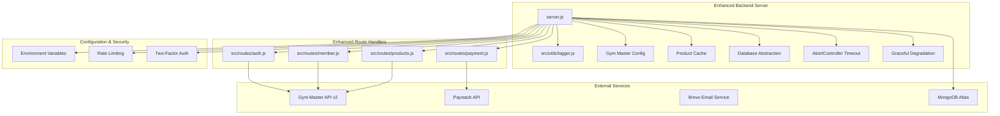
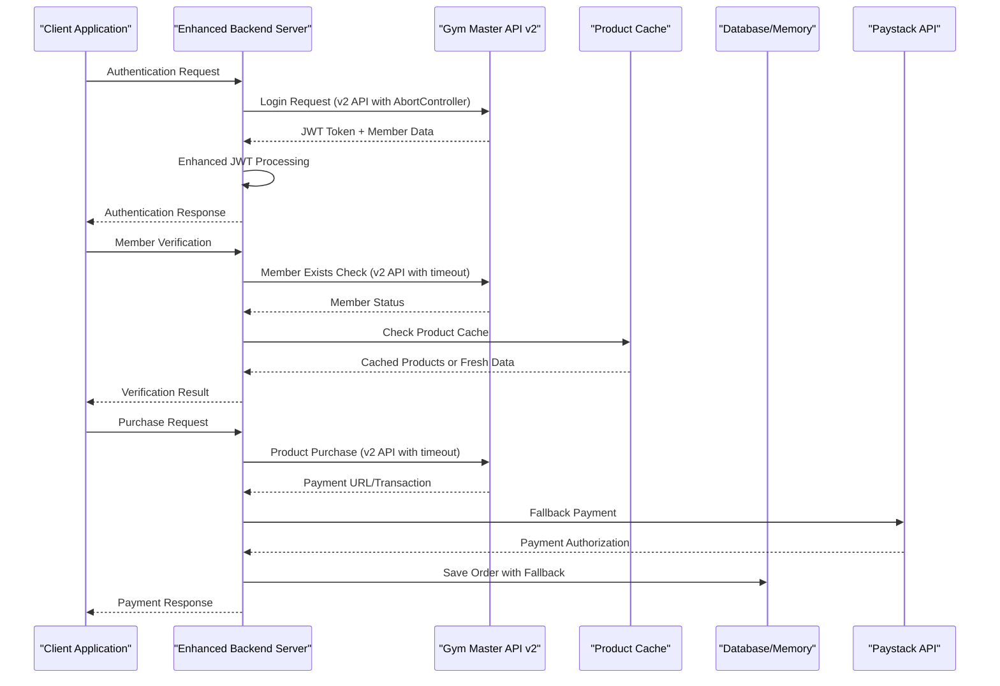
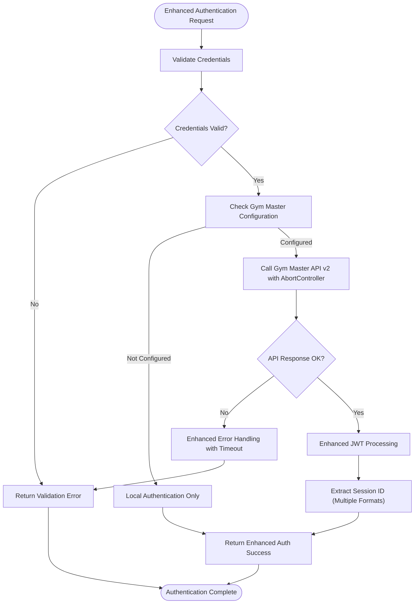
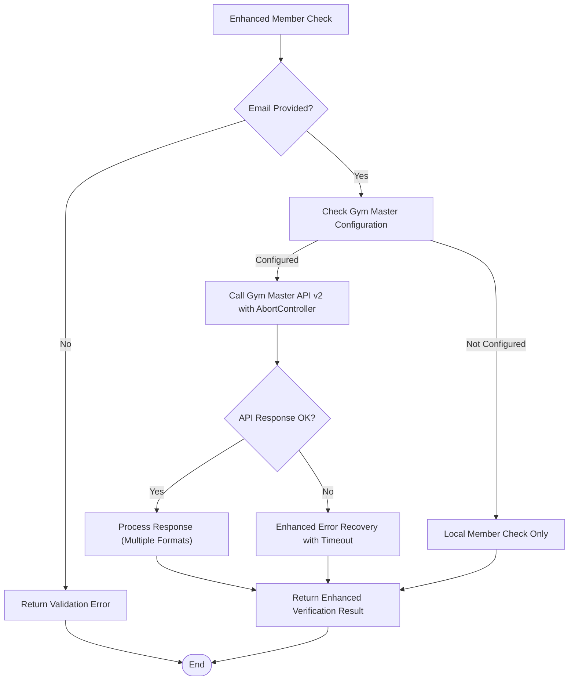
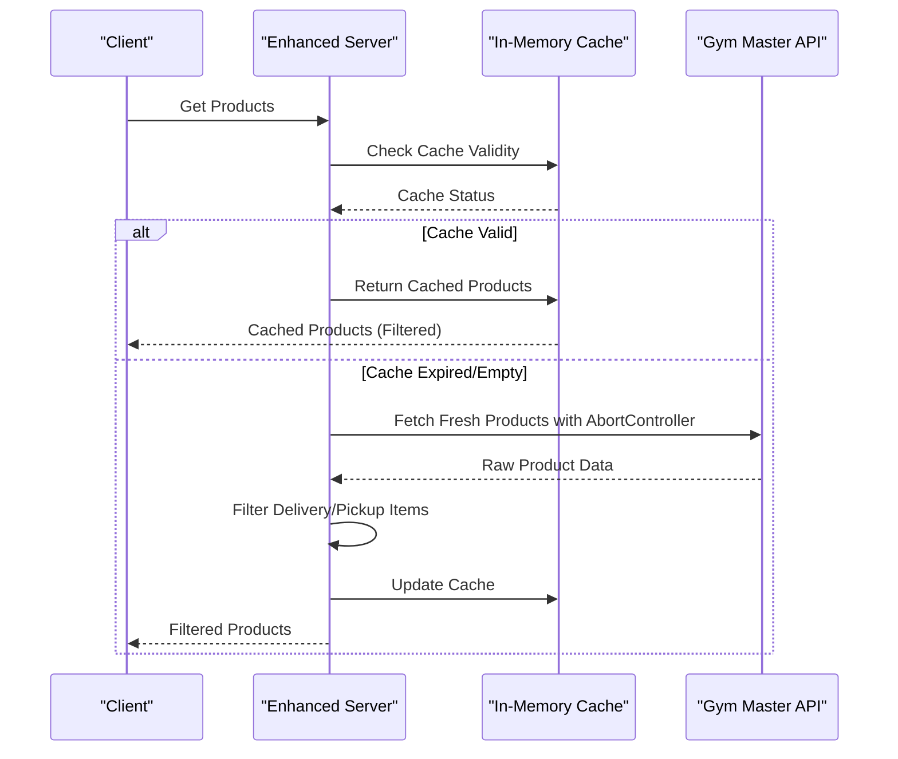
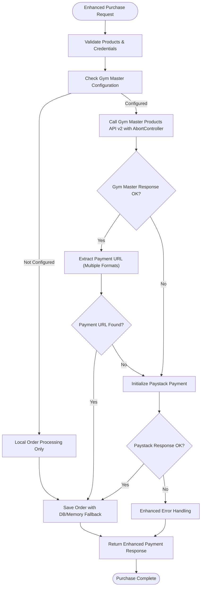
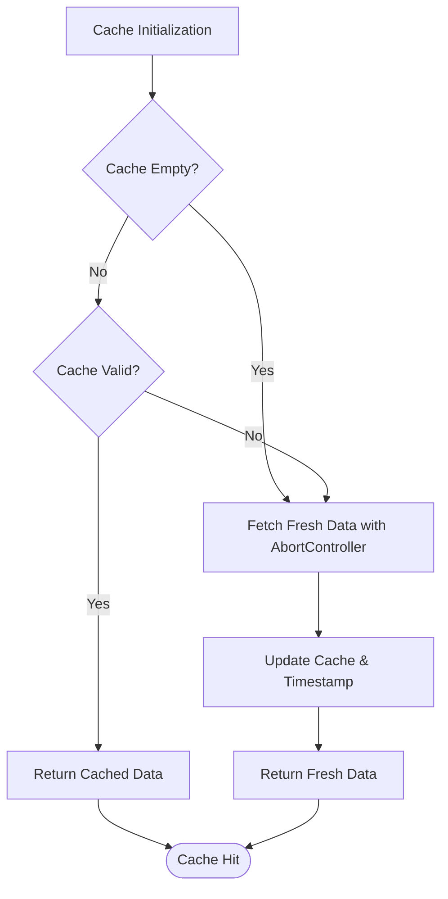
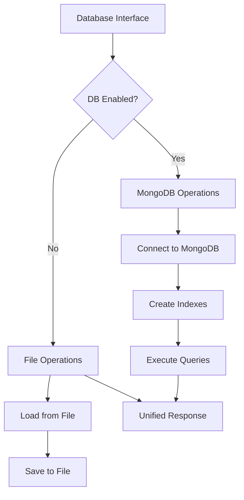

# Gym Master API Integration

<cite>
**Referenced Files in This Document**
- [server.js](file://server.js)
- [auth.js](file://src/routes/auth.js)
- [member.js](file://src/routes/member.js)
- [products.js](file://src/routes/products.js)
- [payment.js](file://src/routes/payment.js)
- [logger.js](file://src/utils/logger.js)
- [package.json](file://package.json)
</cite>

## Update Summary
**Changes Made**
- Enhanced error handling with graceful degradation when Gym Master is not configured
- Improved conditional processing logic with better fallback mechanisms for local order processing
- Implemented comprehensive fallback strategies for API unavailability scenarios
- Added AbortController-based timeout mechanisms for external API calls
- Strengthened error recovery strategies with enhanced timeout protection
- Implemented graceful degradation returning empty product arrays instead of 500 errors

## Table of Contents
1. [Introduction](#introduction)
2. [Project Structure](#project-structure)
3. [Core Components](#core-components)
4. [Architecture Overview](#architecture-overview)
5. [Detailed Component Analysis](#detailed-component-analysis)
6. [Enhanced Error Handling](#enhanced-error-handling)
7. [Caching Mechanisms](#caching-mechanisms)
8. [Product Filtering System](#product-filtering-system)
9. [Configuration Management](#configuration-management)
10. [Database Abstraction Layer](#database-abstraction-layer)
11. [Performance Considerations](#performance-considerations)
12. [Troubleshooting Guide](#troubleshooting-guide)
13. [Security Considerations](#security-considerations)
14. [Conclusion](#conclusion)

## Introduction
This document provides comprehensive documentation for the enhanced Gym Master API integration within the Active Zone Hub platform. The integration has been significantly improved with enhanced error handling, caching mechanisms, product filtering, and robust configuration management. The recent updates focus on implementing graceful degradation strategies when Gym Master API is not configured, improved conditional processing logic, and better fallback mechanisms for local order processing. The integration enables seamless member authentication, prospect creation, profile updates, and purchase processing through Gym Master's APIs with improved reliability and performance.

## Project Structure
The Gym Master API integration is implemented with enhanced modularity and improved error handling:

**Diagram sources**
- [server.js](file://server.js#L286-L291)
- [auth.js](file://src/routes/auth.js#L5-L9)
- [products.js](file://src/routes/products.js#L4-L8)

**Section sources**
- [server.js](file://server.js#L1-L50)
- [package.json](file://package.json#L1-L33)

## Core Components

### Enhanced Authentication Flow
The authentication system now provides multiple authentication methods with improved error handling and timeout mechanisms:

1. **Legacy Login Endpoint** (`/api/login`): Direct Gym Master authentication with JWT token extraction and AbortController timeout
2. **Modern Auth Routes** (`/api/login` in routes): Express-validator based authentication with v2 API support and enhanced error handling
3. **Enhanced JWT Processing**: Improved token parsing with multiple fallback formats and timeout protection

**Section sources**
- [server.js](file://server.js#L631-L728)
- [auth.js](file://src/routes/auth.js#L11-L51)

### Advanced Member Verification Processes
The system implements comprehensive member verification with enhanced error handling and timeout protection:

- **Member Existence Check**: Validates existing members via email with v2 API support and AbortController timeout
- **Prospect Creation**: Creates new customer profiles in Gym Master with fallback mechanisms and timeout handling
- **Profile Updates**: Updates member information including addresses with graceful degradation and timeout protection
- **Enhanced Error Recovery**: Automatic fallback to local processing when API fails with timeout protection

**Section sources**
- [server.js](file://server.js#L420-L448)
- [server.js](file://server.js#L450-L549)
- [server.js](file://server.js#L551-L629)
- [member.js](file://src/routes/member.js#L11-L41)
- [member.js](file://src/routes/member.js#L43-L96)
- [member.js](file://src/routes/member.js#L99-L139)

### Enhanced API Configuration
The integration uses centralized and validated configuration for Gym Master API settings with improved error handling:

- **Centralized Configuration**: Single source of truth for API credentials with validation
- **Default Values**: Safe fallback values when environment variables are missing
- **Validation**: Runtime validation of configuration parameters with graceful degradation
- **Multiple API Versions**: Support for both v1 and v2 Gym Master APIs with timeout protection
- **Timeout Configuration**: Configurable 10-second timeout for all external API calls

**Section sources**
- [server.js](file://server.js#L286-L291)
- [auth.js](file://src/routes/auth.js#L5-L9)
- [member.js](file://src/routes/member.js#L5-L9)
- [products.js](file://src/routes/products.js#L4-L8)

## Architecture Overview

**Diagram sources**
- [server.js](file://server.js#L631-L728)
- [server.js](file://server.js#L730-L825)
- [products.js](file://src/routes/products.js#L15-L43)

## Detailed Component Analysis

### Enhanced Authentication System

The authentication system implements robust token-based authentication with multiple validation layers, timeout protection, and improved error handling:

**Diagram sources**
- [server.js](file://server.js#L631-L728)
- [auth.js](file://src/routes/auth.js#L11-L51)

**Section sources**
- [server.js](file://server.js#L631-L728)
- [auth.js](file://src/routes/auth.js#L11-L51)

### Advanced Member Verification Workflow

The member verification system provides comprehensive member lifecycle management with enhanced error handling and timeout protection:

**Diagram sources**
- [server.js](file://server.js#L420-L448)
- [member.js](file://src/routes/member.js#L11-L41)

**Section sources**
- [server.js](file://server.js#L420-L448)
- [member.js](file://src/routes/member.js#L11-L41)

### Enhanced Product Caching and Filtering

The product system implements intelligent caching with automatic filtering, timeout protection, and graceful degradation:

**Diagram sources**
- [products.js](file://src/routes/products.js#L15-L66)

**Section sources**
- [products.js](file://src/routes/products.js#L15-L66)

### Enhanced Purchase Processing Integration

The purchase system integrates Gym Master's product API with comprehensive fallback mechanisms and timeout protection:

**Diagram sources**
- [server.js](file://server.js#L730-L825)

**Section sources**
- [server.js](file://server.js#L730-L825)

## Enhanced Error Handling

### Comprehensive Error Recovery Strategies with Timeout Protection
The integration implements multiple layers of error handling and recovery with enhanced timeout mechanisms:

- **AbortController Timeout Management**: Configurable 10-second timeout for all external API calls using AbortController
- **JSON Parsing Resilience**: Graceful fallback when Gym Master returns non-JSON responses
- **API Failure Contingencies**: Automatic fallback to local processing when external APIs fail
- **Network Timeout Management**: Enhanced timeout handling with proper error propagation
- **Validation Error Handling**: Comprehensive input validation with meaningful error messages
- **Database Fallback Mechanisms**: File-based storage when MongoDB is unavailable
- **Graceful Degradation**: Returns empty product arrays instead of 500 errors for better frontend stability
- **Conditional Processing Logic**: Improved logic for handling Gym Master configuration states

**Updated** Enhanced with graceful degradation strategies when Gym Master is not configured

**Section sources**
- [server.js](file://server.js#L496-L548)
- [server.js](file://server.js#L592-L628)
- [server.js](file://server.js#L769-L824)
- [products.js](file://src/routes/products.js#L24-L32)

### Enhanced Logging and Monitoring
- **Structured Logging**: Winston-based logging with timestamps and metadata
- **Request Tracing**: Comprehensive request/response logging with timing and timeout information
- **Error Classification**: Distinct logging levels for different error types including timeout errors
- **Performance Metrics**: Request duration tracking and monitoring with timeout detection

**Section sources**
- [logger.js](file://src/utils/logger.js#L10-L39)
- [server.js](file://server.js#L379-L401)

## Caching Mechanisms

### Intelligent Product Caching System with Timeout Protection
The integration implements an efficient caching mechanism for product data with enhanced error handling:

- **In-Memory Cache**: Local memory storage for frequently accessed product data
- **TTL Management**: 5-minute cache expiration with automatic refresh
- **Cache Validation**: Real-time cache freshness checking
- **Fallback Handling**: Automatic cache refresh when data becomes stale
- **Timeout Protection**: All cache operations respect the 10-second timeout limit

**Section sources**
- [products.js](file://src/routes/products.js#L10-L13)
- [products.js](file://src/routes/products.js#L45-L66)

### Cache Implementation Details

**Diagram sources**
- [products.js](file://src/routes/products.js#L45-L66)

## Product Filtering System

### Delivery/Pickup Item Exclusion with Enhanced Error Handling
The system automatically filters out delivery and pickup related products with improved error handling:

- **Predefined Filter List**: Products with IDs [730312, 730313] are excluded
- **Automatic Filtering**: Products are filtered during API response processing
- **Cache Integration**: Filtered products are cached for future requests
- **Flexible Configuration**: Easy modification of filter criteria
- **Graceful Degradation**: Returns empty arrays instead of failing when API is unavailable

**Section sources**
- [products.js](file://src/routes/products.js#L32-L34)
- [products.js](file://src/routes/products.js#L28-L37)

### Stock Checking Integration
The system provides real-time stock availability checking with enhanced error handling:

- **Cache-Aware Stock Checks**: Uses cached product data when available
- **Real-time Validation**: Verifies stock levels against Gym Master inventory
- **Comprehensive Reporting**: Detailed stock availability information
- **Error Handling**: Graceful handling of stock check failures with timeout protection

**Section sources**
- [products.js](file://src/routes/products.js#L68-L105)

## Configuration Management

### Centralized Configuration System with Enhanced Validation
The integration uses a centralized configuration approach with improved validation:

- **Single Configuration Object**: Unified Gym Master API settings with validation
- **Environment Variable Validation**: Runtime validation of required credentials with graceful degradation
- **Safe Defaults**: Default values when environment variables are missing
- **Multiple API Version Support**: Seamless switching between API versions
- **Timeout Configuration**: Configurable timeout settings for all external API calls

**Section sources**
- [server.js](file://server.js#L286-L291)
- [auth.js](file://src/routes/auth.js#L5-L9)
- [member.js](file://src/routes/member.js#L5-L9)

### Enhanced Credential Management
- **API Key Validation**: Runtime validation of Gym Master API credentials with fallback mechanisms
- **Company ID Management**: Centralized company identifier handling
- **Base URL Flexibility**: Configurable API endpoint configuration
- **Development/Production Separation**: Environment-specific configuration
- **Timeout Protection**: All credential operations respect timeout limits

**Section sources**
- [server.js](file://server.js#L286-L291)
- [server.js](file://server.js#L295-L297)

## Database Abstraction Layer

### Flexible Storage Architecture with Enhanced Error Handling
The system implements a database abstraction layer with multiple storage options and improved error handling:

- **MongoDB Integration**: Primary storage with connection pooling and indexing
- **File-Based Fallback**: Automatic fallback to JSON file storage with error recovery
- **Unified Interface**: Consistent API for both storage backends
- **Automatic Migration**: Seamless switching between storage methods
- **Graceful Degradation**: Returns empty arrays instead of throwing errors when database is unavailable

**Section sources**
- [server.js](file://server.js#L105-L134)
- [server.js](file://server.js#L136-L284)

### Database Operations Abstraction

**Diagram sources**
- [server.js](file://server.js#L229-L284)

## Performance Considerations

### Enhanced Response Handling with Timeout Protection
The integration implements robust performance optimizations with timeout mechanisms:

- **Intelligent Caching**: 5-minute TTL for product data with automatic refresh and timeout protection
- **Connection Pooling**: Efficient MongoDB connection management
- **Request Throttling**: Rate limiting for authentication and admin operations
- **Memory Management**: Optimized memory usage for caching and processing
- **Timeout Management**: All external API calls respect 10-second timeout limits

### Scalability Improvements
- **Asynchronous Processing**: Non-blocking API calls and database operations with timeout protection
- **Error Isolation**: Individual component failure isolation with graceful degradation
- **Graceful Degradation**: Partial functionality during API outages with timeout handling
- **Resource Optimization**: Efficient resource utilization across all components with timeout protection

### Monitoring and Metrics
- **Request Timing**: Comprehensive performance metrics collection with timeout detection
- **Error Tracking**: Detailed error classification and reporting including timeout errors
- **Storage Performance**: Database and file I/O optimization
- **API Response Times**: External service performance monitoring with timeout limits

## Troubleshooting Guide

### Enhanced Authentication Issues with Timeout Protection

**Authentication Failure**
- Verify Gym Master API credentials in environment variables with validation
- Check JWT token format and expiration using enhanced parsing with timeout handling
- Validate company ID configuration with centralized validation and timeout protection
- Review enhanced authentication logs for detailed error messages including timeout errors
- Test both legacy and modern authentication endpoints with timeout mechanisms
- Monitor AbortController timeout errors and network connectivity issues

**Session Management Problems**
- Monitor enhanced JWT token parsing for malformed tokens with timeout protection
- Verify session ID extraction from token payload with multiple fallbacks
- Check token expiration and renewal processes with timeout handling
- Validate enhanced token processing logic with timeout protection

### Advanced Member Verification Troubleshooting with Timeout Protection

**Member Existence Check Failures**
- Validate email format before API calls with enhanced validation and timeout handling
- Check Gym Master API v2 availability and response formats with timeout protection
- Review response parsing for non-standard JSON formats with timeout handling
- Verify API key permissions and version compatibility with timeout protection

**Prospect Creation Issues**
- Validate required fields with enhanced input validation and timeout handling
- Check address field formatting with comprehensive validation and timeout protection
- Monitor Gym Master v2 response for validation errors with timeout protection
- Handle non-JSON responses with graceful fallback mechanisms and timeout handling

### Enhanced Payment Processing Problems with Timeout Protection

**Gym Master Purchase Failures**
- Verify product IDs and quantities with stock checking and timeout handling
- Check token validity for authenticated purchases with timeout protection
- Validate delivery method selection with enhanced validation and timeout protection
- Monitor transaction reference generation and processing with timeout protection

**Paystack Fallback Issues**
- Verify Paystack API keys configuration with enhanced validation and timeout handling
- Check amount formatting (kobo conversion) with proper error handling and timeout protection
- Validate callback URL configuration and security with timeout protection
- Monitor transaction initialization errors with detailed logging and timeout handling

### Graceful Degradation Troubleshooting

**Gym Master Not Configured**
- Verify environment variables: GYM_MASTER_API_KEY, GYM_MASTER_BASE_URL, GYM_MASTER_COMPANY_ID
- Check configuration validation logic in server.js
- Monitor graceful degradation behavior when API is unavailable
- Ensure local-only order processing continues to function

**Conditional Processing Errors**
- Validate Gym Master configuration checks in order processing logic
- Check token requirement logic for authenticated vs local-only orders
- Monitor fallback mechanisms for API failures
- Verify proper error handling in all conditional branches

### Database and Storage Issues with Enhanced Error Handling

**Order Storage Failures**
- Check MongoDB connection configuration with enhanced diagnostics and timeout handling
- Verify database schema availability and indexing with timeout protection
- Monitor file-based storage as fallback with error recovery and timeout protection
- Validate order data serialization and deserialization with timeout protection

**Cache Issues**
- Monitor cache hit rates and performance metrics with timeout protection
- Check cache invalidation and refresh mechanisms with timeout handling
- Validate cache data integrity and consistency with timeout protection
- Debug cache-related performance bottlenecks with timeout detection

**Section sources**
- [server.js](file://server.js#L105-L148)
- [products.js](file://src/routes/products.js#L15-L43)

## Security Considerations

### Enhanced API Key Protection
- Environment variable storage for sensitive credentials with validation and timeout protection
- Runtime validation of API keys with fallback mechanisms and timeout handling
- Secure logging practices with sensitive data obfuscation and timeout protection
- Configuration management for development vs production environments with timeout protection

### Advanced Token Validation
- Enhanced JWT token parsing with multiple format support and timeout protection
- Session ID extraction for enhanced security with validation and timeout handling
- Token expiration monitoring with automatic renewal and timeout protection
- Secure token transmission protocols with encryption and timeout protection

### Strengthened Communication Security
- HTTPS enforcement in production environments with timeout protection
- SSL/TLS certificate configuration with enhanced validation and timeout handling
- Secure API endpoint design with input sanitization and timeout protection
- Enhanced input validation and XSS prevention with timeout protection

### Advanced Access Control
- Rate limiting for authentication attempts with enhanced thresholds and timeout handling
- Two-factor authentication via TOTP with dual-secret management and timeout protection
- Admin access protection with enhanced security measures and timeout handling
- Session management and cleanup with automated expiration and timeout protection

### Enhanced Error Handling Security
- Generic error messages for API failures with detailed logging and timeout detection
- Detailed logging for debugging without exposing sensitive data and timeout information
- Input validation to prevent injection attacks with enhanced sanitization and timeout protection
- Secure response formatting with comprehensive error handling and timeout protection

**Section sources**
- [server.js](file://server.js#L286-L291)
- [server.js](file://server.js#L352-L377)
- [server.js](file://server.js#L1086-L1184)

## Conclusion

The enhanced Gym Master API integration provides a robust, secure, and highly optimized solution for member management and purchase processing. The recent updates focus on implementing comprehensive graceful degradation strategies when Gym Master API is not configured, improved conditional processing logic, and better fallback mechanisms for local order processing. The implementation includes multiple layers of error handling, intelligent caching mechanisms, product filtering, and enhanced configuration management to ensure reliable operation in production environments.

Key improvements include:
- **Enhanced Error Handling**: Multiple fallback mechanisms and graceful degradation with timeout protection
- **AbortController Timeout Mechanisms**: Configurable 10-second timeout limits for all external API calls
- **Intelligent Caching**: 5-minute TTL product caching with automatic refresh and timeout handling
- **Advanced Product Filtering**: Delivery/pickup item exclusion with flexible configuration and timeout protection
- **Centralized Configuration**: Unified API settings with validation, defaults, and timeout protection
- **Database Abstraction**: MongoDB/Memory storage with seamless fallback and timeout handling
- **Improved Security**: Enhanced authentication, logging, and access control with timeout protection
- **Performance Optimization**: Connection pooling, caching, and resource management with timeout protection
- **Frontend Stability**: Graceful degradation returning empty product arrays instead of 500 errors
- **Conditional Processing**: Improved logic for handling Gym Master configuration states and fallback scenarios

The system maintains backward compatibility while providing significant improvements in reliability, performance, and maintainability. The modular architecture allows for easy extension and maintenance while ensuring high availability and security standards essential for e-commerce applications. The enhanced timeout mechanisms and graceful degradation strategies ensure better user experience during API outages and network connectivity issues.