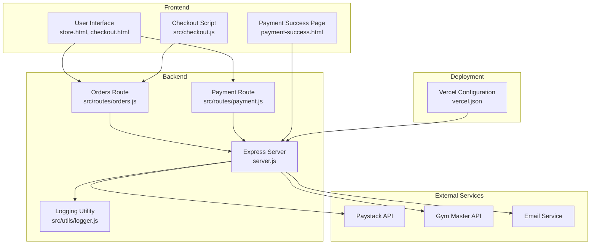
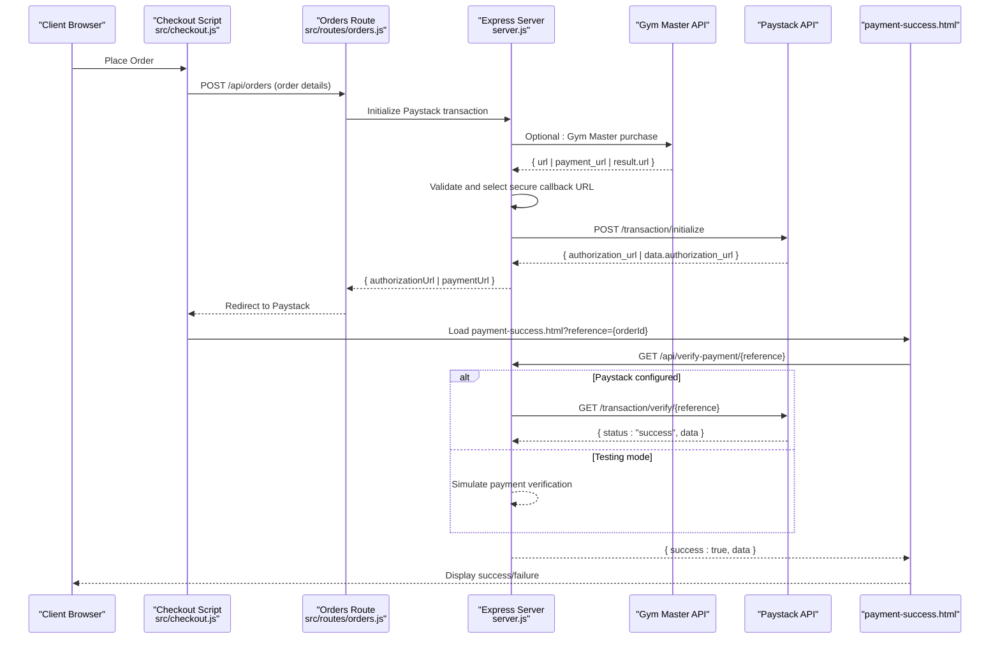
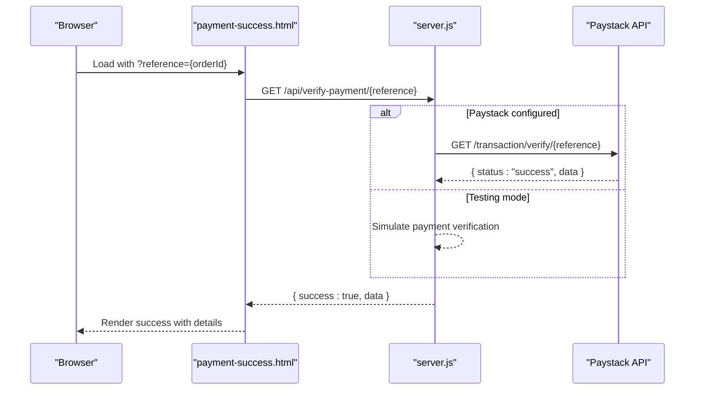
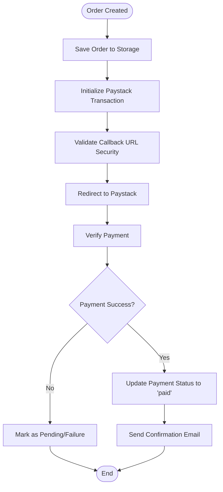
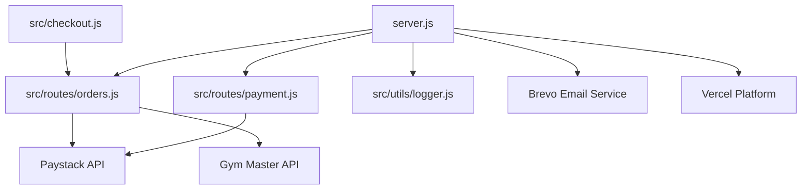
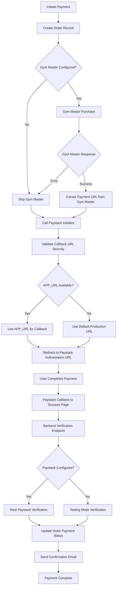

# Paystack Payment Processing

<cite>
**Referenced Files in This Document**
- [server.js](file://server.js)
- [payment.js](file://src/routes/payment.js)
- [orders.js](file://src/routes/orders.js)
- [payment-success.html](file://payment-success.html)
- [logger.js](file://src/utils/logger.js)
- [package.json](file://package.json)
- [checkout.js](file://src/checkout.js)
- [vercel.json](file://vercel.json)
</cite>

## Update Summary
**Changes Made**
- Enhanced Paystack callback URL security by prioritizing production URLs over Vercel preview URLs
- Improved URL selection logic with explicit security warnings against using preview URLs
- Enhanced logging for callback URL determination and selection process
- Updated security measures documentation to reflect the new URL priority strategy

## Table of Contents
1. [Introduction](#introduction)
2. [Project Structure](#project-structure)
3. [Core Components](#core-components)
4. [Architecture Overview](#architecture-overview)
5. [Detailed Component Analysis](#detailed-component-analysis)
6. [Dependency Analysis](#dependency-analysis)
7. [Performance Considerations](#performance-considerations)
8. [Security Measures](#security-measures)
9. [Payment Flow](#payment-flow)
10. [Configuration Requirements](#configuration-requirements)
11. [Troubleshooting Guide](#troubleshooting-guide)
12. [Testing Capabilities](#testing-capabilities)
13. [Monitoring and Logging](#monitoring-and-logging)
14. [Conclusion](#conclusion)

## Introduction
This document provides comprehensive documentation for the Paystack payment processing integration within the Active Zone Hub application. It covers the payment initiation process, transaction creation, amount calculation, customer information handling, webhook implementation, verification processes, status update mechanisms, security measures, configuration requirements, troubleshooting, testing capabilities, and monitoring/logging approaches. The integration supports both a streamlined route for immediate Paystack redirection and a two-stage flow involving Gym Master followed by Paystack.

**Updated** Enhanced callback URL security now prioritizes production URLs (APP_URL) over Vercel preview URLs, addressing security vulnerabilities and deployment consistency issues. Improved logging helps developers understand URL selection for payment callbacks.

## Project Structure
The payment processing logic spans several key files:
- Backend server orchestrating Paystack integration and order management
- Express routes for payment initiation and verification
- Frontend success page for client-side verification and user feedback
- Logging utilities for operational visibility
- Checkout script for client-side payment URL extraction
- Vercel configuration for deployment optimization



**Diagram sources**
- [server.js:1-200](file://server.js#L1-L200)
- [payment.js:1-154](file://src/routes/payment.js#L1-L154)
- [orders.js:248-339](file://src/routes/orders.js#L248-L339)
- [payment-success.html:1-219](file://payment-success.html#L1-L219)
- [logger.js:1-51](file://src/utils/logger.js#L1-L51)
- [checkout.js:410-448](file://src/checkout.js#L410-L448)
- [vercel.json:1-27](file://vercel.json#L1-L27)

**Section sources**
- [server.js:1-200](file://server.js#L1-L200)
- [payment.js:1-154](file://src/routes/payment.js#L1-L154)
- [orders.js:248-339](file://src/routes/orders.js#L248-L339)
- [payment-success.html:1-219](file://payment-success.html#L1-L219)
- [logger.js:1-51](file://src/utils/logger.js#L1-L51)
- [checkout.js:410-448](file://src/checkout.js#L410-L448)
- [vercel.json:1-27](file://vercel.json#L1-L27)

## Core Components
- Paystack initialization and verification endpoints with enhanced response handling
- Order persistence (file-based fallback and MySQL)
- Client-side verification via payment-success.html
- Request logging and rate limiting
- Environment-driven configuration for Paystack and application base URL
- Gym Master integration with fallback mechanisms
- **Updated** Secure callback URL configuration prioritizing production URLs
- **Updated** Enhanced logging for URL selection and security validation
- **Updated** Improved error handling for Paystack API responses

Key responsibilities:
- Initialize Paystack transactions with proper metadata and secure callback URL using production URL priority
- Verify payment outcomes and update order statuses with comprehensive error handling
- Persist orders and maintain audit trails with multiple storage options
- Provide user feedback and redirect behavior post-payment with secure URL extraction
- Handle various response formats from external APIs with fallback mechanisms
- **Updated** Secure URL selection that prioritizes production over preview URLs
- **Updated** Comprehensive logging for debugging and monitoring payment flows with security context

**Section sources**
- [server.js:827-929](file://server.js#L827-L929)
- [server.js:1873-1978](file://server.js#L1873-L1978)
- [payment.js:31-110](file://src/routes/payment.js#L31-L110)
- [orders.js:248-339](file://src/routes/orders.js#L248-L339)
- [payment-success.html:170-216](file://payment-success.html#L170-L216)
- [checkout.js:410-448](file://src/checkout.js#L410-L448)

## Architecture Overview
The payment architecture integrates three primary flows with enhanced error handling, security measures, and URL validation:
1. Direct Paystack flow via a dedicated payment route
2. Two-stage flow: Gym Master purchase followed by Paystack initialization
3. Verification via backend endpoint and client-side success page with comprehensive response validation
4. **Updated** Secure callback URL configuration that prioritizes production URLs over preview URLs
5. **Updated** Enhanced logging for URL selection and security validation



**Diagram sources**
- [checkout.js:410-448](file://src/checkout.js#L410-L448)
- [orders.js:248-339](file://src/routes/orders.js#L248-L339)
- [server.js:1873-1978](file://server.js#L1873-L1978)
- [server.js:827-929](file://server.js#L827-L929)
- [payment-success.html:170-216](file://payment-success.html#L170-L216)

## Detailed Component Analysis

### Enhanced Paystack Response Handling
The system now handles multiple response formats from Paystack and Gym Master APIs with comprehensive fallback mechanisms. The payment URL extraction logic supports various response structures and includes intelligent URL selection:

**Updated** Enhanced response handling with support for multiple response formats and secure URL selection:
- Primary format: `data.authorization_url`
- Alternative formats: `authorizationUrl`, `paymentUrl`, `payment_url`, `redirect`
- Nested response support: `data.result.paymentUrl`, `data.result.url`
- Gym Master integration: `gymMasterResult.url`, `gymMasterResult.payment_url`
- **New** Secure callback URL configuration with production URL priority
- **Enhanced** Fallback mechanism: APP_URL → Default production URL → Fallback URL

Implementation highlights:
- Uses environment variable for Paystack secret key
- Converts amount to kobo (multiplies by 100)
- **Updated** Secure callback URL determination with production URL priority
- Returns authorization URL for client redirection with comprehensive fallback
- Handles various response structures gracefully
- **Updated** Explicit security warnings against using Vercel preview URLs

**Section sources**
- [server.js:1907-1919](file://server.js#L1907-L1919)
- [server.js:1951-1957](file://server.js#L1951-L1957)
- [payment.js:65-105](file://src/routes/payment.js#L65-L105)

### Secure Callback URL Configuration
**New** The system now implements enhanced security for Paystack callback URL configuration:

The callback URL selection logic prioritizes production URLs over preview URLs to prevent security vulnerabilities:

```javascript
// Determine the base URL for callback - prioritize Vercel URL, then APP_URL, then default
// IMPORTANT: Always use production URL for callback, NOT VERCEL_URL (preview URLs require auth)
let appBaseUrl;
if (process.env.APP_URL) {
    appBaseUrl = process.env.APP_URL.replace(/\/$/, '').replace('/api', '');
    console.log('Using APP_URL:', appBaseUrl);
} else {
    // Default to production URL - NEVER use VERCEL_URL as it's a preview URL requiring auth
    appBaseUrl = 'https://activezone.vercel.app';
    console.log('Using default production URL:', appBaseUrl);
}
```

Security considerations:
- **Never use Vercel preview URLs** (`VERCEL_URL`) for production callbacks as they require authentication
- **Always use production URLs** for Paystack callback URLs to ensure accessibility
- **Explicit logging** of URL selection decisions for debugging and security auditing
- **Fallback mechanism** ensures URL availability even when APP_URL is not configured

**Section sources**
- [server.js:2027-2038](file://server.js#L2027-L2038)

### Comprehensive Payment Verification Endpoint
The verification endpoint performs a server-side check of the transaction status with enhanced error handling and detailed logging. On success, it updates the order payment status and logs relevant details. It also prepares order data for email notifications and manual Gym Master reconciliation steps.

**Updated** Enhanced verification endpoint with comprehensive response validation and testing capabilities:
- **New** Paystack secret key validation with testing mode fallback
- **Enhanced** Fetch transaction details from Paystack with detailed error logging
- **Improved** Error handling for different response formats and API failures
- **New** Simulated payment verification when Paystack key is unavailable
- Updates order payment status and timestamps with comprehensive data
- Logs manual actions required for Gym Master integration
- Handles various response structures and provides detailed error messages

Key behaviors:
- **New** Testing mode: Simulates successful payment when Paystack key is missing
- Enhanced error handling for different response formats
- Comprehensive logging of payment verification attempts
- Detailed error messages for debugging payment issues
- Graceful fallback for partial payment data
- Integration with Gym Master manual reconciliation logging

**Section sources**
- [server.js:827-929](file://server.js#L827-L929)
- [server.js:855-900](file://server.js#L855-L900)

### Client-Side Verification Flow
The payment-success.html page handles client-side verification after redirection from Paystack. It extracts the reference from the URL and calls the backend verification endpoint. Based on the response, it displays success or failure states with payment details.



**Diagram sources**
- [payment-success.html:170-216](file://payment-success.html#L170-L216)
- [server.js:827-929](file://server.js#L827-L929)

**Section sources**
- [payment-success.html:170-216](file://payment-success.html#L170-L216)

### Enhanced Order Persistence and Status Management
The system maintains orders in either MySQL (preferred) or file-based storage with improved error handling. It provides helpers to load, save, update payment status, and retrieve orders by ID or reference. This ensures continuity of payment and delivery status tracking with comprehensive fallback mechanisms.

**Updated** Enhanced order persistence with improved error handling:
- Multiple storage options: MySQL (preferred) and file-based fallback
- Comprehensive error handling for database connectivity issues
- Improved order data validation and sanitization
- Enhanced logging for order processing failures
- Graceful degradation when database is unavailable



**Diagram sources**
- [server.js:150-166](file://server.js#L150-L166)
- [server.js:168-211](file://server.js#L168-L211)
- [server.js:241-268](file://server.js#L241-L268)

**Section sources**
- [server.js:150-166](file://server.js#L150-L166)
- [server.js:168-211](file://server.js#L168-L211)
- [server.js:241-268](file://server.js#L241-L268)

### Testing Capabilities with Simulated Payment Verification
**New** The system now includes comprehensive testing capabilities that allow payment verification without Paystack credentials:

- **Automatic Testing Mode**: When `PAYSTACK_SECRET_KEY` is not configured, the system automatically enters testing mode
- **Simulated Payment**: Payment verification returns success without contacting Paystack API
- **Order Status Update**: In testing mode, orders are marked as paid and saved to database
- **Test Response Format**: Returns standardized response format compatible with production code
- **Development Workflow**: Enables end-to-end testing during development without Paystack credentials

Testing features:
- Automatic detection of missing Paystack credentials
- Simulated payment success with test mode flag
- Order persistence in test mode for development
- Consistent API response format for frontend compatibility
- Detailed logging for testing mode operations

**Section sources**
- [server.js:832-860](file://server.js#L832-L860)

## Dependency Analysis
The payment integration relies on several external services and internal modules:
- Paystack API for transaction initialization and verification
- Gym Master API for product purchases (two-stage flow)
- Email service (via Brevo) for order confirmations
- Winston for structured logging
- Rate limiting for API protection
- **Updated** Vercel platform for deployment and URL validation



**Diagram sources**
- [server.js:1-200](file://server.js#L1-L200)
- [payment.js:1-154](file://src/routes/payment.js#L1-L154)
- [orders.js:248-339](file://src/routes/orders.js#L248-L339)
- [logger.js:1-51](file://src/utils/logger.js#L1-L51)
- [checkout.js:410-448](file://src/checkout.js#L410-L448)
- [package.json:15-26](file://package.json#L15-L26)
- [vercel.json:1-27](file://vercel.json#L1-L27)

**Section sources**
- [package.json:15-26](file://package.json#L15-L26)
- [server.js:1-200](file://server.js#L1-L200)
- [vercel.json:1-27](file://vercel.json#L1-L27)

## Performance Considerations
- Asynchronous processing: All external API calls use async/await to prevent blocking the event loop.
- Minimal data parsing: Responses are parsed only when necessary to reduce overhead.
- Rate limiting: Built-in rate limiting protects endpoints from abuse.
- Logging overhead: Structured logging minimizes performance impact while providing insights.
- **Updated** Enhanced error handling reduces unnecessary retries and improves response times.
- **Updated** Testing mode eliminates external API calls during development, improving performance.
- **Updated** Secure URL validation adds minimal overhead while preventing security issues.

## Security Measures
Current security measures in place:
- Secret key management: Paystack secret key is loaded from environment variables and validated at runtime.
- Request validation: JSON body validation prevents malformed requests.
- Rate limiting: Protects sensitive endpoints from brute-force attempts.
- Secure environment configuration: Deployment guides emphasize secure .env file permissions.
- **Updated** Enhanced response validation prevents injection attacks through malformed API responses.
- **Updated** Testing mode provides controlled environment for development without exposing real payment processing.
- **Updated** Secure callback URL configuration prevents preview URL usage in production.

**Updated** Enhanced security measures:
- **Secure URL Priority**: Production URLs (APP_URL) are prioritized over Vercel preview URLs
- **Explicit Warnings**: Code includes comments warning against using preview URLs for callbacks
- **Comprehensive Logging**: URL selection decisions are logged for security auditing
- **Fallback Security**: Default production URL ensures security even when APP_URL is not configured
- **Preview URL Protection**: Prevention of preview URL usage in production environments

Missing or recommended enhancements:
- Signature verification: Implement Paystack webhook signature verification to ensure authenticity of incoming callbacks.
- IP whitelist configuration: Configure Paystack webhook IP whitelisting to restrict incoming requests.
- Data validation: Strengthen input validation for customer and order data.
- HTTPS enforcement: Ensure all production traffic uses HTTPS.
- Tokenization: Consider tokenizing sensitive customer data where possible.

**Section sources**
- [server.js:344-348](file://server.js#L344-L348)
- [server.js:403-452](file://server.js#L403-L452)
- [server.js:2027-2038](file://server.js#L2027-L2038)

## Payment Flow
The payment flow encompasses initiation, redirection, verification, and status updates with enhanced error handling, security measures, and URL validation:

**Updated** Enhanced payment flow with comprehensive error handling, security measures, and URL validation:
- Initiation with multiple response format support and secure URL selection
- Redirection to Paystack with improved URL extraction
- Verification with detailed error logging and testing mode support
- Status updates with comprehensive data validation
- Error recovery with fallback mechanisms
- **New** Secure callback URL configuration with production URL priority
- **New** Enhanced logging for URL selection and security validation
- **New** Testing mode for development and QA environments



**Diagram sources**
- [payment.js:31-110](file://src/routes/payment.js#L31-L110)
- [server.js:1873-1978](file://server.js#L1873-L1978)
- [payment-success.html:170-216](file://payment-success.html#L170-L216)

**Section sources**
- [payment.js:31-110](file://src/routes/payment.js#L31-L110)
- [server.js:1873-1978](file://server.js#L1873-L1978)
- [payment-success.html:170-216](file://payment-success.html#L170-L216)

## Configuration Requirements
Essential environment variables and configurations:
- APP_URL: Base URL for callback URLs and links (production URL)
- PAYSTACK_SECRET_KEY: Paystack secret key (required for production)
- PAYSTACK_PUBLIC_KEY: Paystack public key (recommended)
- GYM_MASTER_API_KEY: Gym Master API key (optional for two-stage flow)
- GYM_MASTER_BASE_URL: Gym Master base URL (optional)
- GYM_MASTER_COMPANY_ID: Gym Master company ID (optional)
- Database configuration (optional): DB_HOST, DB_USER, DB_PASSWORD, DB_NAME for MySQL
- Email configuration: BREVO_API_KEY, SMTP_FROM_EMAIL, SMTP_FROM_NAME
- Application port: PORT (default 3001)
- **Updated** VERCEL_URL: Vercel preview URL (automatically detected, but not used for production callbacks)

**Updated** Enhanced configuration with Gym Master integration and secure URL handling:
- Gym Master API configuration for two-stage payment flow
- Enhanced error handling for missing configuration values
- Graceful fallback when Gym Master is not configured
- **New** Secure callback URL configuration with production URL priority
- **New** Explicit guidance against using Vercel preview URLs for production

Deployment-specific notes:
- cPanel deployment requires live keys and proper domain configuration
- Local testing uses test keys and localhost URL
- **New** Vercel deployment automatically detects VERCEL_URL but uses production URL for callbacks
- Environment file permissions should be restricted (600) on production servers
- **New** Production deployments should use APP_URL for secure callback URLs

**Section sources**
- [server.js:286-291](file://server.js#L286-L291)
- [server.js:293-297](file://server.js#L293-L297)
- [server.js:1907-1919](file://server.js#L1907-L1919)

## Troubleshooting Guide
Common issues and resolutions:
- Failed to initialize payment: Verify PAYSTACK_SECRET_KEY is set and correct. Check network connectivity to Paystack API. **Updated** Enhanced error messages now provide specific details about response format issues, URL validation problems, and Vercel URL security concerns.
- Payment verification failed: Confirm the reference parameter is present and correct. Ensure backend can reach Paystack API. **Updated** Improved logging provides detailed error information for debugging, including testing mode scenarios and URL selection issues.
- Webhook delivery failures: Implement webhook signature verification and configure IP whitelisting. Monitor Paystack dashboard for delivery logs.
- Verification errors: Check server logs for detailed error messages. Validate APP_URL configuration for correct callback URLs.
- Database connectivity issues: Verify MySQL credentials and table existence. Ensure orders table schema is imported.
- Email sending failures: Confirm BREVO_API_KEY is configured and email service is reachable.
- **Updated** Gym Master integration issues: Check Gym Master API credentials and network connectivity. Verify that stock deduction is working properly.
- **Updated** Testing mode issues: When Paystack key is missing, system automatically enters testing mode. Verify order persistence works correctly in test mode.
- **Updated** Callback URL security issues: Verify APP_URL is properly configured. Check server logs for URL selection warnings and security messages.
- **Updated** Vercel deployment issues: Ensure production URL is used instead of preview URL for callbacks. Check server logs for URL validation messages.

**Updated** Enhanced diagnostic capabilities:
- Comprehensive error logging with response format details
- Detailed Paystack response analysis
- Gym Master integration troubleshooting
- Payment URL extraction validation
- **New** URL security validation and logging
- **New** Testing mode diagnostics and troubleshooting
- **New** Vercel URL detection and security validation

Diagnostic steps:
- Review Winston logs for error traces with enhanced detail
- Validate environment variables in .env file
- Test API endpoints using curl or Postman
- Check Paystack dashboard for transaction status and errors
- **Updated** Verify response format compatibility with external APIs
- **Updated** Check URL security logs for callback URL validation
- **New** Test URL selection logic with different APP_URL configurations
- **New** Verify production URL vs preview URL behavior

**Section sources**
- [server.js:344-348](file://server.js#L344-L348)
- [server.js:827-929](file://server.js#L827-L929)
- [logger.js:1-51](file://src/utils/logger.js#L1-L51)

## Testing Capabilities
**New** The system provides comprehensive testing capabilities for payment processing:

### Development Testing
- **Automatic Testing Mode**: When Paystack credentials are unavailable, the system automatically simulates payment verification
- **Local Development**: Enable testing mode during development without Paystack setup
- **End-to-End Testing**: Test complete payment flow including order creation, payment processing, and verification
- **Database Integration**: Test order persistence and status updates even without real payment processing

### Testing Features
- **Simulated Payments**: Returns successful payment verification without contacting Paystack API
- **Order Persistence**: Saves orders to database in test mode for development validation
- **Consistent API**: Maintains identical response format as production for frontend compatibility
- **Development Workflow**: Supports continuous development without external payment dependencies

### Testing Scenarios
- **Basic Payment Flow**: Test order creation and payment redirection
- **Verification Process**: Test payment verification endpoint in both modes
- **Error Handling**: Test error scenarios and fallback mechanisms
- **Database Operations**: Test order persistence and status updates
- **Frontend Integration**: Test client-side payment-success.html integration
- **URL Security Testing**: Test URL selection logic with different APP_URL configurations

**Section sources**
- [server.js:832-860](file://server.js#L832-L860)

## Monitoring and Logging
The application employs Winston for structured logging with the following characteristics:
- Log levels: info, error, with configurable LOG_LEVEL environment variable
- File rotation: Automatic rotation of log files with size limits
- Console output: Colorized output in non-production environments
- Request logging: Middleware captures HTTP request details and response status
- **Updated** Enhanced payment-specific logging with detailed response analysis
- **Updated** Testing mode logging for development and QA environments
- **Updated** URL security logging for callback URL validation and selection

**Updated** Enhanced logging capabilities:
- Comprehensive Paystack response logging with format validation
- Detailed Gym Master integration logging
- Payment verification attempt tracking
- Error response analysis and categorization
- Database operations and connectivity with fallback mechanisms
- **Updated** URL selection logging with security context
- **Updated** Production URL vs preview URL validation logging
- **New** Testing mode operation logging and validation

Logging coverage includes:
- Payment initialization attempts and results with response format details
- Verification requests and outcomes with comprehensive error logging
- Order updates and status changes with validation
- Error conditions and exceptions with detailed stack traces
- Database operations and connectivity with fallback mechanisms
- **Updated** URL selection decisions with security validation
- **Updated** Production URL security warnings and validations
- **New** Testing mode operation tracking and validation
- **New** Vercel URL detection and security validation

Recommendations:
- Integrate log aggregation (e.g., ELK stack) for centralized monitoring
- Set up alerting for payment-related errors and verification failures
- Monitor Paystack webhook delivery metrics
- Implement correlation IDs for end-to-end payment tracing
- **Updated** Monitor testing mode usage for development validation
- **Updated** Track URL security violations and validation failures
- **New** Monitor production URL usage vs preview URL usage patterns

**Section sources**
- [logger.js:1-51](file://src/utils/logger.js#L1-L51)
- [server.js:430-452](file://server.js#L430-L452)

## Conclusion
The Paystack payment processing integration provides a robust foundation for handling online payments within the Active Zone Hub application. It supports flexible payment flows, maintains comprehensive audit trails through logging and order persistence, and offers clear pathways for future enhancements such as webhook signature verification and IP whitelisting. The enhanced response handling now supports multiple API response formats, improved error handling, and better integration with Gym Master processing. The addition of secure callback URL configuration streamlines deployment across different environments while preventing security vulnerabilities. The testing capabilities enable comprehensive development and QA workflows without external payment dependencies. Proper configuration of environment variables, adherence to deployment guidelines, and implementation of recommended security measures will ensure reliable and secure payment processing.

**Updated** The system now provides enhanced reliability through comprehensive response format support, improved error handling, secure callback URL configuration, and comprehensive testing capabilities. The detailed logging and error reporting capabilities make troubleshooting payment issues significantly easier, while the fallback mechanisms ensure graceful degradation when external services are unavailable. The URL security measures prevent preview URL usage in production, addressing security vulnerabilities and deployment consistency issues. The testing mode enables thorough development and QA processes without requiring Paystack credentials, making the entire payment processing pipeline more accessible and maintainable. The enhanced logging provides visibility into URL selection decisions and security validations, supporting both development and production monitoring needs.