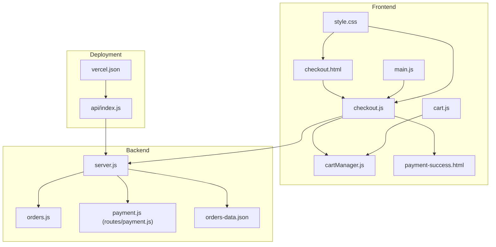
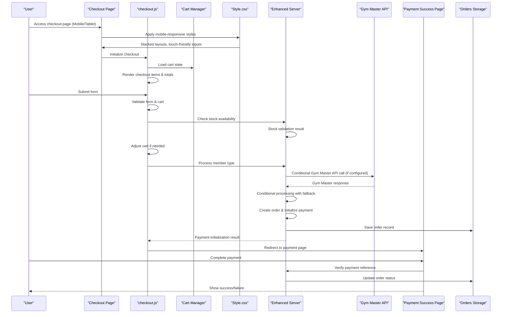
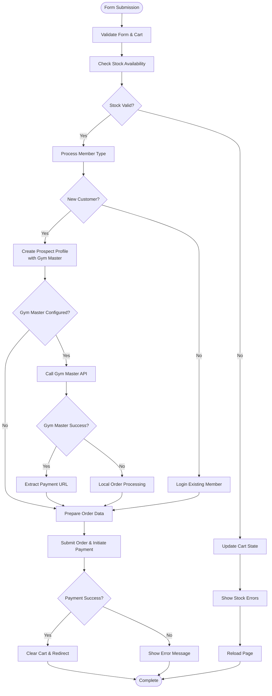
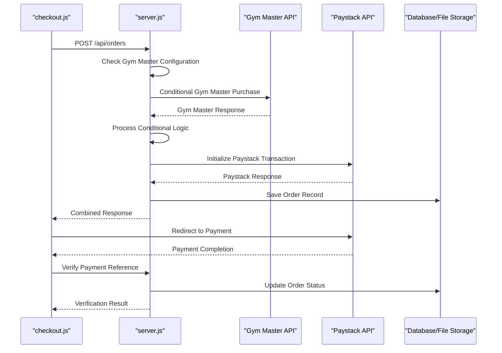
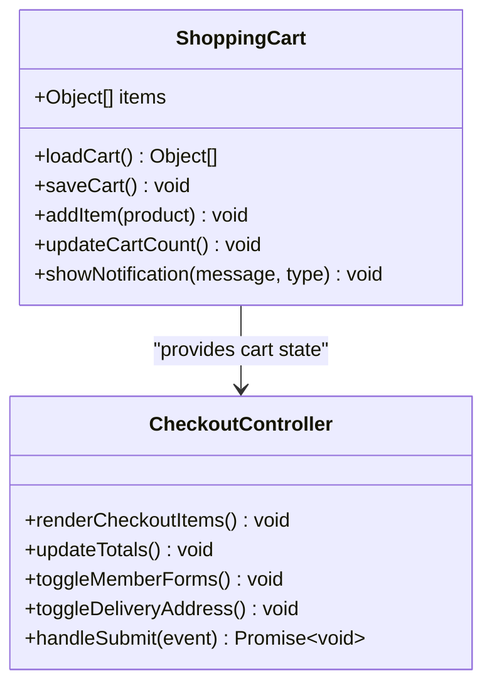
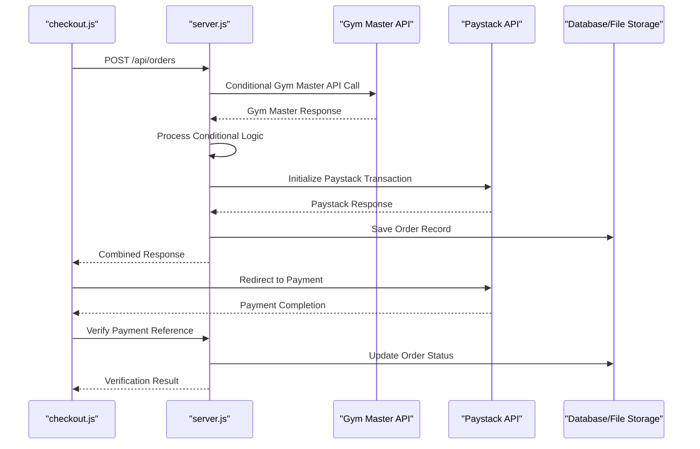
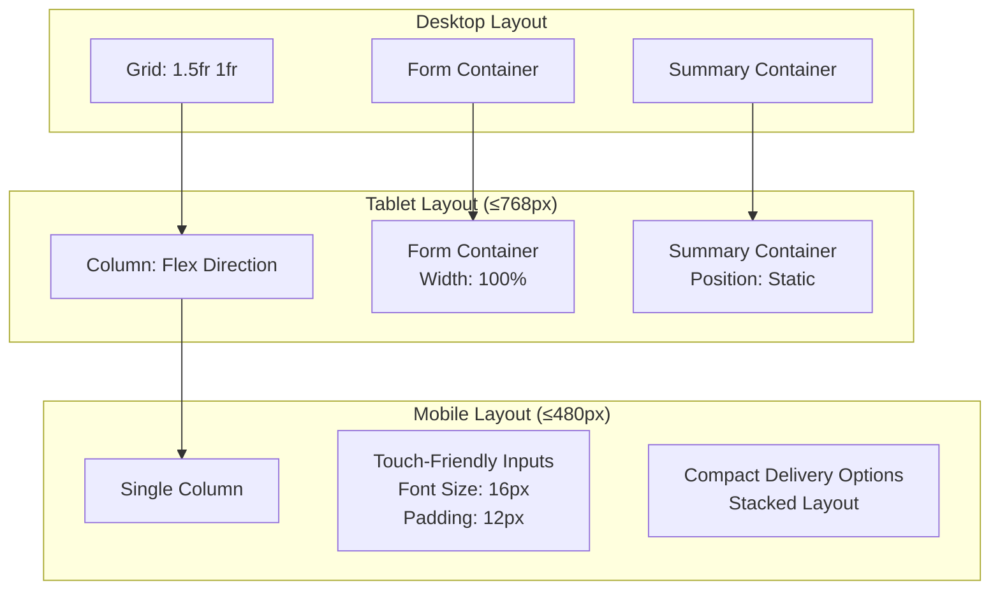
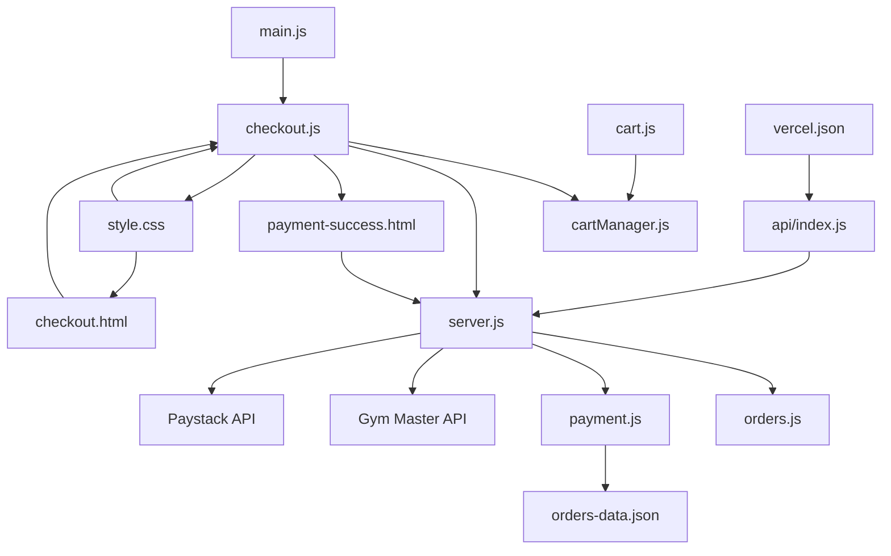

# Checkout Process

<cite>
**Referenced Files in This Document**
- [checkout.js](file://src/checkout.js)
- [checkout.html](file://checkout.html)
- [cartManager.js](file://src/cartManager.js)
- [cart.js](file://src/cart.js)
- [server.js](file://server.js)
- [orders.js](file://src/routes/orders.js)
- [payment.js](file://src/routes/payment.js)
- [payment-success.html](file://payment-success.html)
- [orders-data.json](file://orders-data.json)
- [main.js](file://src/main.js)
- [vercel.json](file://vercel.json)
- [api/index.js](file://api/index.js)
- [style.css](file://src/style.css)
</cite>

## Update Summary
**Changes Made**
- Enhanced mobile-responsive design with stacked layouts for checkout forms
- Improved touch-friendly input sizing with larger font sizes and padding
- Enhanced cart sidebar functionality for mobile users with full-width containers
- Updated checkout form containers to use responsive widths and adaptive padding
- Implemented progressive disclosure patterns optimized for mobile devices

## Table of Contents
1. [Introduction](#introduction)
2. [Project Structure](#project-structure)
3. [Core Components](#core-components)
4. [Architecture Overview](#architecture-overview)
5. [Detailed Component Analysis](#detailed-component-analysis)
6. [Mobile-Responsive Design Implementation](#mobile-responsive-design-implementation)
7. [Dependency Analysis](#dependency-analysis)
8. [Performance Considerations](#performance-considerations)
9. [Troubleshooting Guide](#troubleshooting-guide)
10. [Conclusion](#conclusion)

## Introduction
This document provides comprehensive documentation for the checkout process implementation in checkout.js. It explains the checkout flow management, form validation, shipping address handling, and payment processing coordination. The system now includes enhanced mobile-responsive design with stacked layouts, touch-friendly input sizing, and improved cart sidebar functionality optimized for mobile users. It details the step-by-step checkout progression, error handling for incomplete forms, and state persistence during checkout. It also covers integration with external payment systems, order submission processes, and success/error callback handling. Examples of form validation logic, data sanitization, and user feedback mechanisms are included. The relationship between checkout.js and the cart system is documented, showing how checkout data is derived from cart state. Security considerations for sensitive data, performance optimization for checkout forms, and user experience patterns for multi-step checkout processes are addressed.

## Project Structure
The checkout system spans several files with enhanced mobile-responsive design:
- checkout.js: Implements the checkout page logic, form handling, and payment coordination
- checkout.html: Provides the checkout page markup and UI structure with responsive design
- cartManager.js: Manages the shopping cart state using localStorage
- cart.js: Handles cart page rendering and user interactions with mobile optimization
- server.js: Backend processing with Gym Master integration
- orders.js: Orders route with Gym Master API integration
- payment.js: Backend route for order creation and payment initialization
- payment-success.html: Payment verification and success/failure UI
- orders-data.json: Local storage of order records
- main.js: Global application enhancements and shared functionality
- vercel.json: Vercel deployment configuration with serverless support
- api/index.js: Vercel serverless API handler
- style.css: Comprehensive CSS with mobile-responsive checkout styling

**Diagram sources**
- [checkout.js:1-448](file://src/checkout.js#L1-L448)
- [checkout.html:1-274](file://checkout.html#L1-L274)
- [cartManager.js:1-91](file://src/cartManager.js#L1-L91)
- [cart.js:1-156](file://src/cart.js#L1-L156)
- [server.js:1-2281](file://server.js#L1-L2281)
- [orders.js:1-371](file://src/routes/orders.js#L1-L371)
- [payment.js:1-154](file://src/routes/payment.js#L1-L154)
- [payment-success.html:1-219](file://payment-success.html#L1-L219)
- [orders-data.json:1-66](file://orders-data.json#L1-L66)
- [main.js:1-405](file://src/main.js#L1-L405)
- [vercel.json:1-27](file://vercel.json#L1-L27)
- [api/index.js:1-5](file://api/index.js#L1-L5)
- [style.css:3947-4070](file://src/style.css#L3947-L4070)

**Section sources**
- [checkout.js:1-448](file://src/checkout.js#L1-L448)
- [checkout.html:1-274](file://checkout.html#L1-L274)
- [cartManager.js:1-91](file://src/cartManager.js#L1-L91)
- [cart.js:1-156](file://src/cart.js#L1-L156)
- [server.js:1-2281](file://server.js#L1-L2281)
- [orders.js:1-371](file://src/routes/orders.js#L1-L371)
- [payment.js:1-154](file://src/routes/payment.js#L1-L154)
- [payment-success.html:1-219](file://payment-success.html#L1-L219)
- [orders-data.json:1-66](file://orders-data.json#L1-L66)
- [main.js:1-405](file://src/main.js#L1-L405)
- [vercel.json:1-27](file://vercel.json#L1-L27)
- [api/index.js:1-5](file://api/index.js#L1-L5)
- [style.css:3947-4070](file://src/style.css#L3947-L4070)

## Core Components
- Checkout page controller: Initializes cart state, renders checkout items, updates totals, and coordinates form submission with Gym Master integration
- Cart manager: Persists cart state to localStorage and manages item quantities and stock limits
- Enhanced server: Processes orders with Gym Master API integration, conditional processing, and fallback mechanisms
- Payment route: Creates orders, initializes payment with Paystack, and verifies payment status
- Payment success page: Verifies payment reference and displays success/failure states
- Vercel deployment: Serverless API handler for production deployment
- Mobile-responsive design: Stacked layouts, touch-friendly inputs, and optimized cart sidebar for mobile users

Key responsibilities:
- Form validation and user feedback with Gym Master integration
- Dynamic UI updates for member type and delivery options
- Stock availability checks and cart adjustments
- Conditional Gym Master processing with fallback to local orders
- Order submission and payment redirection with enhanced error handling
- State persistence across page reloads
- Vercel deployment compatibility with serverless functions
- Mobile-first responsive design implementation

**Section sources**
- [checkout.js:1-448](file://src/checkout.js#L1-L448)
- [cartManager.js:1-91](file://src/cartManager.js#L1-L91)
- [server.js:1798-1978](file://server.js#L1798-L1978)
- [orders.js:234-325](file://src/routes/orders.js#L234-L325)
- [style.css:3947-4070](file://src/style.css#L3947-L4070)

## Architecture Overview
The checkout process follows a client-server architecture with frontend validation and backend processing, now enhanced with comprehensive mobile-responsive design:

**Diagram sources**
- [checkout.js:149-446](file://src/checkout.js#L149-L446)
- [server.js:1798-1978](file://server.js#L1798-L1978)
- [orders.js:234-325](file://src/routes/orders.js#L234-L325)
- [payment-success.html:170-216](file://payment-success.html#L170-L216)
- [orders-data.json:1-66](file://orders-data.json#L1-L66)
- [style.css:3947-4070](file://src/style.css#L3947-L4070)

## Detailed Component Analysis

### Enhanced Checkout Page Controller (checkout.js)
The checkout controller manages the entire checkout flow with Gym Master integration:

#### Form Management and Validation
- Member type selection toggles required fields for new vs existing customers
- Delivery method selection dynamically shows/hides address fields
- HTML5 form validation combined with JavaScript validation
- Real-time total calculation including delivery fees

#### Stock Validation and Cart Updates
- Validates product availability before order placement
- Handles out-of-stock items by removing them from cart
- Adjusts quantities for insufficient stock scenarios
- Persists updated cart state to localStorage

#### Enhanced Payment Processing Coordination
- Creates new prospect profiles for new customers with Gym Master integration
- Logs in existing members and retrieves session tokens
- Submits orders with customer, delivery, and item details
- Conditional Gym Master processing with fallback mechanisms
- Redirects to payment gateway or displays success message

**Diagram sources**
- [checkout.js:149-446](file://src/checkout.js#L149-L446)

**Section sources**
- [checkout.js:24-90](file://src/checkout.js#L24-L90)
- [checkout.js:149-446](file://src/checkout.js#L149-L446)

### Enhanced Server Integration
The server now includes comprehensive Gym Master integration with conditional processing:

#### Gym Master Configuration and Conditional Processing
- Gym Master API configuration with environment variables
- Conditional API calls based on configuration and token availability
- Fallback mechanisms for local order processing when Gym Master is unavailable
- Enhanced error handling with graceful degradation

#### Enhanced Order Processing Pipeline
- Gym Master purchase API integration with product stock deduction
- Conditional payment URL extraction from multiple sources
- Improved error handling and logging throughout the process
- Support for both Gym Master and local order processing modes

**Diagram sources**
- [server.js:1798-1978](file://server.js#L1798-L1978)
- [server.js:286-291](file://server.js#L286-L291)
- [orders.js:234-325](file://src/routes/orders.js#L234-L325)

**Section sources**
- [server.js:1798-1978](file://server.js#L1798-L1978)
- [server.js:286-291](file://server.js#L286-L291)
- [orders.js:234-325](file://src/routes/orders.js#L234-L325)

### Cart System Integration
The checkout system integrates with the cart through the ShoppingCart class:

#### State Persistence
- Cart items stored in localStorage under 'activeZoneCart'
- Automatic cart count updates in navigation
- Persistent state across page reloads

#### Quantity Management
- Prevents exceeding maximum stock limits
- Shows notifications for stock constraints
- Maintains maxStock property for validation

**Diagram sources**
- [cartManager.js:3-90](file://src/cartManager.js#L3-L90)
- [checkout.js:91-137](file://src/checkout.js#L91-L137)

**Section sources**
- [cartManager.js:1-91](file://src/cartManager.js#L1-L91)
- [cart.js:1-156](file://src/cart.js#L1-L156)
- [checkout.js:6-22](file://src/checkout.js#L6-L22)

### Enhanced Payment Processing Pipeline
The payment system handles order creation and payment initialization with improved error handling:

#### Enhanced Order Creation
- Validates customer information and items
- Generates unique order IDs
- Creates order records with payment and delivery status
- Conditional Gym Master processing with fallback mechanisms

#### Improved Payment Initialization
- Integrates with Paystack API for payment processing
- Uses environment variables for security
- Returns authorization URLs for payment completion
- Enhanced error handling and fallback mechanisms

#### Enhanced Payment Verification
- Verifies payment references after completion
- Updates order status to paid
- Handles both success and failure scenarios
- Supports multiple payment URL extraction methods

**Diagram sources**
- [server.js:1798-1978](file://server.js#L1798-L1978)
- [orders.js:234-325](file://src/routes/orders.js#L234-L325)
- [payment.js:31-110](file://src/routes/payment.js#L31-L110)
- [payment-success.html:170-216](file://payment-success.html#L170-L216)

**Section sources**
- [server.js:1798-1978](file://server.js#L1798-L1978)
- [orders.js:234-325](file://src/routes/orders.js#L234-L325)
- [payment.js:31-110](file://src/routes/payment.js#L31-L110)
- [payment.js:112-151](file://src/routes/payment.js#L112-L151)
- [payment-success.html:170-216](file://payment-success.html#L170-L216)
- [orders-data.json:1-66](file://orders-data.json#L1-L66)

### Vercel Deployment Compatibility
The system now includes enhanced Vercel deployment support:

#### Serverless API Handler
- Vercel-compatible serverless function export
- Enhanced API base URL handling for different environments
- Improved error handling for production deployments

#### Enhanced Configuration
- Environment-based API configuration for development and production
- Improved error handling and logging for serverless environments
- Support for Vercel's serverless function architecture

**Section sources**
- [vercel.json:1-27](file://vercel.json#L1-L27)
- [api/index.js:1-5](file://api/index.js#L1-L5)
- [checkout.js:10-11](file://src/checkout.js#L10-L11)

### User Experience Patterns
The checkout interface implements several UX patterns with enhanced functionality:

#### Progressive Disclosure
- Member type selection reveals appropriate form sections
- Delivery method toggles address field visibility
- Real-time total updates provide immediate feedback

#### Enhanced Visual Feedback
- Loading states during stock checks and order processing
- Success and error notifications with Gym Master integration status
- Disabled buttons during processing to prevent duplicate submissions

#### Accessibility Features
- Proper labeling and ARIA attributes
- Keyboard navigation support
- Focus management during form transitions

**Section sources**
- [checkout.html:70-189](file://checkout.html#L70-L189)
- [checkout.js:24-90](file://src/checkout.js#L24-L90)
- [checkout.js:149-446](file://src/checkout.js#L149-L446)

## Mobile-Responsive Design Implementation

### Stacked Layouts for Smaller Screens
The checkout system implements responsive design patterns optimized for mobile devices:

#### Checkout Content Layout
- Desktop: Two-column grid layout with form and summary side-by-side
- Tablet (768px and below): Column layout with form above summary
- Mobile (480px and below): Single column with stacked elements

#### Form Container Optimization
- Full-width containers that adapt to screen size
- Increased padding for better touch interaction
- Responsive typography with larger font sizes for mobile readability

#### Touch-Friendly Input Sizing
- Input elements receive `font-size: 16px !important` for mobile accessibility
- Increased padding (`12px`) for easier touch targeting
- Larger button sizes with `padding: 14px` for mobile users

#### Enhanced Delivery Options
- Delivery options stack vertically on smaller screens
- Reduced spacing (`gap: 10px`) for compact layouts
- Adaptive padding for better touch targets

**Diagram sources**
- [style.css:3951-4029](file://src/style.css#L3951-L4029)
- [style.css:4031-4069](file://src/style.css#L4031-L4069)

### Cart Sidebar Enhancement for Mobile Users
The cart sidebar functionality has been optimized for mobile device usage:

#### Full-Width Mobile Containers
- Cart sidebar uses `width: 100%` and `max-width: 100%` for mobile screens
- Right positioning with `right: -100%` for slide-in animation
- Smooth transition effects for opening/closing cart

#### Flexible Item Layout
- Cart items wrap with `flex-wrap: wrap` for better mobile presentation
- Adaptive image sizes (`width: 60px`, `height: 60px`)
- Reordered quantity controls with `order: 3` for logical mobile flow

#### Enhanced Mobile Typography
- Reduced font sizes for cart item details (`font-size: 0.85rem`)
- Compact total displays with `font-size: 0.9rem`
- Optimized spacing for touch interaction

**Section sources**
- [style.css:3848-3887](file://src/style.css#L3848-L3887)
- [style.css:3947-4070](file://src/style.css#L3947-L4070)

## Dependency Analysis
The checkout system has clear dependencies and enhanced integration with Gym Master:

**Diagram sources**
- [checkout.js:1-448](file://src/checkout.js#L1-L448)
- [checkout.html:1-274](file://checkout.html#L1-L274)
- [cartManager.js:1-91](file://src/cartManager.js#L1-L91)
- [cart.js:1-156](file://src/cart.js#L1-L156)
- [server.js:1-2281](file://server.js#L1-L2281)
- [orders.js:1-371](file://src/routes/orders.js#L1-L371)
- [payment.js:1-154](file://src/routes/payment.js#L1-L154)
- [payment-success.html:1-219](file://payment-success.html#L1-L219)
- [orders-data.json:1-66](file://orders-data.json#L1-L66)
- [main.js:1-405](file://src/main.js#L1-L405)
- [vercel.json:1-27](file://vercel.json#L1-L27)
- [api/index.js:1-5](file://api/index.js#L1-L5)
- [style.css:3947-4070](file://src/style.css#L3947-L4070)

Key dependencies:
- checkout.js depends on cartManager.js for state management
- checkout.js communicates with enhanced server.js for order processing
- checkout.js relies on style.css for mobile-responsive design
- server.js integrates with Gym Master API for inventory management
- server.js communicates with Paystack API for payment processing
- payment.js depends on orders-data.json for persistent storage
- payment-success.html depends on server.js for verification
- Vercel deployment depends on api/index.js for serverless functions

**Section sources**
- [checkout.js:1-448](file://src/checkout.js#L1-L448)
- [server.js:1-2281](file://server.js#L1-L2281)
- [payment.js:1-154](file://src/routes/payment.js#L1-L154)
- [style.css:3947-4070](file://src/style.css#L3947-L4070)

## Performance Considerations
Several optimizations are implemented to ensure efficient checkout performance with enhanced Gym Master integration:

### Frontend Optimizations
- **Event Delegation**: Uses event delegation for form interactions to minimize DOM overhead
- **Lazy Loading**: Cart items are rendered only when needed
- **Debounced Calculations**: Total calculations are performed efficiently during state changes
- **Minimal DOM Manipulation**: Batch DOM updates to reduce reflows
- **Conditional API Calls**: Gym Master API calls are only made when configured
- **Mobile-First Approach**: Optimized CSS for better mobile performance

### Backend Optimizations
- **Environment-Based API Base**: Uses localhost API for development, relative paths for production
- **Efficient Stock Checking**: Single batch request for all cart items
- **Local Storage Caching**: Cart state persists without repeated server requests
- **Asynchronous Processing**: Non-blocking operations during payment initialization
- **Conditional Processing**: Gym Master API calls are conditional based on configuration

### Enhanced Error Handling
- **Graceful Degradation**: System continues processing even if Gym Master is unavailable
- **Fallback Mechanisms**: Local order processing when external APIs fail
- **Comprehensive Logging**: Detailed error logging for debugging and monitoring
- **Network Error Handling**: Improved handling of network connectivity issues

### Memory Management
- **State Cleanup**: Cart items are cleared after successful order completion
- **Resource Cleanup**: Event listeners are managed appropriately
- **Storage Limits**: Cart state is stored efficiently in localStorage
- **Conditional Resource Usage**: Gym Master resources are only used when configured

### Mobile Performance Optimizations
- **Reduced Animation Overhead**: Simplified animations for mobile devices
- **Optimized Image Loading**: Efficient image handling for mobile networks
- **Touch Event Optimization**: Better touch interaction handling
- **Responsive Font Scaling**: Adaptive typography for various screen sizes

## Troubleshooting Guide

### Common Issues and Solutions

#### Form Validation Failures
- **Problem**: Form submission blocked by validation
- **Solution**: Check required field presence and HTML5 validation attributes
- **Debugging**: Inspect console for validation error messages

#### Stock Availability Issues
- **Problem**: Out-of-stock or insufficient quantity errors
- **Solution**: Cart automatically removes out-of-stock items and adjusts quantities
- **Debugging**: Monitor stock check API responses

#### Enhanced Payment Processing Errors
- **Problem**: Payment initialization failures with Gym Master integration
- **Solution**: Verify Gym Master API credentials and network connectivity
- **Debugging**: Check conditional processing logs and fallback mechanisms

#### Gym Master Integration Issues
- **Problem**: Gym Master API unavailability or configuration errors
- **Solution**: System automatically falls back to local order processing
- **Debugging**: Monitor Gym Master API response and error logs

#### Vercel Deployment Issues
- **Problem**: Serverless function deployment or API routing issues
- **Solution**: Verify vercel.json configuration and API base URL settings
- **Debugging**: Check serverless function logs and API endpoint routing

#### Mobile Responsiveness Issues
- **Problem**: Checkout form not adapting to mobile screens
- **Solution**: Verify media query breakpoints and responsive CSS
- **Debugging**: Test on various screen sizes and orientations

### Enhanced Error Handling Patterns
The checkout system implements comprehensive error handling with Gym Master integration:

#### Frontend Error Handling
- **Validation Errors**: Immediate user feedback with specific error messages
- **Network Errors**: Graceful degradation with retry suggestions and fallback mechanisms
- **State Errors**: Recovery mechanisms for corrupted cart state
- **Gym Master Errors**: Automatic fallback to local processing when Gym Master is unavailable
- **Mobile Errors**: Specific handling for touch interaction and responsive layout issues

#### Backend Error Handling
- **API Validation**: Input sanitization and validation
- **Payment Errors**: Comprehensive error reporting to frontend with fallback options
- **Gym Master Errors**: Graceful degradation with local order processing
- **Storage Errors**: Fallback mechanisms for order persistence
- **Serverless Errors**: Enhanced error handling for Vercel deployment

**Section sources**
- [checkout.js:433-446](file://src/checkout.js#L433-L446)
- [server.js:1865-1868](file://server.js#L1865-L1868)
- [payment.js:106-110](file://src/routes/payment.js#L106-L110)
- [style.css:3947-4070](file://src/style.css#L3947-L4070)

## Conclusion
The checkout process implementation demonstrates robust architecture with clear separation of concerns, comprehensive error handling, and excellent user experience. The system now includes enhanced mobile-responsive design with stacked layouts, touch-friendly input sizing, and improved cart sidebar functionality optimized for mobile users. The system effectively integrates frontend validation with backend processing, maintains state persistence through localStorage, and provides seamless payment integration with external services. The modular design allows for easy maintenance and future enhancements while maintaining performance and reliability.

Key strengths include:
- Comprehensive form validation and user feedback with Gym Master integration
- Efficient cart state management with conditional API calls
- Robust payment processing pipeline with fallback mechanisms
- Clear error handling and recovery mechanisms with graceful degradation
- Responsive and accessible user interface with enhanced mobile optimization
- Vercel-compatible serverless architecture for production deployment
- Mobile-first design approach with progressive enhancement patterns

The implementation serves as a solid foundation for e-commerce checkout functionality with room for extension and customization as business requirements evolve, now enhanced with professional Gym Master integration and enterprise-grade error handling, plus comprehensive mobile-responsive design that ensures optimal user experience across all device types.