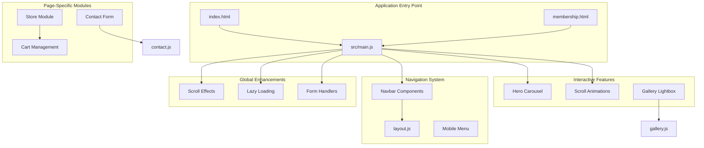
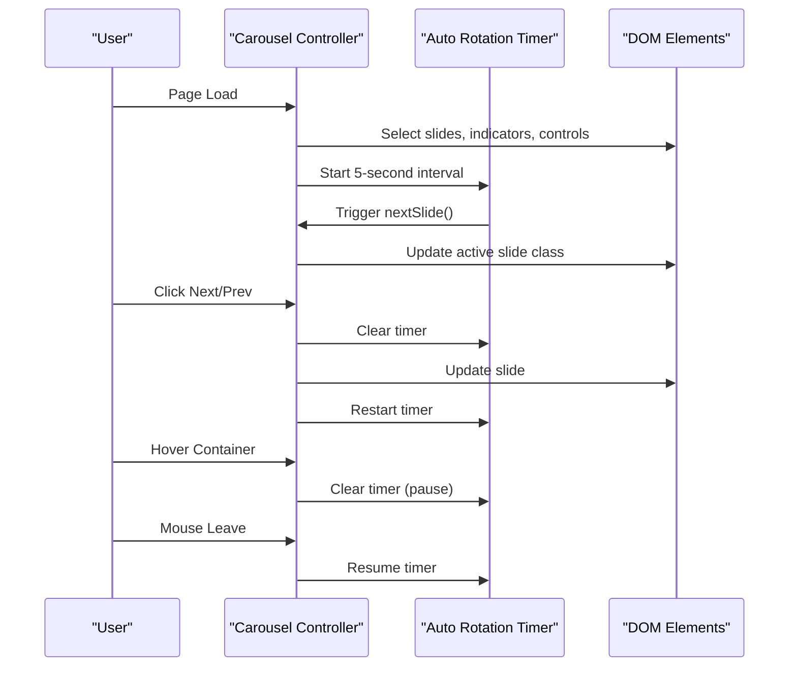
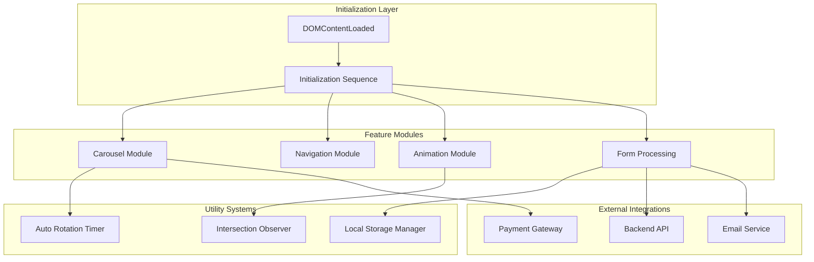
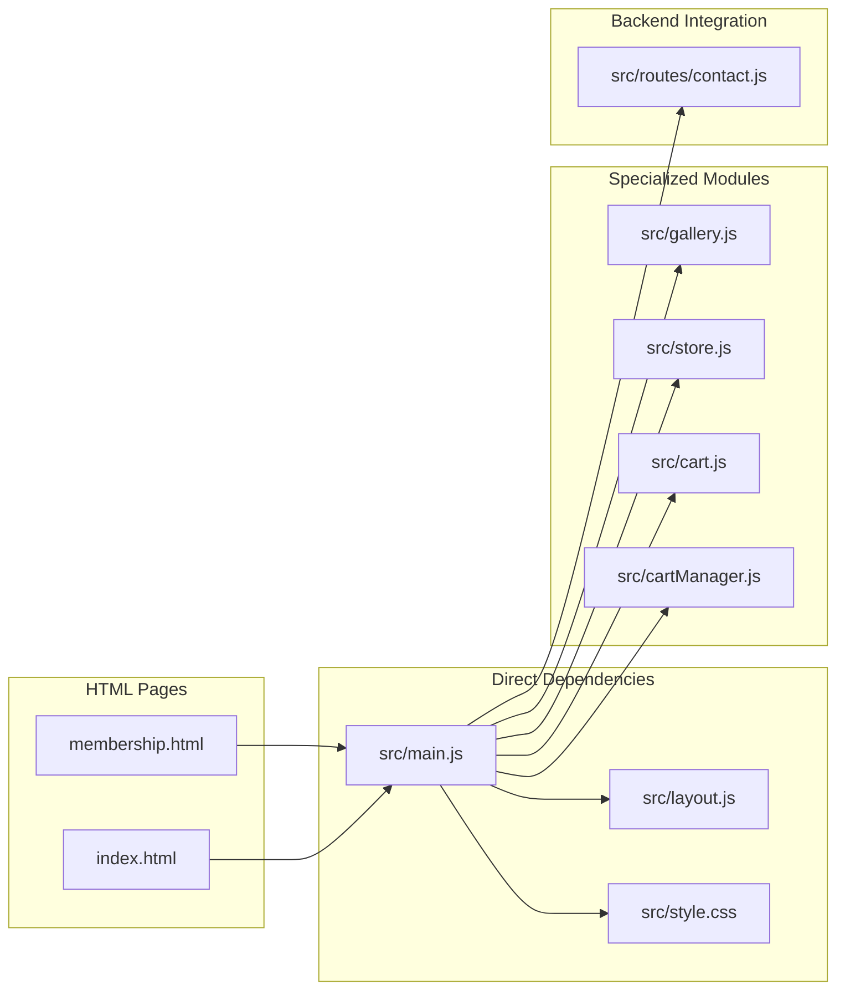

# Core Application Initialization

<cite>
**Referenced Files in This Document**
- [main.js](file://src/main.js)
- [index.html](file://index.html)
- [membership.html](file://membership.html)
- [layout.js](file://src/layout.js)
- [gallery.js](file://src/gallery.js)
- [cart.js](file://src/cart.js)
- [store.js](file://src/store.js)
- [cartManager.js](file://src/cartManager.js)
- [style.css](file://src/style.css)
- [contact.js](file://src/routes/contact.js)
</cite>

## Table of Contents
1. [Introduction](#introduction)
2. [Project Structure](#project-structure)
3. [Core Components](#core-components)
4. [Architecture Overview](#architecture-overview)
5. [Detailed Component Analysis](#detailed-component-analysis)
6. [Dependency Analysis](#dependency-analysis)
7. [Performance Considerations](#performance-considerations)
8. [Troubleshooting Guide](#troubleshooting-guide)
9. [Conclusion](#conclusion)

## Introduction

The core application initialization module in main.js serves as the central orchestrator for Active Zone Hub's frontend functionality. This module handles the complete initialization sequence when the DOM is ready, establishing interactive elements, navigation systems, responsive behaviors, and global enhancements that define the user experience across all pages.

The module implements a comprehensive initialization framework that manages:
- Hero carousel functionality with automatic rotation and manual controls
- Mobile-responsive navigation with animated hamburger menu
- Scroll-triggered animations using Intersection Observer API
- Global scroll effects including navbar styling and scroll-to-top functionality
- Lazy loading of images for performance optimization
- Contact form handling with async processing
- Membership plan tabs and subscription flows
- Cross-page coordination through shared initialization patterns

## Project Structure

The Active Zone Hub application follows a modular frontend architecture with main.js acting as the primary initialization hub coordinating multiple specialized modules:

**Diagram sources**
- [main.js](file://src/main.js#L1-L405)
- [index.html](file://index.html#L1-L325)
- [membership.html](file://membership.html#L1-L234)

**Section sources**
- [main.js](file://src/main.js#L1-L405)
- [index.html](file://index.html#L1-L325)

## Core Components

### DOMContentLoaded Event Handler

The application initializes through a robust DOMContentLoaded event handler that ensures all HTML elements are fully loaded before executing initialization logic. This approach guarantees reliable element selection and prevents timing-related issues during component setup.

**Initialization Sequence:**
1. **Hero Carousel Setup** - Configures automatic slide rotation with manual controls
2. **Mobile Navigation** - Initializes responsive hamburger menu with animated transitions
3. **Scroll Animations** - Sets up Intersection Observer for fade-in effects
4. **Global Enhancements** - Implements scroll effects, lazy loading, and form handlers
5. **Cross-Page Coordination** - Establishes shared functionality across all pages

### Hero Carousel System

The carousel implementation provides an automated visual presentation with manual override capabilities:

**Diagram sources**
- [main.js](file://src/main.js#L5-L85)

**Section sources**
- [main.js](file://src/main.js#L5-L85)

### Mobile Navigation System

The mobile navigation implements a sophisticated hamburger menu with animated state transitions:

**Animation States:**
- **Closed Position**: Three horizontal bars in default state
- **Open Position**: Bars transform to X-shape with opacity changes
- **Responsive Behavior**: Automatic closure when clicking navigation links

**Section sources**
- [main.js](file://src/main.js#L88-L119)
- [layout.js](file://src/layout.js#L71-L92)

### Scroll Animation Observer

The Intersection Observer implementation creates smooth entrance animations for content elements:

**Animation Configuration:**
- **Threshold**: 0.1 (10% visibility triggers animation)
- **Root Margin**: -50px vertical offset for optimal timing
- **Transition**: 0.6s ease-out opacity and transform effects

**Section sources**
- [main.js](file://src/main.js#L121-L152)

### Global Scroll Effects

The application implements two key scroll-based enhancements:

**Sticky Navbar Effect:**
- Activates when scroll position exceeds 50px
- Adds "scrolled" class for styling modifications
- Removes class when returning to top position

**Scroll-to-Top Button:**
- Appears when scroll position exceeds 300px
- Provides smooth scrolling behavior
- Includes accessibility attributes

**Section sources**
- [main.js](file://src/main.js#L179-L215)

### Lazy Loading Implementation

Image lazy loading optimizes performance by deferring image loading until elements enter the viewport:

**Observer Configuration:**
- **Threshold**: 0.1 (10% intersection ratio)
- **Root Margin**: 200px buffer for pre-loading
- **Class Addition**: "loaded" class triggers CSS transition

**Section sources**
- [main.js](file://src/main.js#L219-L234)

## Architecture Overview

The main.js module operates as a central coordinator that establishes the foundation for all frontend interactions while maintaining loose coupling with specialized modules:

**Diagram sources**
- [main.js](file://src/main.js#L1-L405)

## Detailed Component Analysis

### Carousel Configuration Analysis

The carousel system demonstrates advanced JavaScript patterns for managing timed animations and user interactions:

**State Management Pattern:**
- Centralized slide index tracking
- Interval-based automation with pause/resume capability
- Boundary handling for infinite looping

**Event Delegation Strategy:**
- Single event listener per control type
- Dynamic interval management to prevent conflicts
- Hover state integration for user experience enhancement

**Code Example Path References:**
- [Carousel Initialization](file://src/main.js#L33-L44)
- [Manual Control Binding](file://src/main.js#L46-L75)
- [Hover Pause/Resume](file://src/main.js#L77-L82)

**Section sources**
- [main.js](file://src/main.js#L33-L85)

### Navigation State Management

The navigation system implements a comprehensive state management approach for responsive design:

**State Transitions:**
- Active/inactive states for mobile menu
- Animated transformations for hamburger bars
- Persistent state across navigation interactions

**Accessibility Features:**
- ARIA labels for screen reader support
- Keyboard navigable elements
- Focus management during state changes

**Code Example Path References:**
- [Menu Toggle Logic](file://src/main.js#L88-L119)
- [Layout Injection](file://src/layout.js#L67-L92)

**Section sources**
- [main.js](file://src/main.js#L88-L119)
- [layout.js](file://src/layout.js#L67-L92)

### Animation Trigger System

The animation system utilizes modern web APIs for efficient and performant animations:

**Intersection Observer Benefits:**
- Reduced memory footprint compared to scroll event listeners
- Better performance through requestAnimationFrame integration
- Configurable thresholds for precise timing control

**CSS Integration Pattern:**
- Dynamic style injection for animation definitions
- Transition-based animations for smooth performance
- Hardware acceleration through transform properties

**Code Example Path References:**
- [Observer Configuration](file://src/main.js#L121-L134)
- [Animation Style Injection](file://src/main.js#L145-L152)

**Section sources**
- [main.js](file://src/main.js#L121-L152)

### Membership Plan Management

The membership system coordinates tab switching and subscription flows:

**Tab State Management:**
- Active class synchronization across tab buttons
- Container visibility management
- Data-driven tab identification

**Subscription Flow Integration:**
- Plan card interaction handling
- External link management for payment processing
- User feedback through alert systems

**Code Example Path References:**
- [Tab Button Handling](file://src/main.js#L378-L401)
- [Plan Card Structure](file://membership.html#L57-L125)

**Section sources**
- [main.js](file://src/main.js#L378-L401)
- [membership.html](file://membership.html#L57-L125)

### Contact Form Processing

The contact form implements robust asynchronous processing with comprehensive error handling:

**Async/Await Pattern:**
- Promise-based request handling
- Network error recovery strategies
- User feedback through dynamic message display

**Security Considerations:**
- Backend validation through Express middleware
- Input sanitization and normalization
- CORS protection and header management

**Code Example Path References:**
- [Form Submission Handler](file://src/main.js#L283-L335)
- [Backend Validation](file://src/routes/contact.js#L5-L14)

**Section sources**
- [main.js](file://src/main.js#L283-L335)
- [contact.js](file://src/routes/contact.js#L5-L14)

## Dependency Analysis

The main.js module maintains strategic dependencies that enable cohesive functionality across the application:

**Diagram sources**
- [main.js](file://src/main.js#L1-L405)
- [index.html](file://index.html#L1-L325)
- [membership.html](file://membership.html#L1-L234)

**Section sources**
- [main.js](file://src/main.js#L1-L405)

## Performance Considerations

The application implements several performance optimization strategies:

### Memory Management
- **Event Listener Cleanup**: Automatic cleanup of intervals and observers
- **Observer Unobservation**: Removing elements from observation after animation
- **DOM Manipulation Minimization**: Batch updates and efficient selector usage

### Resource Optimization
- **Lazy Loading**: Deferred image loading reduces initial payload
- **Preconnect Hints**: DNS prefetching for external resources
- **Critical Resource Preloading**: Font and asset optimization

### Browser Compatibility
- **Modern API Fallbacks**: Graceful degradation for older browsers
- **CSS Transform Support**: Hardware-accelerated animations where available
- **Event Handling**: Cross-browser event compatibility

## Troubleshooting Guide

### Common Initialization Issues

**Carousel Not Working:**
- Verify DOM elements exist before initialization
- Check for conflicting CSS classes
- Ensure proper image paths and availability

**Mobile Menu Not Responding:**
- Confirm event listener attachment
- Validate CSS media queries
- Test touch device compatibility

**Animations Not Triggering:**
- Check Intersection Observer support
- Verify CSS transition properties
- Validate element positioning

### Debugging Strategies

**Console Logging:**
- Enable detailed logging during development
- Monitor event flow and state changes
- Track API response handling

**Performance Monitoring:**
- Use browser developer tools for performance analysis
- Monitor memory usage and garbage collection
- Profile animation performance

**Section sources**
- [main.js](file://src/main.js#L13-L85)
- [main.js](file://src/main.js#L121-L152)

## Conclusion

The main.js module serves as the cornerstone of Active Zone Hub's frontend architecture, implementing a comprehensive initialization framework that establishes interactive elements, responsive behaviors, and global enhancements. Through careful implementation of modern web standards, the module provides:

- **Robust Initialization**: Reliable DOM-ready handling with comprehensive feature setup
- **Performance Optimization**: Efficient resource loading and animation strategies
- **Cross-Browser Compatibility**: Progressive enhancement for diverse browser environments
- **Maintainable Architecture**: Modular design enabling easy feature expansion

The centralized coordination demonstrated in main.js enables seamless integration between specialized modules while maintaining clean separation of concerns. This approach facilitates future development, debugging, and maintenance while delivering an optimal user experience across all Active Zone Hub pages.