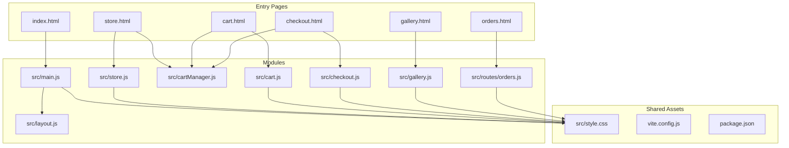
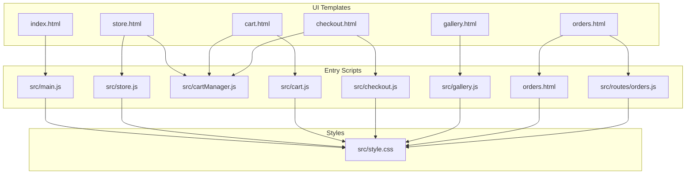
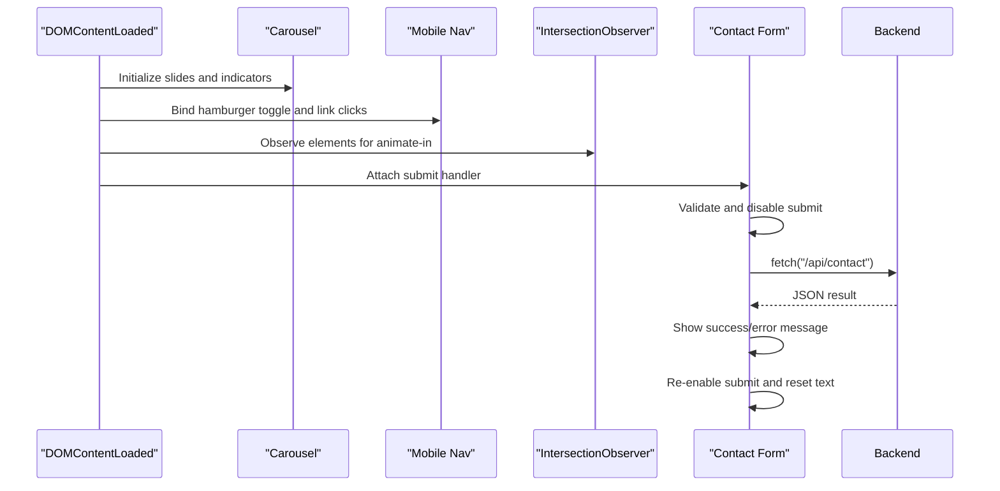
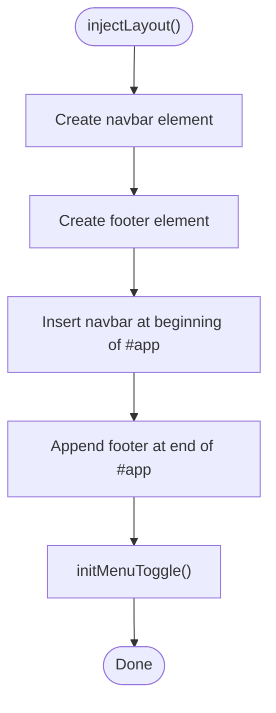
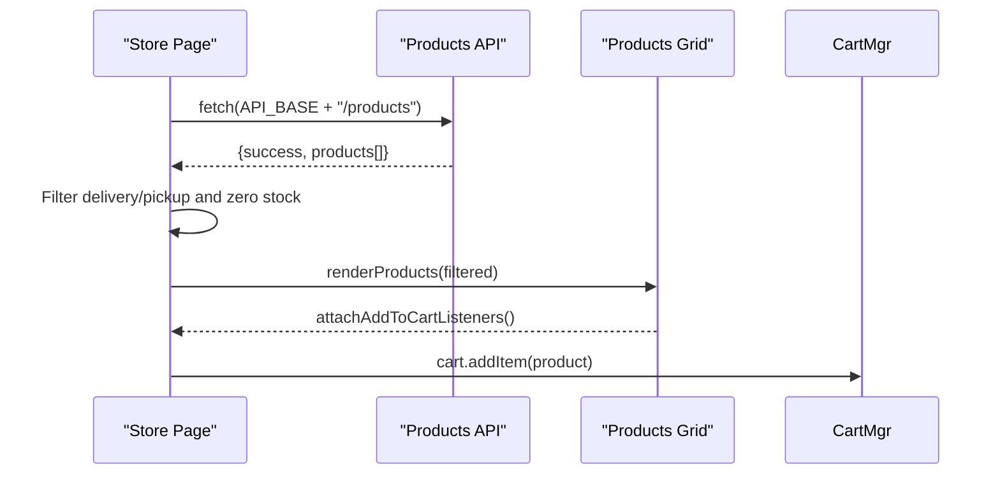
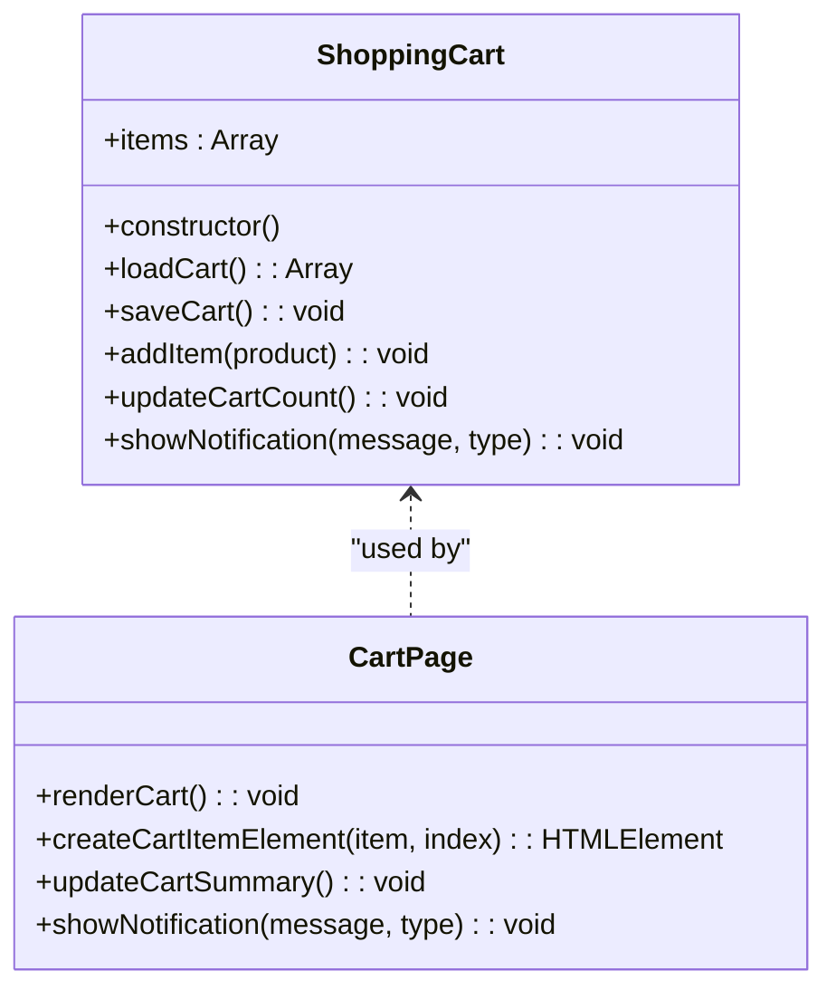
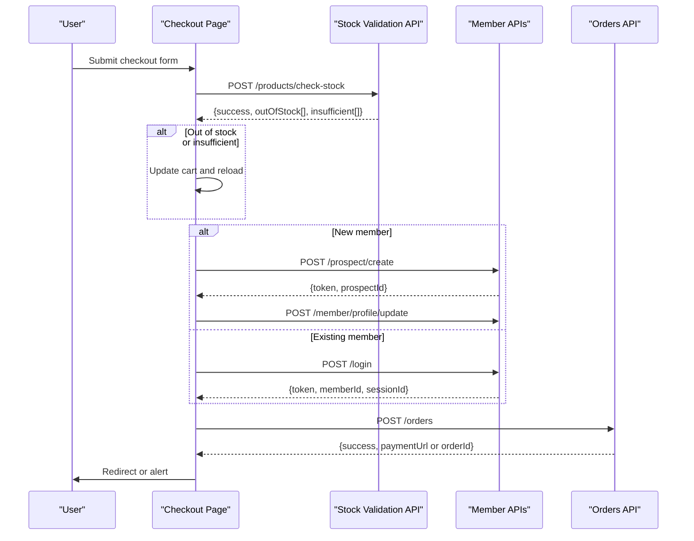
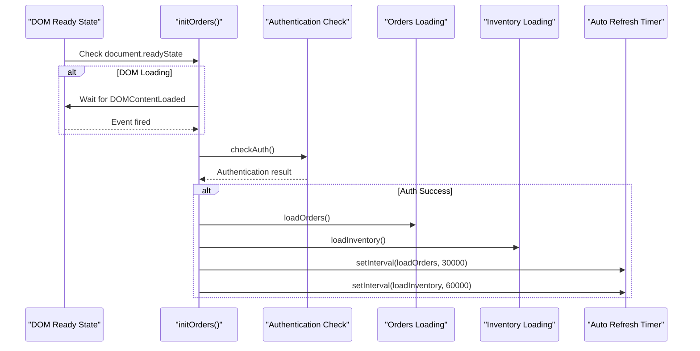
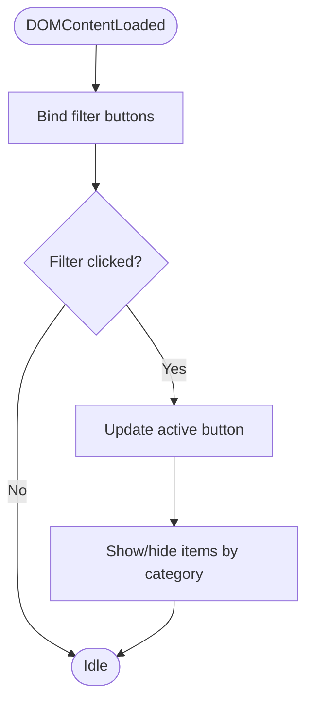
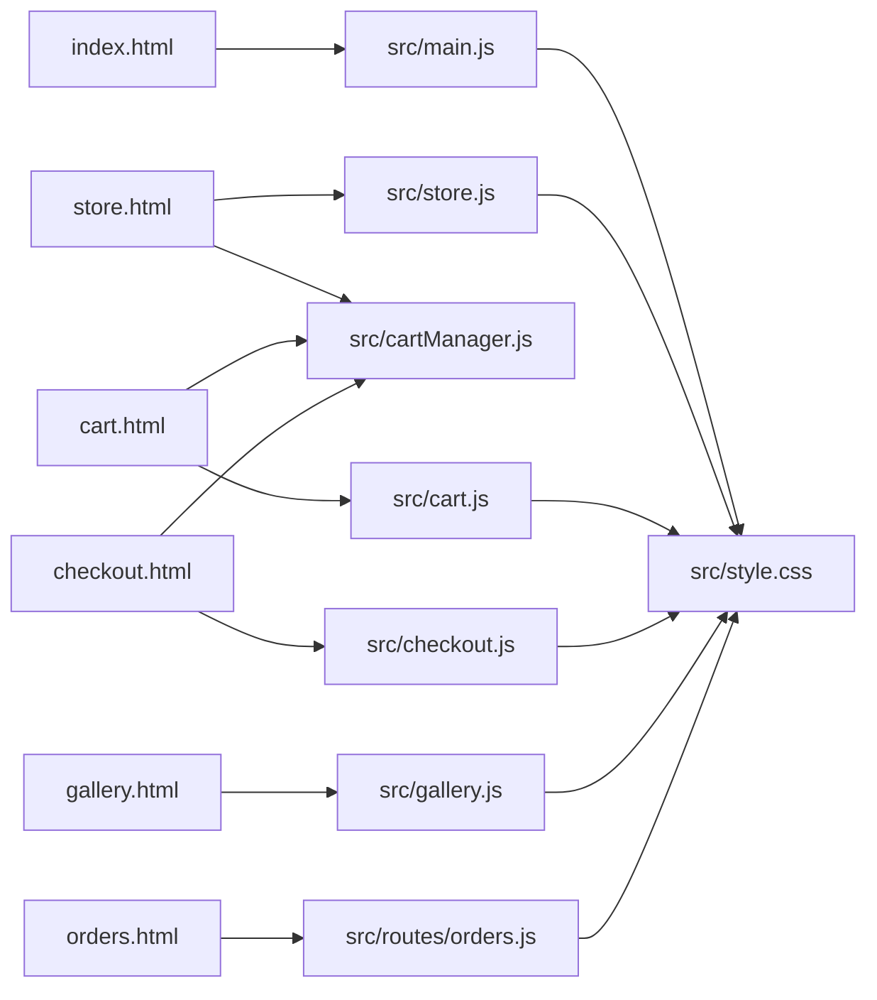

# Frontend Architecture

<cite>
**Referenced Files in This Document**
- [index.html](file://index.html)
- [store.html](file://store.html)
- [cart.html](file://cart.html)
- [orders.html](file://orders.html)
- [src/main.js](file://src/main.js)
- [src/layout.js](file://src/layout.js)
- [src/store.js](file://src/store.js)
- [src/cartManager.js](file://src/cartManager.js)
- [src/cart.js](file://src/cart.js)
- [src/checkout.js](file://src/checkout.js)
- [src/gallery.js](file://src/gallery.js)
- [src/style.css](file://src/style.css)
- [src/routes/orders.js](file://src/routes/orders.js)
- [vite.config.js](file://vite.config.js)
- [package.json](file://package.json)
</cite>

## Update Summary
**Changes Made**
- Enhanced orders page initialization system documentation with comprehensive DOM readiness checking
- Added double initialization prevention using ordersLoaded flag
- Documented controlled initialization context for auto-refresh mechanisms
- Updated orders page architecture to reflect improved initialization patterns

## Table of Contents
1. [Introduction](#introduction)
2. [Project Structure](#project-structure)
3. [Core Components](#core-components)
4. [Architecture Overview](#architecture-overview)
5. [Detailed Component Analysis](#detailed-component-analysis)
6. [Dependency Analysis](#dependency-analysis)
7. [Performance Considerations](#performance-considerations)
8. [Troubleshooting Guide](#troubleshooting-guide)
9. [Conclusion](#conclusion)

## Introduction
This document describes the frontend architecture of Active Zone Hub's client-side implementation. It focuses on the modular JavaScript structure, application initialization, interactive systems (carousel, navigation, forms), shopping cart architecture, store frontend, layout management, responsive design, and frontend-to-backend communication. It also covers performance optimization, caching strategies, and browser compatibility considerations.

## Project Structure
The frontend is organized around single-page HTML templates per major route, with shared styles and modular JavaScript modules. Vite is configured to build multiple entry points mapped to each HTML page. Styles are centralized in a single stylesheet with theme variables and responsive breakpoints.

**Diagram sources**
- [index.html](file://index.html#L1-L325)
- [store.html](file://store.html#L1-L854)
- [cart.html](file://cart.html#L1-L144)
- [orders.html](file://orders.html#L1-L1204)
- [src/main.js](file://src/main.js#L1-L405)
- [src/layout.js](file://src/layout.js#L1-L93)
- [src/store.js](file://src/store.js#L1-L316)
- [src/cartManager.js](file://src/cartManager.js#L1-L91)
- [src/cart.js](file://src/cart.js#L1-L156)
- [src/checkout.js](file://src/checkout.js#L1-L438)
- [src/gallery.js](file://src/gallery.js#L1-L169)
- [src/routes/orders.js](file://src/routes/orders.js#L1-L405)
- [src/style.css](file://src/style.css#L1-L800)
- [vite.config.js](file://vite.config.js#L1-L20)

**Section sources**
- [index.html](file://index.html#L1-L325)
- [store.html](file://store.html#L1-L854)
- [cart.html](file://cart.html#L1-L144)
- [orders.html](file://orders.html#L1-L1204)
- [vite.config.js](file://vite.config.js#L1-L20)
- [package.json](file://package.json#L1-L28)

## Core Components
- Application bootstrap and global enhancements: Carousel, mobile navigation, scroll animations, lazy images, contact form, membership tabs, and scroll-to-top.
- Store frontend: Dynamic product fetching, filtering, category mapping, and add-to-cart integration.
- Shopping cart: Persistent state via localStorage, cart toolbar updates, and cart page rendering.
- Checkout: Member type selection, delivery options, stock validation, and order submission.
- Gallery: Filtering and lightbox with keyboard navigation.
- Layout injection: Shared navbar and footer across pages.
- Orders management: Comprehensive order tracking, status updates, CSV export, and inventory management with auto-refresh capabilities.

**Section sources**
- [src/main.js](file://src/main.js#L1-L405)
- [src/store.js](file://src/store.js#L1-L316)
- [src/cartManager.js](file://src/cartManager.js#L1-L91)
- [src/cart.js](file://src/cart.js#L1-L156)
- [src/checkout.js](file://src/checkout.js#L1-L438)
- [src/gallery.js](file://src/gallery.js#L1-L169)
- [src/layout.js](file://src/layout.js#L1-L93)
- [orders.html](file://orders.html#L1-L1204)
- [src/routes/orders.js](file://src/routes/orders.js#L1-L405)

## Architecture Overview
The frontend follows a modular pattern:
- Entry pages include only the scripts they need.
- Shared modules encapsulate reusable logic (cart manager, layout).
- Store and cart pages depend on the shared cart manager for persistence.
- Checkout integrates with the cart manager and performs backend validation and submission.
- Orders page implements sophisticated initialization with DOM readiness checking and auto-refresh mechanisms.
- Styles are centralized and theme-driven with CSS variables.

**Diagram sources**
- [src/main.js](file://src/main.js#L1-L405)
- [src/store.js](file://src/store.js#L1-L316)
- [src/cartManager.js](file://src/cartManager.js#L1-L91)
- [src/cart.js](file://src/cart.js#L1-L156)
- [src/checkout.js](file://src/checkout.js#L1-L438)
- [src/gallery.js](file://src/gallery.js#L1-L169)
- [orders.html](file://orders.html#L1-L1204)
- [src/routes/orders.js](file://src/routes/orders.js#L1-L405)
- [src/style.css](file://src/style.css#L1-L800)

## Detailed Component Analysis

### Application Initialization and Global Enhancements (src/main.js)
Responsibilities:
- Carousel: Automatic rotation, manual controls, indicator clicks, pause on hover.
- Navigation: Mobile hamburger menu with animated bars and automatic collapse on link click.
- Scroll animations: IntersectionObserver-based fade-in effects.
- Membership tabs: Switch between plan categories.
- Navbar scroll effect: Sticky header with background change on scroll.
- Scroll-to-top button: Visibility and smooth scroll behavior.
- Lazy images: IntersectionObserver-based loading.
- External links: Automatic target and rel attributes for cross-origin links.
- Preconnect: Fonts preconnect for performance.
- Structured data: JSON-LD for SEO.
- Contact form: Async submission via fetch with loading states and feedback.

**Diagram sources**
- [src/main.js](file://src/main.js#L1-L405)

**Section sources**
- [src/main.js](file://src/main.js#L1-L405)

### Layout Management (src/layout.js)
Responsibilities:
- Injects a shared navbar and footer into the DOM.
- Initializes mobile menu toggle logic after injection.

**Diagram sources**
- [src/layout.js](file://src/layout.js#L1-L93)

**Section sources**
- [src/layout.js](file://src/layout.js#L1-L93)

### Store Frontend (src/store.js)
Responsibilities:
- Fetch and render products from the backend API with a conservative fallback to static content.
- Filter products by category and hide/show cards.
- Map product names/groups to categories for filtering.
- Format prices and handle low-stock badges.
- Attach add-to-cart listeners and integrate with the shared cart manager.

**Diagram sources**
- [src/store.js](file://src/store.js#L12-L165)

**Section sources**
- [src/store.js](file://src/store.js#L1-L316)
- [store.html](file://store.html#L1-L854)

### Shopping Cart System (src/cartManager.js + src/cart.js)
Responsibilities:
- Persistent state management via localStorage.
- Add/remove/update quantities and max stock enforcement.
- Update cart toolbar counts and notifications.
- Cart page rendering, quantity adjustments, and removal with user feedback.

**Diagram sources**
- [src/cartManager.js](file://src/cartManager.js#L1-L91)
- [src/cart.js](file://src/cart.js#L1-L156)

**Section sources**
- [src/cartManager.js](file://src/cartManager.js#L1-L91)
- [src/cart.js](file://src/cart.js#L1-L156)
- [cart.html](file://cart.html#L1-L144)

### Checkout Workflow (src/checkout.js)
Responsibilities:
- Member type toggling (new vs existing).
- Delivery method selection and dynamic address fields.
- Stock validation against backend before order placement.
- Prospect creation and member login flows.
- Order submission with totals calculation and redirection to payment.

**Diagram sources**
- [src/checkout.js](file://src/checkout.js#L147-L436)

**Section sources**
- [src/checkout.js](file://src/checkout.js#L1-L438)

### Orders Management System (orders.html + src/routes/orders.js)
Responsibilities:
- Comprehensive order tracking with status management and real-time updates.
- Authentication system with session-based access control.
- Advanced filtering and search capabilities with debounced input handling.
- CSV export functionality with configurable filters.
- Auto-refresh mechanisms for continuous monitoring.
- Inventory management with stock level tracking.
- Notification system for user feedback.

**Updated** Enhanced with sophisticated initialization system featuring DOM readiness checking, double initialization prevention, and controlled auto-refresh mechanisms.

**Diagram sources**
- [orders.html](file://orders.html#L1041-L1065)
- [src/routes/orders.js](file://src/routes/orders.js#L213-L268)

**Section sources**
- [orders.html](file://orders.html#L1-L1204)
- [src/routes/orders.js](file://src/routes/orders.js#L1-L405)

### Gallery Filtering and Lightbox (src/gallery.js)
Responsibilities:
- Filter gallery items by category.
- Open/close lightbox and navigate images with mouse, keyboard, and arrows.

**Diagram sources**
- [src/gallery.js](file://src/gallery.js#L14-L59)

**Section sources**
- [src/gallery.js](file://src/gallery.js#L1-L169)

## Dependency Analysis
- Entry pages depend on specific modules:
  - index.html loads src/main.js for global enhancements.
  - store.html loads src/store.js and src/cartManager.js for product display and cart integration.
  - cart.html loads src/cartManager.js and src/cart.js for cart rendering and interactions.
  - orders.html loads src/routes/orders.js for order management and backend integration.
  - checkout.html loads src/checkout.js and src/cartManager.js for checkout and order submission.
  - gallery.html loads src/gallery.js for filtering and lightbox.
- Shared dependencies:
  - src/style.css provides theming and responsive design.
  - Vite configuration defines multiple entry points for each HTML page.

**Diagram sources**
- [index.html](file://index.html#L1-L325)
- [store.html](file://store.html#L1-L854)
- [cart.html](file://cart.html#L1-L144)
- [orders.html](file://orders.html#L1-L1204)
- [src/main.js](file://src/main.js#L1-L405)
- [src/store.js](file://src/store.js#L1-L316)
- [src/cartManager.js](file://src/cartManager.js#L1-L91)
- [src/cart.js](file://src/cart.js#L1-L156)
- [src/checkout.js](file://src/checkout.js#L1-L438)
- [src/gallery.js](file://src/gallery.js#L1-L169)
- [src/routes/orders.js](file://src/routes/orders.js#L1-L405)
- [src/style.css](file://src/style.css#L1-L800)

**Section sources**
- [vite.config.js](file://vite.config.js#L1-L20)
- [package.json](file://package.json#L1-L28)

## Performance Considerations
- Resource preloading:
  - Preconnect to fonts.googleapis.com for faster font loading.
- Lazy loading:
  - IntersectionObserver-based lazy loading for images.
- Minimal DOM manipulation:
  - Batch updates (e.g., reattaching listeners after rendering).
- Conditional API usage:
  - Loading state only shown after delay; fallback to static content if API fails.
- Local storage caching:
  - Cart persistence avoids repeated network requests for cart state.
- CSS-in-JS for animations:
  - Dynamically injected styles for scroll animations.
- Build configuration:
  - Vite multi-entry builds optimize asset bundling per page.
- Auto-refresh optimization:
  - Orders refresh every 30 seconds, inventory every 60 seconds to balance responsiveness with performance.
- DOM readiness optimization:
  - Intelligent initialization prevents unnecessary processing during page load.

## Troubleshooting Guide
Common issues and resolutions:
- Carousel not rotating:
  - Verify DOM elements with expected selectors exist and intervals are started.
- Mobile menu not closing:
  - Ensure event listeners are attached and bars transforms are applied.
- Cart not updating:
  - Confirm localStorage keys match and saveCart() is called after modifications.
- Store products not loading:
  - Check API_BASE correctness and network connectivity; confirm fallback behavior.
- Checkout stock errors:
  - Review stock validation response and ensure cart updates accordingly.
- Gallery lightbox not opening:
  - Ensure visible items array is updated and lightbox elements exist.
- Orders page not initializing:
  - Check DOM readiness state and ensure ordersLoaded flag prevents double initialization.
- Auto-refresh not working:
  - Verify setInterval timers are properly set and authentication is maintained.
- CSV export failing:
  - Ensure orders are loaded and filters are properly applied before export.

**Section sources**
- [src/main.js](file://src/main.js#L1-L405)
- [src/store.js](file://src/store.js#L1-L316)
- [src/cartManager.js](file://src/cartManager.js#L1-L91)
- [src/checkout.js](file://src/checkout.js#L1-L438)
- [src/gallery.js](file://src/gallery.js#L1-L169)
- [orders.html](file://orders.html#L1-L1204)
- [src/routes/orders.js](file://src/routes/orders.js#L1-L405)

## Conclusion
Active Zone Hub's frontend employs a modular, maintainable architecture with clear separation of concerns. Global enhancements in main.js provide consistent UX across pages, while specialized modules handle store display, cart persistence, checkout flows, gallery interactions, and comprehensive order management. The orders page implements sophisticated initialization patterns with DOM readiness checking, double initialization prevention, and controlled auto-refresh mechanisms. Centralized styling ensures cohesive theming and responsive behavior. The design supports performance through lazy loading, preconnects, conservative API usage, intelligent initialization, and optimized auto-refresh cycles, with robust fallbacks for reliability.