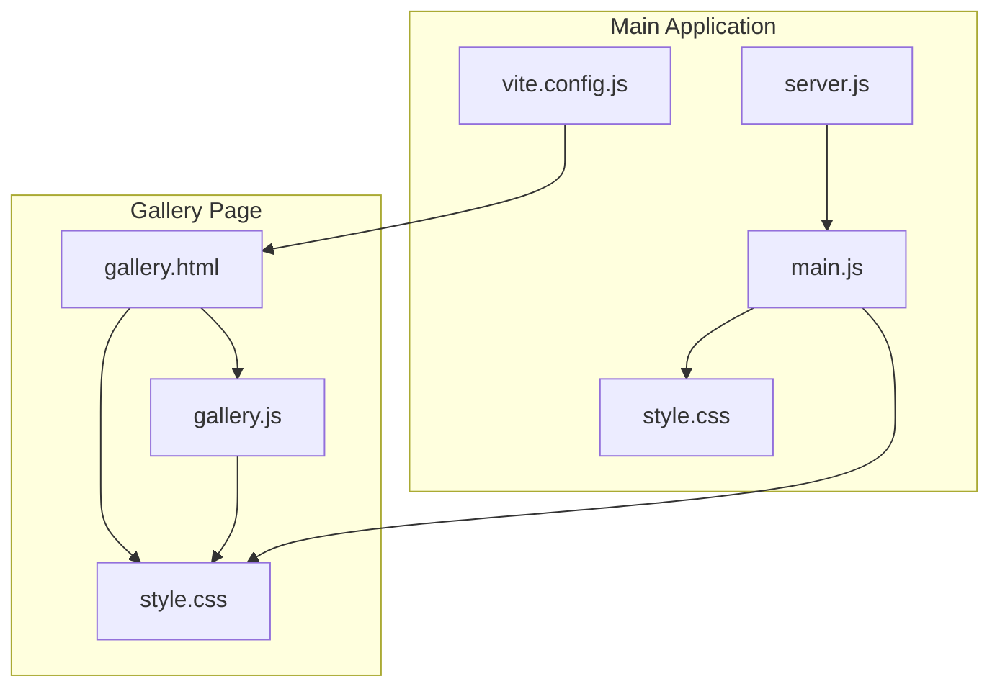
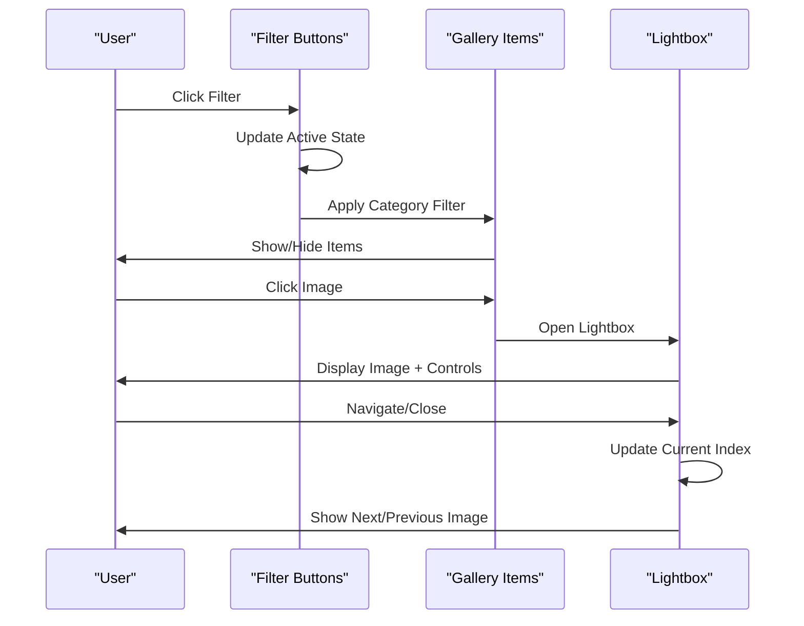
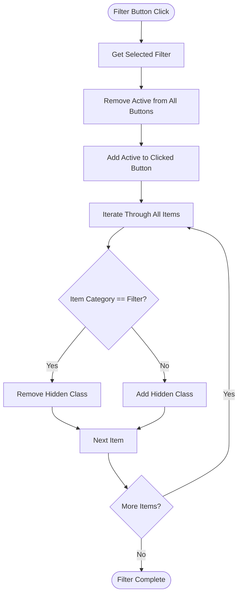
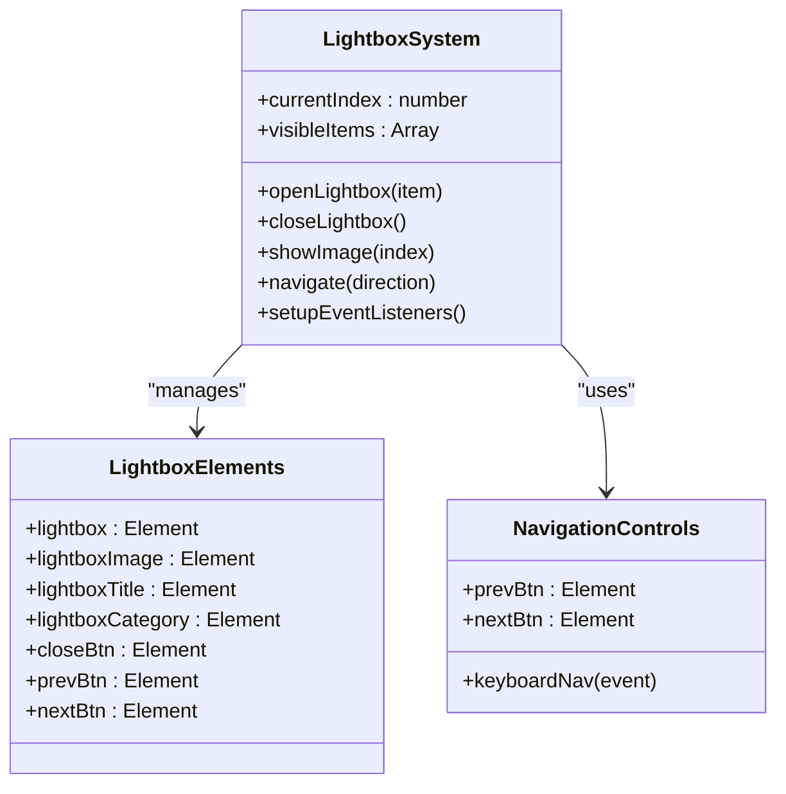
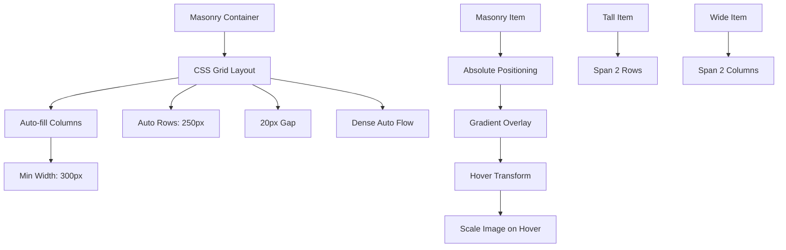
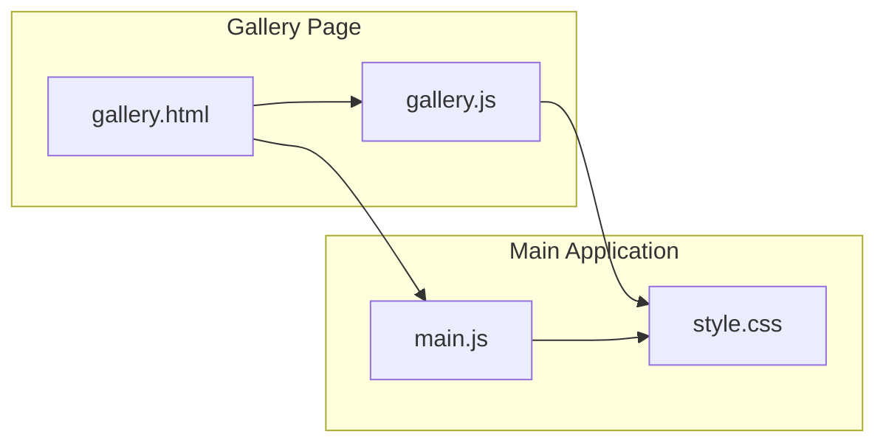
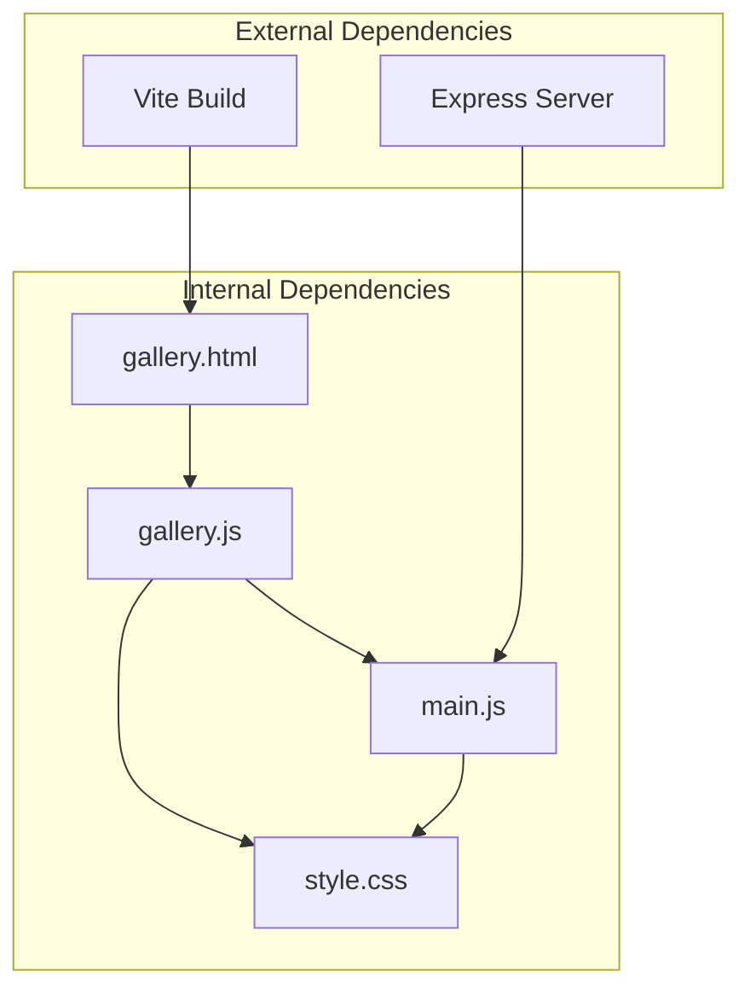

# Gallery System

<cite>
**Referenced Files in This Document**
- [gallery.js](file://src/gallery.js)
- [gallery.html](file://gallery.html)
- [main.js](file://src/main.js)
- [style.css](file://src/style.css)
- [server.js](file://server.js)
- [vite.config.js](file://vite.config.js)
</cite>

## Update Summary
**Changes Made**
- Enhanced CSS fallback mechanism for gallery image lazy loading animation
- Added graceful degradation support for JavaScript-disabled environments
- Improved accessibility with new CSS animation rules
- Updated lazy loading strategy documentation

## Table of Contents
1. [Introduction](#introduction)
2. [Project Structure](#project-structure)
3. [Core Components](#core-components)
4. [Architecture Overview](#architecture-overview)
5. [Detailed Component Analysis](#detailed-component-analysis)
6. [Enhanced Lazy Loading System](#enhanced-lazy-loading-system)
7. [Dependency Analysis](#dependency-analysis)
8. [Performance Considerations](#performance-considerations)
9. [Troubleshooting Guide](#troubleshooting-guide)
10. [Conclusion](#conclusion)
11. [Appendices](#appendices)

## Introduction
This document provides comprehensive documentation for the gallery system implemented in gallery.js. It covers the image gallery functionality including lightbox implementation, thumbnail navigation, image loading optimization, and responsive gallery layouts. It explains the gallery initialization process, event handling for image selection, and modal display management. It also details the integration with static image assets, lazy loading strategies, and performance optimization techniques. Examples of gallery configuration options, custom event handling, and accessibility features are included. The relationship between gallery.js and the main application is shown, demonstrating how galleries integrate with different page types. Browser compatibility, progressive enhancement techniques, and fallback strategies for unsupported browsers are addressed.

**Updated** Enhanced with new CSS fallback mechanism for graceful degradation when JavaScript is disabled, providing improved accessibility and user experience across all environments.

## Project Structure
The gallery system is implemented as a standalone module that integrates with the main application via the gallery page and shared styles. The gallery page defines the HTML structure for the masonry gallery and lightbox, while the gallery script handles filtering, lightbox interactions, and navigation. The main application script provides global enhancements such as lazy loading and cross-page navigation.



**Diagram sources**
- [gallery.html](file://gallery.html#L1-L536)
- [gallery.js](file://src/gallery.js#L1-L169)
- [style.css](file://src/style.css#L2216-L2458)
- [main.js](file://src/main.js#L1-L405)
- [server.js](file://server.js#L1-L800)
- [vite.config.js](file://vite.config.js#L1-L20)

**Section sources**
- [gallery.html](file://gallery.html#L1-L536)
- [gallery.js](file://src/gallery.js#L1-L169)
- [style.css](file://src/style.css#L2216-L2458)
- [main.js](file://src/main.js#L1-L405)
- [vite.config.js](file://vite.config.js#L1-L20)

## Core Components
The gallery system consists of two primary components:
- Gallery Filtering: Provides category-based filtering of masonry items using filter buttons.
- Lightbox Modal: Implements a modal overlay for displaying selected images with navigation controls.

Key features include:
- Category-based filtering with active state management
- Responsive masonry layout with tall and wide variants
- Lightbox with keyboard navigation and close controls
- Lazy loading integration for improved performance
- Accessibility attributes for screen readers and keyboard navigation
- Graceful degradation support for JavaScript-disabled environments

**Updated** Added graceful degradation support through CSS fallback animations for images with `loading="lazy"` attribute.

**Section sources**
- [gallery.js](file://src/gallery.js#L6-L59)
- [gallery.js](file://src/gallery.js#L61-L168)
- [style.css](file://src/style.css#L2265-L2458)

## Architecture Overview
The gallery system follows a modular architecture with clear separation of concerns:
- HTML structure defines the gallery grid and lightbox markup
- JavaScript handles event-driven interactions and state management
- CSS provides responsive layouts and animations
- Integration with main application enhances global functionality



**Diagram sources**
- [gallery.js](file://src/gallery.js#L14-L59)
- [gallery.js](file://src/gallery.js#L84-L167)
- [gallery.html](file://gallery.html#L488-L500)

## Detailed Component Analysis

### Gallery Filtering System
The filtering system manages category-based visibility of gallery items through interactive buttons.



**Diagram sources**
- [gallery.js](file://src/gallery.js#L14-L59)

Key implementation details:
- Event delegation through forEach iteration
- Active state management with CSS class toggling
- Category matching using data attributes
- Visibility control through hidden class application

**Section sources**
- [gallery.js](file://src/gallery.js#L6-L59)
- [gallery.html](file://gallery.html#L50-L61)

### Lightbox Modal Implementation
The lightbox provides a full-screen modal for displaying selected gallery images with navigation controls.



**Diagram sources**
- [gallery.js](file://src/gallery.js#L61-L168)
- [gallery.html](file://gallery.html#L488-L500)

Core functionality includes:
- Modal activation with body overflow control
- Dynamic content population from gallery items
- Navigation through arrow keys and button clicks
- Background click and escape key closing mechanisms

**Section sources**
- [gallery.js](file://src/gallery.js#L61-L168)
- [gallery.html](file://gallery.html#L488-L500)

### Responsive Gallery Layout
The gallery employs CSS Grid for responsive masonry layout with flexible sizing and automatic row spanning.



**Diagram sources**
- [style.css](file://src/style.css#L2265-L2335)

Responsive characteristics:
- Fluid column widths with minimum constraints
- Automatic row height calculation
- Dense packing algorithm for optimal space utilization
- Flexible tall/wide variants for varied content

**Section sources**
- [style.css](file://src/style.css#L2265-L2335)

### Integration with Main Application
The gallery system integrates seamlessly with the main application through shared scripts and styles.



**Diagram sources**
- [gallery.html](file://gallery.html#L532-L533)
- [main.js](file://src/main.js#L1-L405)

Integration points:
- Shared CSS for consistent styling
- Complementary JavaScript functionality
- Unified asset loading strategy
- Cross-page navigation support

**Section sources**
- [gallery.html](file://gallery.html#L532-L533)
- [main.js](file://src/main.js#L1-L405)

## Enhanced Lazy Loading System

**Updated** The gallery system now includes an enhanced lazy loading mechanism with graceful degradation support.

### JavaScript-Based Lazy Loading
The main application script implements intersection observer-based lazy loading for images with automatic class addition upon visibility.

### CSS Fallback Mechanism
A new CSS fallback mechanism ensures images are visible even when JavaScript is disabled or fails to load:

```css
/* Fallback: Show images after a short delay if JS fails */
img[loading="lazy"] {
  animation: fadeInLazy 0.3s ease-in 0.5s forwards;
}

@keyframes fadeInLazy {
  to {
    opacity: 1;
  }
}

img[loading="lazy"].loaded {
  opacity: 1;
}
```

### Graceful Degradation Strategy
The system provides multiple layers of fallback:
- **JavaScript Disabled**: CSS animation ensures images fade in after a brief delay
- **Intersection Observer Fails**: Images remain visible without animation
- **Slow Connections**: Images appear immediately with fade effect for better UX
- **Accessibility**: Screen readers can still access image content

### Performance Optimizations
- **CSS Animation**: Hardware-accelerated opacity transitions
- **Animation Delay**: 0.5s delay prevents premature loading flash
- **Transition Timing**: Smooth 0.3s ease-in animation
- **Fallback Priority**: CSS animation runs regardless of JavaScript state

**Section sources**
- [main.js](file://src/main.js#L219-L234)
- [style.css](file://src/style.css#L3470-L3483)

## Dependency Analysis
The gallery system has minimal external dependencies and maintains loose coupling with the broader application.



**Diagram sources**
- [gallery.js](file://src/gallery.js#L1-L169)
- [main.js](file://src/main.js#L1-L405)
- [server.js](file://server.js#L1-L800)
- [vite.config.js](file://vite.config.js#L1-L20)

Dependency relationships:
- gallery.js depends on gallery.html structure
- Both scripts share style.css for styling
- main.js provides global enhancements
- server.js handles backend integration
- vite.config.js manages build configuration

**Section sources**
- [gallery.js](file://src/gallery.js#L1-L169)
- [main.js](file://src/main.js#L1-L405)
- [server.js](file://server.js#L1-L800)
- [vite.config.js](file://vite.config.js#L1-L20)

## Performance Considerations
The gallery system implements several performance optimization techniques:

### Lazy Loading Strategy
The main application script implements intersection observer-based lazy loading for images with automatic class addition upon visibility.

### CSS Grid Optimization
The masonry layout uses CSS Grid with:
- `grid-auto-flow: dense` for optimal packing
- `grid-auto-rows` for consistent height calculation
- `object-fit: cover` for efficient image rendering

### Event Handling Efficiency
- Single event listener per button type
- Efficient DOM querying with cached selectors
- Minimal reflows through batched DOM manipulation

### Memory Management
- Proper event listener cleanup
- Modal state management
- Conditional element existence checks

### Enhanced Fallback Performance
**Updated** The new CSS fallback mechanism improves performance by:
- Reducing JavaScript dependency for basic image visibility
- Providing immediate visual feedback during slow connections
- Maintaining accessibility standards for all users

**Section sources**
- [main.js](file://src/main.js#L219-L234)
- [style.css](file://src/style.css#L2265-L2335)
- [gallery.js](file://src/gallery.js#L14-L59)

## Troubleshooting Guide
Common issues and solutions for the gallery system:

### Lightbox Not Opening
- Verify lightbox elements exist in the DOM
- Check for JavaScript errors in console
- Ensure proper image source URLs

### Filter Buttons Not Working
- Confirm filter button event listeners are attached
- Verify data-filter attributes match item categories
- Check CSS class manipulation logic

### Responsive Layout Issues
- Validate CSS Grid support in target browsers
- Check media query breakpoints
- Ensure adequate viewport meta tag configuration

### Performance Problems
- Monitor intersection observer performance
- Check for excessive DOM manipulations
- Verify CSS transform performance

### Lazy Loading Issues
**Updated** For images not appearing with lazy loading:
- Verify `loading="lazy"` attribute is present
- Check CSS fallback animation is loading correctly
- Ensure JavaScript is not blocking CSS processing
- Test in incognito mode to rule out caching issues

### JavaScript Disabled Environment
**Updated** When JavaScript is disabled:
- Images should still be visible after 0.5s delay
- CSS fallback animation should trigger automatically
- Verify CSS animation rules are not being blocked
- Check browser compatibility for CSS animations

**Section sources**
- [gallery.js](file://src/gallery.js#L70-L74)
- [gallery.js](file://src/gallery.js#L84-L104)
- [style.css](file://src/style.css#L2265-L2335)

## Conclusion
The gallery system provides a robust, accessible, and performant solution for displaying image collections with advanced filtering and modal viewing capabilities. Its modular architecture ensures maintainability and extensibility while maintaining seamless integration with the broader application ecosystem. The implementation demonstrates best practices in responsive design, accessibility, and performance optimization. The enhanced CSS fallback mechanism and graceful degradation support ensure reliable functionality across all environments, including JavaScript-disabled scenarios.

## Appendices

### Configuration Options
The gallery system supports the following configuration patterns:
- Category-based filtering through data attributes
- Responsive grid layout with customizable breakpoints
- Lightbox customization through CSS variables
- Event-driven interactions with callback hooks

### Accessibility Features
- Keyboard navigation support (arrow keys, escape)
- Screen reader compatibility with aria-label attributes
- Focus management for modal dialogs
- Sufficient color contrast ratios
- Graceful degradation for JavaScript-disabled environments
- CSS fallback animations for improved accessibility

### Browser Compatibility
- Modern CSS Grid support for layout
- Intersection Observer API for lazy loading
- Event listener APIs for interaction handling
- Progressive enhancement for older browsers
- CSS animation support for fallback mechanisms
- Graceful degradation across all modern browsers

### Enhanced Lazy Loading Configuration
**Updated** The new lazy loading system includes:
- CSS fallback animation with 0.5s delay
- JavaScript-based intersection observer
- Manual class addition for successful loads
- Smooth opacity transitions for better UX
- Compatibility with all modern browsers