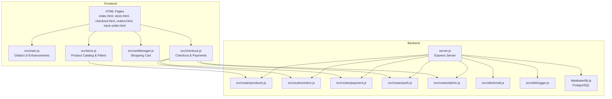
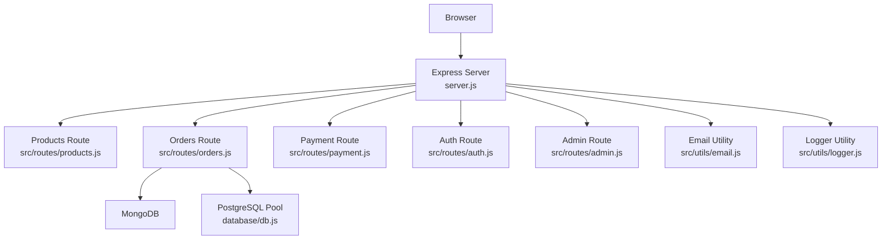
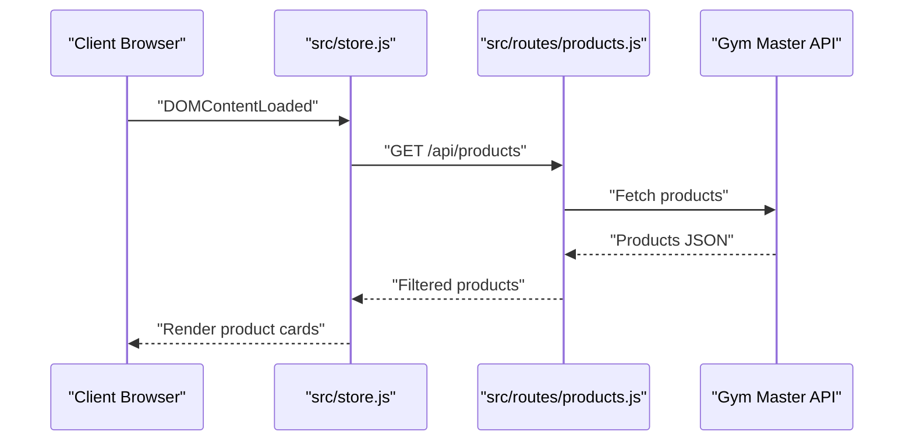
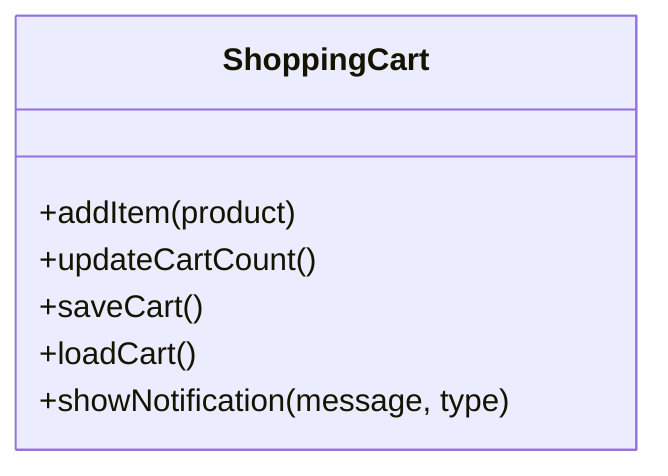
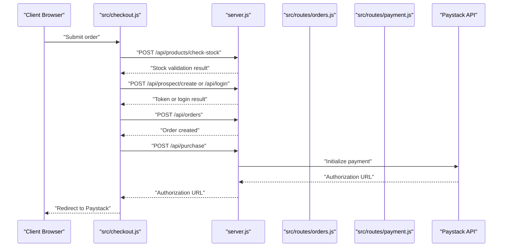
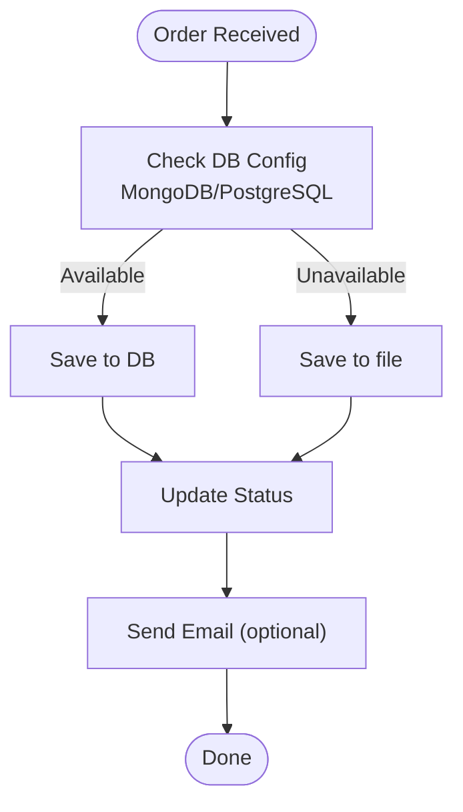
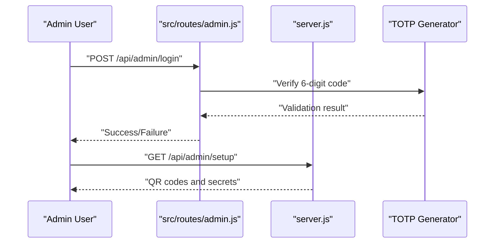
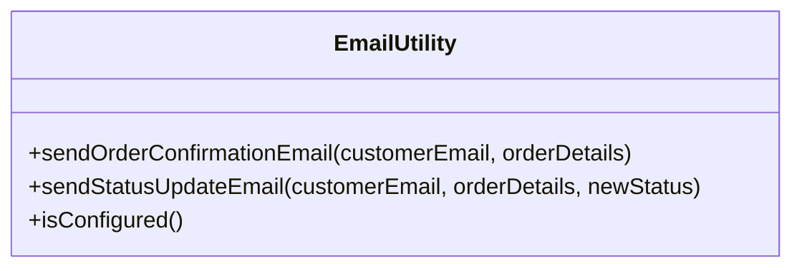
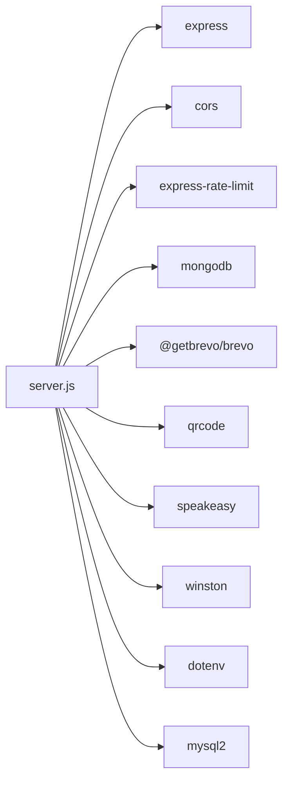

# Laundry Services

<cite>
**Referenced Files in This Document**
- [package.json](file://package.json)
- [server.js](file://server.js)
- [README.md](file://README.md)
- [src/main.js](file://src/main.js)
- [src/store.js](file://src/store.js)
- [src/cartManager.js](file://src/cartManager.js)
- [src/checkout.js](file://src/checkout.js)
- [src/route/products.js](file://src/routes/products.js)
- [src/route/orders.js](file://src/routes/orders.js)
- [src/route/payment.js](file://src/routes/payment.js)
- [src/route/auth.js](file://src/routes/auth.js)
- [src/route/admin.js](file://src/routes/admin.js)
- [src/utils/email.js](file://src/utils/email.js)
- [src/utils/logger.js](file://src/utils/logger.js)
- [database/db.js](file://database/db.js)
</cite>

## Table of Contents
1. [Introduction](#introduction)
2. [Project Structure](#project-structure)
3. [Core Components](#core-components)
4. [Architecture Overview](#architecture-overview)
5. [Detailed Component Analysis](#detailed-component-analysis)
6. [Dependency Analysis](#dependency-analysis)
7. [Performance Considerations](#performance-considerations)
8. [Troubleshooting Guide](#troubleshooting-guide)
9. [Conclusion](#conclusion)

## Introduction
This project is a modern e-commerce platform for a laundry and fitness services hub. It integrates with a third-party Gym Master system for membership and product data, supports online shopping with Paystack payments, and provides order tracking and admin management. The frontend is built with vanilla JavaScript and CSS, while the backend is a Node.js/Express server with optional MongoDB and PostgreSQL persistence.

## Project Structure
The project follows a modular structure:
- Frontend assets and pages under the project root
- Client-side scripts in src/ for UI interactions and cart logic
- Backend routes under src/routes/
- Utilities under src/utils/
- Database configuration under database/
- Server entry point at server.js
- Package configuration at package.json

**Diagram sources**
- [server.js:1-800](file://server.js#L1-L800)
- [src/main.js:1-405](file://src/main.js#L1-L405)
- [src/store.js:1-333](file://src/store.js#L1-L333)
- [src/cartManager.js:1-91](file://src/cartManager.js#L1-L91)
- [src/checkout.js:1-448](file://src/checkout.js#L1-L448)
- [src/routes/products.js:1-133](file://src/routes/products.js#L1-L133)
- [src/routes/orders.js:1-411](file://src/routes/orders.js#L1-L411)
- [src/routes/payment.js:1-154](file://src/routes/payment.js#L1-L154)
- [src/routes/auth.js:1-54](file://src/routes/auth.js#L1-L54)
- [src/routes/admin.js:1-140](file://src/routes/admin.js#L1-L140)
- [src/utils/email.js:1-433](file://src/utils/email.js#L1-L433)
- [src/utils/logger.js:1-67](file://src/utils/logger.js#L1-L67)
- [database/db.js:1-267](file://database/db.js#L1-L267)

**Section sources**
- [README.md:1-3](file://README.md#L1-L3)
- [package.json:1-33](file://package.json#L1-L33)

## Core Components
- Express server with rate limiting, CORS, and request logging
- Product catalog integration with Gym Master API and caching
- Shopping cart with localStorage persistence
- Checkout flow with member/new customer options, stock validation, and Paystack payment initiation
- Order management with file-based and MongoDB fallback, plus optional PostgreSQL
- Admin authentication with TOTP and QR setup
- Email notifications via Brevo transactional emails
- Logging with Winston and serverless-friendly file logging

**Section sources**
- [server.js:1-800](file://server.js#L1-L800)
- [src/routes/products.js:1-133](file://src/routes/products.js#L1-L133)
- [src/cartManager.js:1-91](file://src/cartManager.js#L1-L91)
- [src/checkout.js:1-448](file://src/checkout.js#L1-L448)
- [src/routes/orders.js:1-411](file://src/routes/orders.js#L1-L411)
- [src/routes/admin.js:1-140](file://src/routes/admin.js#L1-L140)
- [src/utils/email.js:1-433](file://src/utils/email.js#L1-L433)
- [src/utils/logger.js:1-67](file://src/utils/logger.js#L1-L67)
- [database/db.js:1-267](file://database/db.js#L1-L267)

## Architecture Overview
The system is a hybrid backend with optional persistence layers:
- Primary persistence: file-based JSON storage for orders
- Secondary persistence: MongoDB for orders and optional PostgreSQL for advanced features
- Frontend communicates with backend routes for products, orders, payments, and admin functions
- Gym Master API integration for membership checks, prospect creation, and product catalogs
- Brevo integration for order confirmation and status update emails

**Diagram sources**
- [server.js:1-800](file://server.js#L1-L800)
- [src/routes/products.js:1-133](file://src/routes/products.js#L1-L133)
- [src/routes/orders.js:1-411](file://src/routes/orders.js#L1-L411)
- [src/routes/payment.js:1-154](file://src/routes/payment.js#L1-L154)
- [src/routes/auth.js:1-54](file://src/routes/auth.js#L1-L54)
- [src/routes/admin.js:1-140](file://src/routes/admin.js#L1-L140)
- [src/utils/email.js:1-433](file://src/utils/email.js#L1-L433)
- [src/utils/logger.js:1-67](file://src/utils/logger.js#L1-L67)
- [database/db.js:1-267](file://database/db.js#L1-L267)

## Detailed Component Analysis

### Product Catalog Integration
The product catalog fetches data from Gym Master, caches it, filters out delivery/pickup items, and exposes stock-check endpoints.

**Diagram sources**
- [src/store.js:14-98](file://src/store.js#L14-L98)
- [src/routes/products.js:53-91](file://src/routes/products.js#L53-L91)

**Section sources**
- [src/routes/products.js:1-133](file://src/routes/products.js#L1-L133)
- [src/store.js:1-333](file://src/store.js#L1-L333)

### Shopping Cart Management
The cart persists in localStorage, validates stock limits, and updates UI counters.

**Diagram sources**
- [src/cartManager.js:1-91](file://src/cartManager.js#L1-L91)

**Section sources**
- [src/cartManager.js:1-91](file://src/cartManager.js#L1-L91)

### Checkout and Payment Flow
The checkout validates stock, handles new/existing members, creates prospects, initiates Paystack payments, and manages order persistence.

**Diagram sources**
- [src/checkout.js:149-448](file://src/checkout.js#L149-L448)
- [src/routes/orders.js:216-271](file://src/routes/orders.js#L216-L271)
- [src/routes/payment.js:31-110](file://src/routes/payment.js#L31-L110)
- [server.js:760-800](file://server.js#L760-L800)

**Section sources**
- [src/checkout.js:1-448](file://src/checkout.js#L1-L448)
- [src/routes/orders.js:1-411](file://src/routes/orders.js#L1-L411)
- [src/routes/payment.js:1-154](file://src/routes/payment.js#L1-L154)
- [server.js:1-800](file://server.js#L1-L800)

### Order Management and Persistence
The system supports file-based, MongoDB, and PostgreSQL persistence with fallback mechanisms and TOTP-protected deletion.

**Diagram sources**
- [src/routes/orders.js:53-85](file://src/routes/orders.js#L53-L85)
- [server.js:160-250](file://server.js#L160-L250)
- [database/db.js:66-240](file://database/db.js#L66-L240)

**Section sources**
- [src/routes/orders.js:1-411](file://src/routes/orders.js#L1-L411)
- [server.js:106-250](file://server.js#L106-L250)
- [database/db.js:1-267](file://database/db.js#L1-L267)

### Admin Authentication and Security
Admin login uses TOTP with QR setup and rate limiting to prevent brute-force attacks.

**Diagram sources**
- [src/routes/admin.js:10-38](file://src/routes/admin.js#L10-L38)
- [server.js:382-398](file://server.js#L382-L398)

**Section sources**
- [src/routes/admin.js:1-140](file://src/routes/admin.js#L1-L140)
- [server.js:359-435](file://server.js#L359-L435)

### Email Notifications
Emails are sent via Brevo for order confirmations and status updates with robust error handling.

**Diagram sources**
- [src/utils/email.js:428-432](file://src/utils/email.js#L428-L432)

**Section sources**
- [src/utils/email.js:1-433](file://src/utils/email.js#L1-L433)

## Dependency Analysis
Key runtime dependencies include Express, MongoDB driver, Paystack SDK, Brevo email, rate limiting, and Winston logging.

**Diagram sources**
- [package.json:19-31](file://package.json#L19-L31)
- [server.js:1-15](file://server.js#L1-L15)

**Section sources**
- [package.json:1-33](file://package.json#L1-L33)
- [server.js:1-26](file://server.js#L1-L26)

## Performance Considerations
- Product caching reduces Gym Master API calls and improves load times
- Rate limiting protects endpoints from abuse
- LocalStorage cart avoids server round-trips for client-side cart operations
- Optional MongoDB and PostgreSQL provide scalable persistence with fallbacks
- Request logging helps monitor performance and detect bottlenecks

## Troubleshooting Guide
Common issues and resolutions:
- Gym Master API credentials missing: Configure environment variables for API key, base URL, and company ID
- MongoDB connection failures: Verify URI and credentials; fallback to file storage is automatic
- Paystack payment initialization errors: Check secret key and network connectivity
- Email delivery failures: Confirm Brevo API key and sender configuration
- Admin TOTP setup: Use the QR setup endpoint to configure authenticator apps

**Section sources**
- [src/routes/products.js:56-64](file://src/routes/products.js#L56-L64)
- [server.js:106-158](file://server.js#L106-L158)
- [src/routes/payment.js:65-91](file://src/routes/payment.js#L65-L91)
- [src/utils/email.js:25-38](file://src/utils/email.js#L25-L38)
- [src/routes/admin.js:40-137](file://src/routes/admin.js#L40-L137)

## Conclusion
This laundry services platform combines a responsive frontend with a robust backend that integrates with Gym Master, supports secure payments via Paystack, and provides comprehensive order management with optional persistence layers. The modular design, security measures, and extensible utilities make it suitable for scaling and maintenance.