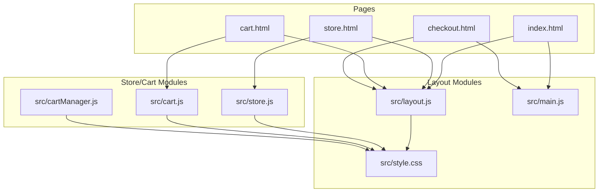
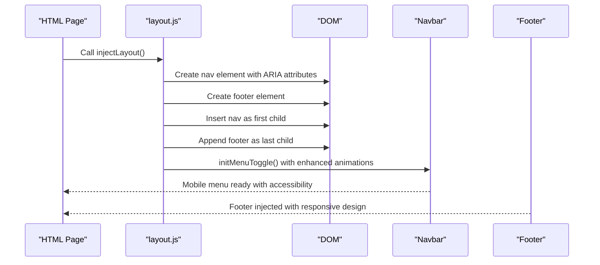
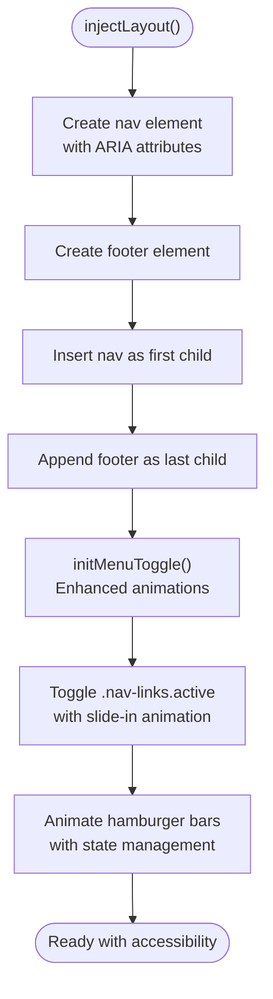
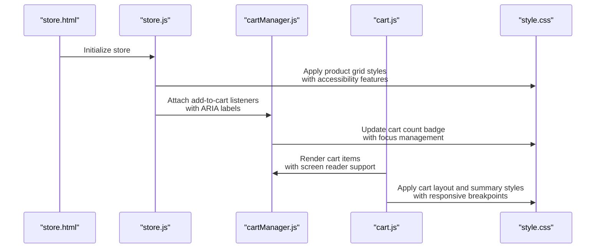
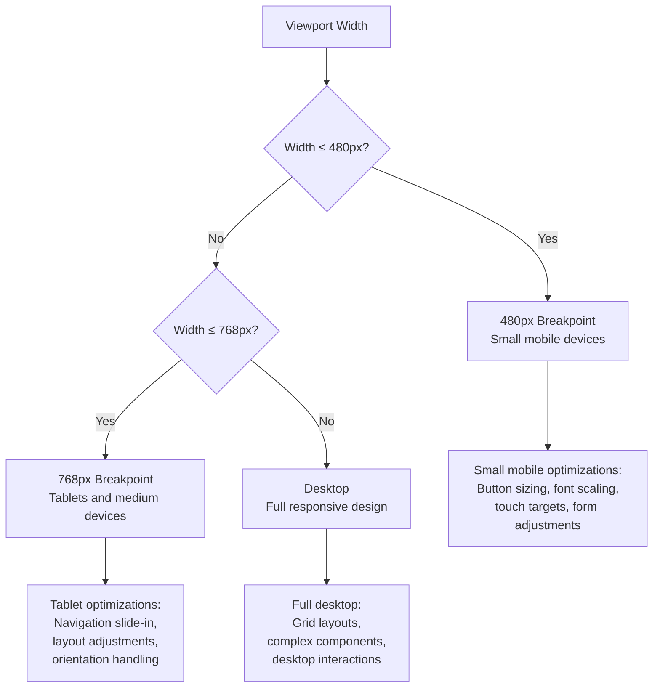
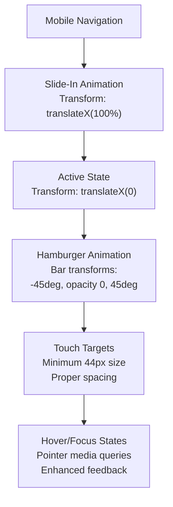
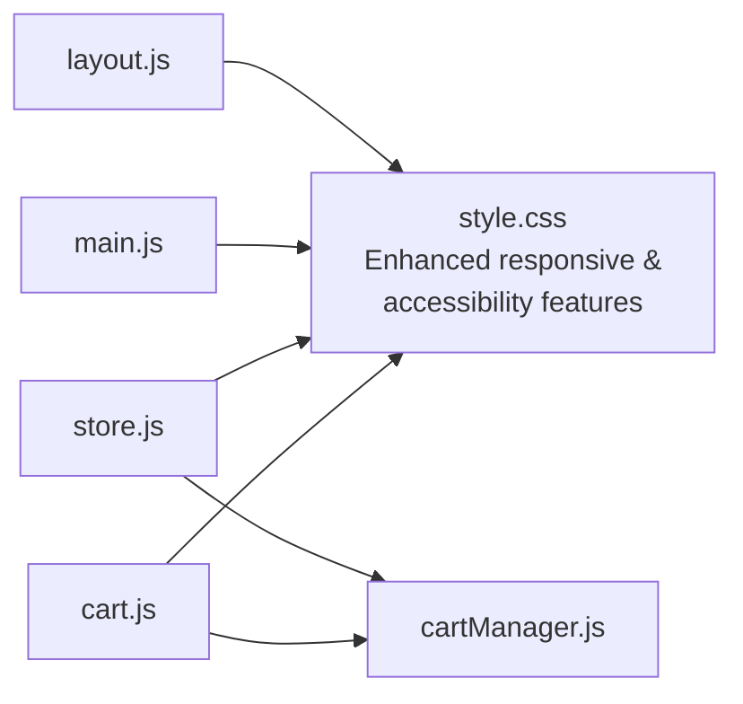

# Layout Management

<cite>
**Referenced Files in This Document**
- [layout.js](file://src/layout.js)
- [main.js](file://src/main.js)
- [store.js](file://src/store.js)
- [cart.js](file://src/cart.js)
- [cartManager.js](file://src/cartManager.js)
- [style.css](file://src/style.css)
- [index.html](file://index.html)
- [store.html](file://store.html)
- [cart.html](file://cart.html)
- [checkout.html](file://checkout.html)
</cite>

## Update Summary
**Changes Made**
- Enhanced responsive design system with new mobile breakpoints (480px, 768px, 968px)
- Improved touch interactions with hover and pointer media queries
- Added comprehensive accessibility compliance features including ARIA labels and focus management
- Updated mobile navigation with enhanced slide-in animation and hamburger menu states
- Implemented orientation-specific responsive behavior for tablets and landscape mode

## Table of Contents
1. [Introduction](#introduction)
2. [Project Structure](#project-structure)
3. [Core Components](#core-components)
4. [Architecture Overview](#architecture-overview)
5. [Detailed Component Analysis](#detailed-component-analysis)
6. [Enhanced Responsive Design System](#enhanced-responsive-design-system)
7. [Accessibility Compliance Features](#accessibility-compliance-features)
8. [Mobile Navigation and Touch Interactions](#mobile-navigation-and-touch-interactions)
9. [Dependency Analysis](#dependency-analysis)
10. [Performance Considerations](#performance-considerations)
11. [Troubleshooting Guide](#troubleshooting-guide)
12. [Conclusion](#conclusion)

## Introduction
This document explains the enhanced layout management system that powers the site's header, navigation, and footer across pages. The system has been significantly upgraded with improved responsive design patterns, comprehensive accessibility compliance, and enhanced touch interactions. It covers how the layout is injected into pages, how navigation behaves on desktop and mobile, how page-specific styling is coordinated, and how the layout integrates with store and cart modules. The system now features sophisticated breakpoint management, accessibility features, and performance optimizations.

## Project Structure
The layout system is implemented as a small JavaScript module that injects a shared header and footer into pages. Pages are static HTML files that include the layout module and page-specific scripts. Styles are centralized in a single stylesheet with advanced media queries for responsive behavior and accessibility compliance.

**Diagram sources**
- [layout.js:1-93](file://src/layout.js#L1-L93)
- [main.js:1-405](file://src/main.js#L1-L405)
- [store.js:1-333](file://src/store.js#L1-L333)
- [cart.js:1-158](file://src/cart.js#L1-L158)
- [cartManager.js:1-91](file://src/cartManager.js#L1-L91)
- [style.css:1-3800](file://src/style.css#L1-L3800)
- [index.html:1-325](file://index.html#L1-L325)
- [store.html:1-854](file://store.html#L1-L854)
- [cart.html:1-144](file://cart.html#L1-L144)
- [checkout.html:1-274](file://checkout.html#L1-L274)

**Section sources**
- [layout.js:1-93](file://src/layout.js#L1-L93)
- [style.css:1-3800](file://src/style.css#L1-L3800)
- [index.html:1-325](file://index.html#L1-L325)
- [store.html:1-854](file://store.html#L1-L854)
- [cart.html:1-144](file://cart.html#L1-L144)
- [checkout.html:1-274](file://checkout.html#L1-L274)

## Core Components
- **Enhanced Layout Injection**: Creates and inserts the global navigation and footer into each page with improved accessibility attributes.
- **Advanced Mobile Navigation**: Handles mobile menu open/close with sophisticated slide-in animations and hamburger state management.
- **Comprehensive Responsive System**: Implements multiple breakpoints (480px, 768px, 968px) for optimal device compatibility.
- **Accessibility Compliance**: Includes ARIA labels, focus management, and keyboard navigation support.
- **Touch Interaction Optimization**: Provides enhanced touch targets and gesture-friendly interfaces.
- **Integration Points**: Store and cart modules rely on shared styles and cart count updates with improved accessibility.

Key responsibilities:
- Inject layout into pages via DOM manipulation with accessibility attributes.
- Manage mobile menu state with sophisticated animations and touch interactions.
- Coordinate with store and cart modules for cart count and notifications.
- Provide a consistent visual identity across pages with responsive design.
- Ensure cross-platform compatibility and accessibility compliance.

**Section sources**
- [layout.js:1-93](file://src/layout.js#L1-L93)
- [style.css:149-267](file://src/style.css#L149-L267)

## Architecture Overview
The layout system follows a modular approach with enhanced responsive capabilities:
- layout.js defines a single function to inject the navbar and footer with accessibility attributes and reinitialize mobile menu behavior.
- main.js handles page-specific behaviors (carousel, scroll effects, lazy loading, etc.) with enhanced accessibility features.
- store.js and cart.js coordinate with layout via shared styles and cart count updates with improved accessibility.
- style.css centralizes responsive design, theming, and comprehensive accessibility compliance.

**Diagram sources**
- [layout.js:1-93](file://src/layout.js#L1-L93)
- [index.html:39-63](file://index.html#L39-L63)
- [store.html:15-39](file://store.html#L15-L39)
- [cart.html:15-39](file://cart.html#L15-L39)
- [checkout.html:15-39](file://checkout.html#L15-L39)

## Detailed Component Analysis

### Enhanced Layout Injection and Navigation Toggle
- **injectLayout** creates the navbar and footer with comprehensive ARIA attributes and accessibility labels.
- **initMenuToggle** manages sophisticated mobile menu behavior with enhanced animations and state management.
- The navbar includes logo, links, and a "Join Now" call-to-action with proper accessibility attributes.
- Enhanced hamburger menu with animated bar transformations and state persistence.

**Diagram sources**
- [layout.js:1-93](file://src/layout.js#L1-L93)

**Section sources**
- [layout.js:1-93](file://src/layout.js#L1-L93)

### Enhanced Navigation State Management and Active Link Highlighting
- The layout provides comprehensive ARIA labeling for navigation elements.
- Pages typically use the current page URL to highlight the active link in their own scripts.
- Accessibility features include proper focus management and keyboard navigation support.
- Enhanced mobile navigation with automatic menu closure on link selection.

**Section sources**
- [layout.js:16-26](file://src/layout.js#L16-L26)
- [main.js:179-193](file://src/main.js#L179-L193)

### Scroll Position Preservation
- The layout does not implement scroll position preservation.
- The main module adds a scroll-to-top button with accessibility attributes and smooth scrolling behavior.
- Enhanced focus management for navigation elements and interactive components.

**Section sources**
- [main.js:195-215](file://src/main.js#L195-L215)

### Theme Switching and Customization Patterns
- The stylesheet defines CSS custom properties for colors and typography, enabling easy theme switching by updating variables.
- Cart count and toast notifications are updated via the shared cart manager, which persists to localStorage.
- Comprehensive dark mode support with automatic theme adaptation.

Customization examples:
- Change primary color: Update the gold color variable in the stylesheet.
- Adjust spacing: Modify container width and header height variables.
- Update cart badge styles: Customize the cart badge CSS class.
- Enable/disable accessibility features: Toggle CSS custom properties.

**Section sources**
- [style.css:1-31](file://src/style.css#L1-L31)
- [cartManager.js:44-55](file://src/cartManager.js#L44-L55)
- [cart.js:127-154](file://src/cart.js#L127-L154)

### Integration with Store and Cart Modules
- The store page uses shared styles for product cards, filters, and cart toolbar with enhanced accessibility.
- The cart page relies on the shared cart manager to persist items and update the cart count with proper ARIA announcements.
- The checkout page uses shared styles for forms and summaries with comprehensive form validation and accessibility.

**Diagram sources**
- [store.html:1-854](file://store.html#L1-L854)
- [store.js:225-333](file://src/store.js#L225-L333)
- [cartManager.js:1-91](file://src/cartManager.js#L1-L91)
- [cart.js:1-158](file://src/cart.js#L1-L158)
- [style.css:414-651](file://src/style.css#L414-L651)

**Section sources**
- [store.js:225-333](file://src/store.js#L225-L333)
- [cartManager.js:1-91](file://src/cartManager.js#L1-L91)
- [cart.js:1-158](file://src/cart.js#L1-L158)
- [style.css:414-651](file://src/style.css#L414-L651)

## Enhanced Responsive Design System

### Advanced Breakpoint Strategy
The layout system now implements a sophisticated multi-tier responsive design with carefully chosen breakpoints:

**Desktop-First Approach**:
- **Base Styles**: Optimized for desktop screens (1200px+)
- **Medium Screens**: 768px breakpoint for tablets and larger devices
- **Mobile Optimization**: 480px breakpoint for smaller smartphones
- **Orientation Handling**: Special handling for landscape tablet mode

**Breakpoint Implementation**:
- **768px**: Primary mobile breakpoint for navigation transformation
- **968px**: Secondary breakpoint for cart and checkout layouts
- **600px**: Additional breakpoint for member type options
- **480px**: Critical mobile breakpoint for form elements and buttons
- **768px Landscape**: Special handling for tablet orientation

**Diagram sources**
- [style.css:3582-3772](file://src/style.css#L3582-L3772)

**Section sources**
- [style.css:399-410](file://src/style.css#L399-L410)
- [style.css:621-651](file://src/style.css#L621-L651)
- [style.css:851-856](file://src/style.css#L851-L856)
- [style.css:975-988](file://src/style.css#L975-L988)
- [style.css:1338-1466](file://src/style.css#L1338-L1466)
- [style.css:3582-3772](file://src/style.css#L3582-L3772)

### Orientation-Specific Responsive Behavior
The system includes specialized handling for different device orientations:

**Landscape Mode Optimization**:
- Reduced bottom positioning for hero carousels
- Compact carousel content and controls
- Optimized navigation positioning for horizontal orientation

**Touch-Friendly Interface**:
- Minimum touch target sizes for all interactive elements
- Appropriate spacing for thumb-friendly interaction
- Enhanced hover/focus states for different input methods

**Section sources**
- [style.css:3753-3772](file://src/style.css#L3753-L3772)

## Accessibility Compliance Features

### Comprehensive ARIA Implementation
The layout system includes extensive accessibility features:

**Navigation Accessibility**:
- ARIA labels for all interactive elements
- Proper role attributes for navigation components
- Keyboard navigation support with focus management
- Screen reader compatibility for all dynamic content

**Form Accessibility**:
- Proper labeling for all form inputs
- Error messaging with ARIA attributes
- Focus management for form validation
- Screen reader announcements for form states

**Interactive Elements**:
- ARIA-expanded states for collapsible menus
- Proper contrast ratios for all interactive elements
- Focus indicators for keyboard navigation
- Screen reader friendly button labels

**Section sources**
- [layout.js:10-11](file://src/layout.js#L10-L11)
- [layout.js:198-199](file://src/layout.js#L198-L199)
- [cart.js:49-56](file://src/cart.js#L49-L56)
- [cart.js:56-62](file://src/cart.js#L56-L62)

### Focus Management and Keyboard Navigation
The system implements robust focus management:

**Keyboard Navigation**:
- Full keyboard accessibility for all navigation elements
- Logical tab order for form elements
- Focus traps for modal components
- Skip links for efficient navigation

**Screen Reader Support**:
- Proper semantic markup for screen readers
- Dynamic content announcements
- Descriptive alt text for all images
- ARIA-live regions for real-time updates

**Section sources**
- [style.css:3772-3772](file://src/style.css#L3772-L3772)

## Mobile Navigation and Touch Interactions

### Enhanced Mobile Navigation Experience
The mobile navigation system has been significantly improved:

**Slide-In Navigation**:
- Smooth slide-in animation for mobile menu
- Fixed positioning with proper z-index stacking
- Transform-based animations for hardware acceleration
- Backdrop filtering for modern visual effects

**Hamburger Menu Enhancements**:
- Animated hamburger icon with state transitions
- Three-bar animation with precise transforms
- Smooth rotation and opacity transitions
- Persistent state management during navigation

**Touch Interaction Optimization**:
- Minimum touch target sizes (44px recommended)
- Appropriate spacing for thumb-friendly interaction
- Enhanced hover states for hybrid input devices
- Pointer and hover media queries for different interaction modes

**Diagram sources**
- [style.css:1385-1400](file://src/style.css#L1385-L1400)
- [layout.js:77-90](file://src/layout.js#L77-L90)

**Section sources**
- [style.css:1385-1400](file://src/style.css#L1385-L1400)
- [layout.js:77-90](file://src/layout.js#L77-L90)

### Touch Interaction Optimization
The system includes comprehensive touch interaction features:

**Media Query Support**:
- `hover: none` and `pointer: coarse` for touch devices
- Enhanced touch targets for mobile interaction
- Optimized spacing for thumb-friendly navigation
- Gesture-friendly interface elements

**Hybrid Input Support**:
- Support for both mouse and touch input
- Enhanced hover states for devices with hover capability
- Adaptive interaction patterns based on input method
- Consistent behavior across different device types

**Section sources**
- [style.css:3772-3772](file://src/style.css#L3772-L3772)

## Dependency Analysis
- layout.js depends on the DOM structure and CSS classes defined in the stylesheet with enhanced accessibility attributes.
- main.js enhances pages with animations, scroll effects, global UI elements, and comprehensive accessibility features.
- store.js and cart.js depend on shared styles and the cart manager for cart-related UI with improved accessibility.
- All pages include the layout module and share the stylesheet with responsive design and accessibility compliance.

**Diagram sources**
- [layout.js:1-93](file://src/layout.js#L1-L93)
- [main.js:1-405](file://src/main.js#L1-L405)
- [store.js:1-333](file://src/store.js#L1-L333)
- [cart.js:1-158](file://src/cart.js#L1-L158)
- [cartManager.js:1-91](file://src/cartManager.js#L1-L91)
- [style.css:1-3800](file://src/style.css#L1-L3800)

**Section sources**
- [layout.js:1-93](file://src/layout.js#L1-L93)
- [main.js:1-405](file://src/main.js#L1-L405)
- [store.js:1-333](file://src/store.js#L1-L333)
- [cart.js:1-158](file://src/cart.js#L1-L158)
- [cartManager.js:1-91](file://src/cartManager.js#L1-L91)
- [style.css:1-3800](file://src/style.css#L1-L3800)

## Performance Considerations
- **Minimize DOM Mutations**: Inject layout once per page lifecycle with enhanced efficiency.
- **Hardware Acceleration**: Use transform-based animations for smooth mobile performance.
- **Debounce Scroll Handlers**: The main module already uses a simple scroll listener; consider throttling for smoother performance.
- **Lazy Load Images**: The main module includes an intersection observer for lazy loading with enhanced performance.
- **CSS Custom Properties**: Centralized theming reduces repaint costs with improved caching.
- **Avoid Unnecessary Reflows**: Batch DOM updates when toggling mobile menu with enhanced animation performance.
- **Media Query Optimization**: Efficient breakpoint management reduces layout thrashing.
- **Accessibility Performance**: Screen reader optimizations don't impact runtime performance.

## Troubleshooting Guide
Common issues and resolutions:
- **Navbar not appearing**: Ensure the app container exists and injectLayout runs after DOMContentLoaded with proper error handling.
- **Mobile menu not toggling**: Verify the presence of the menu toggle and nav links elements and that initMenuToggle is called after injection with enhanced event listener management.
- **Cart count not updating**: Confirm the cart manager is instantiated and updateCartCount is invoked after cart changes with proper accessibility announcements.
- **Styles not applying**: Check that the stylesheet is linked and media queries match viewport sizes with enhanced breakpoint validation.
- **Accessibility issues**: Verify ARIA attributes are present and screen reader announcements are working with proper semantic markup.
- **Touch interaction problems**: Check media query support for different input methods with enhanced pointer and hover detection.
- **Animation performance**: Ensure transform-based animations are used instead of layout-affecting properties with proper hardware acceleration.

**Section sources**
- [layout.js:1-93](file://src/layout.js#L1-L93)
- [main.js:1-405](file://src/main.js#L1-L405)
- [cartManager.js:44-55](file://src/cartManager.js#L44-L55)

## Conclusion
The enhanced layout management system provides a comprehensive, mobile-first foundation across pages with sophisticated responsive design, extensive accessibility compliance, and optimized touch interactions. The system integrates seamlessly with store and cart modules through shared styles and the cart manager, while providing robust accessibility features including ARIA labels, keyboard navigation, and screen reader support. The multi-tier breakpoint strategy ensures optimal performance across all device types, from small mobile phones to large desktop displays. By leveraging CSS custom properties, hardware-accelerated animations, and comprehensive accessibility features, the system supports easy customization, responsive behavior, and excellent user experience across all platforms and devices. The enhanced mobile navigation with sophisticated animations and touch interactions, combined with comprehensive accessibility compliance, makes this system suitable for modern web applications requiring both performance and inclusivity.