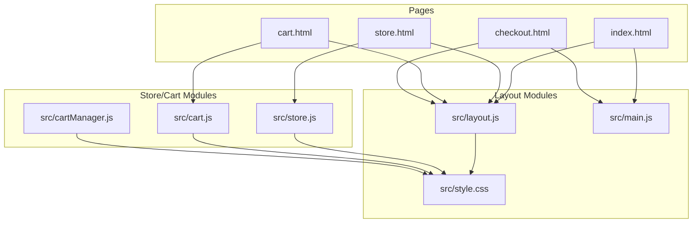
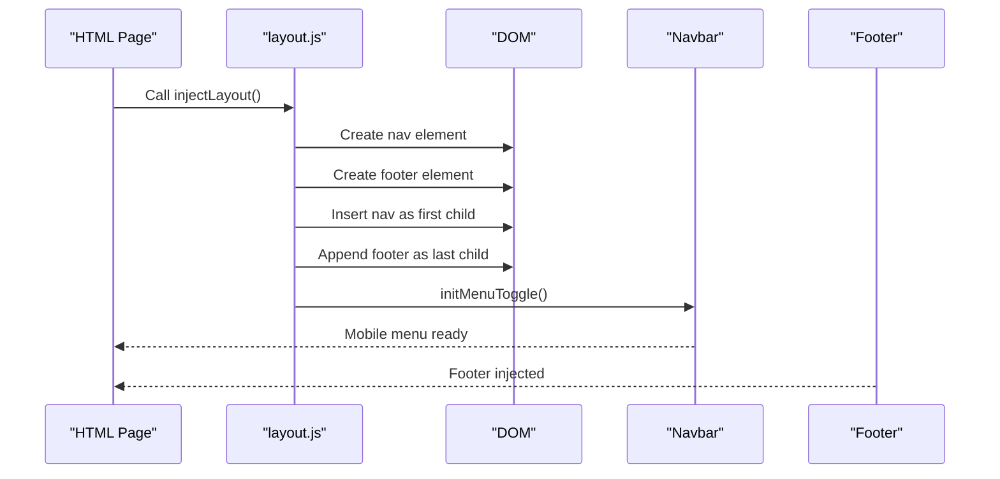
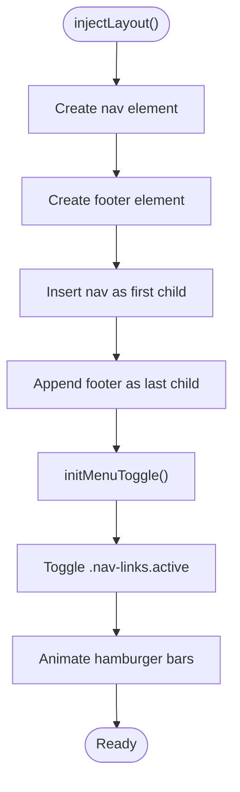
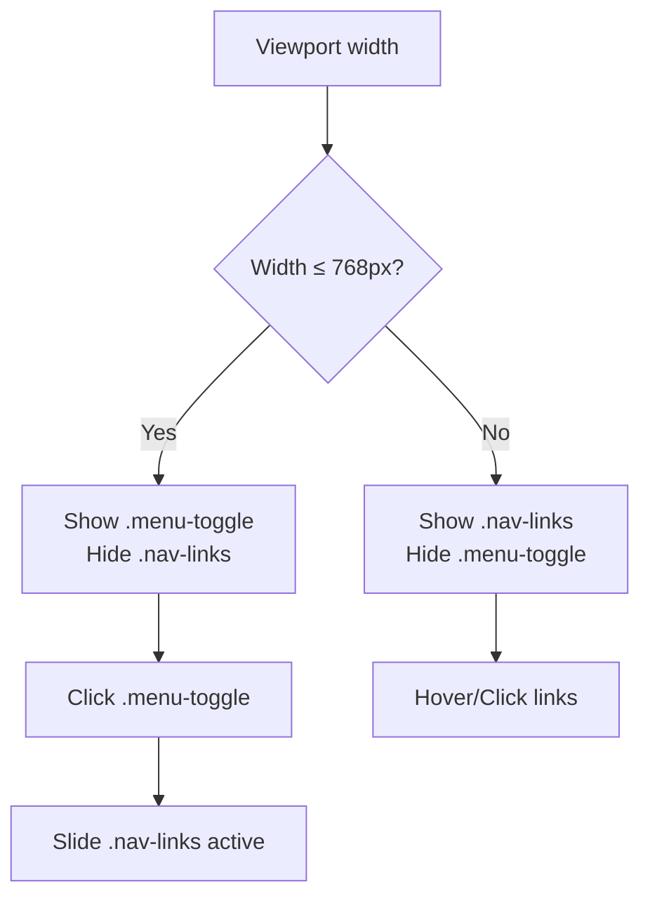
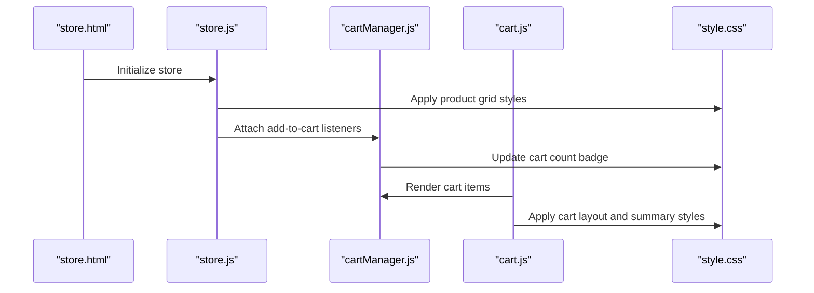
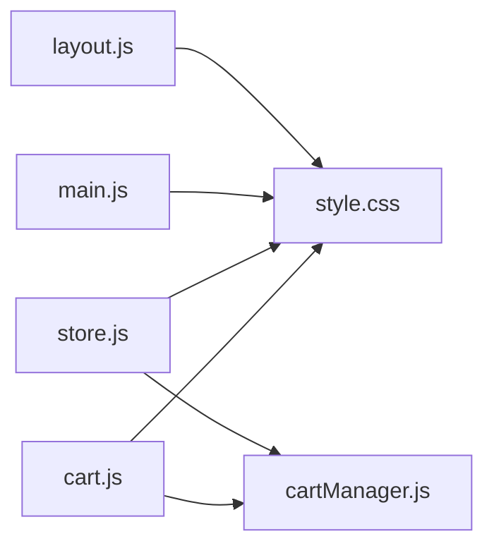

# Layout Management

<cite>
**Referenced Files in This Document**
- [layout.js](file://src/layout.js)
- [main.js](file://src/main.js)
- [store.js](file://src/store.js)
- [cart.js](file://src/cart.js)
- [cartManager.js](file://src/cartManager.js)
- [style.css](file://src/style.css)
- [index.html](file://index.html)
- [store.html](file://store.html)
- [cart.html](file://cart.html)
- [checkout.html](file://checkout.html)
</cite>

## Table of Contents
1. [Introduction](#introduction)
2. [Project Structure](#project-structure)
3. [Core Components](#core-components)
4. [Architecture Overview](#architecture-overview)
5. [Detailed Component Analysis](#detailed-component-analysis)
6. [Dependency Analysis](#dependency-analysis)
7. [Performance Considerations](#performance-considerations)
8. [Troubleshooting Guide](#troubleshooting-guide)
9. [Conclusion](#conclusion)

## Introduction
This document explains the layout management system that powers the site’s header, navigation, and footer across pages. It covers how the layout is injected into pages, how navigation behaves on desktop and mobile, how page-specific styling is coordinated, and how the layout integrates with store and cart modules. It also documents responsive design patterns, accessibility features, and performance considerations.

## Project Structure
The layout system is implemented as a small JavaScript module that injects a shared header and footer into pages. Pages are static HTML files that include the layout module and page-specific scripts. Styles are centralized in a single stylesheet with media queries for responsiveness.

**Diagram sources**
- [layout.js](file://src/layout.js#L1-L93)
- [main.js](file://src/main.js#L1-L405)
- [store.js](file://src/store.js#L1-L316)
- [cart.js](file://src/cart.js#L1-L156)
- [cartManager.js](file://src/cartManager.js#L1-L91)
- [style.css](file://src/style.css#L1-L800)
- [index.html](file://index.html#L1-L325)
- [store.html](file://store.html#L1-L854)
- [cart.html](file://cart.html#L1-L144)
- [checkout.html](file://checkout.html#L1-L274)

**Section sources**
- [layout.js](file://src/layout.js#L1-L93)
- [style.css](file://src/style.css#L1-L800)
- [index.html](file://index.html#L1-L325)
- [store.html](file://store.html#L1-L854)
- [cart.html](file://cart.html#L1-L144)
- [checkout.html](file://checkout.html#L1-L274)

## Core Components
- Layout injection: Creates and inserts the global navigation and footer into each page.
- Navigation toggle: Handles mobile menu open/close and hamburger animation.
- Page-specific styling: Each page sets a distinct header background and title.
- Integration points: Store and cart modules rely on shared styles and cart count updates.

Key responsibilities:
- Inject layout into pages via DOM manipulation.
- Manage mobile menu state and animations.
- Coordinate with store and cart modules for cart count and notifications.
- Provide a consistent visual identity across pages.

**Section sources**
- [layout.js](file://src/layout.js#L1-L93)
- [style.css](file://src/style.css#L149-L267)

## Architecture Overview
The layout system follows a modular approach:
- layout.js defines a single function to inject the navbar and footer and reinitialize mobile menu behavior.
- main.js handles page-specific behaviors (carousel, scroll effects, lazy loading, etc.) and global enhancements.
- store.js and cart.js coordinate with layout via shared styles and cart count updates.
- style.css centralizes responsive design and theming.

**Diagram sources**
- [layout.js](file://src/layout.js#L1-L93)
- [index.html](file://index.html#L39-L63)
- [store.html](file://store.html#L15-L39)
- [cart.html](file://cart.html#L15-L39)
- [checkout.html](file://checkout.html#L15-L39)

## Detailed Component Analysis

### Layout Injection and Navigation Toggle
- injectLayout creates the navbar and footer, inserts them into the page, and reinitializes the mobile menu toggle.
- initMenuToggle toggles the mobile menu visibility and animates the hamburger icon bars.
- The navbar includes logo, links, and a “Join Now” call-to-action.

**Diagram sources**
- [layout.js](file://src/layout.js#L1-L93)

**Section sources**
- [layout.js](file://src/layout.js#L1-L93)

### Responsive Navigation and Mobile-First Design
- Desktop navigation is always visible.
- On narrow screens, the mobile menu appears behind the hamburger icon and slides into view when toggled.
- The stylesheet defines media queries for responsive adjustments (e.g., store toolbar layout, cart layout).

**Diagram sources**
- [style.css](file://src/style.css#L400-L410)
- [layout.js](file://src/layout.js#L71-L92)

**Section sources**
- [style.css](file://src/style.css#L400-L410)
- [layout.js](file://src/layout.js#L71-L92)

### Page-Specific Styling Coordination
- Each page sets a unique header background image and title to reflect its purpose.
- The layout remains consistent while visuals adapt per page.

Examples:
- Home page: Hero carousel and multiple sections.
- Store page: Page header with cart toolbar and filters.
- Cart page: Page header with cart summary and empty state.
- Checkout page: Page header with secure checkout form and summary.

**Section sources**
- [index.html](file://index.html#L66-L130)
- [store.html](file://store.html#L40-L80)
- [cart.html](file://cart.html#L40-L96)
- [checkout.html](file://checkout.html#L40-L226)

### Navigation State Management and Active Link Highlighting
- The layout does not programmatically manage active link highlighting.
- Pages typically use the current page URL to highlight the active link in their own scripts (e.g., main.js demonstrates scroll effects and global enhancements).
- For consistent active-state styling, apply a CSS class on the current page link in each page’s HTML.

**Section sources**
- [layout.js](file://src/layout.js#L16-L26)
- [main.js](file://src/main.js#L179-L193)

### Scroll Position Preservation
- The layout does not implement scroll position preservation.
- The main module adds a scroll-to-top button and smooth scrolling behavior globally.
- For page-specific scroll restoration, consider using the Page Visibility API or session storage to record and restore positions.

**Section sources**
- [main.js](file://src/main.js#L195-L215)

### Theme Switching and Customization Patterns
- The stylesheet defines CSS custom properties for colors and typography, enabling easy theme switching by updating variables.
- Cart count and toast notifications are updated via the shared cart manager, which persists to localStorage.

Customization examples:
- Change primary color: Update the gold color variable in the stylesheet.
- Adjust spacing: Modify container width and header height variables.
- Update cart badge styles: Customize the cart badge CSS class.

**Section sources**
- [style.css](file://src/style.css#L1-L31)
- [cartManager.js](file://src/cartManager.js#L44-L55)
- [cart.js](file://src/cart.js#L127-L154)

### Integration with Store and Cart Modules
- The store page uses shared styles for product cards, filters, and cart toolbar.
- The cart page relies on the shared cart manager to persist items and update the cart count.
- The checkout page uses shared styles for forms and summaries.

**Diagram sources**
- [store.html](file://store.html#L1-L854)
- [store.js](file://src/store.js#L225-L316)
- [cartManager.js](file://src/cartManager.js#L1-L91)
- [cart.js](file://src/cart.js#L1-L156)
- [style.css](file://src/style.css#L414-L651)

**Section sources**
- [store.js](file://src/store.js#L225-L316)
- [cartManager.js](file://src/cartManager.js#L1-L91)
- [cart.js](file://src/cart.js#L1-L156)
- [style.css](file://src/style.css#L414-L651)

## Dependency Analysis
- layout.js depends on the DOM structure and CSS classes defined in the stylesheet.
- main.js enhances pages with animations, scroll effects, and global UI elements.
- store.js and cart.js depend on shared styles and the cart manager for cart-related UI.
- All pages include the layout module and share the stylesheet.

**Diagram sources**
- [layout.js](file://src/layout.js#L1-L93)
- [main.js](file://src/main.js#L1-L405)
- [store.js](file://src/store.js#L1-L316)
- [cart.js](file://src/cart.js#L1-L156)
- [cartManager.js](file://src/cartManager.js#L1-L91)
- [style.css](file://src/style.css#L1-L800)

**Section sources**
- [layout.js](file://src/layout.js#L1-L93)
- [main.js](file://src/main.js#L1-L405)
- [store.js](file://src/store.js#L1-L316)
- [cart.js](file://src/cart.js#L1-L156)
- [cartManager.js](file://src/cartManager.js#L1-L91)
- [style.css](file://src/style.css#L1-L800)

## Performance Considerations
- Minimize DOM mutations: Inject layout once per page lifecycle.
- Debounce scroll handlers: The main module already uses a simple scroll listener; consider throttling for smoother performance.
- Lazy load images: The main module includes an intersection observer for lazy loading.
- CSS custom properties: Centralized theming reduces repaint costs.
- Avoid unnecessary reflows: Batch DOM updates when toggling mobile menu.

[No sources needed since this section provides general guidance]

## Troubleshooting Guide
Common issues and resolutions:
- Navbar not appearing: Ensure the app container exists and injectLayout runs after DOMContentLoaded.
- Mobile menu not toggling: Verify the presence of the menu toggle and nav links elements and that initMenuToggle is called after injection.
- Cart count not updating: Confirm the cart manager is instantiated and updateCartCount is invoked after cart changes.
- Styles not applying: Check that the stylesheet is linked and media queries match viewport sizes.

**Section sources**
- [layout.js](file://src/layout.js#L1-L93)
- [main.js](file://src/main.js#L1-L405)
- [cartManager.js](file://src/cartManager.js#L44-L55)

## Conclusion
The layout management system provides a consistent, mobile-first foundation across pages. It integrates cleanly with store and cart modules through shared styles and the cart manager. By leveraging CSS custom properties and modular JavaScript, the system supports easy customization, responsive behavior, and good performance. Extending the layout to include active link highlighting and scroll restoration would further enhance the user experience.