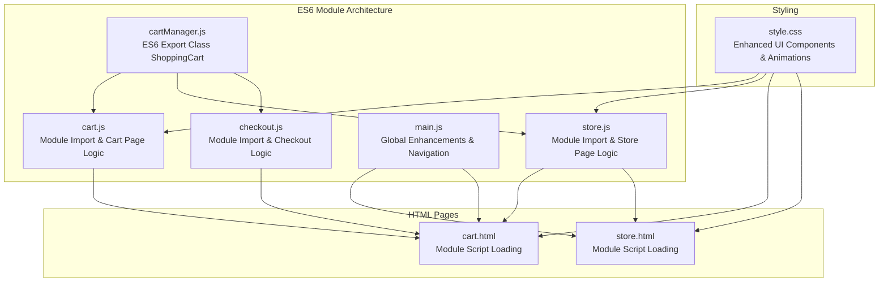
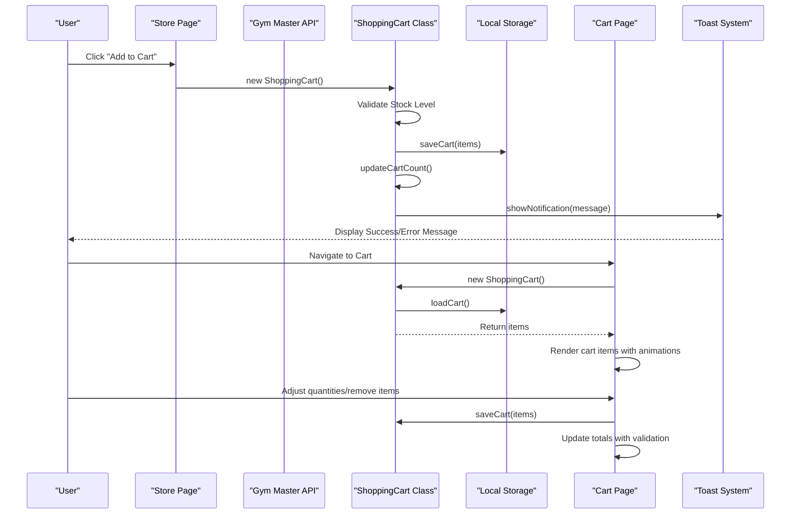
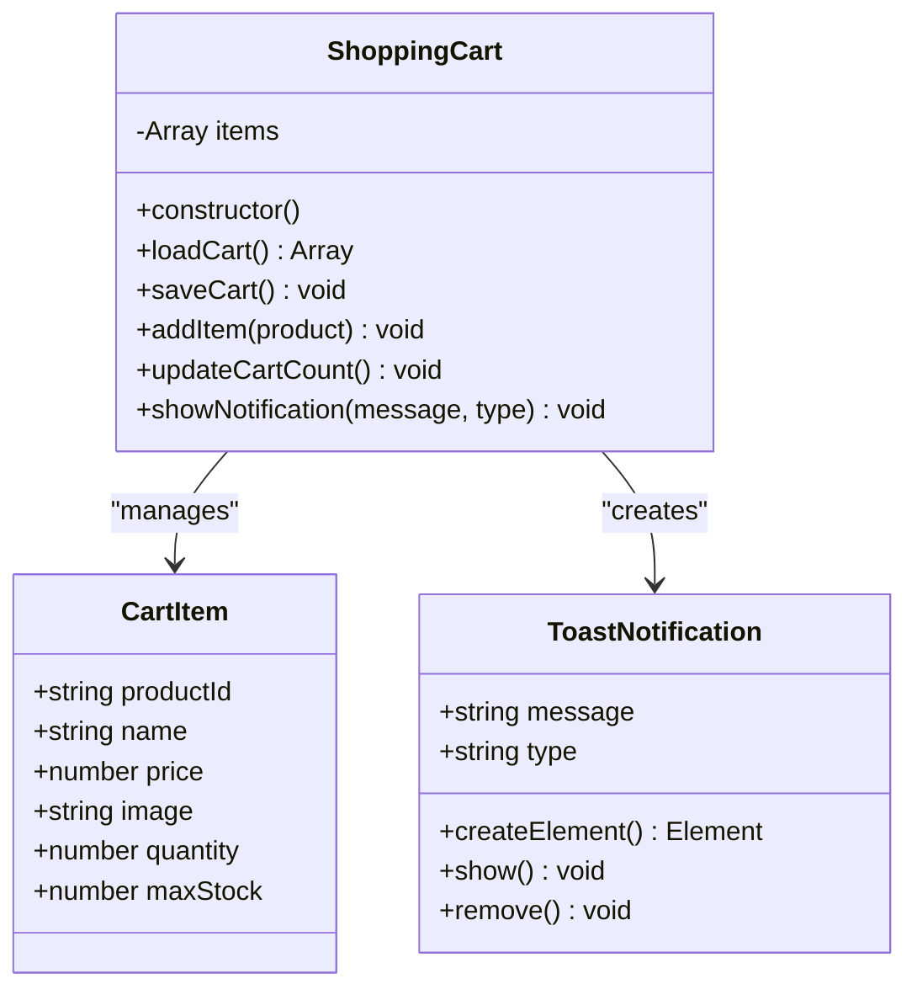
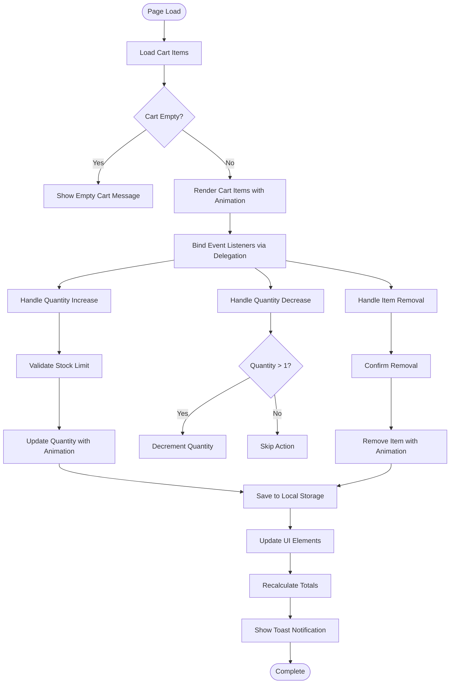
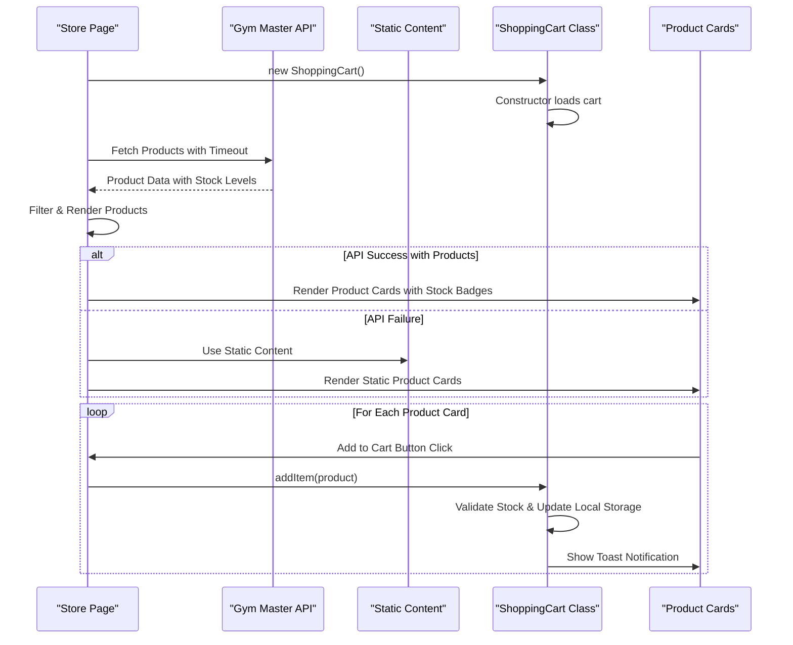
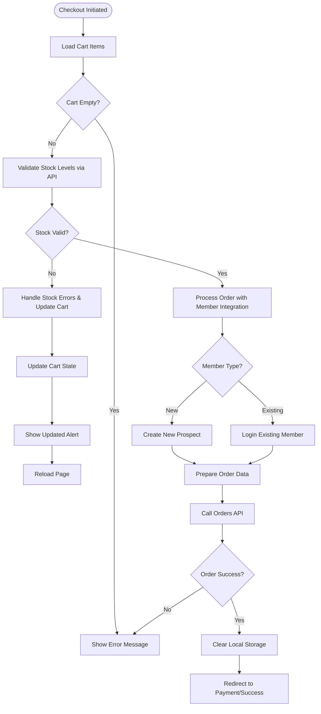
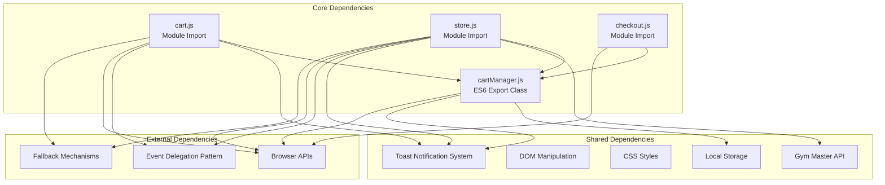

# Shopping Cart System

<cite>
**Referenced Files in This Document**
- [cartManager.js](file://src/cartManager.js)
- [cart.js](file://src/cart.js)
- [store.js](file://src/store.js)
- [checkout.js](file://src/checkout.js)
- [cart.html](file://cart.html)
- [store.html](file://store.html)
- [style.css](file://src/style.css)
- [main.js](file://src/main.js)
</cite>

## Update Summary
**Changes Made**
- Updated to reflect ES6 module architecture with proper class exports for ShoppingCart
- Enhanced JavaScript module system with modern ES6 import/export patterns
- Improved error handling mechanisms and module bundling compatibility
- Maintained backward compatibility while upgrading to modern JavaScript standards

## Table of Contents
1. [Introduction](#introduction)
2. [Project Structure](#project-structure)
3. [Core Components](#core-components)
4. [Architecture Overview](#architecture-overview)
5. [Detailed Component Analysis](#detailed-component-analysis)
6. [ES6 Module Architecture](#es6-module-architecture)
7. [Enhanced Event Delegation Patterns](#enhanced-event-delegation-patterns)
8. [Gym Master API Integration](#gym-master-api-integration)
9. [Cart Badge Management](#cart-badge-management)
10. [Toast Notification System](#toast-notification-system)
11. [Dependency Analysis](#dependency-analysis)
12. [Performance Considerations](#performance-considerations)
13. [Troubleshooting Guide](#troubleshooting-guide)
14. [Conclusion](#conclusion)

## Introduction
This document provides comprehensive technical documentation for the enhanced shopping cart system architecture, featuring modern ES6 module architecture with proper class exports for ShoppingCart. The system now implements a singleton pattern using ES6 classes with enhanced error handling, improved event delegation patterns for better performance, and comprehensive Gym Master API integration. The cart system maintains robust local storage persistence, product display integration, and checkout processing with enhanced stock validation and module bundling compatibility.

## Project Structure
The shopping cart system spans multiple ES6 modules with enhanced architecture and modern JavaScript patterns:

**Diagram sources**
- [cartManager.js](file://src/cartManager.js#L3-L91)
- [cart.js](file://src/cart.js#L3-L4)
- [store.js](file://src/store.js#L3-L4)
- [checkout.js](file://src/checkout.js#L3-L4)
- [cart.html](file://cart.html#L139-L140)
- [store.html](file://store.html#L765-L766)

**Section sources**
- [cartManager.js](file://src/cartManager.js#L1-L91)
- [cart.js](file://src/cart.js#L1-L158)
- [store.js](file://src/store.js#L1-L333)
- [checkout.js](file://src/checkout.js#L1-L440)
- [cart.html](file://cart.html#L1-L144)
- [store.html](file://store.html#L1-L769)

## Core Components
The enhanced cart system consists of four primary ES6 modules with improved architecture:

### ES6 Export Class ShoppingCart (`cartManager.js`)
The cart manager implements a modern ES6 class with singleton pattern:
- **ES6 Export Class**: Uses `export class ShoppingCart` for proper module exports
- **Constructor Initialization**: Loads existing cart from local storage with automatic cart count updates
- **Enhanced Persistence**: JSON serialization with automatic cart count synchronization
- **Advanced Stock Validation**: Comprehensive stock level checking with user notifications
- **Toast Notification System**: Built-in notification system for user feedback
- **Real-time Cart Count**: Automatic updates across all pages with badge management

### Enhanced Cart Page Implementation (`cart.js`)
The cart page module features ES6 module import and comprehensive UI interactions:
- **ES6 Import Statement**: `import { ShoppingCart } from './cartManager.js'`
- **Event Delegation**: Efficient click handling for quantity controls and removal
- **Toast Notifications**: Inline notification system for user actions
- **Real-time Updates**: Immediate UI updates with smooth animations
- **Stock Validation**: Client-side stock checking with user feedback
- **Responsive Design**: Adaptive layout for all device sizes

### Enhanced Store Integration (`store.js`)
The store module provides ES6 module import and advanced product display:
- **ES6 Import Statement**: `import { ShoppingCart } from './cartManager.js'`
- **Gym Master API Integration**: Direct integration with Gym Master product database
- **Event Delegation**: Efficient add-to-cart button handling
- **Category Filtering**: Advanced product categorization and filtering
- **Stock Integration**: Real-time stock level integration
- **Fallback Mechanisms**: Graceful degradation when API is unavailable

### Enhanced Checkout Integration (`checkout.js`)
The checkout process features ES6 module import and comprehensive validation:
- **ES6 Import Statement**: `import { ShoppingCart } from './cartManager.js'`
- **Stock Validation**: Server-side stock verification before order processing
- **Member Integration**: Support for both new and existing members
- **Delivery Options**: Flexible delivery and pickup options
- **Error Handling**: Comprehensive error handling and user feedback

**Section sources**
- [cartManager.js](file://src/cartManager.js#L3-L91)
- [cart.js](file://src/cart.js#L3-L4)
- [store.js](file://src/store.js#L3-L4)
- [checkout.js](file://src/checkout.js#L3-L4)

## Architecture Overview
The enhanced cart system follows a modern ES6 module architecture with advanced event delegation and API integration:

**Diagram sources**
- [store.js](file://src/store.js#L327-L327)
- [cartManager.js](file://src/cartManager.js#L19-L42)
- [cart.js](file://src/cart.js#L5-L6)

The enhanced ES6 architecture ensures:
- **Modern Module Standards**: Proper ES6 export/import patterns for better maintainability
- **Single Source of Truth**: Centralized cart state management via local storage
- **Real-time Synchronization**: Instant cart updates across all pages
- **Performance Optimization**: Event delegation reduces memory overhead
- **API Resilience**: Graceful fallback when Gym Master API is unavailable
- **User Experience**: Comprehensive feedback through toast notifications

## Detailed Component Analysis

### ES6 Export Class ShoppingCart Singleton Pattern
The cart manager implements an optimized ES6 class with modern architecture:

**Diagram sources**
- [cartManager.js](file://src/cartManager.js#L3-L91)

Key ES6 implementation characteristics:
- **ES6 Export Class**: `export class ShoppingCart` for proper module exports
- **Constructor Initialization**: Loads existing cart from local storage with automatic cart count updates
- **Enhanced Persistence**: JSON serialization with automatic cart count synchronization
- **Advanced Cart Count Management**: Real-time updates across navbar and store toolbar
- **Comprehensive Notification System**: Toast notifications with success/warning types
- **Stock Validation Integration**: Seamless stock level checking with user feedback

**Section sources**
- [cartManager.js](file://src/cartManager.js#L3-L91)

### Enhanced Cart Data Structure and Operations
The cart stores items with comprehensive metadata:
- `productId`: Unique Gym Master product identifier
- `name`: Product display name from API
- `price`: Current unit price from API
- `image`: Product image URL from Gym Master
- `quantity`: Number of units in cart
- `maxStock`: Maximum allowable quantity from API

Enhanced cart operations include:
- **Smart Addition**: Automatic stock validation with user notifications
- **Quantity Updates**: Real-time stock checking with immediate feedback
- **Removal Operations**: Confirmation dialogs with cart updates
- **Automatic Persistence**: Seamless local storage synchronization
- **Real-time Counting**: Instant cart badge updates across pages

**Section sources**
- [cartManager.js](file://src/cartManager.js#L19-L42)
- [cart.js](file://src/cart.js#L38-L64)

### Enhanced Cart Page Functionality
The cart page provides comprehensive item management with advanced interactions:

**Diagram sources**
- [cart.js](file://src/cart.js#L11-L38)
- [cart.js](file://src/cart.js#L89-L127)

Enhanced interactive controls include:
- **ES6 Import/Export**: Modern module pattern for better maintainability
- **Event Delegation**: Efficient click handling for all cart actions
- **Quantity Adjustment**: Smart increment/decrement with stock validation
- **Item Removal**: Animated removal with confirmation and feedback
- **Real-time Updates**: Smooth animations and immediate UI feedback
- **Responsive Design**: Adaptive layout with mobile optimization

**Section sources**
- [cart.js](file://src/cart.js#L38-L127)

### Enhanced Store Integration and Product Display
The store module provides comprehensive Gym Master API integration with ES6 modules:

**Diagram sources**
- [store.js](file://src/store.js#L14-L98)
- [store.js](file://src/store.js#L327-L327)

Enhanced integration features:
- **ES6 Import Statement**: `import { ShoppingCart } from './cartManager.js'`
- **Gym Master API Integration**: Direct product data fetching with comprehensive error handling
- **Category Filtering**: Advanced product categorization with dynamic filtering
- **Stock Integration**: Real-time stock level integration with visual indicators
- **Event Delegation**: Efficient add-to-cart button handling with delegation
- **Fallback Mechanisms**: Graceful degradation when API is unavailable

**Section sources**
- [store.js](file://src/store.js#L14-L98)
- [store.js](file://src/store.js#L327-L327)

### Enhanced Checkout Integration and Validation
The checkout process features ES6 module import and comprehensive validation:

**Diagram sources**
- [checkout.js](file://src/checkout.js#L149-L438)

**Section sources**
- [checkout.js](file://src/checkout.js#L149-L438)

## ES6 Module Architecture
The system implements modern ES6 module architecture with proper class exports:

### Module Export/Import Pattern
- **Export Class**: `export class ShoppingCart` in cartManager.js
- **Import Statement**: `import { ShoppingCart } from './cartManager.js'` in cart.js, store.js, checkout.js
- **Module Loading**: ES6 modules with type="module" attributes in HTML
- **Bundling Compatibility**: Proper module structure for modern build tools

### ES6 Class Implementation
- **Class Declaration**: `export class ShoppingCart` with constructor pattern
- **Method Definitions**: Standard ES6 method syntax
- **Property Initialization**: Direct property assignment in constructor
- **Module Exports**: Single class export for clean module interface

### Module Loading Strategy
- **Script Type**: `type="module"` for all cart-related scripts
- **Relative Imports**: Proper relative path resolution for module dependencies
- **Execution Order**: Module loading order ensures proper initialization
- **Error Handling**: Module loading errors are handled gracefully

**Section sources**
- [cartManager.js](file://src/cartManager.js#L3-L4)
- [cart.js](file://src/cart.js#L3-L4)
- [store.js](file://src/store.js#L3-L4)
- [checkout.js](file://src/checkout.js#L3-L4)
- [cart.html](file://cart.html#L139-L140)
- [store.html](file://store.html#L765-L766)

## Enhanced Event Delegation Patterns
The system implements comprehensive event delegation for improved performance:

### Event Delegation Architecture
- **Store Page**: Single event listener handles all add-to-cart buttons
- **Cart Page**: Single event listener manages all quantity controls and removals
- **Filter System**: Centralized event handling for category filtering
- **Performance Benefits**: Reduced memory footprint and improved responsiveness

### Implementation Details
- **Store Event Delegation**: `document.addEventListener('click', attachAddToCartListeners)`
- **Cart Event Delegation**: `document.getElementById('cartItems').addEventListener('click', ...)`
- **Filter Event Delegation**: `document.addEventListener('click', setupFilters)`
- **Dynamic Content Support**: Works with both static and dynamically generated content

**Section sources**
- [store.js](file://src/store.js#L268-L332)
- [cart.js](file://src/cart.js#L89-L127)
- [store.js](file://src/store.js#L218-L263)

## Gym Master API Integration
The system provides comprehensive integration with Gym Master API:

### API Integration Features
- **Product Fetching**: Direct API calls with timeout handling
- **Stock Validation**: Real-time stock level checking
- **Category Mapping**: Automatic product categorization
- **Fallback Mechanisms**: Graceful degradation when API fails
- **Performance Optimization**: Loading states and caching strategies

### API Response Handling
- **Success Responses**: Product data with stock levels and pricing
- **Error Handling**: Comprehensive error catching and user feedback
- **Timeout Management**: 500ms loading delay before showing loading state
- **Content Replacement**: Conservative approach to content replacement

### Product Data Processing
- **Field Mapping**: API field names mapped to internal properties
- **Stock Filtering**: Zero stock products automatically filtered out
- **Category Classification**: Intelligent product categorization
- **Price Formatting**: Proper currency formatting and display

**Section sources**
- [store.js](file://src/store.js#L14-L98)
- [store.js](file://src/store.js#L100-L142)

## Cart Badge Management
The system provides sophisticated cart badge management across all pages:

### Badge Implementation
- **Navbar Integration**: Cart count in navigation bar with automatic updates
- **Store Toolbar**: View cart button with live badge counting
- **Real-time Updates**: Instant badge updates when cart items change
- **Visibility Control**: Automatic show/hide based on cart contents

### Badge Styling and Behavior
- **Gold Color Scheme**: Consistent with brand identity
- **Responsive Design**: Adapts to different screen sizes
- **Animation Effects**: Smooth appearance/disappearance transitions
- **Accessibility**: Proper ARIA labels and keyboard navigation support

### Update Mechanisms
- **Automatic Updates**: Cart count updates triggered by cart changes
- **Cross-page Synchronization**: Consistent badge state across all pages
- **Initial Load Handling**: Badge population during page initialization
- **Memory Management**: Efficient badge element management

**Section sources**
- [cartManager.js](file://src/cartManager.js#L44-L55)
- [cart.html](file://cart.html#L56-L68)
- [store.html](file://store.html#L67-L68)

## Toast Notification System
The system features a comprehensive toast notification system:

### Notification Types
- **Success Notifications**: Green checkmark icons for successful actions
- **Warning Notifications**: Orange exclamation icons for stock warnings
- **Auto-dismiss**: 3-second automatic dismissal
- **Visual Feedback**: Slide-in animations with smooth transitions

### Implementation Features
- **Inline Creation**: Dynamic toast element creation and removal
- **Icon Integration**: SVG icons for visual distinction
- **Positioning**: Fixed positioning for consistent user experience
- **Animation Control**: CSS transitions for smooth appearance/disappearance

### Usage Examples
- **Add to Cart**: Success notifications with item names
- **Stock Limit Reached**: Warning notifications with stock information
- **Item Removal**: Confirmation notifications with action feedback
- **API Errors**: User-friendly error messages for system issues

**Section sources**
- [cartManager.js](file://src/cartManager.js#L57-L89)
- [cart.js](file://src/cart.js#L129-L156)

## Dependency Analysis
The enhanced cart system exhibits clear ES6 module dependency relationships:

**Diagram sources**
- [cartManager.js](file://src/cartManager.js#L1-L91)
- [cart.js](file://src/cart.js#L1-L158)
- [store.js](file://src/store.js#L1-L333)
- [checkout.js](file://src/checkout.js#L1-L440)

**Section sources**
- [cartManager.js](file://src/cartManager.js#L1-L91)
- [cart.js](file://src/cart.js#L1-L158)
- [store.js](file://src/store.js#L1-L333)
- [checkout.js](file://src/checkout.js#L1-L440)

## Performance Considerations
The enhanced cart system implements several performance optimizations:

### ES6 Module Performance
- **Modern Syntax**: ES6 classes and modules provide better optimization opportunities
- **Tree Shaking**: Proper module exports enable dead code elimination
- **Lazy Loading**: Modules can be loaded on-demand for better initial performance
- **Memory Management**: Efficient class instantiation and garbage collection

### Event Delegation Performance
- **Reduced Memory Footprint**: Single event listeners instead of per-element handlers
- **Improved Responsiveness**: Better handling of dynamic content
- **Scalability**: Efficient handling of large product catalogs
- **Memory Management**: Automatic cleanup of event listeners

### API Integration Efficiency
- **Loading States**: Prevents unnecessary re-renders during API calls
- **Timeout Management**: 500ms delay before showing loading state
- **Conservative Content Replacement**: Only replaces content when sufficient data is available
- **Fallback Mechanisms**: Graceful degradation when API fails

### Local Storage Management
- **Efficient Serialization**: JSON serialization minimizes storage overhead
- **Selective Updates**: Only saves cart state when items change
- **Memory Management**: Clears cart items from memory after checkout
- **Automatic Cleanup**: Cart clearing after successful orders

### UI Rendering Optimizations
- **Animation Performance**: Hardware-accelerated CSS transitions
- **Conditional Rendering**: Only renders cart content when items exist
- **Toast Management**: Efficient toast element creation and cleanup
- **Badge Updates**: Optimized badge element manipulation

### Browser Storage Limitations
The system handles browser storage constraints:
- **JSON Size Limits**: Typical 5-10MB limit per domain
- **Performance Degradation**: Large carts may impact performance
- **Cleanup Strategies**: Automatic cart clearing after successful orders
- **Error Handling**: Graceful handling of storage quota exceeded scenarios

**Section sources**
- [cartManager.js](file://src/cartManager.js#L14-L16)
- [cart.js](file://src/cart.js#L89-L127)
- [store.js](file://src/store.js#L26-L36)
- [checkout.js](file://src/checkout.js#L408-L409)

## Troubleshooting Guide

### Common Issues and Solutions

#### ES6 Module Loading Problems
**Symptoms**: Cart functionality not working, console errors about module loading
**Causes**: Incorrect module paths or missing type="module" attributes
**Solutions**:
- Verify ES6 import statements use correct relative paths
- Ensure HTML files include `type="module"` for script tags
- Check browser compatibility with ES6 modules
- Validate module export/import syntax consistency

#### Enhanced Cart State Synchronization Problems
**Symptoms**: Cart count shows incorrect values across pages
**Causes**: Multiple cart instances or timing issues
**Solutions**:
- Ensure singleton pattern implementation with `new ShoppingCart()`
- Verify local storage key consistency ("activeZoneCart")
- Check for concurrent modifications and race conditions
- Implement proper cart initialization on page load

#### Enhanced Stock Validation Errors
**Symptoms**: Items cannot be added beyond maximum stock
**Causes**: Stock level mismatches or validation failures
**Solutions**:
- Verify product stock levels from Gym Master API
- Check maxStock property assignment from API response
- Implement proper error messaging with toast notifications
- Validate stock levels before allowing additions

#### Enhanced Local Storage Corruption
**Symptoms**: Cart fails to load or displays malformed data
**Causes**: Corrupted JSON or storage quota exceeded
**Solutions**:
- Implement JSON parsing error handling with fallback
- Add storage quota monitoring and user notifications
- Provide manual reset functionality for corrupted data
- Implement data validation on load

#### Enhanced UI Update Failures
**Symptoms**: Cart items not updating after modifications
**Causes**: Event delegation issues or DOM manipulation problems
**Solutions**:
- Verify event delegation implementation with proper selectors
- Check for proper DOM element selection and existence
- Ensure proper state synchronization across all pages
- Validate toast notification system functionality

#### API Integration Issues
**Symptoms**: Products not loading or API errors
**Causes**: Network issues or API downtime
**Solutions**:
- Implement proper error handling and user feedback
- Use fallback to static content when API fails
- Add retry mechanisms and user-controlled refresh
- Monitor API response times and handle timeouts gracefully

#### Toast Notification Problems
**Symptoms**: Notifications not appearing or disappearing too quickly
**Causes**: CSS animation issues or JavaScript errors
**Solutions**:
- Verify CSS animation classes and transitions
- Check JavaScript execution timing and error handling
- Ensure proper element creation and removal
- Validate SVG icon rendering and styling

**Section sources**
- [cartManager.js](file://src/cartManager.js#L57-L89)
- [cart.js](file://src/cart.js#L129-L156)
- [store.js](file://src/store.js#L79-L97)
- [checkout.js](file://src/checkout.js#L425-L437)

## Conclusion
The enhanced shopping cart system demonstrates robust architecture with clear separation of concerns, modern ES6 module patterns, advanced event delegation patterns, comprehensive Gym Master API integration, and sophisticated user experience features. The ES6 class export pattern ensures consistent cart state across the application with proper module bundling compatibility, while the modular design allows for easy maintenance and extension. The system effectively handles product integration, stock validation, and checkout processing with enhanced performance optimizations and comprehensive error handling mechanisms. The event delegation patterns significantly improve performance, the toast notification system enhances user feedback, and the cart badge management provides real-time visibility across all pages. These improvements collectively provide a seamless e-commerce experience with professional-grade performance and reliability using modern JavaScript standards.