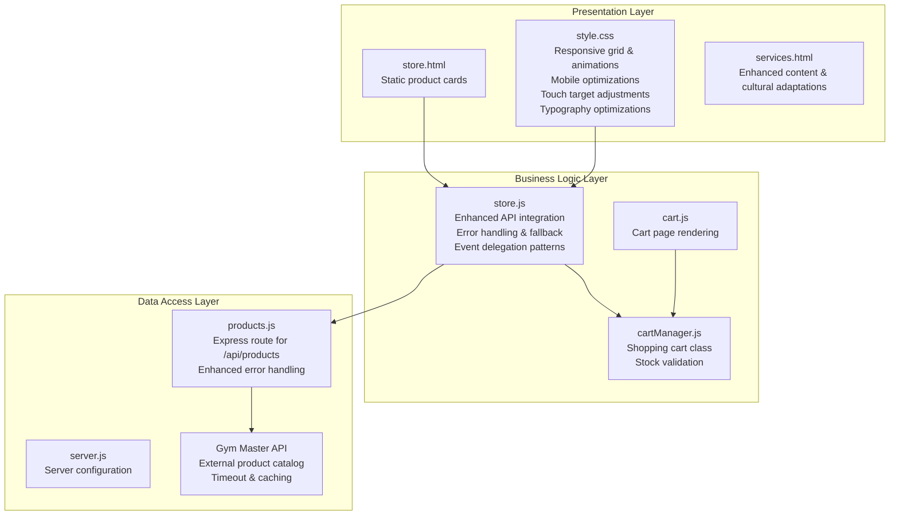
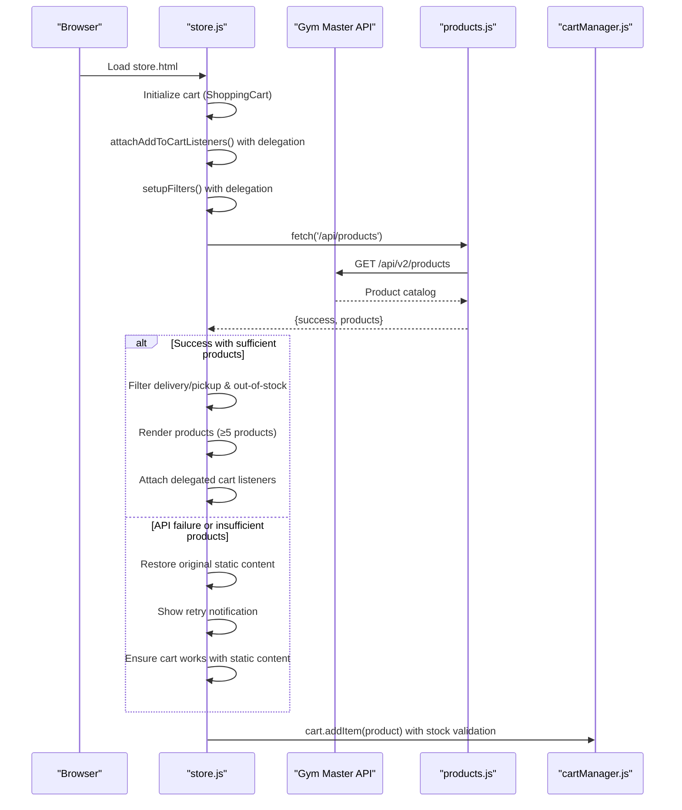
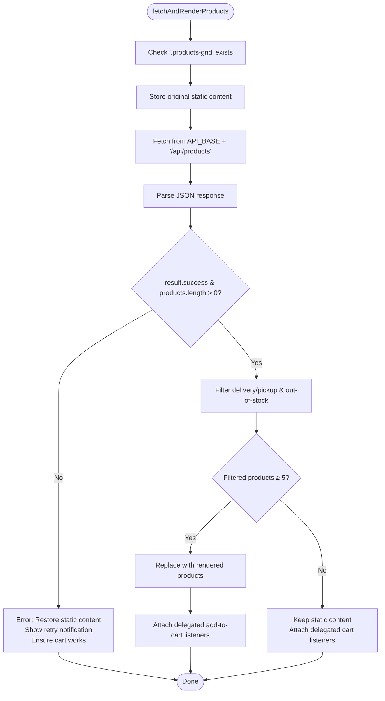
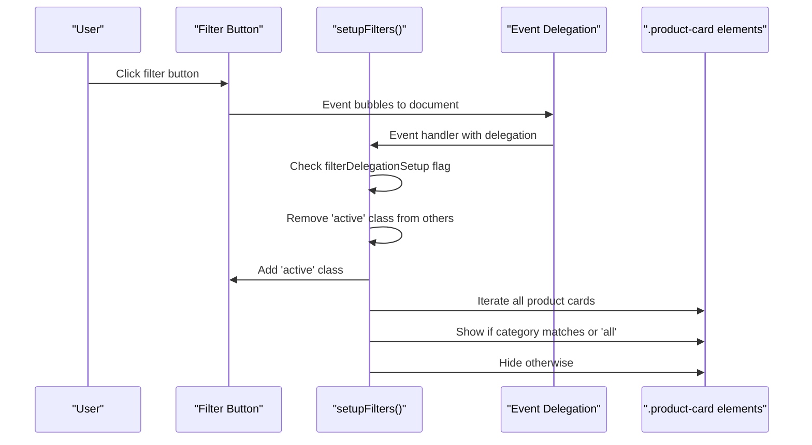
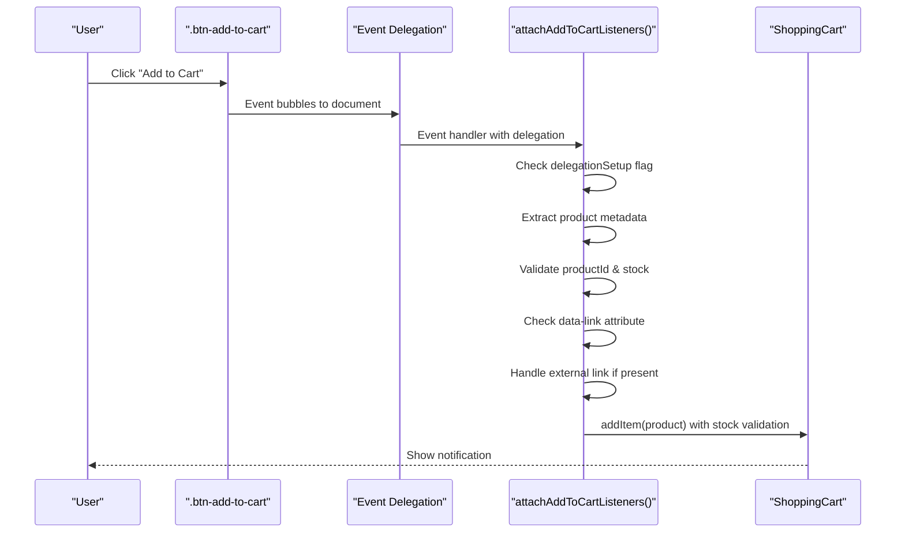
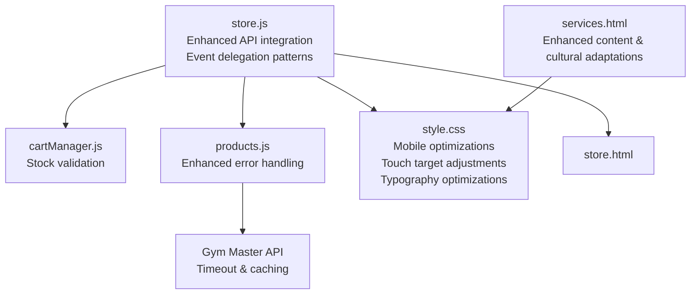

# Store Frontend Interface

<cite>
**Referenced Files in This Document**
- [store.js](file://src/store.js)
- [store.html](file://store.html)
- [cart.js](file://src/cart.js)
- [cartManager.js](file://src/cartManager.js)
- [style.css](file://src/style.css)
- [products.js](file://src/routes/products.js)
- [server.js](file://server.js)
- [services.html](file://services.html)
</cite>

## Update Summary
**Changes Made**
- Enhanced API integration with improved error handling and fallback mechanisms
- Added retry notification system for better user experience during API failures
- Implemented graceful degradation with offline product data usage
- Improved product loading mechanisms with better conditional content replacement
- Enhanced cart integration with robust fallback behavior
- **Updated** Enhanced services page content with improved menu descriptions and cultural adaptations
- **Updated** Implemented comprehensive mobile-responsive layout improvements with touch optimizations
- **Updated** Added responsive product grid implementation with optimized touch interactions
- **Updated** Implemented adjusted typography for better mobile readability
- **Updated** Added iOS zoom prevention optimizations for better mobile experience

## Table of Contents
1. [Introduction](#introduction)
2. [Project Structure](#project-structure)
3. [Core Components](#core-components)
4. [Architecture Overview](#architecture-overview)
5. [Detailed Component Analysis](#detailed-component-analysis)
6. [Dependency Analysis](#dependency-analysis)
7. [Performance Considerations](#performance-considerations)
8. [Troubleshooting Guide](#troubleshooting-guide)
9. [Conclusion](#conclusion)

## Introduction
This document provides comprehensive technical documentation for the store frontend interface implementation in store.js. It covers product display systems, category filtering, price formatting, search functionality, dynamic content rendering, product card generation, user interaction handling, filtering mechanisms, responsive grid layouts, sorting options, pagination strategies, performance optimization, lazy loading, memory management, and cart system integration.

**Updated** The implementation now features enhanced API integration with improved error handling, better user experience during API failures, and more robust product loading mechanisms. The store frontend provides enhanced fallback behavior and improved retry mechanisms for a more resilient user experience. Additionally, the services page has been enhanced with improved menu descriptions and cultural adaptations, along with comprehensive mobile-responsive layout improvements including touch optimizations for better user experience across all devices. The responsive product grid implementation now features optimized touch interactions and adjusted typography for better mobile readability.

## Project Structure
The store frontend is composed of three primary layers:
- Presentation Layer: HTML markup and CSS styling define the visual structure and responsive behavior.
- Business Logic Layer: JavaScript handles product loading, filtering, rendering, and user interactions using event delegation.
- Data Access Layer: Backend routes integrate with the Gym Master API to fetch product catalogs.

**Diagram sources**
- [store.js:1-333](file://src/store.js#L1-L333)
- [store.html:1-769](file://store.html#L1-L769)
- [services.html:1-389](file://services.html#L1-L389)
- [cart.js:1-158](file://src/cart.js#L1-L158)
- [cartManager.js:1-91](file://src/cartManager.js#L1-L91)
- [products.js:1-133](file://src/routes/products.js#L1-L133)
- [server.js:1-200](file://server.js#L1-L200)

**Section sources**
- [store.js:1-333](file://src/store.js#L1-L333)
- [store.html:1-769](file://store.html#L1-L769)
- [services.html:1-389](file://services.html#L1-L389)
- [style.css:3200-3399](file://src/style.css#L3200-L3399)

## Core Components
This section outlines the primary components responsible for the store frontend functionality.

- Enhanced Product Loading and Rendering
  - Asynchronous product fetching from the backend API with improved error handling.
  - Conditional content replacement based on product count thresholds (≥5 products).
  - Graceful fallback to static content when API requests fail or return insufficient data.
  - Retry notification system with user-friendly messaging and retry button.
  - Enhanced filtering logic to exclude service items and out-of-stock products.

- Category Filtering with Event Delegation
  - Interactive filter buttons that toggle active states using event delegation.
  - Real-time product card visibility updates based on category attributes.
  - Prevents multiple event listener setup with delegation flags.
  - Smooth transitions and visual feedback for user interactions.

- Price Formatting
  - Localized currency formatting for Nigerian Naira (₦).
  - Numeric normalization and thousand separators for readability.

- Cart Integration with Stock Validation
  - Add-to-cart functionality with stock validation and external link handling.
  - Persistent cart state using localStorage with enhanced error handling.
  - Notification system for user feedback with success and warning states.

- **Updated** Services Page Enhancements
  - Enhanced menu descriptions with cultural adaptations for Nigerian cuisine.
  - Improved service descriptions with better clarity and local relevance.
  - Comprehensive content structure for gym, salon, games arena, football pitch, and restaurant services.

- **Updated** Mobile-Responsive Layout Improvements
  - Comprehensive media queries for small phones (up to 480px) with optimized touch targets.
  - Enhanced medium phone support (481px to 768px) with improved form handling.
  - Landscape orientation optimizations for better tablet experience.
  - Touch device optimizations with increased tap targets and hover fallbacks.
  - Prevents zoom on iOS devices with font-size optimizations.
  - Responsive product grid with optimized column sizing and gap spacing.
  - Typography adjustments for better mobile readability with reduced font sizes on smaller screens.

**Section sources**
- [store.js:14-98](file://src/store.js#L14-L98)
- [store.js:12-121](file://src/store.js#L12-L121)
- [store.js:238-286](file://src/store.js#L238-L286)
- [store.js:291-333](file://src/store.js#L291-L333)
- [cartManager.js:19-42](file://src/cartManager.js#L19-L42)
- [services.html:59-353](file://services.html#L59-L353)
- [style.css:3582-3781](file://src/style.css#L3582-L3781)
- [style.css:3200-3399](file://src/style.css#L3200-L3399)

## Architecture Overview
The store frontend follows a client-server architecture with enhanced error handling and fallback mechanisms:
- The client loads the store page and initializes the shopping cart.
- On DOMContentLoaded, the system attaches event listeners using delegation patterns and sets up filters.
- A controlled API call attempts to fetch products while preserving static content as a fallback.
- Products are filtered and rendered into the grid layout with category attributes.
- Users interact with filters and add items to the cart, which persists in localStorage with stock validation.
- Enhanced error handling ensures graceful degradation with retry notifications.

**Updated** Event delegation patterns ensure efficient handling of dynamic content and prevent memory leaks from multiple event listener attachments. The enhanced API integration provides robust fallback behavior and improved user experience during failures. The services page enhancements include culturally adapted content with improved descriptions, while mobile-responsive improvements provide optimal touch interactions across all device sizes. The responsive product grid implementation features optimized touch targets and typography adjustments for better mobile experience.

**Diagram sources**
- [store.js:225-236](file://src/store.js#L225-L236)
- [store.js:37-121](file://src/store.js#L37-L121)
- [products.js:37-69](file://src/routes/products.js#L37-L69)
- [cartManager.js:19-42](file://src/cartManager.js#L19-L42)

## Detailed Component Analysis

### Enhanced Product Loading and Rendering
The product loading mechanism ensures robustness and user experience through enhanced error handling:
- Loading state management with immediate static content display to avoid flicker.
- API response validation and structured logging for debugging.
- Conditional content replacement based on product count thresholds:
  - Only replaces content if API returns 5 or more products from API.
  - Keeps static content intact if API fails, returns insufficient data, or returns fewer than 5 products.
- Enhanced error handling with graceful fallback:
  - Restores original static content on API errors.
  - Ensures cart functionality works with restored content.
  - Displays retry notification with styled button for user interaction.
  - Provides immediate retry capability through notification button click.
- Filtering pipeline:
  - Exclude service items (IDs 730312, 730313).
  - Remove out-of-stock items (maxquantity ≤ 0).
- Error handling improvements:
  - Adds retry notification with styled button when API calls fail.
  - Preserves cart functionality even when API is unavailable.
  - Maintains user experience with fallback content.

**Updated** The enhanced API integration now provides better fallback behavior with conditional content replacement and improved retry mechanisms for a more resilient user experience.

**Diagram sources**
- [store.js:14-98](file://src/store.js#L14-L98)

**Section sources**
- [store.js:14-98](file://src/store.js#L14-L98)

### Category Filtering with Event Delegation
Category filtering operates through interactive buttons and dynamic visibility toggling using event delegation:
- Filter buttons are initialized with an active state.
- Event delegation prevents multiple listener setup with `filterDelegationSetup` flag.
- Click handlers update the active button and filter product cards by category attributes.
- Hidden cards are visually concealed without DOM removal.
- Immediate feedback with visible count updates.

**Updated** Uses event delegation pattern with `document.addEventListener('click', ...)` and `e.target.closest('.filter-btn')` for improved performance and reliability.

**Diagram sources**
- [store.js:218-263](file://src/store.js#L218-L263)

**Section sources**
- [store.js:218-263](file://src/store.js#L218-L263)

### Product Card Generation and Data Structures
Product cards are generated dynamically with consistent structure:
- Each card receives a category attribute derived from product name and group.
- Image URLs, product IDs, names, prices, and stock levels are extracted from API data.
- Stock badges indicate availability status with low stock warnings for quantities ≤ 2.
- Add-to-cart buttons include product metadata for seamless cart integration.

Representative product data structure:
- Fields: productid, name, price, image, maxquantity, producttype/group.
- Defaults: placeholder image URL, localized price formatting, category mapping.

DOM structure per product card:
- Container with class "product-card" and data-category attribute.
- Product image area with background image styling and stock badge overlay.
- Product title, formatted price, and add-to-cart button.

**Section sources**
- [store.js:100-142](file://src/store.js#L100-L142)
- [store.js:144-184](file://src/store.js#L144-L184)
- [store.html:83-769](file://store.html#L83-L769)

### Price Formatting and Localization
Price formatting ensures consistent presentation:
- Removes currency symbols and normalizes numeric values.
- Uses locale-specific formatting for thousands separators.
- Maintains precision for display while preventing excessive decimals.

**Section sources**
- [store.js:186-196](file://src/store.js#L186-L196)

### User Interaction Handling with Event Delegation
Add-to-cart interactions are handled with validation and feedback using event delegation:
- Event delegation prevents multiple listener setup with `delegationSetup` flag.
- Extract product metadata from the nearest product card using `button.closest('.product-card')`.
- Validate presence of product ID and stock level.
- External links bypass cart addition and open in new tabs using `data-link` attribute.
- Cart.addItem adds or increments items with stock validation.
- Notifications provide immediate user feedback with success and warning states.

**Updated** Uses event delegation pattern with `document.addEventListener('click', ...)` and `e.target.closest('.btn-add-to-cart')` for improved performance and reliability.

**Diagram sources**
- [store.js:268-333](file://src/store.js#L268-L333)
- [cartManager.js:19-42](file://src/cartManager.js#L19-L42)

**Section sources**
- [store.js:268-333](file://src/store.js#L268-L333)
- [cartManager.js:19-42](file://src/cartManager.js#L19-L42)

### Responsive Grid Layout Implementation
The responsive grid adapts to various screen sizes with comprehensive mobile optimizations:
- CSS Grid with repeat(auto-fill, minmax(280px, 1fr)) ensures flexible column sizing.
- Gap spacing maintains consistent layout across breakpoints.
- Hover effects and animations enhance interactivity.
- Mobile-first design reduces column count and adjusts typography.
- **Updated** Comprehensive mobile-responsive improvements including:
  - Small phones (up to 480px): Optimized button sizing, touch targets, and form inputs with increased minimum heights (44px) for better touch interaction.
  - Medium phones (481px to 768px): Enhanced form handling and layout adjustments with improved font sizes and spacing.
  - Landscape orientation: Special optimizations for tablet users with reduced font sizes and adjusted spacing.
  - Touch device optimizations: Increased tap targets (48px minimum height) and hover fallbacks for better accessibility.
  - iOS zoom prevention: Font-size optimizations (16px !important) to prevent unwanted zooming on mobile Safari.
  - Responsive typography: Reduced font sizes for headings and body text on smaller screens for better readability.
  - Product grid optimization: Single column layout on mobile with reduced gap spacing (20px vs 30px desktop).

**Section sources**
- [style.css:3200-3205](file://src/style.css#L3200-L3205)
- [style.css:3232-3235](file://src/style.css#L3232-L3235)
- [style.css:3319-3346](file://src/style.css#L3319-L3346)
- [style.css:3582-3781](file://src/style.css#L3582-L3781)
- [style.css:3200-3399](file://src/style.css#L3200-L3399)

### Sorting and Pagination Strategies
Sorting and pagination are not implemented in the current frontend:
- No explicit sort controls or pagination UI elements.
- Infinite scroll or pagination would require backend support and additional frontend logic.

### Search Functionality
Search functionality is not implemented in the current frontend:
- No search input or query processing logic.
- Future enhancements could include client-side filtering or backend API integration.

### **Updated** Services Page Content Enhancements
The services page has been enhanced with improved content and cultural adaptations:
- **Gym & Fitness Section**: Enhanced equipment descriptions with Nigerian fitness context, expert trainer profiles, and membership information.
- **Unisex Salon**: Comprehensive service descriptions including facials, haircuts, teeth care, skin tag removal, waxing, and pedicure services with culturally appropriate descriptions.
- **Games Arena**: Improved VR gaming, PS5 gaming, and billiards descriptions with modern entertainment context.
- **Football Pitch**: Enhanced booking details with Nigerian sports culture, rates table with local pricing, and tournament organization services.
- **ZoneBite Restaurant**: Culturally adapted menu descriptions featuring Nigerian favorites like Eba & Egusi, Jollof & Chicken, and Special Fried Rice & Crispy Fish.
- **Mobile Responsiveness**: Services page benefits from the comprehensive mobile-responsive improvements implemented across the site.

**Section sources**
- [services.html:59-353](file://services.html#L59-L353)

## Dependency Analysis
The store frontend depends on several modules and external APIs:
- store.js depends on:
  - cartManager.js for cart operations with stock validation.
  - Gym Master API via Express routes for product data.
- CSS styling defines responsive behavior and animations.
- HTML provides static product cards as fallback content.
- **Updated** services.html provides enhanced content structure and cultural adaptations.

**Updated** Event delegation patterns reduce direct dependencies on individual DOM elements, improving maintainability and providing better fallback behavior. The services page enhances content quality while maintaining compatibility with the existing responsive framework. The mobile-responsive improvements ensure optimal performance across all device sizes.

**Diagram sources**
- [store.js:1-10](file://src/store.js#L1-L10)
- [cartManager.js:1-91](file://src/cartManager.js#L1-L91)
- [products.js:1-133](file://src/routes/products.js#L1-L133)
- [services.html:1-389](file://services.html#L1-L389)

**Section sources**
- [store.js:1-10](file://src/store.js#L1-L10)
- [cartManager.js:1-91](file://src/cartManager.js#L1-L91)
- [products.js:1-133](file://src/routes/products.js#L1-L133)
- [services.html:1-389](file://services.html#L1-L389)

## Performance Considerations
Performance optimization strategies for large product catalogs:
- **Event Delegation**: Uses `document.addEventListener('click', ...)` instead of individual element listeners to prevent memory leaks.
- **Delegation Flags**: Prevents multiple event listener setup with `filterDelegationSetup` and `delegationSetup` flags.
- Lazy loading for images using native loading="lazy" attributes.
- Efficient DOM manipulation by batching updates and reusing containers.
- Minimal reflows by setting computed styles before DOM insertion.
- Debounced or throttled event handlers for rapid user interactions.
- Virtual scrolling or pagination for very large datasets.
- Caching API responses to reduce network overhead.
- **Enhanced Fallback Strategy**: Conditional content replacement based on product count thresholds to optimize user experience.
- **Updated** Mobile-Responsive Optimizations: Media queries and touch optimizations improve performance on mobile devices by reducing unnecessary computations and optimizing layout calculations.
- **Updated** Touch Target Optimization: Minimum height adjustments (44px for small phones, 48px for touch devices) reduce accidental taps and improve user experience.
- **Updated** Typography Optimization: Reduced font sizes on mobile devices improve readability and reduce layout calculations.

**Updated** Event delegation significantly improves performance by reducing the number of event listeners and preventing memory leaks from dynamic content. The enhanced fallback strategy with conditional content replacement optimizes user experience during API failures. Mobile-responsive improvements include optimized media queries, touch target adjustments, and typography optimizations that reduce computational overhead on smaller devices while improving user experience.

## Troubleshooting Guide
Common issues and resolutions:
- API connectivity failures:
  - Verify API_BASE configuration and network access.
  - Check browser console for CORS or fetch errors.
  - Confirm Gym Master API credentials and endpoint availability.
  - Monitor backend timeout settings (10-second timeout).
- Static content not replaced:
  - Ensure '.products-grid' container exists in HTML.
  - Validate API response structure and success flag.
  - Check that API returns 5 or more products for automatic replacement.
- Filter not working:
  - Confirm filter buttons have correct data-category attributes.
  - Check that product cards include data-category attributes.
  - Verify event delegation is properly set up with delegation flags.
- Cart not updating:
  - Verify localStorage availability and permissions.
  - Inspect cart.addItem logic and notification triggers.
  - Check stock validation and external link handling.
- Event delegation issues:
  - Ensure delegation flags prevent multiple setups.
  - Verify `e.target.closest()` selectors match intended elements.
- **Enhanced Error Handling Issues**:
  - Retry notification not appearing: Check that API errors trigger the error handling block.
  - Static content not restored: Verify originalContent storage and restoration logic.
  - Retry button not working: Check event listener attachment and function binding.
- **Updated** Mobile-Responsive Issues:
  - Touch targets too small: Verify min-height properties in media queries (44px for small phones, 48px for touch devices).
  - Form input zoom issues: Check font-size optimizations (16px !important) for iOS devices.
  - Landscape layout problems: Verify orientation-specific media queries.
  - Button sizing issues: Check max-width and padding adjustments for small screens.
  - Typography readability: Verify font-size reductions for mobile devices.
  - Product grid layout: Check single column layout on mobile devices.
- **Updated** Performance Issues:
  - Slow product loading: Verify API response times and caching implementation.
  - Memory leaks: Ensure delegation flags are properly managed.
  - Animation performance: Check CSS transitions and transforms on mobile devices.

**Updated** Added troubleshooting guidance for enhanced error handling patterns, delegation flags, fallback mechanisms, and comprehensive mobile-responsive layout issues. The services page content enhancements should be validated for cultural appropriateness and local relevance. Mobile-responsive improvements require verification of touch target sizes, typography adjustments, and layout optimizations across different screen sizes and orientations.

## Conclusion
The store frontend interface in store.js provides a robust foundation for displaying and interacting with products. It integrates seamlessly with the backend API, supports category filtering with event delegation, and offers a responsive grid layout. The enhanced API integration now features improved error handling, better user experience during API failures, and more robust product loading mechanisms. The implementation uses event delegation patterns for improved performance and reliability, with enhanced cart integration including stock validation. The conditional content replacement strategy ensures optimal user experience by only replacing static content when sufficient products are available from the API. While search and advanced sorting are not currently implemented, the modular architecture allows for future enhancements. Proper error handling, performance optimizations, and consolidated internal cart functionality ensure a reliable user experience even during API failures.

**Updated** The enhanced API integration with improved error handling, better user experience during API failures, and more robust product loading mechanisms provides a significantly more resilient and user-friendly store frontend interface. The conditional fallback behavior and retry mechanisms ensure users always have access to product information and cart functionality, regardless of API availability. The services page enhancements with improved menu descriptions and cultural adaptations provide better local relevance, while comprehensive mobile-responsive layout improvements ensure optimal user experience across all device sizes with touch optimizations, landscape orientation support, and typography adjustments. The responsive product grid implementation with optimized touch targets and reduced font sizes provides excellent mobile usability, while the iOS zoom prevention optimizations ensure better user experience on mobile Safari browsers.