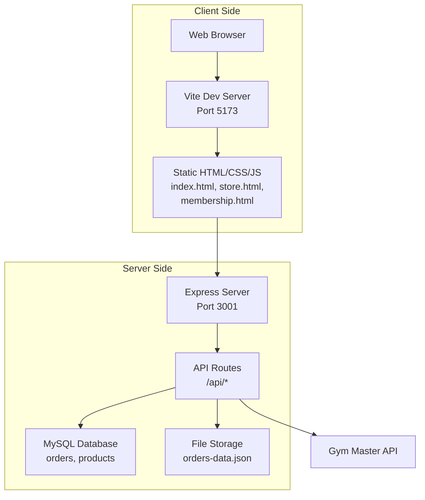

# Getting Started

<cite>
**Referenced Files in This Document**
- [README.md](file://README.md)
- [package.json](file://package.json)
- [vite.config.js](file://vite.config.js)
- [server.js](file://server.js)
- [START_DEV_SERVER.bat](file://START_DEV_SERVER.bat)
- [LOCAL_TESTING_GUIDE.txt](file://LOCAL_TESTING_GUIDE.txt)
- [database/schema.sql](file://database/schema.sql)
- [database/init.sql](file://database/init.sql)
- [database/db.js](file://database/db.js)
- [index.html](file://index.html)
- [store.html](file://store.html)
- [membership.html](file://membership.html)
</cite>

## Table of Contents
1. [Introduction](#introduction)
2. [Prerequisites](#prerequisites)
3. [Installation](#installation)
4. [Local Development Environment](#local-development-environment)
5. [Environment Variables](#environment-variables)
6. [Database Initialization](#database-initialization)
7. [Basic Usage](#basic-usage)
8. [Testing and Verification](#testing-and-verification)
9. [Architecture Overview](#architecture-overview)
10. [Troubleshooting](#troubleshooting)
11. [Conclusion](#conclusion)

## Introduction
Active Zone Hub is a modern web application integrating a frontend built with static HTML/CSS/JavaScript and a backend API server. It supports online store functionality, membership plans, and order management with optional database persistence. The project uses Vite for fast development builds and Express for the backend API.

## Prerequisites
Before installing Active Zone Hub, ensure your system meets the following requirements:
- Node.js v18 or higher
- npm (comes with Node.js)
- Optional: MySQL or MariaDB for persistent order storage (can run without a database for frontend testing)

Verification steps:
- Confirm Node.js installation: node --version
- Confirm npm installation: npm --version

**Section sources**
- [LOCAL_TESTING_GUIDE.txt](file://LOCAL_TESTING_GUIDE.txt#L12-L18)

## Installation
Follow these steps to set up the project locally:

1. Clone the repository to your local machine.
2. Open a terminal in the project root directory.
3. Install dependencies:
   - Run: npm install
   - Wait for installation to complete (added packages message indicates success)

4. Create or configure environment variables:
   - Copy .env.example to .env if it does not exist
   - Configure .env for local testing (see Environment Variables section)

5. Start the backend server:
   - Option A: npm run server
   - Option B: Double-click START_BACKEND_SERVER.bat

6. Start the frontend development server:
   - Option A: npm run dev
   - Option B: Double-click START_DEV_SERVER.bat

7. Access the application:
   - Frontend: http://localhost:5173
   - Backend API: http://localhost:3001

**Section sources**
- [LOCAL_TESTING_GUIDE.txt](file://LOCAL_TESTING_GUIDE.txt#L63-L79)
- [LOCAL_TESTING_GUIDE.txt](file://LOCAL_TESTING_GUIDE.txt#L118-L146)
- [LOCAL_TESTING_GUIDE.txt](file://LOCAL_TESTING_GUIDE.txt#L153-L182)
- [START_DEV_SERVER.bat](file://START_DEV_SERVER.bat#L1-L12)

## Local Development Environment
The project uses Vite for the frontend development server and Express for the backend API server. The development workflow is designed for rapid iteration with hot reload.

Frontend development server:
- Port: 5173
- Hot reload enabled
- Automatic browser launch on startup

Backend development server:
- Port: 3001
- API endpoints exposed under /api/*
- CORS enabled for development

Vite configuration:
- Base path set to "./"
- Multiple entry points for HTML pages
- Rollup options configured for multi-page build

**Section sources**
- [vite.config.js](file://vite.config.js#L1-L20)
- [package.json](file://package.json#L5-L11)
- [server.js](file://server.js#L26-L27)

## Environment Variables
Configure the .env file for local development. Key variables include:

Required for backend operation:
- APP_URL: http://localhost:3001
- PAYSTACK_SECRET_KEY: sk_test_... (use test keys for local testing)
- PAYSTACK_PUBLIC_KEY: pk_test_...
- BREVO_API_KEY: xkeysib-... (for email notifications)
- SMTP_FROM_EMAIL: activezone6060@gmail.com
- SMTP_FROM_NAME: Active Zone Hub

Database configuration (optional):
- DATABASE_ENABLED: true (to enable MySQL)
- DB_HOST: localhost
- DB_USER: root
- DB_PASSWORD: (your MySQL password)
- DB_NAME: activezone

Security:
- TOTP_SECRET_ADMIN: auto-generated on first run
- TOTP_SECRET: auto-generated on first run

**Section sources**
- [LOCAL_TESTING_GUIDE.txt](file://LOCAL_TESTING_GUIDE.txt#L91-L117)
- [server.js](file://server.js#L105-L148)

## Database Initialization
Active Zone Hub supports two database modes:

Option 1: File-based storage (default)
- No database required
- Orders stored in orders-data.json
- Automatic fallback when DATABASE_ENABLED=false

Option 2: MySQL database
- Import schema: database/schema.sql via phpMyAdmin
- Required tables: orders, products
- Connection configured via environment variables

PostgreSQL support (alternative):
- database/init.sql provides PostgreSQL schema
- database/db.js contains PostgreSQL connection logic

Database connection behavior:
- Backend checks for DATABASE_ENABLED and credentials
- Logs connection status and table verification
- Falls back to file storage if database is unavailable

**Section sources**
- [server.js](file://server.js#L105-L148)
- [database/schema.sql](file://database/schema.sql#L1-L46)
- [database/init.sql](file://database/init.sql#L1-L80)
- [database/db.js](file://database/db.js#L1-L50)

## Basic Usage
After successful setup, access the application at http://localhost:5173. Navigate through the following sections:

Homepage (index.html):
- Hero carousel with facility highlights
- Services grid showcasing offerings
- Testimonials section
- Gallery preview
- Navigation to all sections

Store (store.html):
- Product listings from Gym Master API
- Category filtering (gloves, belts, apparel, etc.)
- Shopping cart functionality
- Add to cart actions

Membership (membership.html):
- Individual and couples membership plans
- Pricing tiers with savings
- Direct links to Gym Master signup

Additional pages:
- About, Services, Gallery, Contact
- Cart, Checkout, Orders, Track Order

**Section sources**
- [index.html](file://index.html#L1-L325)
- [store.html](file://store.html#L1-L854)
- [membership.html](file://membership.html#L1-L234)

## Testing and Verification
Perform these verification steps to ensure proper setup:

1. Backend health check:
   - Visit: http://localhost:3001/api/health
   - Expected: {"status":"ok","message":"Server is running"}

2. Product API test:
   - Visit: http://localhost:3001/api/products
   - Verify product data loads (requires backend running)

3. Frontend functionality:
   - Homepage carousel rotates automatically
   - Navigation links work correctly
   - Store page shows products (requires backend)

4. Development server behavior:
   - Vite dev server starts on port 5173
   - Automatic browser launch occurs
   - Changes persist with hot reload

5. Database verification (if using MySQL):
   - Check orders table exists
   - Verify connection logs in backend console

**Section sources**
- [LOCAL_TESTING_GUIDE.txt](file://LOCAL_TESTING_GUIDE.txt#L147-L151)
- [LOCAL_TESTING_GUIDE.txt](file://LOCAL_TESTING_GUIDE.txt#L191-L261)

## Architecture Overview
The application follows a client-server architecture with separate frontend and backend concerns:

**Diagram sources**
- [server.js](file://server.js#L26-L27)
- [vite.config.js](file://vite.config.js#L4-L19)

## Troubleshooting
Common setup issues and solutions:

Port conflicts:
- Error: "Port 3001 already in use"
  - Solution: Stop conflicting process or change PORT in .env
- Error: "Port 5173 already in use"
  - Solution: Close other Vite instances or use different terminal

Node.js/npm not found:
- Error: "npm: command not found"
  - Solution: Install Node.js LTS from nodejs.org

Database connection failures:
- Error: Cannot connect to database
  - Solution: Install MySQL/MariaDB or run without database (file-based mode)

CORS errors:
- Error: Cross-origin request blocked
  - Solution: Ensure backend server runs with correct APP_URL

Payment test failures:
- Error: Payment declined with test card
  - Solution: Use exact test card 4084084084084081 with CVV 408, PIN 0000, OTP 123456

Google Authenticator issues:
- Error: TOTP codes not accepted
  - Solution: Visit http://localhost:3001/api/totp/setup, scan QR code, update .env

Email notification problems:
- Error: Emails not sending
  - Solution: Verify BREVO_API_KEY and check backend console for errors

**Section sources**
- [LOCAL_TESTING_GUIDE.txt](file://LOCAL_TESTING_GUIDE.txt#L326-L395)

## Conclusion
You are now ready to develop and test Active Zone Hub locally. The setup provides a complete development environment with hot reload, API connectivity, and optional database persistence. Use the troubleshooting section for resolving common issues and refer to the testing guidelines for verification.