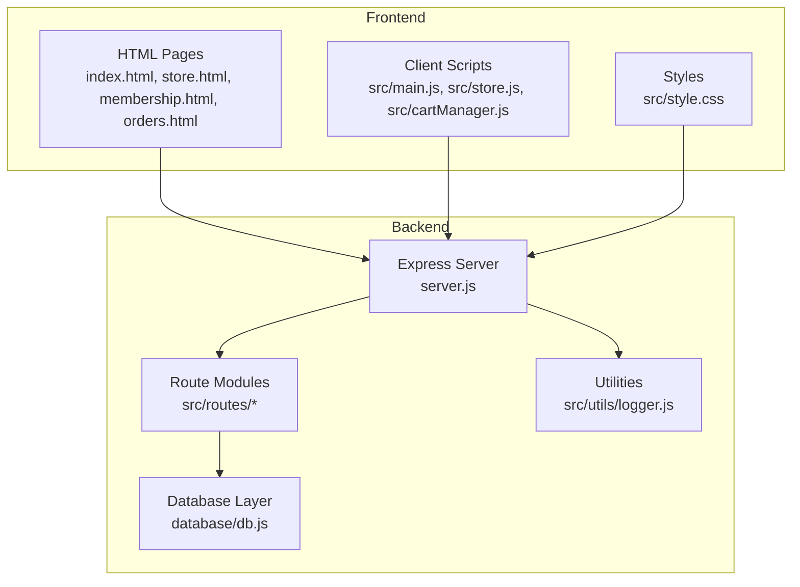
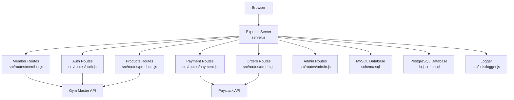
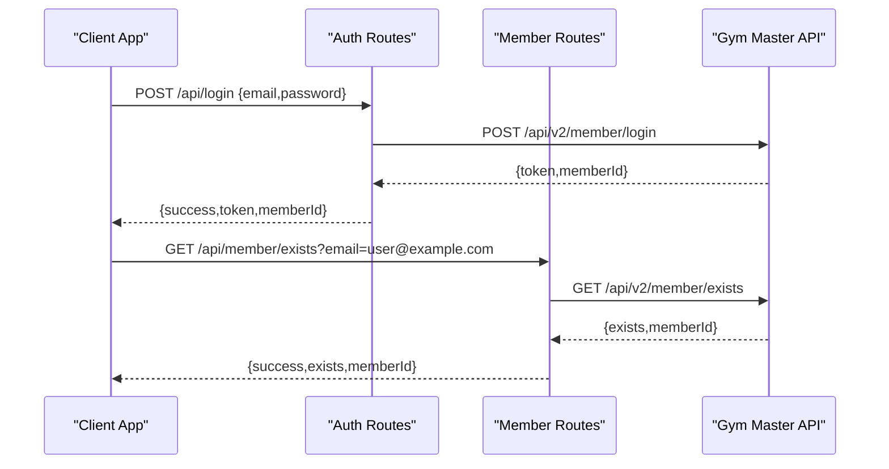
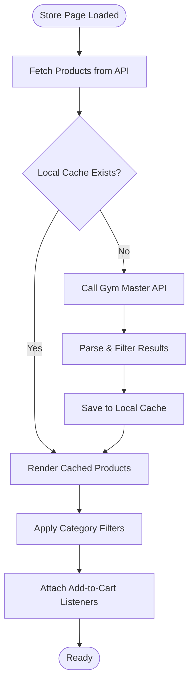
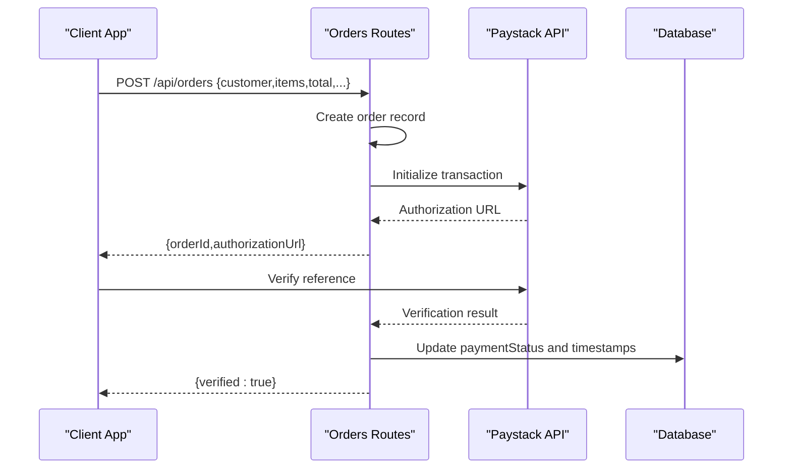
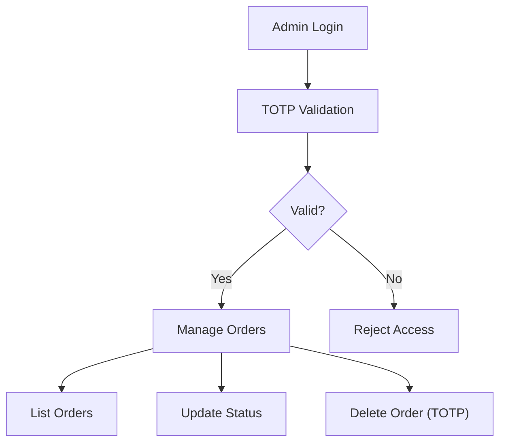
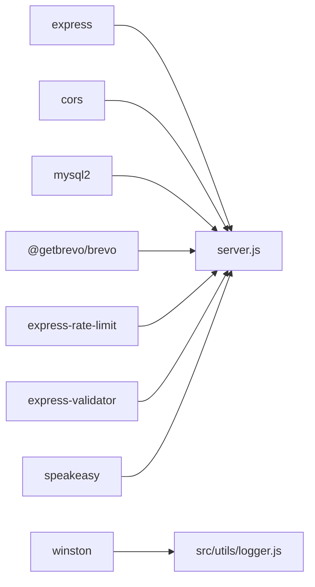

# Project Overview

<cite>
**Referenced Files in This Document**
- [README.md](file://README.md)
- [package.json](file://package.json)
- [server.js](file://server.js)
- [src/main.js](file://src/main.js)
- [src/store.js](file://src/store.js)
- [src/cartManager.js](file://src/cartManager.js)
- [src/route files](file://src/routes)
- [src/utils/logger.js](file://src/utils/logger.js)
- [database/db.js](file://database/db.js)
- [database/init.sql](file://database/init.sql)
- [database/schema.sql](file://database/schema.sql)
</cite>

## Table of Contents
1. [Introduction](#introduction)
2. [Project Structure](#project-structure)
3. [Core Components](#core-components)
4. [Architecture Overview](#architecture-overview)
5. [Detailed Component Analysis](#detailed-component-analysis)
6. [Dependency Analysis](#dependency-analysis)
7. [Performance Considerations](#performance-considerations)
8. [Troubleshooting Guide](#troubleshooting-guide)
9. [Conclusion](#conclusion)

## Introduction
Active Zone Hub is a premium digital platform designed for fitness centers and recreation hubs. It integrates Gym Master membership management with an e-commerce store, enabling seamless membership verification, online shopping, secure payments, order management, and administrative oversight. The platform targets fitness facilities seeking a unified, modern solution to manage memberships and retail sales while offering a fast, mobile-first web experience.

## Project Structure
The project combines a static HTML/CSS/JavaScript frontend with a Node.js/Express backend. Static assets and pages are served directly by the Express server, while API routes handle membership, store, payment, order, and administrative operations. Data persistence supports both file-based storage and optional MySQL/PostgreSQL backends.

**Diagram sources**
- [server.js](file://server.js#L26-L470)
- [src/main.js](file://src/main.js#L1-L405)
- [src/store.js](file://src/store.js#L1-L316)
- [src/cartManager.js](file://src/cartManager.js#L1-L91)
- [src/utils/logger.js](file://src/utils/logger.js#L1-L51)
- [database/db.js](file://database/db.js#L1-L267)

**Section sources**
- [server.js](file://server.js#L26-L470)
- [package.json](file://package.json#L1-L28)

## Core Components
- Frontend client-side scripts for interactive UI, store product rendering, cart management, and form handling.
- Backend Express server routing membership, store, payment, order, contact, and admin endpoints.
- Database abstraction supporting MySQL (via schema and helpers) and PostgreSQL (via dedicated db.js).
- Logging utility for structured request and error logging.

Key capabilities:
- Membership verification and login via Gym Master API.
- Online store with product retrieval, filtering, and cart management.
- Payment initiation and verification via Paystack.
- Order lifecycle management with status updates and tracking.
- Administrative dashboard features for order management and security (TOTP).

**Section sources**
- [src/main.js](file://src/main.js#L1-L405)
- [src/store.js](file://src/store.js#L1-L316)
- [src/cartManager.js](file://src/cartManager.js#L1-L91)
- [src/route files](file://src/routes)
- [database/db.js](file://database/db.js#L1-L267)

## Architecture Overview
The system follows a layered architecture:
- Presentation layer: HTML/CSS/JavaScript for user-facing pages and interactions.
- Application layer: Express routes encapsulating business logic for members, products, payments, orders, and administration.
- Data layer: Optional MySQL/PostgreSQL schema and file-based fallback for orders and product caches.
- External integrations: Gym Master API for membership operations and Paystack for payment processing.

**Diagram sources**
- [server.js](file://server.js#L17-L24)
- [src/routes/member.js](file://src/routes/member.js#L1-L142)
- [src/routes/auth.js](file://src/routes/auth.js#L1-L54)
- [src/routes/products.js](file://src/routes/products.js#L1-L121)
- [src/routes/payment.js](file://src/routes/payment.js#L1-L154)
- [src/routes/orders.js](file://src/routes/orders.js#L1-L340)
- [database/schema.sql](file://database/schema.sql#L1-L46)
- [database/init.sql](file://database/init.sql#L1-L80)
- [src/utils/logger.js](file://src/utils/logger.js#L1-L51)

## Detailed Component Analysis

### Membership and Authentication
- Member existence checks and creation endpoints integrate with Gym Master v2 APIs.
- Login endpoint authenticates members and decodes session identifiers from tokens.
- Profile update endpoint allows adding/updating contact/address details post-prospect creation.

**Diagram sources**
- [src/routes/auth.js](file://src/routes/auth.js#L11-L51)
- [src/routes/member.js](file://src/routes/member.js#L11-L41)
- [server.js](file://server.js#L480-L779)

**Section sources**
- [src/routes/auth.js](file://src/routes/auth.js#L1-L54)
- [src/routes/member.js](file://src/routes/member.js#L1-L142)
- [server.js](file://server.js#L480-L779)

### Online Store and Cart
- Product catalog is fetched from Gym Master with local caching and filtering.
- Client-side cart persists to localStorage and updates UI counts.
- Store page renders products, applies category filters, and attaches add-to-cart handlers.

**Diagram sources**
- [src/store.js](file://src/store.js#L12-L121)
- [src/store.js](file://src/store.js#L225-L236)
- [src/cartManager.js](file://src/cartManager.js#L3-L42)

**Section sources**
- [src/store.js](file://src/store.js#L1-L316)
- [src/cartManager.js](file://src/cartManager.js#L1-L91)
- [src/main.js](file://src/main.js#L1-L405)

### Payments and Order Management
- Orders are created client-side and persisted either to file or database depending on configuration.
- Payment initialization uses Paystack with metadata linking to the order.
- Payment verification updates order records and triggers notifications.

**Diagram sources**
- [src/routes/orders.js](file://src/routes/orders.js#L203-L294)
- [src/routes/orders.js](file://src/routes/orders.js#L296-L337)
- [src/routes/payment.js](file://src/routes/payment.js#L31-L110)
- [server.js](file://server.js#L168-L211)

**Section sources**
- [src/routes/orders.js](file://src/routes/orders.js#L1-L340)
- [src/routes/payment.js](file://src/routes/payment.js#L1-L154)
- [server.js](file://server.js#L168-L211)

### Administrative Dashboard and Security
- Admin endpoints expose order listing, status updates, and deletion guarded by TOTP-based authentication.
- Rate limiting protects sensitive endpoints from brute-force attempts.
- Structured logging captures request telemetry and errors.

**Diagram sources**
- [src/routes/orders.js](file://src/routes/orders.js#L161-L201)
- [server.js](file://server.js#L404-L429)
- [src/utils/logger.js](file://src/utils/logger.js#L10-L39)

**Section sources**
- [src/routes/orders.js](file://src/routes/orders.js#L1-L340)
- [server.js](file://server.js#L404-L429)
- [src/utils/logger.js](file://src/utils/logger.js#L1-L51)

## Dependency Analysis
The backend relies on a small set of focused libraries:
- Express for HTTP routing and middleware.
- Gym Master API for membership operations.
- Paystack for payment initialization and verification.
- MySQL2 for database connectivity and pooling.
- Winston for structured logging.
- Speakeasy for TOTP-based admin security.
- CORS and rate-limiting for security and stability.

**Diagram sources**
- [package.json](file://package.json#L15-L26)
- [server.js](file://server.js#L3-L15)
- [src/utils/logger.js](file://src/utils/logger.js#L1-L51)

**Section sources**
- [package.json](file://package.json#L1-L28)
- [server.js](file://server.js#L3-L15)

## Performance Considerations
- Database pooling and connection limits reduce overhead and improve throughput.
- Local caching of products minimizes repeated Gym Master API calls.
- Pagination and filtering in order listings prevent large payloads.
- Rate limiting prevents abuse and stabilizes response times.
- Client-side cart persistence avoids server round-trips for UI state.

[No sources needed since this section provides general guidance]

## Troubleshooting Guide
Common operational issues and resolutions:
- Gym Master API failures: The system continues to operate with local order processing and returns success for local logging even if Gym Master is unreachable.
- Paystack configuration: Ensure the Paystack secret key is set; payment verification requires a valid secret.
- Database connectivity: If DATABASE_ENABLED is false or DB credentials are missing, the system falls back to file-based storage for orders.
- Logging: Review logs in the logs directory for request telemetry and error stacks.

**Section sources**
- [server.js](file://server.js#L502-L600)
- [server.js](file://server.js#L344-L348)
- [server.js](file://server.js#L105-L148)
- [src/utils/logger.js](file://src/utils/logger.js#L10-L39)

## Conclusion
Active Zone Hub delivers a cohesive digital ecosystem for fitness and recreation centers. By combining Gym Master membership integration with a modern e-commerce store and robust order/payment workflows, it streamlines operations while maintaining flexibility through configurable data backends and strong security practices.