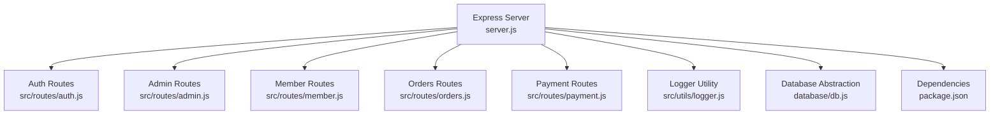
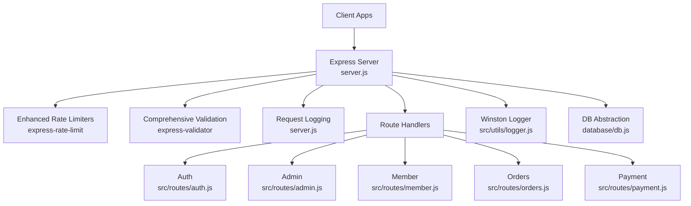
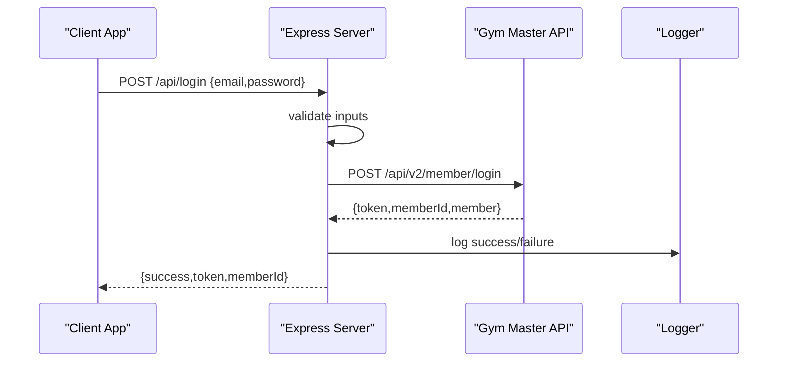
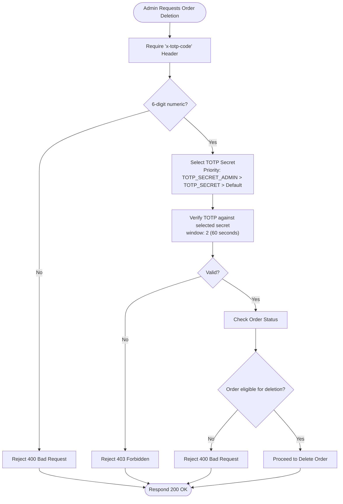
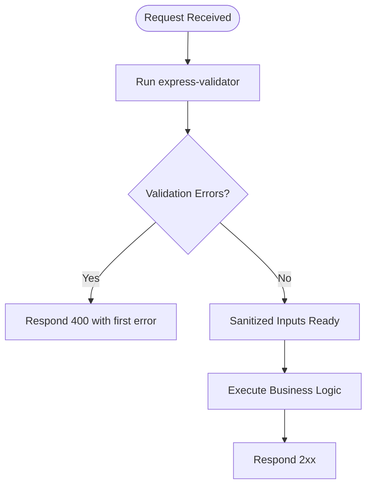
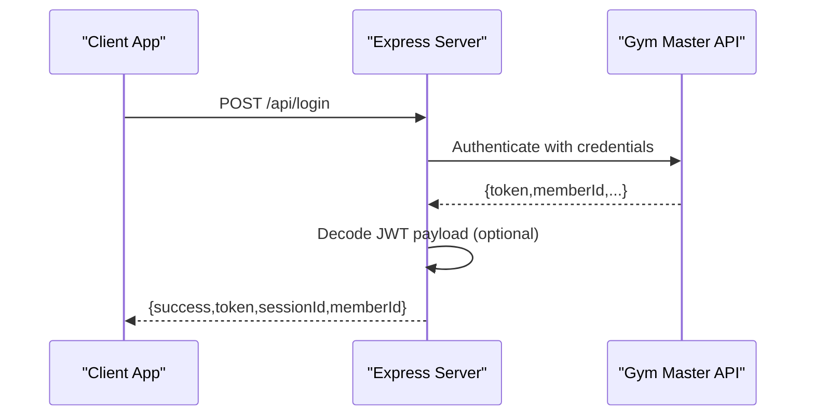
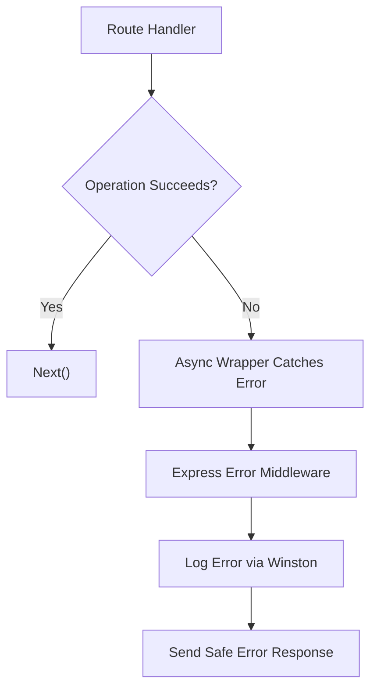
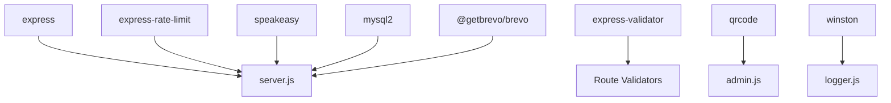

# Security Implementation

<cite>
**Referenced Files in This Document**
- [server.js](file://server.js)
- [auth.js](file://src/routes/auth.js)
- [admin.js](file://src/routes/admin.js)
- [member.js](file://src/routes/member.js)
- [orders.js](file://src/routes/orders.js)
- [payment.js](file://src/routes/payment.js)
- [db.js](file://database/db.js)
- [logger.js](file://src/utils/logger.js)
- [package.json](file://package.json)
- [orders.html](file://orders.html)
</cite>

## Update Summary
**Changes Made**
- Enhanced order deletion security with prioritized TOTP secret selection (TOTP_SECRET_ADMIN > TOTP_SECRET > default)
- Improved TOTP authentication logic with better fallback mechanisms and comprehensive logging for debugging
- Enhanced frontend TOTP integration with improved error handling and user feedback
- Strengthened rate limiting for order deletion operations with enhanced validation
- Updated TOTP configuration with improved secret generation and fallback handling

## Table of Contents
1. [Introduction](#introduction)
2. [Project Structure](#project-structure)
3. [Core Components](#core-components)
4. [Architecture Overview](#architecture-overview)
5. [Detailed Component Analysis](#detailed-component-analysis)
6. [Dependency Analysis](#dependency-analysis)
7. [Performance Considerations](#performance-considerations)
8. [Troubleshooting Guide](#troubleshooting-guide)
9. [Conclusion](#conclusion)
10. [Appendices](#appendices)

## Introduction
This document provides comprehensive security documentation for Active Zone Hub's backend and frontend systems. It covers authentication and authorization patterns, two-factor authentication (2FA) implementation, enhanced rate limiting, input validation, CORS configuration, session management, token handling, error handling strategies, security headers, HTTPS enforcement, protections against common vulnerabilities, and operational security practices such as logging, audits, and incident response.

## Project Structure
The security-relevant components are primarily implemented in the Express server and route handlers. Supporting infrastructure includes a database abstraction layer and a logging utility.

**Diagram sources**
- [server.js:1-200](file://server.js#L1-L200)
- [auth.js:1-54](file://src/routes/auth.js#L1-L54)
- [admin.js:1-81](file://src/routes/admin.js#L1-L81)
- [member.js:1-142](file://src/routes/member.js#L1-L142)
- [orders.js:1-350](file://src/routes/orders.js#L1-L350)
- [payment.js:1-154](file://src/routes/payment.js#L1-L154)
- [logger.js:1-51](file://src/utils/logger.js#L1-L51)
- [db.js:1-267](file://database/db.js#L1-L267)
- [package.json:1-28](file://package.json#L1-L28)

**Section sources**
- [server.js:1-200](file://server.js#L1-L200)
- [package.json:1-28](file://package.json#L1-L28)

## Core Components
- **Enhanced Authentication and Authorization**
  - Member authentication integrates with an external Gym Master service via dedicated endpoints.
  - Administrative access uses a simple password check with comprehensive rate limiting.
- **Advanced Two-Factor Authentication (2FA)**
  - TOTP-based 2FA implemented with separate secrets for admin login and order deletion workflows.
  - QR code setup for Google Authenticator with distinct accounts for each function.
  - **Updated**: Enhanced TOTP secret selection with prioritized fallback mechanism (TOTP_SECRET_ADMIN > TOTP_SECRET > default).
- **Comprehensive Rate Limiting**
  - Express-rate-limit applied with specific configurations: admin login (5 attempts/15min), order deletion (3 attempts/15min), general API (100 requests/min).
- **Robust Input Validation**
  - express-validator validates and sanitizes request parameters and bodies across all routes with comprehensive validation rules.
- **CORS Configuration**
  - CORS enabled globally; consider narrowing origins for production.
- **Session Management and Token Handling**
  - Token exchange with Gym Master; JWT decoding performed for session metadata extraction.
- **Centralized Error Handling**
  - Async error handling wrapper and structured logging for diagnostics.
- **Advanced Logging and Auditing**
  - Winston-based structured logging with file rotation and console transport for development.

**Section sources**
- [server.js:410-435](file://server.js#L410-L435)
- [server.js:1126-1142](file://server.js#L1126-L1142)
- [server.js:1245-1311](file://server.js#L1245-L1311)
- [auth.js:11-18](file://src/routes/auth.js#L11-L18)
- [admin.js:10-26](file://src/routes/admin.js#L10-L26)
- [orders.js:192-232](file://src/routes/orders.js#L192-L232)
- [logger.js:10-48](file://src/utils/logger.js#L10-L48)

## Architecture Overview
The backend enforces security policies at the middleware and route levels, with external integrations for authentication and payments, featuring enhanced rate limiting and comprehensive input validation.

**Diagram sources**
- [server.js:410-435](file://server.js#L410-L435)
- [auth.js:1-54](file://src/routes/auth.js#L1-L54)
- [admin.js:1-81](file://src/routes/admin.js#L1-L81)
- [member.js:1-142](file://src/routes/member.js#L1-L142)
- [orders.js:1-350](file://src/routes/orders.js#L1-L350)
- [payment.js:1-154](file://src/routes/payment.js#L1-L154)
- [logger.js:1-51](file://src/utils/logger.js#L1-L51)
- [db.js:1-267](file://database/db.js#L1-L267)

## Detailed Component Analysis

### Enhanced Authentication and Authorization
- **Member Authentication**
  - Frontend authenticates against Gym Master via a dedicated endpoint, receiving a token and member metadata.
  - Validation ensures presence of email and password before forwarding to Gym Master.
- **Administrative Access Controls**
  - Admin login endpoint checks a configurable password and returns success on match.
  - Admin login is protected by a strict rate limiter (5 attempts per 15 minutes) to mitigate brute-force attempts.

**Diagram sources**
- [server.js:682-779](file://server.js#L682-L779)
- [auth.js:11-51](file://src/routes/auth.js#L11-L51)
- [logger.js:10-48](file://src/utils/logger.js#L10-L48)

**Section sources**
- [server.js:682-779](file://server.js#L682-L779)
- [auth.js:11-51](file://src/routes/auth.js#L11-L51)
- [member.js:11-41](file://src/routes/member.js#L11-L41)

### Advanced Two-Factor Authentication (TOTP)
- **Separate TOTP Secrets**
  - Distinct secrets for admin login (TOTP_SECRET_ADMIN) and order deletion (TOTP_SECRET) are generated or loaded from environment variables.
  - QR code setup for Google Authenticator with separate accounts for each function.
- **Enhanced Order Deletion Security**
  - **Updated**: Uses prioritized secret selection with fallback mechanism: TOTP_SECRET_ADMIN > TOTP_SECRET > default.
  - Requires a valid TOTP code passed via a custom header ('x-totp-code'); enforced with regex validation and time-based token verification with 60-second window tolerance.
  - Enhanced frontend integration prompts users for TOTP code before deletion confirmation with improved error handling.
  - Comprehensive logging for debugging purposes including secret availability checks and validation attempts.

**Diagram sources**
- [server.js:1245-1311](file://server.js#L1245-L1311)
- [orders.js:192-232](file://src/routes/orders.js#L192-L232)
- [admin.js:28-125](file://src/routes/admin.js#L28-L125)
- [orders.html:877-916](file://orders.html#L877-L916)

**Section sources**
- [server.js:357-385](file://server.js#L357-L385)
- [server.js:1144-1242](file://server.js#L1144-L1242)
- [server.js:1245-1311](file://server.js#L1245-L1311)
- [orders.js:192-232](file://src/routes/orders.js#L192-L232)
- [admin.js:28-125](file://src/routes/admin.js#L28-L125)
- [orders.html:877-916](file://orders.html#L877-L916)

### Enhanced Rate Limiting Mechanisms
- **Admin Login Rate Limiter**
  - Strict limit of 5 attempts per 15 minutes to protect admin login from brute-force attacks.
- **Order Deletion Rate Limiter**
  - **Updated**: Enhanced rate limiter with improved validation and logging for order deletion endpoint.
  - Strict limit of 3 attempts per 15 minutes to protect order deletion endpoint.
- **General API Rate Limiter**
  - Moderate limit of 100 requests per minute to prevent abuse across all API routes.
- **Implementation Strategy**
  - Rate limiters are applied at the route level for specific endpoints and globally for all API routes.

**Diagram sources**
- [server.js:410-435](file://server.js#L410-L435)
- [server.js:462-462](file://server.js#L462-L462)
- [server.js:1126-1126](file://server.js#L1126-L1126)
- [server.js:1245-1245](file://server.js#L1245-L1245)

**Section sources**
- [server.js:410-435](file://server.js#L410-L435)
- [server.js:462-462](file://server.js#L462-L462)
- [server.js:1126-1142](file://server.js#L1126-L1142)
- [server.js:1245-1311](file://server.js#L1245-L1311)

### Comprehensive Input Validation Strategies
- **Validation Library**
  - express-validator is used across all routes to validate and sanitize inputs with comprehensive validation rules.
- **Validation Examples**
  - Member authentication validates email format and password presence.
  - Order creation validates nested objects, email format, numeric fields, and array requirements.
  - Parameter validation ensures order IDs are properly formatted and escaped.
  - Query parameter validation for member existence checks.

**Diagram sources**
- [auth.js:11-18](file://src/routes/auth.js#L11-L18)
- [orders.js:234-245](file://src/routes/orders.js#L234-L245)
- [orders.js:147-154](file://src/routes/orders.js#L147-L154)
- [orders.js:102-108](file://src/routes/orders.js#L102-L108)

**Section sources**
- [auth.js:11-18](file://src/routes/auth.js#L11-L18)
- [orders.js:102-108](file://src/routes/orders.js#L102-L108)
- [orders.js:147-154](file://src/routes/orders.js#L147-L154)
- [orders.js:234-245](file://src/routes/orders.js#L234-L245)

### CORS Configuration
- **Global CORS**
  - CORS middleware is enabled globally, allowing broad cross-origin requests.
- **Recommendations**
  - Configure allowed origins, methods, and headers based on deployment requirements.
  - Consider stricter policy in production environments.

**Section sources**
- [server.js:388-388](file://server.js#L388-L388)

### Session Management and Token Handling
- **Token Exchange**
  - On successful authentication, the system receives a token from Gym Master and decodes its payload to extract session identifiers.
- **Token Usage**
  - Tokens are validated and used for downstream operations (e.g., member profile updates).
- **JWT Decoding**
  - Base64 payload parsing is used to extract session metadata; errors are handled gracefully.

**Diagram sources**
- [server.js:682-779](file://server.js#L682-L779)

**Section sources**
- [server.js:749-763](file://server.js#L749-L763)
- [auth.js:20-46](file://src/routes/auth.js#L20-L46)

### Enhanced Error Handling Patterns
- **Async Wrapper**
  - Centralized async error handler forwards unhandled promise rejections to Express error-handling middleware.
- **Structured Logging**
  - Winston logger captures timestamps, levels, messages, and metadata; file rotation prevents disk growth.
- **Request Logging**
  - Middleware logs method, path, status, duration, and IP; distinguishes warnings for 4xx/5xx responses.

**Diagram sources**
- [server.js:29-32](file://server.js#L29-L32)
- [logger.js:10-48](file://src/utils/logger.js#L10-L48)
- [server.js:437-459](file://server.js#L437-L459)

**Section sources**
- [server.js:29-32](file://server.js#L29-L32)
- [logger.js:10-48](file://src/utils/logger.js#L10-L48)
- [server.js:437-459](file://server.js#L437-L459)

### Security Headers and HTTPS Enforcement
- **Current State**
  - No explicit security headers are set in the server.
  - HTTPS enforcement is implemented with automatic redirection in production environments.
- **Recommendations**
  - Add security headers (e.g., Content-Security-Policy, X-Frame-Options, X-Content-Type-Options, Referrer-Policy).
  - Enforce HTTPS using reverse proxy or HSTS headers in production deployments.

### Protection Against Common Vulnerabilities
- **XSS**
  - Input sanitization via express-validator reduces risk; consider CSP headers and templating best practices.
- **CSRF**
  - Not currently implemented; consider CSRF tokens for state-changing operations.
- **SQL Injection**
  - Database operations use parameterized queries and JSON serialization; maintain this pattern.
- **Information Disclosure**
  - Error responses avoid exposing internal details; logging captures stack traces securely.

**Section sources**
- [orders.js:192-232](file://src/routes/orders.js#L192-L232)
- [db.js:182-218](file://database/db.js#L182-L218)

### Database Security and Data Protection
- **Connection Pooling**
  - PostgreSQL pool supports SSL configuration; ensure proper SSL settings in production.
- **Field Serialization**
  - JSON fields are serialized/deserialized carefully; validate and sanitize before persistence.
- **Fallback Storage**
  - File-based order storage is present; restrict filesystem permissions and sanitize inputs.

**Section sources**
- [db.js:105-155](file://database/db.js#L105-L155)
- [db.js:182-218](file://database/db.js#L182-L218)
- [server.js:34-103](file://server.js#L34-L103)

### Compliance Considerations
- **Data Handling**
  - Validate privacy practices for personal data collection and processing.
  - Ensure secure transmission and storage of sensitive information.
- **Logging**
  - Avoid logging personally identifiable information (PII) in plain text; mask or redact sensitive fields.

## Dependency Analysis
Security-related dependencies include Express, express-validator, express-rate-limit, speakeasy, QRCode generation, and Winston logging.

**Diagram sources**
- [package.json:19-29](file://package.json#L19-L29)
- [server.js:1-15](file://server.js#L1-L15)
- [admin.js:1-128](file://src/routes/admin.js#L1-L128)
- [logger.js:1-51](file://src/utils/logger.js#L1-L51)

**Section sources**
- [package.json:19-29](file://package.json#L19-L29)

## Performance Considerations
- **Rate Limiting Impact**
  - Tune limits based on traffic patterns to balance security and user experience.
  - Separate rate limiters for different endpoints optimize performance for critical operations.
- **Logging Overhead**
  - File rotation and selective console logging reduce overhead in production.
- **Database Connections**
  - Proper pool sizing and SSL configuration improve reliability under load.

## Troubleshooting Guide
- **Authentication Failures**
  - Verify Gym Master API keys and endpoints; check decoded JWT payload extraction logs.
- **2FA Issues**
  - **Updated**: Confirm TOTP secret configuration and time synchronization; review QR setup page for separate admin and order deletion accounts.
  - Check prioritized secret selection logs (TOTP_SECRET_ADMIN > TOTP_SECRET > default).
- **Rate Limit Exceeded**
  - Adjust rate limiter windows and max values; monitor client-side retry behavior.
- **CORS Errors**
  - Align allowed origins with deployment domains; test with browser developer tools.
- **Logging and Auditing**
  - Review Winston log files for error stacks and request metadata; rotate logs regularly.

**Section sources**
- [server.js:682-779](file://server.js#L682-L779)
- [server.js:1245-1311](file://server.js#L1245-L1311)
- [logger.js:10-48](file://src/utils/logger.js#L10-L48)

## Conclusion
Active Zone Hub implements comprehensive layered security controls including enhanced input validation, sophisticated rate limiting, advanced 2FA with separate authentication codes, and robust logging. The system now features specific rate limiting configurations (5 attempts/15min for admin login, 3 attempts/15min for order deletion, 100 requests/min for general API) and separate TOTP secrets for different functions. Recent security enhancements include improved order deletion functionality with TOTP verification, enhanced authentication flow consistency, and strengthened frontend integration for order management operations.

**Updated**: The most significant enhancement is the prioritized TOTP secret selection mechanism for order deletion, which now follows the hierarchy: TOTP_SECRET_ADMIN > TOTP_SECRET > default. This provides better fallback capabilities and improved debugging through comprehensive logging of secret availability and validation attempts. The frontend integration has been enhanced with improved error handling and user feedback for TOTP authentication.

To strengthen the system further, enforce HTTPS, add security headers, harden CORS, implement CSRF protection, and refine error handling to prevent information leakage. Regular audits, vulnerability assessments, and incident response procedures will further enhance operational security.

## Appendices
- **Security Checklist**
  - Enable HTTPS and HSTS in production.
  - Configure strict CORS and Content-Security-Policy headers.
  - Implement CSRF tokens for state-changing endpoints.
  - Audit third-party integrations (Gym Master, Brevo, Paystack) for secure configurations.
  - Establish incident response playbooks and regular penetration testing schedules.
  - Monitor rate limiter effectiveness and adjust thresholds based on traffic patterns.
  - Regularly review and update TOTP secrets and authentication procedures.
  - Implement monitoring for suspicious TOTP usage patterns.
  - Validate order deletion authorization flows and audit trails.
  - **Updated**: Verify TOTP secret priority configuration and fallback mechanisms.
  - **Updated**: Test frontend TOTP integration with enhanced error handling.