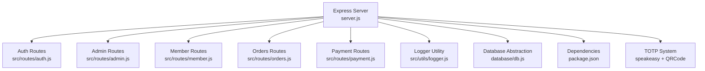
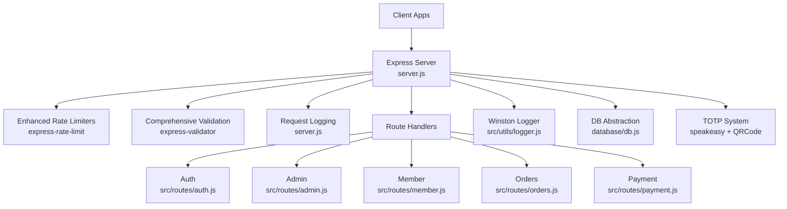
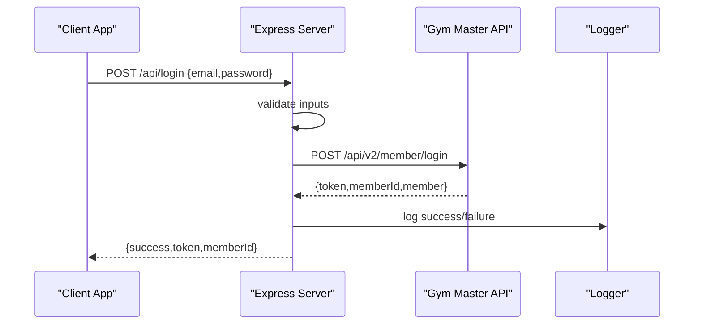
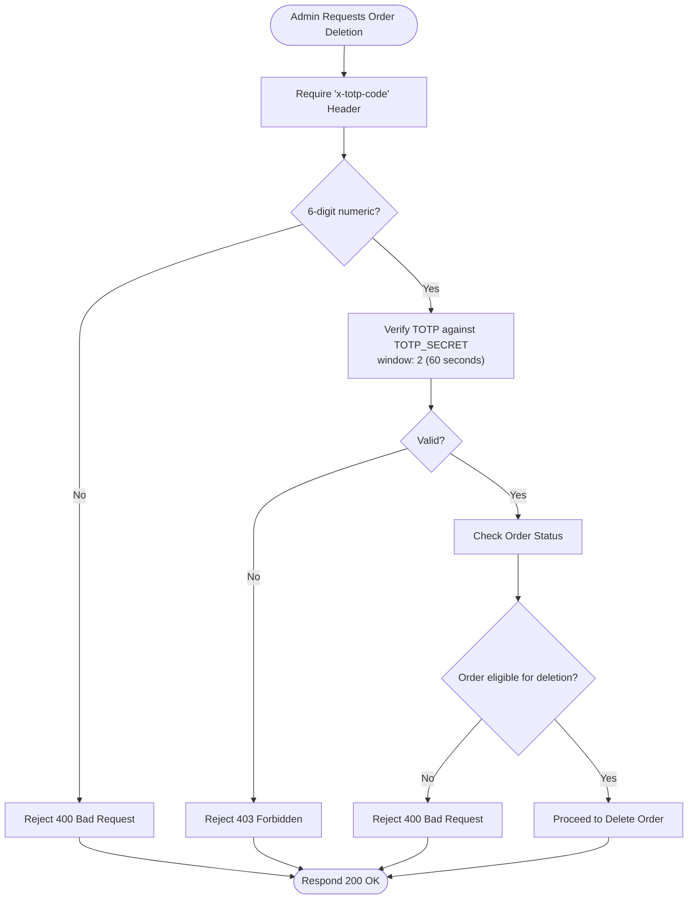
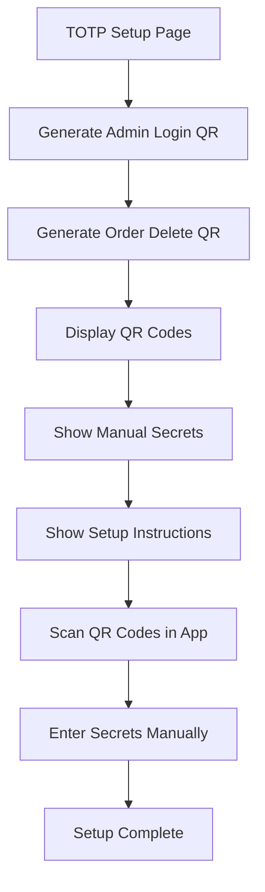
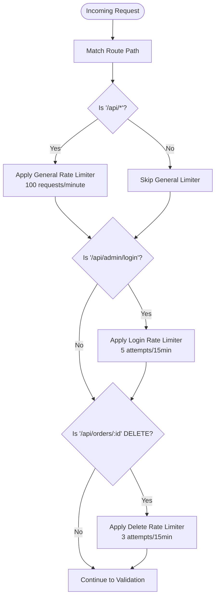
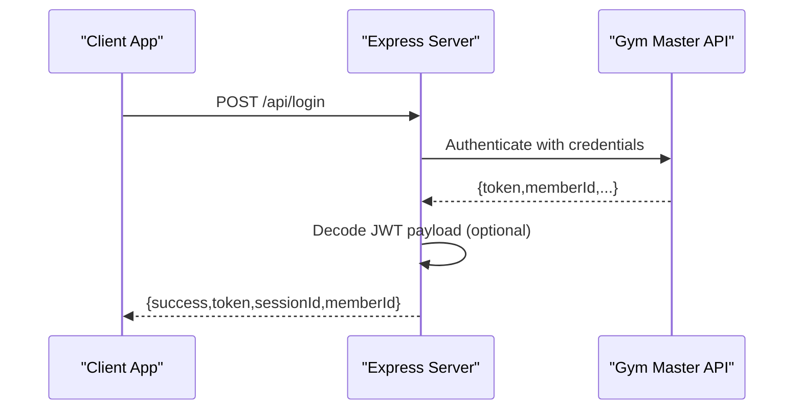
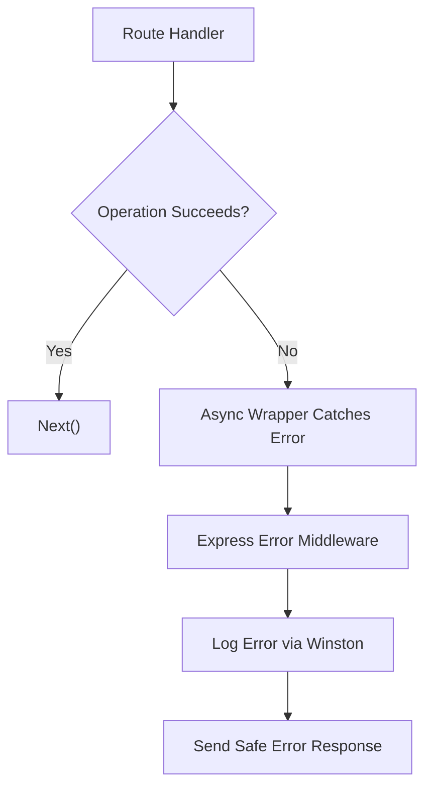
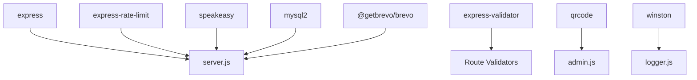

# Security Implementation

<cite>
**Referenced Files in This Document**
- [server.js](file://server.js)
- [auth.js](file://src/routes/auth.js)
- [admin.js](file://src/routes/admin.js)
- [member.js](file://src/routes/member.js)
- [orders.js](file://src/routes/orders.js)
- [payment.js](file://src/routes/payment.js)
- [db.js](file://database/db.js)
- [logger.js](file://src/utils/logger.js)
- [package.json](file://package.json)
- [orders.html](file://orders.html)
- [vercel.json](file://vercel.json)
</cite>

## Update Summary
**Changes Made**
- Complete implementation of TOTP (Time-Based One-Time Password) authentication system replacing password-based authentication
- Added comprehensive TOTP setup procedures with QR code generation for authenticator app configuration
- Implemented separate TOTP secrets for admin login and order deletion functions
- Added detailed user instructions for both admin login and order deletion functions
- Updated authentication flow to use speakeasy library for TOTP verification with rate limiting and enhanced security measures
- Integrated TOTP setup page with manual secret entry and QR code scanning capabilities

## Table of Contents
1. [Introduction](#introduction)
2. [Project Structure](#project-structure)
3. [Core Components](#core-components)
4. [Architecture Overview](#architecture-overview)
5. [Detailed Component Analysis](#detailed-component-analysis)
6. [Dependency Analysis](#dependency-analysis)
7. [Performance Considerations](#performance-considerations)
8. [Troubleshooting Guide](#troubleshooting-guide)
9. [Conclusion](#conclusion)
10. [Appendices](#appendices)

## Introduction
This document provides comprehensive security documentation for Active Zone Hub's backend and frontend systems. It covers authentication and authorization patterns, two-factor authentication (2FA) implementation using TOTP, enhanced rate limiting, input validation, CORS configuration, session management, token handling, error handling strategies, security headers, HTTPS enforcement, protections against common vulnerabilities, and operational security practices such as logging, audits, and incident response.

## Project Structure
The security-relevant components are primarily implemented in the Express server and route handlers. Supporting infrastructure includes a database abstraction layer, TOTP authentication system, and a logging utility.

**Diagram sources**
- [server.js:1-200](file://server.js#L1-L200)
- [auth.js:1-54](file://src/routes/auth.js#L1-L54)
- [admin.js:1-140](file://src/routes/admin.js#L1-L140)
- [member.js:1-142](file://src/routes/member.js#L1-L142)
- [orders.js:1-411](file://src/routes/orders.js#L1-L411)
- [payment.js:1-154](file://src/routes/payment.js#L1-L154)
- [logger.js:1-67](file://src/utils/logger.js#L1-L67)
- [db.js:1-267](file://database/db.js#L1-L267)
- [package.json:1-33](file://package.json#L1-L33)

**Section sources**
- [server.js:1-200](file://server.js#L1-L200)
- [package.json:1-33](file://package.json#L1-L33)

## Core Components
- **Enhanced Authentication and Authorization**
  - Member authentication integrates with an external Gym Master service via dedicated endpoints.
  - Administrative access uses TOTP-based 2FA with separate secrets for different functions.
- **Advanced Two-Factor Authentication (2FA)**
  - Complete TOTP implementation using speakeasy library for time-based authentication codes.
  - Separate TOTP secrets for admin login (TOTP_SECRET_ADMIN) and order deletion (TOTP_SECRET).
  - QR code generation for Google Authenticator setup with manual secret backup option.
  - Comprehensive TOTP setup page with step-by-step instructions for both admin and order deletion functions.
  - Time-based token verification with 60-second window tolerance and 2-step window for time drift.
- **Comprehensive Rate Limiting**
  - Express-rate-limit applied with specific configurations: admin login (5 attempts/15min), order deletion (3 attempts/15min), general API (100 requests/min).
- **Robust Input Validation**
  - express-validator validates and sanitizes request parameters and bodies across all routes with comprehensive validation rules.
- **CORS Configuration**
  - CORS enabled globally; consider narrowing origins for production.
- **Session Management and Token Handling**
  - Token exchange with Gym Master; JWT decoding performed for session metadata extraction.
- **Centralized Error Handling**
  - Async error handling wrapper and structured logging for diagnostics.
- **Advanced Logging and Auditing**
  - Winston-based structured logging with file rotation and console transport for development.
- **Security Headers and HTTPS Enforcement**
  - Vercel configuration includes basic security headers (X-Content-Type-Options, X-Frame-Options, X-XSS-Protection).
  - Automatic HTTPS redirection in production environments.

**Section sources**
- [server.js:335-357](file://server.js#L335-L357)
- [server.js:382-407](file://server.js#L382-L407)
- [server.js:410-431](file://server.js#L410-L431)
- [auth.js:11-18](file://src/routes/auth.js#L11-L18)
- [admin.js:10-38](file://src/routes/admin.js#L10-L38)
- [orders.js:10-11](file://src/routes/orders.js#L10-L11)
- [logger.js:10-67](file://src/utils/logger.js#L10-L67)
- [vercel.json:10-25](file://vercel.json#L10-L25)

## Architecture Overview
The backend enforces security policies at the middleware and route levels, with external integrations for authentication and payments, featuring comprehensive TOTP-based 2FA, enhanced rate limiting, and comprehensive input validation.

**Diagram sources**
- [server.js:335-357](file://server.js#L335-L357)
- [auth.js:1-54](file://src/routes/auth.js#L1-L54)
- [admin.js:1-140](file://src/routes/admin.js#L1-L140)
- [member.js:1-142](file://src/routes/member.js#L1-L142)
- [orders.js:1-411](file://src/routes/orders.js#L1-L411)
- [payment.js:1-154](file://src/routes/payment.js#L1-L154)
- [logger.js:1-67](file://src/utils/logger.js#L1-L67)
- [db.js:1-267](file://database/db.js#L1-L267)

## Detailed Component Analysis

### Enhanced Authentication and Authorization
- **Member Authentication**
  - Frontend authenticates against Gym Master via a dedicated endpoint, receiving a token and member metadata.
  - Validation ensures presence of email and password before forwarding to Gym Master.
- **Administrative Access Controls**
  - Admin login endpoint now uses TOTP-based 2FA with dedicated secret (TOTP_SECRET_ADMIN).
  - Admin login requires a valid 6-digit TOTP code passed via request body.
  - Admin login is protected by a strict rate limiter (5 attempts per 15 minutes) to mitigate brute-force attempts.

**Diagram sources**
- [server.js:662-758](file://server.js#L662-L758)
- [auth.js:11-51](file://src/routes/auth.js#L11-L51)
- [logger.js:10-67](file://src/utils/logger.js#L10-L67)

**Section sources**
- [server.js:662-758](file://server.js#L662-L758)
- [auth.js:11-51](file://src/routes/auth.js#L11-L51)
- [member.js:11-41](file://src/routes/member.js#L11-L41)

### Advanced Two-Factor Authentication (TOTP)
- **Complete TOTP Implementation**
  - **Updated**: Full TOTP system using speakeasy library for time-based authentication codes.
  - Separate TOTP secrets for different functions: TOTP_SECRET_ADMIN for admin login, TOTP_SECRET for order deletion.
  - QR code setup for Google Authenticator with separate accounts for each function.
  - Manual secret backup option for both admin login and order deletion functions.
  - Requires a valid TOTP code passed via request headers (X-TOTP-Code) for order deletion.
  - Comprehensive frontend integration prompts users for TOTP code before deletion confirmation with improved error handling.
  - Detailed setup instructions with step-by-step guidance for authenticator app configuration.

**Diagram sources**
- [server.js:335-357](file://server.js#L335-L357)
- [orders.js:320-360](file://src/routes/orders.js#L320-L360)
- [admin.js:10-38](file://src/routes/admin.js#L10-L38)
- [orders.html:877-921](file://orders.html#L877-L921)

**Section sources**
- [server.js:335-357](file://server.js#L335-L357)
- [server.js:1144-1242](file://server.js#L1144-L1242)
- [server.js:1245-1311](file://server.js#L1245-L1311)
- [orders.js:10-11](file://src/routes/orders.js#L10-L11)
- [orders.js:320-360](file://src/routes/orders.js#L320-L360)
- [admin.js:10-38](file://src/routes/admin.js#L10-L38)
- [orders.html:877-921](file://orders.html#L877-L921)

### TOTP Setup Procedures
- **QR Code Generation**
  - Separate QR codes generated for admin login and order deletion functions.
  - QR codes use otpauth URLs with base32-encoded secrets.
  - Setup page displays both QR codes and manual secret entries.
- **Manual Secret Backup**
  - Both secrets displayed as text for manual entry into authenticator apps.
  - Copy-to-clipboard functionality for easy secret transfer.
- **Setup Instructions**
  - Step-by-step instructions for Google Authenticator/Microsoft Authy setup.
  - Clear distinction between admin login and order deletion accounts.
  - Important notes about saving both secrets securely.

**Diagram sources**
- [admin.js:40-137](file://src/routes/admin.js#L40-L137)

**Section sources**
- [admin.js:40-137](file://src/routes/admin.js#L40-L137)

### Enhanced Rate Limiting Mechanisms
- **Admin Login Rate Limiter**
  - Strict limit of 5 attempts per 15 minutes to protect admin login from brute-force attacks.
  - Now applies to TOTP-based admin login endpoint.
- **Order Deletion Rate Limiter**
  - **Updated**: Enhanced rate limiter with improved validation and logging for order deletion endpoint.
  - Strict limit of 3 attempts per 15 minutes to protect order deletion endpoint.
  - Rate limiting combined with TOTP verification for maximum security.
- **General API Rate Limiter**
  - Moderate limit of 100 requests per minute to prevent abuse across all API routes.
- **Implementation Strategy**
  - Rate limiters are applied at the route level for specific endpoints and globally for all API routes.

**Diagram sources**
- [server.js:382-407](file://server.js#L382-L407)
- [server.js:433-434](file://server.js#L433-L434)

**Section sources**
- [server.js:382-407](file://server.js#L382-L407)
- [server.js:433-434](file://server.js#L433-L434)
- [server.js:1126-1142](file://server.js#L1126-L1142)
- [server.js:1245-1311](file://server.js#L1245-L1311)

### Comprehensive Input Validation Strategies
- **Validation Library**
  - express-validator is used across all routes to validate and sanitize inputs with comprehensive validation rules.
- **Validation Examples**
  - Member authentication validates email format and password presence.
  - Order creation validates nested objects, email format, numeric fields, and array requirements.
  - Parameter validation ensures order IDs are properly formatted and escaped.
  - Query parameter validation for member existence checks.
  - **Updated**: TOTP code validation ensures 6-digit numeric format for admin login and order deletion.

**Diagram sources**
- [auth.js:11-18](file://src/routes/auth.js#L11-L18)
- [orders.js:234-245](file://src/routes/orders.js#L234-L245)
- [orders.js:147-154](file://src/routes/orders.js#L147-L154)
- [orders.js:102-108](file://src/routes/orders.js#L102-L108)

**Section sources**
- [auth.js:11-18](file://src/routes/auth.js#L11-L18)
- [orders.js:102-108](file://src/routes/orders.js#L102-L108)
- [orders.js:147-154](file://src/routes/orders.js#L147-L154)
- [orders.js:234-245](file://src/routes/orders.js#L234-L245)

### CORS Configuration
- **Global CORS**
  - CORS middleware is enabled globally, allowing broad cross-origin requests.
- **Recommendations**
  - Configure allowed origins, methods, and headers based on deployment requirements.
  - Consider stricter policy in production environments.

**Section sources**
- [server.js:360](file://server.js#L360)

### Session Management and Token Handling
- **Token Exchange**
  - On successful authentication, the system receives a token from Gym Master and decodes its payload to extract session identifiers.
- **Token Usage**
  - Tokens are validated and used for downstream operations (e.g., member profile updates).
- **JWT Decoding**
  - Base64 payload parsing is used to extract session metadata; errors are handled gracefully.
- **TOTP Integration**
  - TOTP codes are verified separately from token authentication for administrative functions.

**Diagram sources**
- [server.js:662-758](file://server.js#L662-L758)

**Section sources**
- [server.js:749-763](file://server.js#L749-L763)
- [auth.js:20-46](file://src/routes/auth.js#L20-L46)

### Enhanced Error Handling Patterns
- **Async Wrapper**
  - Centralized async error handler forwards unhandled promise rejections to Express error-handling middleware.
- **Structured Logging**
  - Winston logger captures timestamps, levels, messages, and metadata; file rotation prevents disk growth.
- **Request Logging**
  - Middleware logs method, path, status, duration, and IP; distinguishes warnings for 4xx/5xx responses.
- **TOTP Error Handling**
  - Specific error handling for invalid TOTP codes and format validation.
  - Comprehensive logging for debugging TOTP authentication failures.

**Diagram sources**
- [server.js:29-32](file://server.js#L29-L32)
- [logger.js:10-67](file://src/utils/logger.js#L10-L67)
- [server.js:437-459](file://server.js#L437-L459)

**Section sources**
- [server.js:29-32](file://server.js#L29-L32)
- [logger.js:10-67](file://src/utils/logger.js#L10-L67)
- [server.js:437-459](file://server.js#L437-L459)

### Security Headers and HTTPS Enforcement
- **Current State**
  - Vercel configuration includes basic security headers: X-Content-Type-Options, X-Frame-Options, X-XSS-Protection.
  - Automatic HTTPS enforcement through Vercel platform.
- **Recommendations**
  - Add Content-Security-Policy headers for XSS protection.
  - Implement HSTS headers in production deployments.
  - Consider adding Referrer-Policy and Permissions-Policy headers.

**Section sources**
- [vercel.json:10-25](file://vercel.json#L10-L25)

### Protection Against Common Vulnerabilities
- **XSS**
  - Input sanitization via express-validator reduces risk; consider CSP headers and templating best practices.
- **CSRF**
  - Not currently implemented; consider CSRF tokens for state-changing operations.
- **SQL Injection**
  - Database operations use parameterized queries and JSON serialization; maintain this pattern.
- **Information Disclosure**
  - Error responses avoid exposing internal details; logging captures stack traces securely.
- **TOTP Security**
  - Time-based verification with window tolerance prevents replay attacks.
  - Separate secrets for different functions minimize attack surface.
  - Rate limiting combined with TOTP verification provides defense-in-depth.

**Section sources**
- [orders.js:320-360](file://src/routes/orders.js#L320-L360)
- [db.js:182-218](file://database/db.js#L182-L218)

### Database Security and Data Protection
- **Connection Pooling**
  - PostgreSQL pool supports SSL configuration; ensure proper SSL settings in production.
- **Field Serialization**
  - JSON fields are serialized/deserialized carefully; validate and sanitize before persistence.
- **Fallback Storage**
  - File-based order storage is present; restrict filesystem permissions and sanitize inputs.
- **Data Encryption**
  - Sensitive data (TOTP secrets) stored in environment variables.
  - No encryption of order data in file-based fallback storage.

**Section sources**
- [db.js:105-155](file://database/db.js#L105-L155)
- [db.js:182-218](file://database/db.js#L182-L218)
- [server.js:34-103](file://server.js#L34-L103)

### Compliance Considerations
- **Data Handling**
  - Validate privacy practices for personal data collection and processing.
  - Ensure secure transmission and storage of sensitive information.
- **Logging**
  - Avoid logging personally identifiable information (PII) in plain text; mask or redact sensitive fields.
- **TOTP Compliance**
  - TOTP implementation follows RFC 6238 standards.
  - Time synchronization handled automatically with window tolerance.
  - Separate secrets for different functions meet security best practices.

## Dependency Analysis
Security-related dependencies include Express, express-validator, express-rate-limit, speakeasy, QRCode generation, and Winston logging.

**Diagram sources**
- [package.json:19-31](file://package.json#L19-L31)
- [server.js:1-15](file://server.js#L1-L15)
- [admin.js:1-140](file://src/routes/admin.js#L1-L140)
- [logger.js:1-67](file://src/utils/logger.js#L1-L67)

**Section sources**
- [package.json:19-31](file://package.json#L19-L31)

## Performance Considerations
- **Rate Limiting Impact**
  - Tune limits based on traffic patterns to balance security and user experience.
  - Separate rate limiters for different endpoints optimize performance for critical operations.
- **Logging Overhead**
  - File rotation and selective console logging reduce overhead in production.
- **Database Connections**
  - Proper pool sizing and SSL configuration improve reliability under load.
- **TOTP Verification Performance**
  - Speakeasy library provides efficient time-based token verification.
  - Window tolerance of 2 steps balances security with usability.

## Troubleshooting Guide
- **Authentication Failures**
  - Verify Gym Master API keys and endpoints; check decoded JWT payload extraction logs.
- **2FA Issues**
  - **Updated**: Confirm TOTP_SECRET_ADMIN and TOTP_SECRET configuration for admin login and order deletion respectively.
  - Check TOTP secret availability logs and validation attempts.
  - Verify authenticator app time synchronization and timezone settings.
- **Rate Limit Exceeded**
  - Adjust rate limiter windows and max values; monitor client-side retry behavior.
- **CORS Errors**
  - Align allowed origins with deployment domains; test with browser developer tools.
- **Logging and Auditing**
  - Review Winston log files for error stacks and request metadata; rotate logs regularly.
- **TOTP Setup Issues**
  - Verify QR code generation and manual secret entry functionality.
  - Check that both admin login and order deletion secrets are properly configured.

**Section sources**
- [server.js:662-758](file://server.js#L662-L758)
- [server.js:1245-1311](file://server.js#L1245-L1311)
- [logger.js:10-67](file://src/utils/logger.js#L10-L67)
- [admin.js:40-137](file://src/routes/admin.js#L40-L137)

## Conclusion
Active Zone Hub implements comprehensive layered security controls including enhanced input validation, sophisticated rate limiting, advanced TOTP-based 2FA with dedicated authentication codes, and robust logging. The system now features specific rate limiting configurations (5 attempts/15min for admin login, 3 attempts/15min for order deletion, 100 requests/min for general API) and a complete TOTP authentication system with separate secrets for different functions.

Recent security enhancements include the complete implementation of TOTP (Time-Based One-Time Password) authentication system replacing password-based authentication, comprehensive TOTP setup procedures with QR code generation for authenticator app configuration, detailed user instructions for both admin login and order deletion functions, and updated authentication flow using speakeasy library for TOTP verification with rate limiting and enhanced security measures.

The most significant enhancement is the complete TOTP implementation that provides defense-in-depth security through multiple authentication factors. The system now features separate TOTP secrets (TOTP_SECRET_ADMIN for admin login, TOTP_SECRET for order deletion), QR code generation for setup, manual secret backup options, and comprehensive frontend integration for order management operations. The TOTP system includes time-based verification with window tolerance, rate limiting for brute force protection, and detailed logging for security auditing.

To strengthen the system further, enforce HTTPS, add comprehensive security headers, harden CORS, implement CSRF protection, and refine error handling to prevent information leakage. Regular audits, vulnerability assessments, and incident response procedures will further enhance operational security.

## Appendices
- **Security Checklist**
  - Enable HTTPS and HSTS in production.
  - Configure strict CORS and Content-Security-Policy headers.
  - Implement CSRF tokens for state-changing endpoints.
  - Audit third-party integrations (Gym Master, Brevo, Paystack) for secure configurations.
  - Establish incident response playbooks and regular penetration testing schedules.
  - Monitor rate limiter effectiveness and adjust thresholds based on traffic patterns.
  - Regularly review and update TOTP secrets and authentication procedures.
  - Implement monitoring for suspicious TOTP usage patterns.
  - Validate order deletion authorization flows and audit trails.
  - **Updated**: Verify TOTP_SECRET_ADMIN and TOTP_SECRET configuration for admin login and order deletion respectively.
  - **Updated**: Test frontend TOTP integration with simplified authentication process.
  - **Updated**: Ensure both QR code generation and manual secret entry functionality works correctly.
  - **Updated**: Verify separate TOTP secrets for different administrative functions.