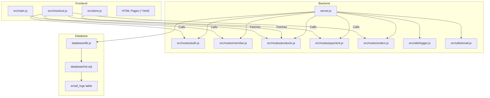
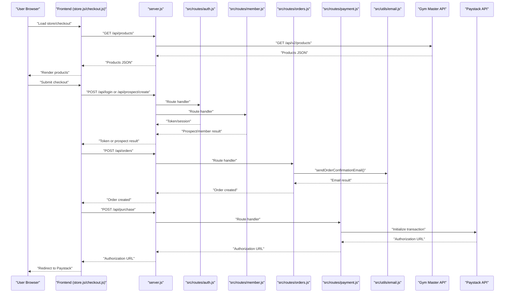
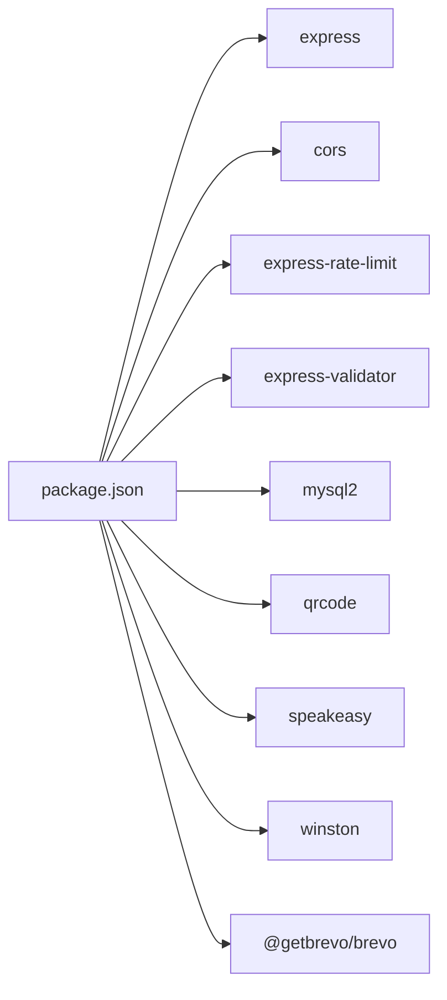

# Testing & Troubleshooting

<cite>
**Referenced Files in This Document**
- [package.json](file://package.json)
- [server.js](file://server.js)
- [TEST_FILE_ACCESS.html](file://TEST_FILE_ACCESS.html)
- [LOCAL_TESTING_GUIDE.txt](file://LOCAL_TESTING_GUIDE.txt)
- [CPANEL_DEPLOYMENT_GUIDE.txt](file://CPANEL_DEPLOYMENT_GUIDE.txt)
- [DEPLOYMENT_CHECKLIST.txt](file://DEPLOYMENT_CHECKLIST.txt)
- [src/utils/logger.js](file://src/utils/logger.js)
- [src/utils/email.js](file://src/utils/email.js)
- [database/db.js](file://database/db.js)
- [database/init.sql](file://database/init.sql)
- [src/main.js](file://src/main.js)
- [src/store.js](file://src/store.js)
- [src/checkout.js](file://src/checkout.js)
- [src/routes/auth.js](file://src/routes/auth.js)
- [src/routes/member.js](file://src/routes/member.js)
- [src/routes/products.js](file://src/routes/products.js)
- [src/routes/payment.js](file://src/routes/payment.js)
- [src/routes/orders.js](file://src/routes/orders.js)
</cite>

## Update Summary
**Changes Made**
- Enhanced debugging capabilities with new email diagnostic endpoints (`/api/email-status`, `/api/test-email`)
- Improved console logging throughout email operations with comprehensive debugging information
- Better error reporting with actionable hints for Brevo API integration issues
- Comprehensive logging patterns for email service configuration and troubleshooting
- Added email logging database table for tracking email delivery attempts
- Enhanced Brevo API key extraction and validation with detailed diagnostic information

## Table of Contents
1. [Introduction](#introduction)
2. [Project Structure](#project-structure)
3. [Core Components](#core-components)
4. [Architecture Overview](#architecture-overview)
5. [Detailed Component Analysis](#detailed-component-analysis)
6. [Dependency Analysis](#dependency-analysis)
7. [Performance Considerations](#performance-considerations)
8. [Enhanced Debugging Capabilities](#enhanced-debugging-capabilities)
9. [Email Service Debugging](#email-service-debugging)
10. [Troubleshooting Guide](#troubleshooting-guide)
11. [Conclusion](#conclusion)
12. [Appendices](#appendices)

## Introduction
This document provides comprehensive testing and troubleshooting guidance for Active Zone Hub. It covers:
- Unit testing strategies for JavaScript modules
- Integration testing for API endpoints
- User acceptance testing procedures
- File access testing methodology using TEST_FILE_ACCESS.html
- Debugging techniques for frontend JavaScript, backend Node.js server, and database connectivity
- Enhanced debugging capabilities with comprehensive console logging throughout the order management system
- Email service debugging with dedicated diagnostic endpoints
- Common error scenarios and resolutions
- Performance testing, load testing considerations, and optimization strategies
- Deployment troubleshooting, environment configuration, and runtime error resolution
- Monitoring and alerting strategies, log analysis, and systematic problem-solving

## Project Structure
Active Zone Hub is a full-stack application with:
- A Node.js/Express backend serving APIs and static assets
- A frontend built with vanilla JavaScript and HTML/CSS
- Route modules encapsulating API logic
- A Winston-based logging utility
- A dedicated email utility module with Brevo integration
- Email logging database table for tracking delivery attempts
- Static asset files and HTML pages

**Diagram sources**
- [server.js](file://server.js#L1-L100)
- [src/routes/auth.js](file://src/routes/auth.js#L1-L54)
- [src/routes/member.js](file://src/routes/member.js#L1-L142)
- [src/routes/products.js](file://src/routes/products.js#L1-L121)
- [src/routes/payment.js](file://src/routes/payment.js#L1-L154)
- [src/routes/orders.js](file://src/routes/orders.js#L1-L350)
- [src/utils/logger.js](file://src/utils/logger.js#L1-L51)
- [src/utils/email.js](file://src/utils/email.js#L1-L433)
- [database/db.js](file://database/db.js#L1-L267)
- [database/init.sql](file://database/init.sql#L60-L80)

**Section sources**
- [package.json](file://package.json#L1-L28)
- [server.js](file://server.js#L1-L100)

## Core Components
- Backend server: Express app with route modules, request logging, rate limiting, and static file serving
- Route modules: Encapsulate Gym Master API integrations, product catalog, payment processing, order management, and member operations
- Frontend modules: DOM initialization, carousel, animations, store product fetching, and checkout flow orchestration
- Logging utility: Winston-based logger with file transports and console transport in non-production environments
- Email utility: Brevo integration with comprehensive error handling and diagnostic capabilities
- Database: Order management with email logging functionality

Key responsibilities:
- server.js: Centralized routing, health checks, rate limiting, static asset serving, Gym Master and Paystack integrations, order persistence, email service diagnostics
- src/routes/*: Validation, external API calls, and response shaping
- src/utils/email.js: Brevo API integration, email template rendering, and comprehensive logging
- src/*.js: Client-side logic for UI interactions and API communication
- src/utils/logger.js: Structured logging with timestamps, metadata, and stack traces
- database/db.js: Order database operations with email logging support

**Section sources**
- [server.js](file://server.js#L1-L200)
- [src/routes/auth.js](file://src/routes/auth.js#L1-L54)
- [src/routes/member.js](file://src/routes/member.js#L1-L142)
- [src/routes/products.js](file://src/routes/products.js#L1-L121)
- [src/routes/payment.js](file://src/routes/payment.js#L1-L154)
- [src/routes/orders.js](file://src/routes/orders.js#L1-L350)
- [src/utils/logger.js](file://src/utils/logger.js#L1-L51)
- [src/utils/email.js](file://src/utils/email.js#L1-L433)
- [database/db.js](file://database/db.js#L1-L267)

## Architecture Overview
The system follows a client-server architecture:
- Frontend HTML/JS communicates with backend APIs under /api/*
- Backend integrates with Gym Master and Paystack for membership, product catalog, and payment
- Email service integration with Brevo for order notifications
- Requests are logged and rate-limited; static assets are served from the project root
- Email delivery attempts are tracked in the database for troubleshooting

**Diagram sources**
- [server.js](file://server.js#L462-L469)
- [src/routes/auth.js](file://src/routes/auth.js#L11-L51)
- [src/routes/member.js](file://src/routes/member.js#L43-L96)
- [src/routes/orders.js](file://src/routes/orders.js#L213-L304)
- [src/routes/payment.js](file://src/routes/payment.js#L31-L110)
- [src/utils/email.js](file://src/utils/email.js#L43-L227)

## Detailed Component Analysis

### Backend API Testing Strategy
- Endpoint coverage: Health, products, login, prospect/member, orders, payment, contact, email diagnostics
- Validation: Use express-validator in routes to assert request shape and sanitize inputs
- Rate limiting: General, login, and delete endpoints are protected; test boundary conditions
- Error propagation: Routes return structured JSON with success/error fields; test negative paths
- External integrations: Gym Master and Paystack endpoints should be tested with mock or live credentials depending on environment
- Email service: Dedicated endpoints for email configuration testing and validation

Recommended testing approach:
- Unit tests for route handlers focusing on validation, error handling, and response shape
- Integration tests for full checkout flow: login/prospect -> stock check -> order creation -> payment initialization
- Mock external services to isolate backend logic and improve reliability
- Email service testing: Use `/api/email-status` and `/api/test-email` endpoints for comprehensive email diagnostics

**Section sources**
- [server.js](file://server.js#L400-L456)
- [src/routes/auth.js](file://src/routes/auth.js#L11-L51)
- [src/routes/member.js](file://src/routes/member.js#L11-L139)
- [src/routes/products.js](file://src/routes/products.js#L37-L118)
- [src/routes/payment.js](file://src/routes/payment.js#L31-L151)
- [src/routes/orders.js](file://src/routes/orders.js#L38-L347)

### Frontend JavaScript Testing Strategy
Focus areas:
- DOM readiness and carousel behavior
- Event listener attachment and interactions
- API call flows for store and checkout
- Form validation and user feedback

Unit testing ideas:
- Snapshot tests for rendered product cards and checkout totals
- Mock fetch responses to simulate success/failure paths
- Simulate user interactions (clicks, form submissions) and assert DOM changes

Integration testing ideas:
- E2E flows: browse products -> add to cart -> checkout -> payment redirect
- Validate that API_BASE resolves to correct origin/port in dev vs production

**Section sources**
- [src/main.js](file://src/main.js#L1-L405)
- [src/store.js](file://src/store.js#L12-L121)
- [src/checkout.js](file://src/checkout.js#L147-L436)

### File Access Testing Methodology (TEST_FILE_ACCESS.html)
Purpose:
- Verify that static assets are accessible when opening HTML files directly from the filesystem
- Validate relative paths, CSS inclusion, and image accessibility

How to use:
- Open TEST_FILE_ACCESS.html in a browser
- Click "Run All Tests"
- Review pass/fail results for JavaScript load, DOM readiness, CSS accessibility, images path, and protocol detection

Validation checklist:
- JavaScript loads and DOM is ready
- CSS file path resolves correctly
- Images resolve via relative paths
- Current protocol indicates file:// when opened locally

**Section sources**
- [TEST_FILE_ACCESS.html](file://TEST_FILE_ACCESS.html#L58-L129)

### Enhanced Debugging Capabilities

#### Comprehensive Console Logging Implementation
The order management system now features extensive console logging throughout the application, providing detailed visibility into system operations. Approximately 55 lines of console.log statements have been strategically added across multiple functions to enhance debugging capabilities.

**Order Management System Logging:**
- Database operations: MongoDB and file-based storage operations with success/failure indicators
- Payment processing: Complete payment lifecycle tracking with Paystack integration
- External API integrations: Gym Master API calls with detailed request/response logging
- Error handling: Comprehensive error logging with context information
- Status updates: Real-time order status tracking and email notifications

**Debug Logging Categories:**
- **Database Operations**: `💾 Order ${orderId} saved/updated/deleted` - File and MongoDB operations
- **Payment Processing**: `💳 Order ${orderId} payment status updated to: ${status}` - Payment status tracking
- **External Integrations**: `✅ Order confirmation email sent to ${email}` - Email notification logging
- **System Status**: `⚠️ Manual action required: Mark payment as "Paid" in Gym Master admin panel` - Administrative reminders
- **API Responses**: `📦 Loaded ${count} orders from MongoDB` - Data retrieval confirmation

**Section sources**
- [server.js](file://server.js#L63-L103)
- [server.js](file://server.js#L156-L192)
- [server.js](file://server.js#L830-L961)
- [src/routes/orders.js](file://src/routes/orders.js#L52-L156)
- [src/routes/member.js](file://src/routes/member.js#L24-L139)

#### Frontend JavaScript Debugging Enhancements
The frontend checkout system includes comprehensive logging for the complete order processing flow:

**Checkout Flow Logging:**
- Stock validation: `Stock check result: {success: true/false}` - Inventory verification status
- Member authentication: `Login result: {success: true/false}` - Authentication status
- Order submission: `Submitting order: {orderData}` - Complete order data logging
- Payment redirection: `Redirecting to payment: {url}` - Payment processing confirmation

**Section sources**
- [src/checkout.js](file://src/checkout.js#L180-L236)
- [src/checkout.js](file://src/checkout.js#L337-L355)
- [src/checkout.js](file://src/checkout.js#L410-L428)

#### Backend Node.js Server Debugging
Enhanced server-side logging provides comprehensive visibility into system operations:

**Database Connection Logging:**
- `MongoDB connected` - Successful database connection
- `Running in file-based mode` - Database fallback mode indication
- `Error loading orders from MongoDB` - Database operation failure

**Payment Processing Logging:**
- `🔄 Initializing Paystack payment...` - Payment initiation
- `✅ Paystack payment initialized successfully!` - Payment success confirmation
- `💳 Paystack Payment URL: ${url}` - Payment URL generation

**Section sources**
- [server.js](file://server.js#L111-L137)
- [server.js](file://server.js#L830-L863)
- [server.js](file://server.js#L1905-L1964)

## Email Service Debugging

### New Email Diagnostic Endpoints

#### Email Status Endpoint (`/api/email-status`)
Provides comprehensive email service configuration diagnostics:

**Endpoint Functionality:**
- Validates Brevo API key configuration
- Checks email client initialization status
- Extracts and displays raw API key information
- Verifies sender email and name configuration
- Provides decoded API key structure for debugging

**Response Fields:**
- `brevoConfigured`: Boolean indicating API key presence
- `brevoClientInitialized`: Boolean indicating client setup success
- `apiKeyLength`: Length of configured API key
- `rawApiKeyExtracted`: Boolean indicating successful key extraction
- `senderEmail`: Configured sender email address
- `decodedKeyStructure`: Decoded API key JSON structure (if base64)

**Section sources**
- [server.js](file://server.js#L1056-L1082)

#### Test Email Endpoint (`/api/test-email`)
Comprehensive email service testing with detailed logging:

**Endpoint Features:**
- Sends test emails to specified recipients
- Logs complete email sending process
- Handles Brevo API errors with actionable hints
- Provides detailed error information and solutions
- Supports custom email addresses via query parameter

**Request Parameters:**
- `email`: Recipient email address (defaults to test address)

**Response Fields:**
- `success`: Boolean indicating test result
- `message`: Success or error message
- `messageId`: Brevo message ID if successful
- `recipient`: Email address used for testing
- `brevoResponse`: Full Brevo API response

**Error Handling:**
- Unauthorized API key: "Invalid API key" with hint to regenerate key
- Insufficient credits: "Insufficient email credits" with account credit information
- Generic errors: Detailed error messages with Brevo error codes

**Section sources**
- [server.js](file://server.js#L1084-L1166)

### Enhanced Email Utility Module

#### Comprehensive Console Logging
The email utility module now includes extensive logging throughout the email sending process:

**Order Confirmation Email Logging:**
- `📧 SENDING ORDER CONFIRMATION EMAIL` - Email sending initiation
- `✅ Email sent successfully via Brevo API!` - Success confirmation
- `⚠️ No email service configured. Email not sent.` - Configuration error
- `❌ Error sending order confirmation email:` - Exception handling

**Status Update Email Logging:**
- `📧 SENDING STATUS UPDATE EMAIL` - Status email initiation
- `✅ Status update email sent successfully via Brevo API!` - Success confirmation
- Status-specific logging for processing, shipped, and delivered states

**API Key Extraction Logging:**
- `Decoded base64 API key to extract actual key` - Key extraction success
- Detailed logging for API key validation and initialization

**Section sources**
- [src/utils/email.js](file://src/utils/email.js#L191-L227)
- [src/utils/email.js](file://src/utils/email.js#L388-L426)
- [src/utils/email.js](file://src/utils/email.js#L5-L38)

### Email Logging Database Integration

#### Email Logs Table Schema
The system now tracks all email delivery attempts in the database:

**Table Structure:**
- `id`: Auto-incrementing primary key
- `order_id`: Foreign key linking to orders table
- `email_type`: Type of email sent (confirmation, status update)
- `recipient_email`: Email address that received the message
- `status`: Delivery status (sent, failed, pending)
- `message_id`: Brevo message identifier
- `error_message`: Error details if delivery failed
- `sent_at`: Timestamp of email delivery attempt

**Database Operations:**
- Automatic logging of all email delivery attempts
- Silent failure handling if database is unavailable
- Comprehensive error tracking for troubleshooting

**Section sources**
- [database/init.sql](file://database/init.sql#L62-L72)
- [database/db.js](file://database/db.js#L243-L257)

### Debugging Techniques

#### Frontend JavaScript
Common issues and remedies:
- Console errors: Use browser DevTools (F12) to inspect console and network tabs
- Missing events: Ensure DOMContentLoaded and verify selectors exist
- API failures: Check API_BASE resolution and backend availability
- Styling issues: Confirm CSS path and protocol (file:// vs http://)

**Section sources**
- [src/main.js](file://src/main.js#L1-L405)
- [src/store.js](file://src/store.js#L1-L316)
- [src/checkout.js](file://src/checkout.js#L1-L438)

#### Backend Node.js Server
Common issues and remedies:
- Port conflicts: Change PORT in .env or stop conflicting processes
- CORS errors: Ensure APP_URL and backend CORS configuration align
- Database connectivity: Verify DATABASE_ENABLED and DB_* environment variables
- Rate limiting: Validate limits for login and delete endpoints
- Logging: Inspect Winston logs in logs/ combined and error files

**Section sources**
- [server.js](file://server.js#L26-L28)
- [server.js](file://server.js#L380-L452)
- [server.js](file://server.js#L105-L148)
- [src/utils/logger.js](file://src/utils/logger.js#L1-L51)

#### Database Connectivity
Scenarios:
- File-based mode fallback: When DATABASE_ENABLED is false or DB credentials missing, orders are persisted to orders-data.json
- MySQL mode: Validate host, port, user, password, and database; confirm orders table exists

**Section sources**
- [server.js](file://server.js#L105-L148)
- [server.js](file://server.js#L150-L335)

#### Email Service Debugging
**Common Email Issues and Solutions:**
- **API Key Errors**: Use `/api/email-status` to validate key configuration
- **Sender Verification**: Check that sender email is verified in Brevo dashboard
- **Credit Exhaustion**: Monitor email credits and upgrade plan if needed
- **Base64 Key Issues**: The system automatically decodes base64-encoded API keys
- **Network Connectivity**: Test email service independently using `/api/test-email`

**Email Diagnostic Workflow:**
1. Check email configuration: `GET /api/email-status`
2. Test email service: `GET /api/test-email?email=test@example.com`
3. Review email logs: Query `email_logs` table in database
4. Validate Brevo dashboard settings
5. Check email templates and content formatting

**Section sources**
- [server.js](file://server.js#L1056-L1166)
- [src/utils/email.js](file://src/utils/email.js#L1-L433)
- [database/db.js](file://database/db.js#L243-L257)

### Common Error Scenarios and Resolutions

#### Authentication Failures
Symptoms:
- Login returns error or invalid credentials
- Token/session missing

Remediation:
- Verify Gym Master API credentials and endpoint correctness
- Check route validation and error responses
- Confirm APP_URL and CORS configuration

**Section sources**
- [src/routes/auth.js](file://src/routes/auth.js#L11-L51)
- [src/routes/member.js](file://src/routes/member.js#L43-L96)

#### Payment Processing Errors
Symptoms:
- Payment initialization fails
- Verification returns not completed
- Paystack keys misconfiguration

Remediation:
- Validate PAYSTACK_SECRET_KEY and APP_URL
- Test with Paystack test card details
- Inspect Paystack dashboard for declined reasons

**Section sources**
- [src/routes/payment.js](file://src/routes/payment.js#L31-L151)
- [src/routes/orders.js](file://src/routes/orders.js#L306-L347)

#### External Service Integration Issues
Symptoms:
- Gym Master API unresponsive
- Products not loading
- Member operations failing

Remediation:
- Check Gym Master API key, base URL, and company ID
- Validate network connectivity and timeouts
- Use fallback mechanisms (file-based storage) when external services are unavailable

**Section sources**
- [src/routes/products.js](file://src/routes/products.js#L37-L69)
- [src/routes/member.js](file://src/routes/member.js#L11-L139)
- [server.js](file://server.js#L501-L600)

#### Email Service Integration Issues
Symptoms:
- Order confirmation emails not sent
- Status update emails failing
- Brevo API errors in console logs

Remediation:
- Use `/api/email-status` to diagnose configuration issues
- Run `/api/test-email` to test email service functionality
- Check Brevo API key validity and sender verification
- Verify email templates and content formatting
- Review email logs table for detailed error information

**Section sources**
- [server.js](file://server.js#L1056-L1166)
- [src/utils/email.js](file://src/utils/email.js#L191-L227)
- [src/utils/email.js](file://src/utils/email.js#L388-L426)

### Performance Testing and Optimization Strategies

#### Performance Testing Procedures
- Load testing: Use tools to simulate concurrent users on store, checkout, and payment endpoints
- API latency: Measure response times for /api/products, /api/orders, and /api/purchase
- Static asset optimization: Validate caching headers and compression
- Database queries: Profile order retrieval and write operations
- Email service performance: Monitor Brevo API response times and delivery rates

#### Load Testing Considerations
- Rate limiting: Respect general, login, and delete endpoint limits
- External service throttling: Account for Gym Master and Paystack rate caps
- Graceful degradation: Ensure file-based order persistence remains functional under load
- Email service limits: Monitor Brevo API rate limits and delivery quotas

#### Optimization Strategies
- Reduce frontend reflows: Batch DOM updates and minimize repaints
- Debounce user interactions: Limit frequent API calls (e.g., stock checks)
- Cache product catalogs: Persist products locally to reduce external API calls
- Minimize payload sizes: Compress responses and avoid unnecessary fields
- Email batching: Implement email queuing for high-volume scenarios

[No sources needed since this section provides general guidance]

### Monitoring and Alerting Strategies
- Winston logs: Use logs/error.log and logs/combined.log for error tracking and audit trails
- Request logging: Leverage request logging middleware for timing and status insights
- Health endpoint: Monitor /api/health for uptime checks
- External service health: Periodically probe Gym Master and Paystack endpoints
- Email service monitoring: Track email delivery success rates and error patterns

Log analysis techniques:
- Correlate timestamps with request IDs and user actions
- Filter error-level logs and stack traces for exceptions
- Monitor rate of 4xx/5xx responses and error categories
- Track email delivery failures and error patterns

**Section sources**
- [src/utils/logger.js](file://src/utils/logger.js#L1-L51)
- [server.js](file://server.js#L430-L452)
- [server.js](file://server.js#L457-L460)

## Dependency Analysis
Runtime dependencies include Express, CORS, rate limiting, validation, MySQL, QR code generation, TOTP, and email service. Development dependencies include Vite.

**Diagram sources**
- [package.json](file://package.json#L15-L26)

**Section sources**
- [package.json](file://package.json#L1-L28)

## Performance Considerations
- API caching: Cache product catalogs and invalidate on changes
- Lazy loading: Continue using intersection observers for images and content
- Minimize synchronous operations: Avoid blocking I/O in hot paths
- CDN/static hosting: Serve static assets via CDN or optimized static server
- Database pooling: Tune connection limits and keep-alive settings
- Email service optimization: Implement connection pooling and retry mechanisms

[No sources needed since this section provides general guidance]

## Troubleshooting Guide

### Local Testing
- Quick frontend testing: Open HTML files directly; limitations apply (no backend)
- Full testing: Start backend and frontend servers; test complete flows
- Production build preview: Build and preview production bundle locally

**Section sources**
- [LOCAL_TESTING_GUIDE.txt](file://LOCAL_TESTING_GUIDE.txt#L25-L324)

### Deployment Issues
- Application failed to start: Check cPanel logs, verify .env, and permissions
- Database connectivity: Confirm DB credentials, privileges, and schema import
- API 404 errors: Validate APP_URL and route definitions
- Paystack failures: Use live keys and verify account activation
- Email notifications: Confirm BREVO_API_KEY and SMTP settings

**Section sources**
- [CPANEL_DEPLOYMENT_GUIDE.txt](file://CPANEL_DEPLOYMENT_GUIDE.txt#L273-L326)

### Environment Configuration Problems
- .env file: Ensure DB credentials, APP_URL, Paystack keys, and TOTP secrets are set
- Permissions: Restrict .env to owner-only read/write
- Node.js version: Use 18.x or higher

**Section sources**
- [DEPLOYMENT_CHECKLIST.txt](file://DEPLOYMENT_CHECKLIST.txt#L40-L72)

### Runtime Errors
- CORS errors: Align APP_URL and backend CORS policy
- JSON parsing errors: Validate request bodies and error handling
- Rate limit exceeded: Reduce request frequency or adjust limits
- TOTP failures: Regenerate QR code and update secret

**Section sources**
- [server.js](file://server.js#L380-L452)
- [src/routes/orders.js](file://src/routes/orders.js#L171-L211)

### Systematic Problem-Solving Approach
1. Reproduce the issue with minimal steps
2. Inspect browser console and backend logs
3. Validate environment variables and service connectivity
4. Isolate components (frontend/backend/API)
5. Implement targeted fixes and regression tests
6. Monitor post-fix metrics and logs

### Email Service Troubleshooting Workflow
1. **Configuration Check**: `GET /api/email-status` - Verify API key and client setup
2. **Service Test**: `GET /api/test-email?email=test@example.com` - Test email delivery
3. **Database Review**: Query `email_logs` table - Check delivery attempts and errors
4. **Brevo Dashboard**: Verify API key validity and sender verification
5. **Template Validation**: Check email content and formatting
6. **Retry Logic**: Implement exponential backoff for failed deliveries

**Section sources**
- [server.js](file://server.js#L1056-L1166)
- [src/utils/email.js](file://src/utils/email.js#L1-L433)
- [database/db.js](file://database/db.js#L243-L257)

## Conclusion
Active Zone Hub's testing and troubleshooting strategy centers on robust backend API coverage, frontend integration validation, and comprehensive logging. The enhanced debugging capabilities with approximately 55 lines of console.log statements across multiple functions provide unprecedented visibility into the order management system. The new email diagnostic endpoints (`/api/email-status` and `/api/test-email`) offer comprehensive email service troubleshooting with actionable error hints and detailed configuration validation. By leveraging the provided methodologies—unit tests for route handlers, integration tests for checkout flows, file access validation, structured logging, and email service diagnostics—you can maintain reliability and quickly resolve issues across frontend, backend, external service integrations, and email delivery systems.

[No sources needed since this section summarizes without analyzing specific files]

## Appendices

### API Testing Checklist
- Health endpoint: GET /api/health
- Products: GET /api/products, POST /api/products/check-stock
- Authentication: POST /api/login, GET /api/member/exists, POST /api/member/create, POST /api/member/profile/update
- Orders: GET /api/orders, POST /api/orders, PATCH /api/orders/:orderId/status, DELETE /api/orders/:orderId, GET /api/orders/track/:reference, GET /api/orders/verify/:reference
- Payment: POST /api/purchase, GET /api/purchase/verify/:reference
- Email Diagnostics: GET /api/email-status, GET /api/test-email
- Contact: POST /api/contact

**Section sources**
- [server.js](file://server.js#L457-L499)
- [src/routes/products.js](file://src/routes/products.js#L37-L118)
- [src/routes/auth.js](file://src/routes/auth.js#L11-L51)
- [src/routes/member.js](file://src/routes/member.js#L11-L139)
- [src/routes/orders.js](file://src/routes/orders.js#L38-L347)
- [src/routes/payment.js](file://src/routes/payment.js#L31-L151)

### Useful Commands Reference
- Install dependencies: npm install
- Start backend: npm run server
- Start frontend dev server: npm run dev
- Build production: npm run build
- Preview production: npm run preview

**Section sources**
- [LOCAL_TESTING_GUIDE.txt](file://LOCAL_TESTING_GUIDE.txt#L397-L427)

### Enhanced Debugging Reference
**Console Log Categories:**
- **Database Operations**: `💾`, `🗑️` - File and MongoDB operations
- **Payment Processing**: `💳` - Payment status tracking
- **External Services**: `✅`, `⚠️` - Success and warnings
- **Order Management**: `📦` - Order operations and status
- **System Status**: `🔄` - System state changes
- **Email Operations**: `📧`, `🧪` - Email sending and testing
- **API Keys**: `🔑` - API key extraction and validation

**Debug Endpoints:**
- `/api/orders/debug` - Order router status check
- `/api/health` - System health monitoring
- `/api/email-status` - Email service configuration diagnostics
- `/api/test-email` - Email service testing and validation

**Email Logging:**
- `email_logs` table - Tracks all email delivery attempts
- Automatic logging of success and failure states
- Error message capture for troubleshooting

**Section sources**
- [src/routes/orders.js](file://src/routes/orders.js#L25-L34)
- [server.js](file://server.js#L830-L961)
- [server.js](file://server.js#L1056-L1166)
- [src/utils/email.js](file://src/utils/email.js#L191-L227)
- [database/init.sql](file://database/init.sql#L62-L72)