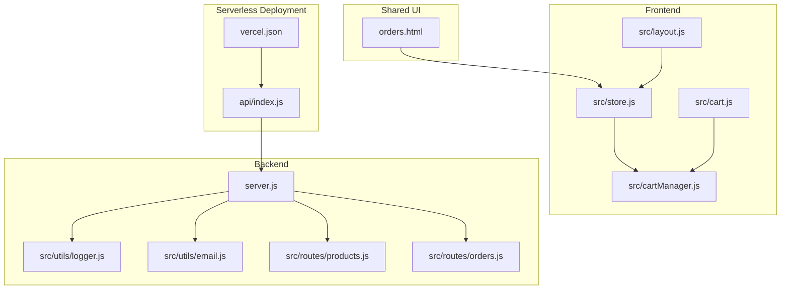
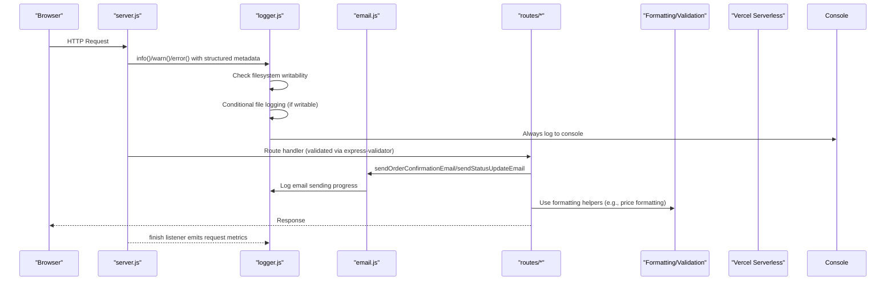
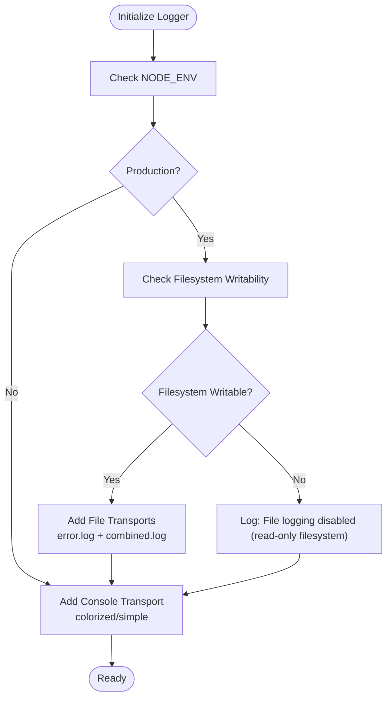
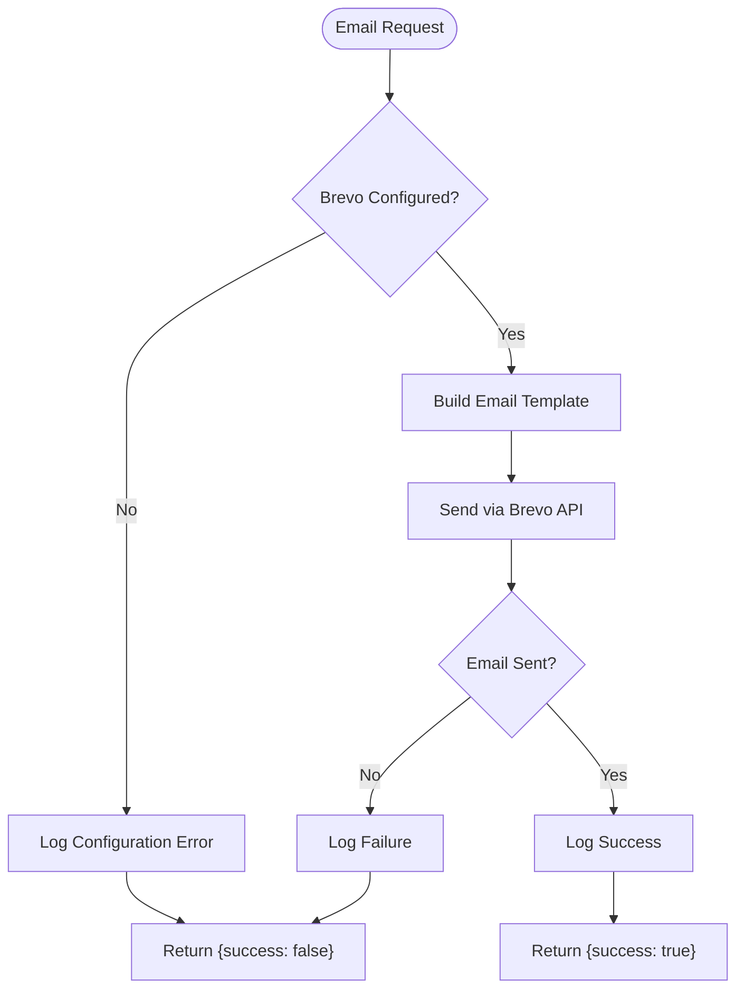
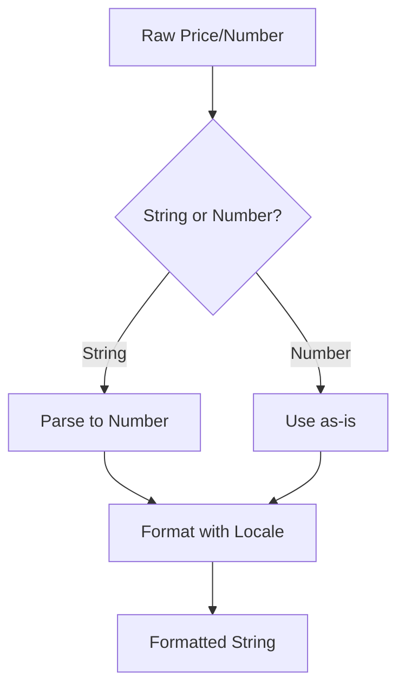
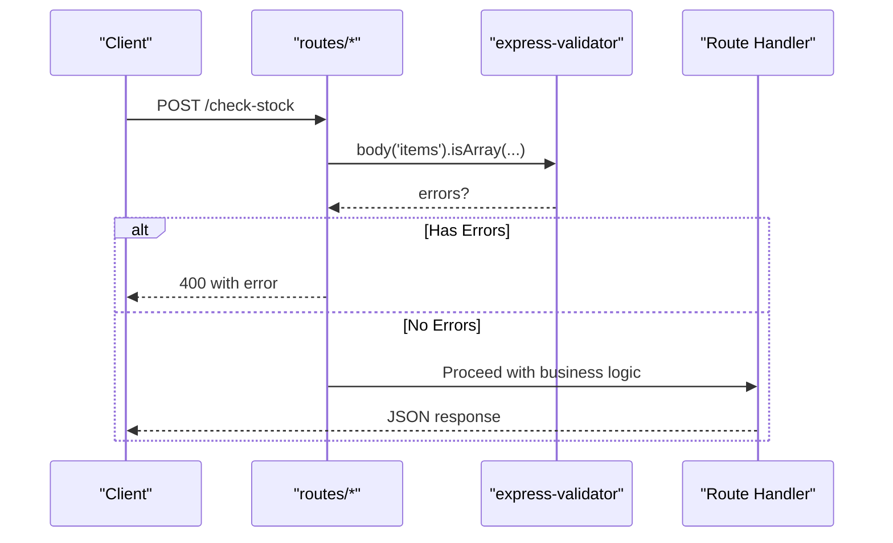
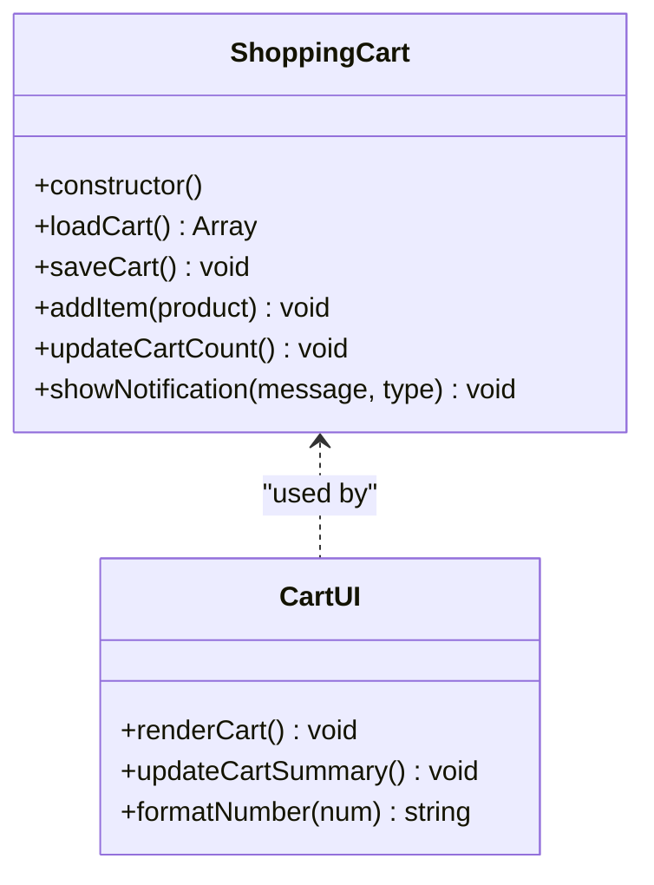
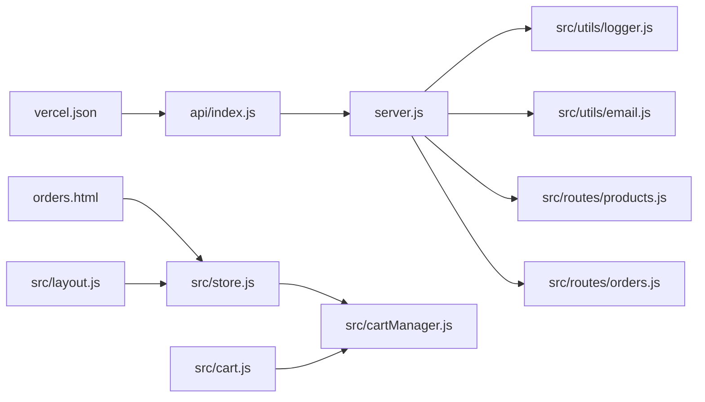

# Utilities & Helpers

<cite>
**Referenced Files in This Document**
- [logger.js](file://src/utils/logger.js)
- [email.js](file://src/utils/email.js)
- [server.js](file://server.js)
- [package.json](file://package.json)
- [cart.js](file://src/cart.js)
- [store.js](file://src/store.js)
- [cartManager.js](file://src/cartManager.js)
- [orders.html](file://orders.html)
- [products.js](file://src/routes/products.js)
- [orders.js](file://src/routes/orders.js)
- [layout.js](file://src/layout.js)
- [vercel.json](file://vercel.json)
- [api/index.js](file://api/index.js)
</cite>

## Update Summary
**Changes Made**
- Updated centralized logging system documentation to include serverless compatibility with Vercel read-only filesystem detection
- Added conditional file logging based on filesystem writability checks
- Enhanced error handling patterns for serverless deployments
- Updated troubleshooting guide with serverless-specific considerations
- Added Vercel deployment configuration documentation

## Table of Contents
1. [Introduction](#introduction)
2. [Project Structure](#project-structure)
3. [Core Components](#core-components)
4. [Architecture Overview](#architecture-overview)
5. [Detailed Component Analysis](#detailed-component-analysis)
6. [Dependency Analysis](#dependency-analysis)
7. [Performance Considerations](#performance-considerations)
8. [Troubleshooting Guide](#troubleshooting-guide)
9. [Conclusion](#conclusion)
10. [Appendices](#appendices)

## Introduction
This document explains the utility functions and helper modules that power Active Zone Hub's frontend and backend. It focuses on:
- Centralized logging via Winston-based logger.js with structured, environment-aware logging and automatic serverless compatibility
- Brevo transactional email service integration for order confirmations and status updates
- Common formatting helpers for prices and numbers used across modules
- Validation utilities integrated with Express routes
- Error handling patterns and debugging helpers
- Reusable components and helpers supporting main application functionality
- Guidelines for extending the utility library and maintaining quality standards
- Testing strategies and best practices for utility functions

## Project Structure
The utility ecosystem spans:
- Frontend helpers in src/cart.js, src/store.js, src/cartManager.js, and shared layout injection in src/layout.js
- Backend helpers in server.js (request logging, rate limiting, DB helpers, and error handling)
- Route-level helpers in src/routes/products.js and src/routes/orders.js
- Centralized logging system in src/utils/logger.js with automatic serverless compatibility
- Email service integration in src/utils/email.js
- Serverless deployment configuration in vercel.json

**Diagram sources**
- [server.js](file://server.js#L14-L14)
- [logger.js](file://src/utils/logger.js#L1-L67)
- [email.js](file://src/utils/email.js#L1-L412)
- [products.js](file://src/routes/products.js#L1-L133)
- [orders.js](file://src/routes/orders.js#L1-L200)
- [cart.js](file://src/cart.js#L1-L158)
- [store.js](file://src/store.js#L1-L333)
- [cartManager.js](file://src/cartManager.js#L1-L91)
- [orders.html](file://orders.html#L704-L734)
- [layout.js](file://src/layout.js#L1-L93)
- [vercel.json](file://vercel.json#L1-L27)
- [api/index.js](file://api/index.js#L1-L4)

**Section sources**
- [logger.js](file://src/utils/logger.js#L1-L67)
- [email.js](file://src/utils/email.js#L1-L412)
- [server.js](file://server.js#L14-L14)
- [package.json](file://package.json#L19-L30)

## Core Components
- **Centralized Logger**: Winston-based structured logging with automatic serverless compatibility, file and console transports, timestamps, and stack traces.
- **Email Service Integration**: Brevo transactional email service for order confirmations and status updates with HTML and plain text templates.
- **Price and Number Formatting Helpers**: Used in store.js, cart.js, and orders.html to present localized currency and numeric values consistently.
- **Validation Utilities**: Integrated with express-validator in routes for robust input sanitization and validation.
- **Cart and Notification Helpers**: Encapsulated in cartManager.js and reused by cart.js and store.js for cart operations and toast notifications.
- **Layout Injection**: Shared layout generation in layout.js for consistent navigation and footer across pages.
- **Serverless Deployment**: Automatic fallback to console-only logging when filesystem is read-only, preventing server crashes during startup.

**Section sources**
- [logger.js](file://src/utils/logger.js#L10-L67)
- [email.js](file://src/utils/email.js#L19-L412)
- [store.js](file://src/store.js#L209-L219)
- [cart.js](file://src/cart.js#L83-L85)
- [orders.html](file://orders.html#L720-L731)
- [cartManager.js](file://src/cartManager.js#L57-L89)
- [layout.js](file://src/layout.js#L1-L93)

## Architecture Overview
The logging utility is consumed by the backend server middleware and route handlers. The email utility integrates with order management routes for automated customer notifications. Formatting helpers are used in frontend modules to maintain consistent presentation. Validation utilities enforce input correctness at the route layer. The enhanced logging system automatically adapts to serverless environments by detecting read-only filesystems and falling back to console-only logging.

**Diagram sources**
- [server.js](file://server.js#L438-L459)
- [logger.js](file://src/utils/logger.js#L10-L67)
- [email.js](file://src/utils/email.js#L22-L206)
- [products.js](file://src/routes/products.js#L71-L118)
- [orders.js](file://src/routes/orders.js#L35-L46)

## Detailed Component Analysis

### Enhanced Centralized Logging System (logger.js)
- **Purpose**: Provide unified logging across the backend with configurable levels, timestamps, stack traces, and automatic serverless compatibility.
- **Serverless Compatibility**: Automatically detects read-only filesystems (Vercel) and falls back to console-only logging.
- **Log Levels**: Controlled by environment variable with defaults applied.
- **Formatting**: ISO-like timestamp, uppercase level, optional JSON metadata, and stack trace for errors.
- **Output Destinations**:
  - File transports for combined and error logs with rotation limits (only when filesystem is writable).
  - Console transport in all environments with colorized/simple formatting for serverless visibility.

**Updated** Added automatic serverless compatibility with Vercel read-only filesystem detection and conditional file logging based on filesystem writability.

**Diagram sources**
- [logger.js](file://src/utils/logger.js#L5-L18)
- [logger.js](file://src/utils/logger.js#L22-L45)

**Section sources**
- [logger.js](file://src/utils/logger.js#L10-L67)
- [server.js](file://server.js#L438-L459)

### Brevo Transactional Email Service (email.js)
- **Purpose**: Provide comprehensive email functionality for order confirmations and status updates using Brevo transactional emails.
- **Features**: HTML and plain text email templates, dynamic content generation, status-specific messaging, and error handling.
- **Email Templates**: Order confirmation with detailed item breakdown, delivery information, and tracking links; Status update emails for processing, shipping, and delivery.
- **Integration**: Automatically configured with API key, supports custom sender information, and provides fallback mechanisms when email service is unavailable.

**Diagram sources**
- [email.js](file://src/utils/email.js#L8-L17)
- [email.js](file://src/utils/email.js#L22-L206)
- [email.js](file://src/utils/email.js#L211-L405)

**Section sources**
- [email.js](file://src/utils/email.js#L1-L412)
- [orders.js](file://src/routes/orders.js#L35-L46)

### Price and Number Formatting Helpers
- **Store Price Formatting (store.js)**: Converts raw price values to localized Nigerian locale with thousands separators and up to two decimals.
- **Cart Number Formatting (cart.js)**: Formats raw numeric values with comma separators for display.
- **Orders Number Formatting (orders.html)**: Formats totals and counts using US locale with controlled decimals.
- **Consistency**: These helpers ensure uniform presentation across store, cart, and orders views.

**Diagram sources**
- [store.js](file://src/store.js#L209-L219)
- [cart.js](file://src/cart.js#L83-L85)
- [orders.html](file://orders.html#L720-L731)

**Section sources**
- [store.js](file://src/store.js#L209-L219)
- [cart.js](file://src/cart.js#L83-L85)
- [orders.html](file://orders.html#L720-L731)

### Validation Utilities (Express Routes)
- **Products Route**: Validates stock check input and product retrieval with error handling.
- **Orders Route**: Comprehensive validation for order creation, status updates, and deletion with TOTP verification.
- **Benefits**: Prevents malformed requests, reduces downstream errors, and centralizes sanitization.

**Diagram sources**
- [products.js](file://src/routes/products.js#L71-L118)
- [orders.js](file://src/routes/orders.js#L234-L245)

**Section sources**
- [products.js](file://src/routes/products.js#L71-L118)
- [orders.js](file://src/routes/orders.js#L147-L154)

### Cart and Notification Helpers (cartManager.js, cart.js, store.js)
- **ShoppingCart Class**: Manages cart persistence, item addition, quantity updates, and cart count updates.
- **Toast Notifications**: Unified success/warning notifications with icons and timed dismissal.
- **Integration**: cart.js and store.js rely on cartManager.js for cart operations and notifications.

**Diagram sources**
- [cartManager.js](file://src/cartManager.js#L3-L91)
- [cart.js](file://src/cart.js#L83-L158)
- [store.js](file://src/store.js#L280-L333)

**Section sources**
- [cartManager.js](file://src/cartManager.js#L3-L91)
- [cart.js](file://src/cart.js#L83-L158)
- [store.js](file://src/store.js#L280-L333)

### Layout Injection (layout.js)
- **Purpose**: Inject standardized navigation and footer into pages for consistent UX.
- **Behavior**: Creates navbar/footer elements and initializes mobile menu toggle.

**Section sources**
- [layout.js](file://src/layout.js#L1-L93)

### Serverless Deployment Configuration
- **Purpose**: Enable seamless deployment to Vercel with automatic serverless function routing.
- **Configuration**: Rewrites API routes to serverless entry point, sets cache headers, and applies security headers.
- **Integration**: Express app exported as serverless function for Vercel platform.

**Section sources**
- [vercel.json](file://vercel.json#L1-L27)
- [api/index.js](file://api/index.js#L1-L4)

## Dependency Analysis
- **Logger dependency**: server.js imports logger.js and uses it for request lifecycle logging and error capture.
- **Email dependency**: orders.js imports email utility for automated customer notifications.
- **Formatting dependencies**: store.js, cart.js, and orders.html depend on locale-aware formatting APIs for consistent display.
- **Validation dependencies**: routes depend on express-validator for input validation and sanitization.
- **Cart dependencies**: cart.js and store.js depend on cartManager.js for cart logic and notifications.
- **Serverless dependencies**: vercel.json configures automatic routing and deployment for serverless environments.

**Diagram sources**
- [server.js](file://server.js#L14-L14)
- [logger.js](file://src/utils/logger.js#L1-L67)
- [email.js](file://src/utils/email.js#L1-L412)
- [products.js](file://src/routes/products.js#L1-L133)
- [orders.js](file://src/routes/orders.js#L1-L200)
- [cart.js](file://src/cart.js#L1-L158)
- [store.js](file://src/store.js#L1-L333)
- [cartManager.js](file://src/cartManager.js#L1-L91)
- [orders.html](file://orders.html#L704-L734)
- [layout.js](file://src/layout.js#L1-L93)
- [vercel.json](file://vercel.json#L1-L27)
- [api/index.js](file://api/index.js#L1-L4)

**Section sources**
- [server.js](file://server.js#L14-L14)
- [logger.js](file://src/utils/logger.js#L1-L67)
- [email.js](file://src/utils/email.js#L1-L412)
- [store.js](file://src/store.js#L1-L333)
- [cart.js](file://src/cart.js#L1-L158)
- [cartManager.js](file://src/cartManager.js#L1-L91)
- [orders.html](file://orders.html#L704-L734)
- [products.js](file://src/routes/products.js#L1-L133)
- [orders.js](file://src/routes/orders.js#L1-L200)
- [layout.js](file://src/layout.js#L1-L93)
- [vercel.json](file://vercel.json#L1-L27)
- [api/index.js](file://api/index.js#L1-L4)

## Performance Considerations
- **Logging overhead**: File rotation and stack traces are enabled; ensure appropriate log levels in production to minimize I/O. The enhanced logging system automatically disables file logging in serverless environments to prevent startup failures.
- **Email service costs**: Brevo API calls have quotas and costs; consider implementing retry logic and rate limiting for email operations.
- **Formatting costs**: Using locale-aware formatting is efficient; avoid excessive reflows by batching DOM updates (as seen in cart rendering).
- **Validation cost**: express-validator runs before handlers; keep validation rules concise and targeted to reduce CPU overhead.
- **Network calls**: API calls to Gym Master and external services should be cached or rate-limited to prevent repeated network latency.
- **Serverless optimization**: The logging system automatically adapts to serverless constraints, ensuring minimal resource usage and preventing filesystem-related errors.

## Troubleshooting Guide
- **Logging issues**:
  - Verify log directory creation and permissions.
  - Confirm environment variables for log level and transports.
  - **Serverless-specific**: Check console logs for "File logging disabled (read-only filesystem)" message when running on Vercel.
- **Email service issues**:
  - Check BREVO_API_KEY configuration in .env file.
  - Verify SMTP_FROM_EMAIL and SMTP_FROM_NAME settings.
  - Monitor Brevo API quota limits and error responses.
- **Request failures**:
  - Use logger.warn for non-2xx responses and logger.error for unhandled exceptions.
- **Validation errors**:
  - Inspect express-validator error arrays for precise failure reasons.
- **Cart anomalies**:
  - Confirm localStorage availability and cart persistence logic.
- **Formatting inconsistencies**:
  - Ensure consistent use of locale-specific formatting helpers across modules.
- **Serverless deployment issues**:
  - Verify Vercel configuration in vercel.json.
  - Check that API routes are properly rewritten to serverless entry point.
  - Ensure environment variables are configured in Vercel dashboard.

**Section sources**
- [logger.js](file://src/utils/logger.js#L5-L8)
- [email.js](file://src/utils/email.js#L8-L17)
- [server.js](file://server.js#L451-L456)
- [orders.js](file://src/routes/orders.js#L147-L154)

## Conclusion
Active Zone Hub's utilities provide a cohesive foundation for logging, email notifications, formatting, validation, cart management, and layout. The new Winston-based logging system with automatic serverless compatibility significantly enhances the application's deployability and reliability across different hosting environments. The enhanced logging system automatically detects read-only filesystems (Vercel) and falls back to console-only logging, preventing server crashes during startup. The Brevo email integration and comprehensive utility ecosystem ensure consistent observability, customer communication, and user experience. By centralizing these concerns, the application maintains consistency, improves debuggability, and simplifies maintenance. Extending the utility library should follow established patterns: encapsulate behavior, export reusable functions, leverage the enhanced logger framework, and ensure serverless compatibility.

## Appendices

### Guidelines for Extending the Utility Library
- **Encapsulation**: Group related helpers into focused modules (e.g., formatting, validation, persistence).
- **Export patterns**: Prefer named exports for specific functions and default exports for cohesive modules.
- **Logging**: Use the centralized logger for structured logs with contextual metadata. Ensure serverless compatibility by avoiding filesystem-dependent operations.
- **Email integration**: Follow the existing email utility patterns for new notification types.
- **Validation**: Integrate with express-validator in route files for consistent input handling.
- **Testing**: Write unit tests for pure functions and integration tests for route-level helpers.
- **Documentation**: Keep inline comments concise; add module-level docs in README or dedicated docs.
- **Serverless considerations**: Design utilities to gracefully handle read-only filesystems and limited resources.

### Testing Strategies for Utility Functions
- **Unit tests**: Validate formatting helpers with representative inputs and locales.
- **Integration tests**: Simulate route validations and error scenarios.
- **Mocking**: Stub external services (e.g., Gym Master API, Brevo API) and databases for isolated tests.
- **Coverage**: Aim for high coverage of edge cases (invalid inputs, missing data, boundary conditions).
- **Email testing**: Implement test harnesses for email templates and Brevo API interactions.
- **Logging tests**: Verify log levels, formatting, and output destinations in different environments, including serverless scenarios.
- **Serverless testing**: Test filesystem detection and fallback mechanisms in simulated read-only environments.

### Environment Configuration Requirements
- **Logging**: LOG_LEVEL environment variable for controlling log verbosity.
- **Email**: BREVO_API_KEY, SMTP_FROM_EMAIL, SMTP_FROM_NAME for email service configuration.
- **Database**: DATABASE_ENABLED, DB_HOST, DB_USER, DB_PASSWORD, DB_NAME for database connectivity.
- **Security**: TOTP_SECRET, TOTP_SECRET_ADMIN for administrative security features.
- **Serverless**: Vercel environment variables for API keys and configuration in production deployments.

**Section sources**
- [logger.js](file://src/utils/logger.js#L11)
- [email.js](file://src/utils/email.js#L8-L17)
- [server.js](file://server.js#L108-L155)
- [orders.js](file://src/routes/orders.js#L10)
- [vercel.json](file://vercel.json#L1-L27)